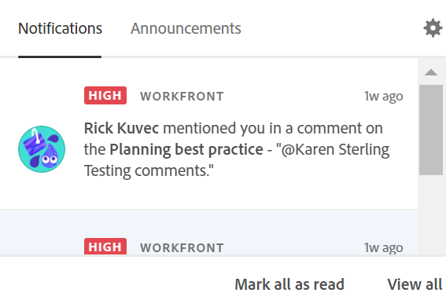

# 管理Adobe Workfront Planning应用程序内通知

{{planning-important-intro}}

当存在以下情况时，您可以从Workfront Planning接收应用程序内通知：

* 有人在记录评论中标记您或您的团队

  有关在记录评论中标记其他人的信息，请参阅[管理记录评论](/help/quicksilver/planning/records/manage-record-comments.md)。
* 有人要求您授予访问视图或工作区<!--or record-->的权限
* 有人确认已授予您查看或工作区的访问权限<!--or record Isk confirmed there is no notification for denying permissions - did not test-->

## 访问权限要求

+++ 展开以查看本文中各项功能的访问要求。 

<table style="table-layout:auto"> 
<col> 
</col> 
<col> 
</col> 
<tbody> 
    <tr> 
<tr> 
</tr>   
<tr> 
   <td role="rowheader">
Adobe Workfront 包
</td> 
   <td> 

任何Workfront和任何Planning包
 
任何工作流和任何计划包

有关每个Workfront Planning包中所包含内容的更多信息，请联系您的Workfront客户代表。 
 
   </td> 
  <tr> 
   <td role="rowheader">
Adobe Workfront许可证
</td> 
   <td>
浅色或更高

   </td> 
  </tr> 
  <tr> 
   <td role="rowheader">
对象权限
</td> 
   <td>   
查看工作区或更高权限 
  
   
系统管理员对所有工作区具有权限，包括他们未创建的工作区
 </td> 
  </tr> 
</tbody> 
</table>

有关Workfront访问要求的详细信息，请参阅Workfront文档中的[访问要求](/help/quicksilver/administration-and-setup/add-users/access-levels-and-object-permissions/access-level-requirements-in-documentation.md)。

+++   

<!--
OLD:

+++ Expand to view access requirements. 

<table style="table-layout:auto"> 
<col> 
</col> 
<col> 
</col> 
<tbody> 
    <tr> 
<tr> 
<td> 
   
 Products
 </td> 
   <td> 
   <ul><li>
 Adobe Workfront
</li> 
   <li>
 Adobe Workfront Planning
</li></ul></td> 
  </tr>   
<tr> 
   <td role="rowheader">
Adobe Workfront plan*
</td> 
   <td> 

Any of the following Workfront plans:
 
<ul><li>Select</li> 
<li>Prime</li> 
<li>Ultimate</li></ul> 

Workfront Planning is not available for legacy Workfront plans
 
   </td> 
<tr> 
   <td role="rowheader">
Adobe Workfront Planning package*
</td> 
   <td> 

Any 
 

For more information about what is included in each Workfront Planning plan, contact your Workfront account manager. 
 
   </td> 
 <tr> 
   <td role="rowheader">
Adobe Workfront platform
</td> 
   <td> 

Your organization's instance of Workfront must be onboarded to the Adobe Unified Experience.
 

The users in your organization receive notifications from Workfront Planning only when your organization is onboarded to the Adobe Unified Experience. 

For more information, see <a href="/help/quicksilver/workfront-basics/navigate-workfront/workfront-navigation/adobe-unified-experience.md">Adobe Unified Experience for Workfront</a>. 
 
   </td> 
   </tr> 
  </tr> 
  <tr> 
   <td role="rowheader">
Adobe Workfront license*
</td> 
   <td>
 Standard, Light, or Contributor

   
Workfront Planning is not available for legacy Workfront licenses
 
  </td> 
  </tr> 
  <tr> 
   <td role="rowheader">
Access level configuration
</td> 
   <td> 
There are no access level controls for Adobe Workfront Planning
   
</td> 
  </tr> 
<tr> 
   <td role="rowheader">
Object permissions
</td> 
   <td>   
View or higher permissions to a workspace</a> 
  
   
System Administrators have permissions to all workspaces, including the ones they did not create
  </td> 
  </tr> 
<tr>
   <td role="rowheader">
Layout template
</td>
   <td> Users with a Light or Contributor license must be assigned a layout template that includes Planning.
   
Standard users and System Administrators have the Planning areas enabled by default.

</li></ul>
</td>
  </tr>
</tbody> 
</table> 

+++
-->

## 当有人在评论中标记您时管理应用程序内通知

1. （视情况而定）当有人在记录中的评论中为您或您的团队标记后，请转到Adobe Experience Cloud中的应用程序内&#x200B;**通知**&#x200B;图标。

   

1. 单击通知。

   此时将在Workfront Planning中打开记录详细信息页面。 您可以更新记录或回复评论。

1. （可选）单击&#x200B;**全部标记为已读**&#x200B;以指示您已读取所有通知。
1. （可选）单击&#x200B;**查看全部**&#x200B;以转到Adobe Experience Cloud中的&#x200B;**通知**&#x200B;页面。

## 在请求和授予权限时管理应用程序内通知

当有人请求或授予您查看、工作区或记录类型的权限时，您会收到应用程序内通知。<!--or record-->

有关请求、授予或拒绝权限的信息，请参阅[请求视图或工作区的权限](/help/quicksilver/planning/access/request-permissions.md)。

有关管理Workfront Planning通知的信息，请参阅[管理Adobe Workfront Planning通知首选项](/help/quicksilver/planning/notifications/manage-notification-preferences.md)。

## 在批准或拒绝Planning请求时管理应用程序内通知

在以下情况下，您会收到应用程序内通知：有人提交请求以供审批，或者有人批准您提交的请求。

有关提交请求的信息，请参阅[提交Adobe Workfront计划请求以创建记录](/help/quicksilver/planning/requests/submit-requests.md)。

有关批准请求的信息，请参阅[在Adobe Workfront规划中批准请求](/help/quicksilver/planning/requests/approve-request.md)。
