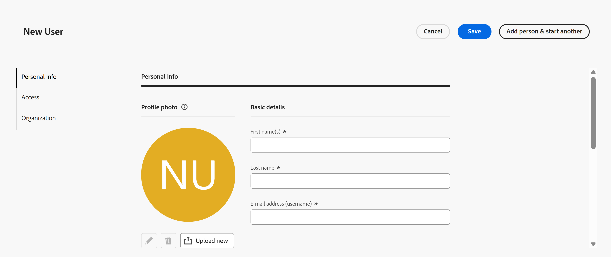

# 在Adobe Workfront Planning中作为独立产品管理用户

>[!IMPORTANT]
>
>本文中的信息是指Adobe Workfront Planning（作为独立产品购买时）。 当您的公司购买了仅限Adobe Workfront Planning的软件包，但没有购买Workfront Workflow软件包时，请参阅本文。
>
>有关与Workfront包一起购买时的Adobe Workfront Planning的信息，请参阅[Adobe Workfront Planning入门](/help/quicksilver/planning/general/planning-overview.md)。
>

您可以在Adobe Workfront Planning中作为独立产品管理用户，其方式与在Adobe Workfront中管理用户类似。

在Workfront Planning中可分配用户的访问级别存在一些限制。

## 访问权限要求

+++ 展开以查看本文中各项功能的访问要求。 

<table style="table-layout:auto"> 
<col> 
</col> 
<col> 
</col> 
<tbody> 
    <tr> 
<tr> 
</tr>   
<tr> 
   <td role="rowheader">
Adobe Workfront规划包
</td> 
   <td> 

任何Workfront Planning作为独立包

</td> </tr>
  <tr> 
   <td role="rowheader">
Adobe Workfront许可证
</td> 
   <td>
规划管理员

   </td> 
  </tr>

</tbody> 
</table>

有关将Workfront作为独立包所需的访问权限的更多信息，请参阅[将Adobe Workfront计划作为独立产品所需的访问权限](/help/quicksilver/planning/planning-sta/access-needed-for-planning-sta.md)。
+++    

## Adobe Workfront Planning中的访问级别

作为独立产品购买时，您可以在Workfront Planning中为用户分配以下访问级别：

* 规划管理员
* 规划标准

有关每次访问中包含的功能的详细信息，请参阅[作为独立产品的Adobe Workfront Planning所需的访问](/help/quicksilver/planning/planning-sta/access-needed-for-planning-sta.md)。

在Workfront Planning中作为独立产品使用访问级别时，请考虑以下事项：

* 您不能在Workfront Planning中创建或修改访问级别。 它们已预配置。

* 在将用户作为Workfront产品的管理员添加到Adobe Admin Console后，他们会自动分配到Workfront Planning中的此访问级别，并且无法在Planning中编辑其访问级别。
* 将用户添加到Admin Console后，您只能将Planning Standard访问级别分配给Planning中的用户。 这是您可以手动分配给用户的唯一访问级别。

## 在Workfront Planning中作为独立产品管理用户

1. 作为Planning管理员，执行下列操作之一：

   * 如果您是新的Workfront Planning客户，您将收到来自Adobe Workfront的电子邮件，提醒您现在在Adobe Workfront中有一个帐户。 使用电子邮件中的链接登录到Admin Console。

   * 如果您是现有的Workfront规划管理员，并且希望将其他人添加到您的帐户，请登录到Admin Console。

   有关信息，请参阅[在Adobe Admin Console中管理用户](/help/quicksilver/administration-and-setup/add-users/create-and-manage-users/admin-console.md)。

1. 在Admin Console中，通过下列选项卡之一开始添加用户：

   * **管理员**：在Planning中将用户自动创建为Planning管理员用户。
   * **用户**：您必须在Workfront Planning中分配访问级别。

1. （视情况而定）从Adobe CX企业版主页登录到Workfront。

   Workfront Planning将打开。
1. 单击&#x200B;**主菜单** > **用户** > **新用户**。

   

1. 在&#x200B;**新用户**&#x200B;框中，更新以下信息：

   * **名字**：与您添加到Admin Console中的姓名相同。
   * **姓氏**：与您添加到Admin Console中的姓名相同。
   * **电子邮件地址（用户名）**：您添加到Admin Console的电子邮件相同。
   * **用户处于活动状态**：要指示用户处于活动状态，可以登录Workfront Planning并可以分配给记录，请打开该设置。
   * **访问级别**：为非管理员用户选择Planning Standard。 这是唯一的选择。

     >[!TIP]
     >
     >将已设置为Admin Console管理员的用户添加为用户，将自动为该用户添加Planning管理员访问级别。 无法编辑此内容。

   * **团队**：从下拉菜单中，选择要与用户关联的团队。 必须先创建团队，然后才能将团队分配给用户。

     有关信息，请参阅[管理团队](/help/quicksilver/planning/planning-sta/manage-teams-in-planning-sta.md)。

1. 单击&#x200B;**立即上传**&#x200B;添加个人资料图片，然后单击&#x200B;**保存**。

1. 单击&#x200B;**保存**&#x200B;或&#x200B;**添加人员并开始另一个**&#x200B;以保存用户并添加另一个。

   用户已添加，将收到一封用于登录Workfront Planning的电子邮件。
1. （可选）要编辑现有用户，请执行下列操作之一：

   * 将鼠标悬停在列表中的用户名上，然后单击&#x200B;**更多**&#x200B;菜单 > **编辑用户**
   * 在列表中选择用户，然后单击页面底部蓝色工具栏上的&#x200B;**编辑用户**。
1. （可选）要删除用户，请执行下列操作之一：

   * 将鼠标悬停在列表中的用户名上，然后单击&#x200B;**更多**&#x200B;菜单 > **删除用户**
   * 在列表中选择团队，然后单击页面底部蓝色工具栏上的&#x200B;**删除用户**
1. 单击&#x200B;**删除**&#x200B;以进行确认。
1. （可选）要停用用户，请执行以下操作之一：

   * 将鼠标悬停在列表中的用户名上，然后单击&#x200B;**更多**&#x200B;菜单 > **停用**
   * 在列表中选择团队，然后单击页面底部蓝色工具栏上的&#x200B;**取消激活**
1. 单击&#x200B;**停用**&#x200B;以确认。

   要保留您工作的历史记录，我们建议停用而不是删除用户。

