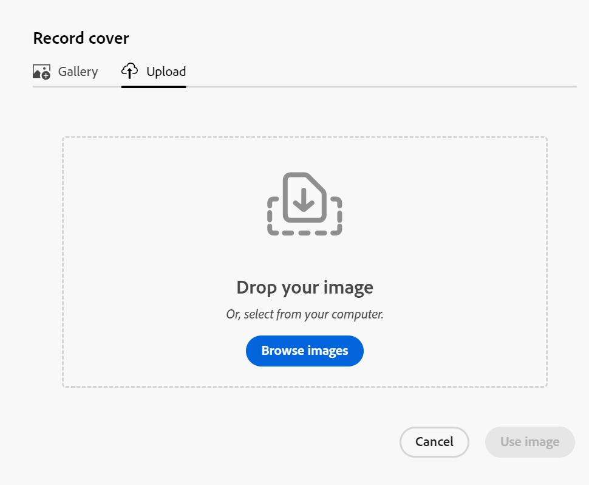
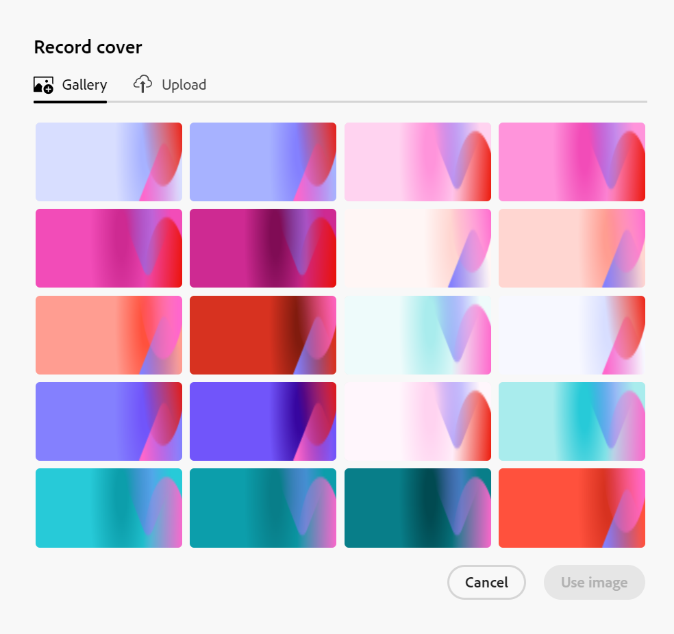

# 将封面图像添加到记录

{{planning-important-intro}}

编辑记录时，您可以在Adobe Workfront Planning中将封面图像添加到记录页来个性化记录。

有关编辑记录的信息，请参阅[编辑记录](/help/quicksilver/planning/records/edit-records.md)。

必须先创建记录类型，然后才能开始创建和编辑记录。

有关信息，请参阅[创建记录类型](/help/quicksilver/planning/architecture/create-record-types.md)。

## 访问要求

+++ 展开以查看Workfront Planning的访问要求。

您必须具有以下权限才能执行本文中的步骤：

<table style="table-layout:auto"> 
<col> 
</col> 
<col> 
</col> 
<tbody> 
    <tr> 
<tr> 
<td> 
   
 产品
 </td> 
   <td> 
   <ul><li>
 Adobe Workfront
</li> 
   <li>
 Adobe Workfront规划
</li></ul></td> 
  </tr>   
<tr> 
   <td role="rowheader">
Adobe Workfront计划*
</td> 
   <td> 

以下任意Workfront计划：
 
<ul><li>选择</li> 
<li>Prime</li> 
<li>Ultimate</li></ul> 

Workfront Planning不适用于旧版Workfront计划
 
   </td> 
<tr> 
   <td role="rowheader">
Adobe Workfront规划计划*
</td> 
   <td> 

任何 
 

有关每个Workfront计划中包括的内容的更多信息，请联系您的Workfront客户经理。 
 
   </td> 
 <tr> 
   <td role="rowheader">
Adobe Workfront平台
</td> 
   <td> 

贵组织的Workfront实例必须载入AdobeUnified Experience，才能访问Workfront Planning的所有功能。
 

有关详细信息，请参阅<a href="/help/quicksilver/workfront-basics/navigate-workfront/workfront-navigation/adobe-unified-experience.md">AdobeWorkfront的Unified Experience</a>。 
 
   </td> 
   </tr> 
  </tr> 
  <tr> 
   <td role="rowheader">
Adobe Workfront许可证*
</td> 
   <td>
 标准

   
Workfront计划不适用于旧版Workfront许可证
 
  </td> 
  </tr> 
  <tr> 
   <td role="rowheader">
访问级别配置
</td> 
   <td> 
Adobe Workfront Planning没有访问级别控制
   
</td> 
  </tr> 
<tr> 
   <td role="rowheader">
对象权限
</td> 
   <td>   
管理工作区的权限 
  
   
系统管理员对所有工作区具有权限，包括他们未创建的工作区
 </td> 
  </tr> 
<tr> 
   <td role="rowheader">
布局模板
</td> 
   <td> 
必须为所有用户(包括Workfront管理员)分配一个布局模板，该模板应包括主菜单中的Planning区域。 
 </td> 
  </tr> 
</tbody> 
</table>

*有关Workfront访问要求的详细信息，请参阅Workfront文档中的[访问要求](/help/quicksilver/administration-and-setup/add-users/access-levels-and-object-permissions/access-level-requirements-in-documentation.md)。

+++

<!--

OLD: 
<table style="table-layout:auto">
 <col>
 </col>
 <col>
 </col>
 <tbody>
    <tr>
<tr>
<td>
   
 Product
 </td>
   <td>
   
 Adobe Workfront
 </td>
  </tr>  
 <td role="rowheader">
Adobe Workfront agreement
</td>
   <td>

Your organization must be enrolled in the early access stage for Workfront Planning 

   </td>
  </tr>
  <tr>
   <td role="rowheader">
Adobe Workfront plan
</td>
   <td>

Any

   </td>
  </tr>
  <tr>
   <td role="rowheader">
Adobe Workfront license*
</td>
   <td>
   
New: Standard
  
   
Current: Plan
   
  </td>
  </tr>
  
  <tr>
   <td role="rowheader">
Access level configurations
</td>
   <td> 
There are no access controls for Workfront Planning 
  
</td>
  </tr>
<tr>
   <td role="rowheader">
Permissions
</td>
   <td> 
Manage permissions to a workspace 
  
   
System Administrators have permissions to all workspaces, including the ones they did not create

</td>
  </tr>
<tr>
   <td role="rowheader">
Layout template
</td>
   <td>  
All users, including Workfront administrators,  must be assigned a layout template that includes the Planning area in the Main Menu. 
 
For information, see <a href="/help/quicksilver/planning/access/access-overview.md">Access overview</a>. 
  
</td>
  </tr>

 </tbody>
</table>

*For more information, see [Access requirements in Workfornt documentation](/help/quicksilver/administration-and-setup/add-users/access-levels-and-object-permissions/access-level-requirements-in-documentation.md). 

-->

## 有关记录页封面图像的注意事项

您可以通过向记录页添加封面图像对其进行个性化设置。

请考虑以下事项：

* 封面图像对于一个记录是唯一的，并且不适用于同一类型的所有记录。
* 只能添加图像文件作为封面图像。
  <!--above: when you know exactly what type of files are allowed, add the exact extensions above-->
* 您可以从任何视图的记录预览或记录页面将封面图像添加到单个记录。
* 无法从记录视图添加封面图像。
* 每次创建记录时，Workfront都会自动上传封面图像。 您可以稍后修改此图像。

## 将封面图像添加到记录

通过在记录预览或页面顶部添加封面图像，可以个性化记录。

{{step1-to-planning}}

1. 单击要对其记录进行个性化的工作区，

   或

   从工作区中，展开现有工作区名称右侧的向下箭头，搜索工作区，然后在工作区显示在列表中时将其选定。

   此时会打开工作区，并显示记录类型。

1. 单击记录类型卡片。

   此时将打开记录类型页面。

1. 从任何类型的视图中，单击记录

   或

   从表格视图中，单击第一列中的&#x200B;**打开详细信息**&#x200B;图标。

   记录的预览将在视图中打开。

   

1. （可选）单击记录预览右上角的&#x200B;**在新标签中打开**&#x200B;图标 <!--check the icon; they are changing it-->以在新标签中打开记录页面。

   此时将打开记录页面。

   

1. 在记录预览或页面中，单击&#x200B;**添加封面**

   或

   将鼠标悬停在现有封面图像上，单击&#x200B;**更多**&#x200B;菜单，然后单击&#x200B;**上传**。 <!--check the casing here; I logged a bug for this-->
将在**上传**&#x200B;选项卡中打开&#x200B;**记录封面**&#x200B;框。

   

1. 单击&#x200B;**浏览图像**&#x200B;并浏览计算机上的图片以将其选择并添加。

1. （可选）要在保存图像之前删除图像，请单击&#x200B;**上传新图像**&#x200B;图标，然后上传新图像。

1. （可选）单击&#x200B;**图库**&#x200B;选项卡，然后单击图像库中的图像。 无法修改图像库。

   

1. 单击&#x200B;**使用图像**。

   图像会上载到记录预览或页面顶部，并且更改会自动保存。

   

1. （可选）将鼠标悬停在图像上，然后单击封面图像右下角的&#x200B;**更多**&#x200B;菜单，然后执行以下操作之一：

   * 如果要替换封面图像，请单击&#x200B;**上传**，然后重复步骤6以上传并保存新图像。
   * 单击&#x200B;**重新定位**，然后使用&#x200B;**重新定位**&#x200B;工具将封面图像置中，然后在完成时单击&#x200B;**保存**。
   * 单击“**移除**”移除封面图像。

   Workfront会自动保存您所做的更改。
