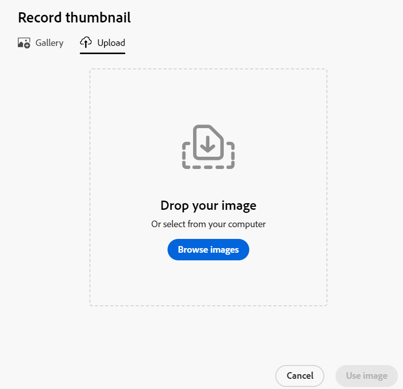

# 向记录添加缩略图

<!--The highlighted information on this page refers to functionality not yet generally available. It is available only in the Preview environment for all customers. After the monthly releases to Production, the same features are also available in the Production environment for customers who enabled fast releases.    

For information about fast releases, see [Enable or disable fast releases for your organization](/help/quicksilver/administration-and-setup/set-up-workfront/configure-system-defaults/enable-fast-release-process.md). -->

{{planning-important-intro}}

您可以在Adobe Workfront Planning中将记录与唯一缩略图相关联，以便轻松识别。

必须先创建记录类型，然后才能开始创建和编辑记录。
有关信息，请参阅[创建记录类型](/help/quicksilver/planning/architecture/create-record-types.md)。

## 访问要求

<!--************double-check permissions here - asking Isk and Lilit what permissions users need for adding thumbnails-->

+++ 展开以查看Workfront Planning的访问要求。

您必须具有以下权限才能执行本文中的步骤：

<table style="table-layout:auto"> 
<col> 
</col> 
<col> 
</col> 
<tbody> 
    <tr> 
<tr> 
<td> 
   
 产品
 </td> 
   <td> 
   <ul><li>
 Adobe Workfront
</li> 
   <li>
 Adobe Workfront规划
</li></ul></td> 
  </tr>   
<tr> 
   <td role="rowheader">
Adobe Workfront计划*
</td> 
   <td> 

以下任意Workfront计划：
 
<ul><li>选择</li> 
<li>Prime</li> 
<li>Ultimate</li></ul> 

Workfront Planning不适用于旧版Workfront计划
 
   </td> 
<tr> 
   <td role="rowheader">
Adobe Workfront规划包*
</td> 
   <td> 

任何 
 

有关每个Workfront计划中包括的内容的更多信息，请联系您的Workfront客户经理。 
 
   </td> 
 <tr> 
   <td role="rowheader">
Adobe Workfront平台
</td> 
   <td> 

贵组织的Workfront实例必须载入AdobeUnified Experience，才能访问Workfront Planning的所有功能。
 

有关详细信息，请参阅<a href="/help/quicksilver/workfront-basics/navigate-workfront/workfront-navigation/adobe-unified-experience.md">AdobeWorkfront的Unified Experience</a>。 
 
   </td> 
   </tr> 
  </tr> 
  <tr> 
   <td role="rowheader">
Adobe Workfront许可证*
</td> 
   <td>
 标准 

   
Workfront计划不适用于旧版Workfront许可证
 
  </td> 
  </tr> 
  <tr> 
   <td role="rowheader">
访问级别配置
</td> 
   <td> 
Adobe Workfront Planning没有访问级别控制
   
</td> 
  </tr> 
<tr> 
   <td role="rowheader">
对象权限
</td> 
   <td>   
管理工作区的权限 
  
   
系统管理员对所有工作区具有权限，包括他们未创建的工作区
 </td> 
  </tr> 
<tr> 
   <td role="rowheader">
布局模板
</td> 
   <td> 
必须为所有用户(包括Workfront管理员)分配一个布局模板，该模板应包括主菜单中的Planning区域。 
 </td> 
  </tr> 
</tbody> 
</table>

*有关Workfront访问要求的详细信息，请参阅Workfront文档中的[访问要求](/help/quicksilver/administration-and-setup/add-users/access-levels-and-object-permissions/access-level-requirements-in-documentation.md)。

+++

## 有关记录缩略图的注意事项

为了从视觉上区分表格视图中的记录，您可以将唯一的缩略图图像与每个记录相关联。

请考虑以下事项：

* 缩略图只显示一条记录，不适用于同一类型的所有记录。
* 您只能添加图像文件作为缩略图。
  <!--above: when you know exactly what type of files are allowed, add the exact extensions above-->
* 可以将缩略图图像添加到表格视图中的单个记录，也可以从记录的页面或预览框中添加缩略图图像。
* 每次创建记录时，Workfront都会自动上传缩略图图像。 您可以稍后修改此图像。
* 缩略图属于记录信息，并显示在记录显示的区域中。 例如，缩略图与记录信息一起显示在以下区域中：

   * 表视图中记录的主要字段
   * 时间线视图中的记录栏。
   * 记录的详细信息预览和页面。

## 向记录添加缩略图

您可以通过以下方式添加缩略图：

* [从表视图向记录添加缩略图](#add-a-thumbnail-to-a-record-from-the-table-view)
* [从详细信息页面向记录添加缩略图](#add-a-thumbnail-to-a-record-from-the-details-page)

### 从表视图向记录添加缩略图

{{step1-to-planning}}

1. 单击要为其添加缩略图的记录的工作区，然后单击记录类型卡片。

   这将打开记录类型页面。
1. 从&#x200B;**视图**&#x200B;下拉菜单中选择一个表视图。 所选类型的所有记录都会显示在表格中。
1. 将鼠标悬停在主字段信息上，单击&#x200B;**更多**&#x200B;菜单，然后单击&#x200B;**缩略图**。

   

   >[!TIP]
   >
   >   主字段是显示在表视图第一列中的字段。 主字段始终冻结，不能隐藏或重新定位。 当主字段为公式字段时，“缩略图”选项在“更多”菜单中不可用。

   默认情况下，**上传**&#x200B;选项卡会在&#x200B;**记录缩略图**&#x200B;框中打开。

   有关上载缩略图的更多信息，请参阅本文中从步骤6开始的[从详细信息页面](#add-a-thumbnail-to-a-record-from-the-details-page)将缩略图添加到记录部分。<!--see if this is accurate-->

<!--
    

  *****update screen shot with correct casing****

1. Drag and drop a file to add as a thumbnail
   
   Or
   
   Click **Browse images**, then browse for an image file to add. The file must be saved on your computer. 
1. (Optional) After the image uploads in the **Record thumbnail** box, use the sizing tool to crop and resize the image.
1. (Optional) Click the **Upload new image** icon  to upload another image. 
1. (Optional) To remove a thumbnail before it is saved, click  **Remove uploaded image** icon  to the right of the image. 
1. (Optional) Click the **Gallery** tab, then click an image. The gallery of images cannot be modified.

   
1. Click **Use image** to add the image as a thumbnail. 
   This closes the **Record thumbnail** box.
   The thumbnail displays in areas of Workfront Planning where the record displays. 

   >[!TIP]
   >
   >   You must enable the Thumbnail field in the table view to display thumbnails in this view. It is disabled by default.

1. (Optional) To remove the thumbnail after it is saved, hover over the primary field and click the **More** menu > **Thumbnail** > the **Remove** icon , then click **Save changes**. -->

### 从详细信息页面向记录添加缩略图

{{step1-to-planning}}

1. 单击要为其添加缩略图的记录的工作区，然后单击记录类型卡片。

   这将打开记录类型页面。
1. 从任何视图中，单击记录以将其打开。

   将显示详细信息预览框。
1. （可选）单击右上角的&#x200B;**在新标签中打开**&#x200B;图标。

   此时将打开记录的详细信息页面。

1. （视情况而定）在记录预览或详细信息页面中，将鼠标悬停在缩略图图像或图标上，然后将鼠标悬停在记录名称上方的空格上，然后单击“**添加缩略图**”或“**编辑缩略图**”。

   默认情况下，**上传**&#x200B;选项卡会在&#x200B;**记录缩略图**&#x200B;框中打开。

   

1. 拖放要作为缩略图添加的文件

   或

   单击&#x200B;**浏览图像**，然后浏览要添加的图像文件。 文件必须保存在计算机上。

1. （可选）在&#x200B;**记录缩略图**&#x200B;框中上传图像后，使用大小调整工具裁切图像并调整其大小。
1. （可选）单击&#x200B;**上传新图像**&#x200B;图标以上传其他图像。
1. （可选）单击&#x200B;**图库**&#x200B;选项卡，然后单击图像。 无法修改图像库。

   

1. （可选）要在保存缩略图之前删除缩略图，请单击图像右侧的&#x200B;**删除**&#x200B;图标。

1. 单击&#x200B;**使用图像**将图像添加为缩略图。
这将关闭**录制缩略图**框。
缩略图显示在Workfront Planning中记录所在的区域中。

   >[!TIP]
   >
   >   必须启用表格视图中的缩略图字段才能在此视图中显示缩略图。 默认情况下处于禁用状态。

1. （可选）要在保存缩略图后将其删除，请单击任意视图中的记录以打开详细信息页面，然后将鼠标悬停在缩略图图像上，然后单击&#x200B;**更多**&#x200B;菜单>**删除**&#x200B;图标。 缩略图图像将被删除。

<!--
### Generate a thumbnail for a record

{{step1-to-planning}}

1. Click the workspace for whose records you want to add thumbnails, then click the record type card. 

   This opens the record type page. 
1. Select a table view from the **View** drop-down menu. All records of the type you selected display in a table. 
1. Hover over the primary field information, click the **More** menu , then click **Thumbnail**. 

   

      >[!TIP]
      >
      >   The primary field is the field that displays in the first column of a table view. The primary field is always frozen and cannot be hidden or relocated. 

   The **Record thumbnail** box opens.

(*************** update the screenshot below*************)
    

1. Click the **Generate** tab, and type a prompt describing the type of image you want to add in the space provided. 
1. Click **Generate**. 

   A set of four suggested images displays. 

1. Click an image to select it, then click **Use image**. 

   The Record thumbnail box closes and the thumbnail is attached to the record. All users who can view the records can now see the selected thumbnail. 
1. (Optional) Click the **More** menu  to the right of the record name in the table view, then click **Thumbnail**. 

   The generated image opens in the **Upload** tab where you can modify or remove it, as described in the section [Upload a thumbnail to a record](#upload-a-thumbnail-to-a-record) in this article. 
-->