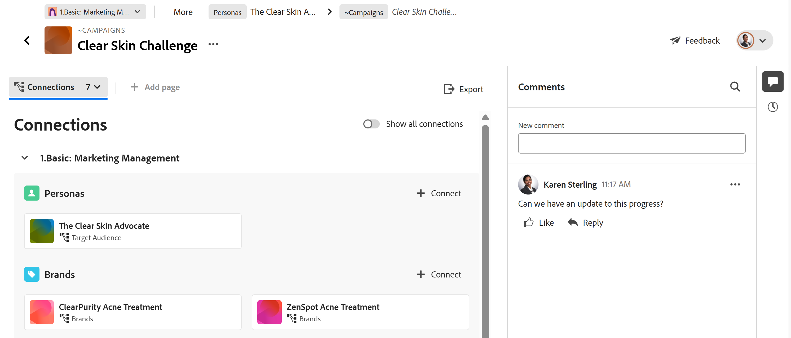

# 连接记录

此页面上高亮显示的信息引用了尚未公开的功能。 它仅在“预览”环境中对所有客户可用。 在每月发布到生产环境后，生产环境中为启用快速发布的客户提供了相同的功能。

有关快速发布的信息，请参阅[为您的组织启用或禁用快速发布](/help/quicksilver/administration-and-setup/set-up-workfront/configure-system-defaults/enable-fast-release-process.md)。

{{planning-important-intro}}

您可以将Adobe Workfront Planning记录相互连接或与其他应用程序中的对象连接。 在连接一个记录时，可以在另一个记录上显示这些记录的信息。

本文介绍了如何连接记录。 有关连接记录的更多常规信息，请参阅[连接的记录概述](/help/quicksilver/planning/records/connected-records-overview.md)。

必须首先将两个记录类型相互连接，或者将记录类型从另一个应用程序连接到对象类型。 这将创建连接的记录字段。 然后，可以在连接的记录字段中将记录彼此连接或将记录从其它应用程序连接到其它对象。

连接记录与将记录从另一个应用程序连接到对象类似。

有关将记录类型相互连接或从其他应用程序连接到对象类型的信息，请参阅[连接记录类型](/help/quicksilver/planning/architecture/connect-record-types.md)。

有关连接记录类型的示例，请参阅[连接记录类型和记录的示例](/help/quicksilver/planning/architecture/example-connect-record-types-and-records.md)。

您可以连接以下各项：

* Adobe Workfront Planning记录
* Adobe Workfront Planning记录包含来自其他应用程序的对象。

  可以将记录与下列应用程序中的以下类型对象连接：

   * Adobe Workfront

      * 项目
      * 项目组合
      * 项目群
      * 公司
      * 组

   * Adobe Experience Manager Assets

      * 图像文件
      * 文件夹

  <!--when you add more objects, fix the Access Requirements below which right now refer only to projects-->

## 访问要求

+++ 展开以查看访问要求。

<table style="table-layout:auto"> 
<col> 
</col> 
<col> 
</col> 
<tbody> 
    <tr> 
<tr> 
<td> 
   
 产品
 </td> 
   <td> 
   <ul><li>
 Adobe Workfront
</li> 
   <li>
 Adobe Workfront规划
</li>
   <li>
Adobe Experience Manager Assets(如果要将AEM资源与Planning记录连接)

   
您必须具有Adobe Experience Manager Assets许可证以及AEM Assets与Workfront之间的集成。
    有关信息，请参阅适用于Experience Manager Assets和Assets Essentials的<a href="/help/quicksilver/documents/adobe-workfront-for-experience-manager-assets-essentials/workfront-for-aem-asset-essentials.md">Adobe Workfront：文章索引</a>。 

   </li>  
   </ul></td> 
  </tr>   
<tr> 
   <td role="rowheader">
Adobe Workfront计划*
</td> 
   <td> 

以下任意Workfront计划：
 
<ul><li>选择</li> 
<li>Prime</li> 
<li>Ultimate</li></ul> 

Workfront Planning不适用于旧版Workfront计划
 
   </td> 
<tr> 
   <td role="rowheader">
Adobe Workfront规划包*
</td> 
   <td> 

任何 
 

有关每个Workfront计划中包括的内容的更多信息，请联系您的Workfront客户经理。 
 
   </td> 
 <tr> 
   <td role="rowheader">
Adobe Workfront平台
</td> 
   <td> 

贵组织的Workfront实例必须载入Adobe Unified Experience才能访问Workfront Planning。
 

有关详细信息，请参阅<a href="/help/quicksilver/workfront-basics/navigate-workfront/workfront-navigation/adobe-unified-experience.md">适用于Workfront的Adobe Unified Experience</a>。 
 
   </td> 
   </tr> 
  </tr> 
  <tr> 
   <td role="rowheader">
Adobe Workfront许可证*
</td> 
   <td> 标准
   
Workfront计划不适用于旧版Workfront许可证
 
  </td> 
  </tr> 
  <tr> 
   <td role="rowheader">
访问级别配置
</td> 
   <td> 
Adobe Workfront Planning对象没有访问级别控制
 
   
查看要从Workfront链接的对象类型的或更高权限。
   
</td> 
  </tr> 
<tr> 
   <td role="rowheader">
对象权限
</td> 
   <td>   
向工作区提供或更高权限以及连接记录的记录类型 
  
   
查看或更高的工作区权限并记录类型，以查看与其他应用程序中的对象和字段的所有连接，无论您对其他应用程序的访问权限如何。 

   
查看要从Workfront或Experience Manager Assets链接的对象或授予对这些对象的更高权限。 

   
系统管理员有权访问所有工作区，包括他们未创建的工作区。
 </td> 
  </tr> 
</tbody> 
</table>

*有关Workfront访问要求的详细信息，请参阅Workfront文档中的[访问要求](/help/quicksilver/administration-and-setup/add-users/access-levels-and-object-permissions/access-level-requirements-in-documentation.md)。

+++

## 连接记录的注意事项

* 要将记录与其他记录或对象连接，您必须具备以下条件：

   * 至少一个工作区、记录类型和记录。

     有关更多信息，请参阅以下文章：

      * [创建工作区](/help/quicksilver/planning/architecture/create-workspaces.md)
      * [创建记录类型](/help/quicksilver/planning/architecture/create-record-types.md)
      * [创建记录](/help/quicksilver/planning/records/create-records.md)

   * 记录类型之间的连接，或记录类型与其他应用程序的对象之间的连接。 有关信息，请参阅[连接记录类型](/help/quicksilver/planning/architecture/connect-record-types.md)。

* 您可以将一个或多个记录或对象相互连接起来。 这取决于您在连接记录或对象类型时选择的连接类型。 有关信息，请参阅[连接记录类型概述](/help/quicksilver/planning/architecture/connect-record-types-overview.md)。

## 从Workfront Planning连接记录

您可以在Workfront Planning记录的以下区域中连接记录：

* 表视图中的已连接记录字段。
* 记录的预览框或页面（在“详细信息”选项卡上的已连接记录字段中）。
* 记录在“连接”选项卡上的预览框或页面。
* “连接的记录”页面选项卡上的记录页面。

### 从记录的表视图或详细信息区域连接Workfront Planning记录

{{step1-to-planning}}

1. 单击要连接其记录的工作区。

   工作区将打开，记录类型显示为卡片。
1. 单击记录类型的卡以打开记录类型页面。
1. 单击表视图的名称以将其打开。
1. （可选）通过向表中添加新行，将记录添加到您选择的记录类型。 有关信息，请参阅[创建记录](/help/quicksilver/planning/records/create-records.md)。
1. （视情况而定）将选定的记录类型与另一个记录类型连接后，转到记录的已连接字段并在该字段内单击，或单击&#x200B;**连接**&#x200B;以添加记录。

   

1. 执行下列操作之一：

   * 从列表中单击已连接记录的名称以将其添加到所选记录。 记录会自动添加。
   * 开始键入记录的名称，并在该记录显示在列表中时单击它。 记录会自动添加。

   >[!TIP]
   >
   >如果只选择在连接记录类型时显示记录的图像，则连接的字段中只会显示记录的缩略图或图标。 有关详细信息，请参阅[连接记录类型](/help/quicksilver/planning/architecture/connect-record-types.md)。
   >

1. （视情况而定）如果在连接记录类型时为“连接”类型选择了“一对多”或“一对一”，并且尝试连接某个记录或已在其他地方连接的对象，您将收到一则警告，指出再次连接该记录或对象会将其从原始连接中删除。 单击&#x200B;**连接**&#x200B;允许删除并连接记录，或单击&#x200B;**取消**&#x200B;返回字段并选择其他记录。
1. （可选）如果找不到要连接的对象并且要添加该对象，请单击&#x200B;**+添加**

   或

   开始键入对象的名称，然后单击&#x200B;**+添加**&#x200B;以创建并添加该对象。

   有关详细信息，请参阅[创建记录](/help/quicksilver/planning/records/create-records.md)一文中的“连接其他记录时创建记录”一节。

   >[!TIP]
   >
   >    通过在表视图中执行以下操作，可以打开记录的页面并连接其他记录：
   >1. 单击视图中的记录名称。
   >1. 查找链接的记录字段，然后双击该字段（如果已经连接记录）
   >或
   >单击&#x200B;**连接记录**（如果字段为空）以从连接的记录或对象类型添加记录。
   >
   >

1. （可选）单击&#x200B;**查看全部**&#x200B;以显示所有记录。

1. （视情况而定）如果您在上一步中单击了&#x200B;**查看所有**，则会显示&#x200B;**连接对象**&#x200B;框。

   

1. 在搜索框中开始键入记录的名称，然后当它显示在列表中时将其选定

   或

   在框中选择一个或多个记录的名称，然后单击&#x200B;**连接对象**。

   添加了以下内容：

   * 链接记录显示在您在上一步中选择的记录的链接记录字段中。
   * 如果您在连接记录类型时添加了链接的查找字段，则链接字段会填充有链接记录中的信息。

   更新链接的记录会自动更新您正在链接的记录的链接字段。 您无法手动编辑链接的字段。

   >[!TIP]
   >
   >* 我们交替使用“链接字段”和“查找字段”。
   >
   >* 当您选择在连接记录类型时连接多个记录时，来自多个对象的字段值或者以逗号分隔，或者根据您在连接记录类型时选择的聚合器聚合。
   >* 您无法添加Workfront预输入字段（包括项目所有者或项目发起人等字段）作为查找字段。
   >
   >* Workfront对象的日期字段信息在Workfront Planning中以24小时制显示，无论它在Workfront中如何显示。
   >
   >   例如，如果项目的计划开始日期在Workfront中显示为3:00 PM，它在Workfront Planning的导入查找字段中将显示为15:00。

1. （可选）关闭记录类型页面，然后转到您选择的工作区。
1. 单击链接到的记录类型的卡。

   例如，如果您已将&#x200B;**Campaign**&#x200B;记录与产品记录连接，请单击&#x200B;**Product**&#x200B;卡。

   记录类型卡应在表视图中打开。 如果没有，请选择表格视图。

   请注意，**Campaign**&#x200B;链接记录字段在产品记录类型页面中显示您链接到产品的营销活动的名称。 更新促销活动信息会自动更新产品记录类型的促销活动链接记录字段。

### 将Workfront Planning记录从记录的表视图或详细信息区域连接到Workfront对象

<!--when we will have more applications to link to from Planning, change the title to something like: Connect Workfront Planning records to objects from other applications-->

在记录类型和Workfront对象类型之间创建连接后，可以将单个记录连接到Workfront中的对象。 您连接的Workfront字段会自动填充到链接对象的记录中。

>[!NOTE]
>
>您无法从Workfront中将Workfront对象类型与Workfront Planning记录类型连接起来。

{{step1-to-planning}}

1. 单击要连接其记录的工作区。

   工作区将打开，记录类型显示为卡片。
1. 单击记录类型的卡以打开记录类型页面。
1. 从&#x200B;**视图**&#x200B;下拉菜单中选择&#x200B;**表**&#x200B;视图。

1. 单击&#x200B;**新建记录**&#x200B;以将单个记录添加到您选择的记录类型。 有关信息，请参阅[创建记录](/help/quicksilver/planning/records/create-records.md)。

1. （视情况而定）将选定的记录类型与Workfront对象类型连接后，转到记录上连接的字段，然后单击该字段，或单击&#x200B;**连接**&#x200B;以添加Workfront对象。

   

1. 执行下列操作之一：

   * 单击列表中的对象以将其添加到所选记录。 对象按字母顺序列出。 对象将自动添加。
   * 开始键入对象的名称，并在该对象显示在列表中时单击它。 对象将自动添加。

   >[!TIP]
   >
   >您可以从视图中打开记录的页面，双击链接的记录字段，或单击字段中的&#x200B;**连接**&#x200B;以添加来自连接的对象类型的对象。

1. （可选）如果找不到要连接的对象并且要添加该对象，请单击&#x200B;**+添加**

   或

   开始键入对象的名称，然后单击&#x200B;**+添加**&#x200B;以创建和添加新项目、项目组合或项目群。

   有关信息，请参阅[从Workfront Planning创建Workfront对象](/help/quicksilver/planning/records/create-workfront-objects-from-workfront-planning.md)

1. （可选）单击&#x200B;**查看全部**&#x200B;以显示您至少具有查看权限的所有对象。

   如果您在上一步中单击了&#x200B;**查看所有**，则会显示&#x200B;**连接对象**&#x200B;框。

   

1. 开始在搜索框中键入Workfront对象的名称，然后当该对象显示在列表中时将其选定

   或

   在框中选择一个或多个对象的名称，然后单击&#x200B;**连接对象**。

   >[!IMPORTANT]
   >
   >* 您只能添加您有权查看的Workfront对象。
   >
   >* 添加Workfront对象后，每个对工作区具有“查看”或更高权限的用户都可以查看Workfront对象及其字段信息，无论他们在Workfront中的权限或访问权限如何。

   添加了以下内容：

   * 选定的Workfront对象将添加到链接的记录字段。
   * 如果您在通过Workfront连接记录类型时添加了它们，则Workfront对象的链接字段（或查找字段）会自动填充Workfront中的信息。

   有关将记录类型与来自其他应用程序的对象连接的详细信息，请参阅[连接记录类型](/help/quicksilver/planning/architecture/connect-record-types.md)。

1. （可选）单击表视图的链接字段或记录页面中链接字段内连接到Workfront Planning记录的Workfront对象的名称。

   如果您至少具有对象的“查看”权限，此操作将在Workfront中打开Workfront对象。

   >[!TIP]
   >
   >* 当您选择在连接记录类型时连接多个记录时，查找字段的值显示时用逗号分隔，或者根据您选择的聚合器聚合。
   >
   >* 在Workfront中，不会为链接的Workfront对象创建链接记录字段。

1. （可选）在记录类型的表视图中，将鼠标悬停在链接Workfront对象的列标题上，单击下拉菜单，然后单击&#x200B;**编辑查找字段**。

1. 从&#x200B;**未选择的字段**&#x200B;区域添加Workfront对象字段

   或

   从&#x200B;**选定字段**&#x200B;区域删除Workfront对象字段。

   这会从Workfront Planning记录中添加或删除链接字段。 与已删除字段关联的信息仍保留在Workfront中。

### 将Workfront Planning记录从记录的表视图或详细信息区域连接到Adobe Experience Manager对象

<!--when we will have more applications to link to from Planning, change the title to something like: Connect Workfront Planning records to objects from other applications-->

>[!IMPORTANT]
>
>您必须拥有Adobe Experience Manager Assets许可证，并且贵组织的Workfront实例必须载入Adobe业务平台或Adobe Admin Console，才能将Workfront Planning记录连接到Adobe Experience Manager Assets。
>
>如果您对加入Adobe Admin Console有任何疑问，请参阅[Adobe Unified Experience常见问题解答](/help/quicksilver/workfront-basics/navigate-workfront/workfront-navigation/unified-experience-faq.md)。

在记录类型与Adobe Experience Manager Assets之间创建连接后，可以将单个记录连接到Experience Manager资源。 创建连接后，您从Experience Manager Assets连接的资源字段会自动填充在您链接的记录类型中。

>[!NOTE]
>
>当Workfront管理员通过Experience Manager Assets与Workfront之间的集成配置元数据映射时，可从Adobe Experience Manager Assets访问Planning记录及其字段。 有关详细信息，请参阅[配置Adobe Workfront和Experience Manager Assets之间的资源元数据映射](https://experienceleague.adobe.com/en/docs/experience-manager-cloud-service/content/assets/integrations/configure-asset-metadata-mapping)。

要将记录与Experience Manager资源连接，请执行以下操作：

{{step1-to-planning}}

1. 单击要连接其记录的工作区。

   此时会打开工作区，并显示记录类型。
1. 单击记录类型的卡以打开记录类型页面。
1. 从记录类型页面右上角的&#x200B;**视图**&#x200B;下拉菜单中选择&#x200B;**表**&#x200B;视图。

1. （可选）单击&#x200B;**新记录**&#x200B;以将新记录添加到您选择的记录类型。 有关信息，请参阅[创建记录](/help/quicksilver/planning/records/create-records.md)。
1. （视情况而定）将所选的记录类型与Experience Manager Assets连接后，转到记录中连接的字段并单击该字段，或单击&#x200B;**连接**&#x200B;将Experience Manager资源添加到记录中，然后单击&#x200B;**+**&#x200B;图标。

   >[!TIP]
   >
   >  您可以在记录页面中的链接对象字段中添加&#x200B;**+**&#x200B;图标，以将资产连接到记录。

   此时会显示&#x200B;**选择Assets**&#x200B;框。<!--we might change this to Connect assets-->

   

1. 单击可选择以下某些类型的资产：

   * 图像
   * 文件夹

   您可以选择多个资源。

   >[!IMPORTANT]
   >
   > 您只能连接有权在Experience Manager中查看的资源。 连接后，所有Workfront Planning用户都可以在Workfront Planning中查看资源，无论他们在Experience Manager Assets中是否具有访问权限。

1. 单击&#x200B;**选择**。<!-- we might change this to Connect-->

   添加了以下内容：

   * 选定的Experience Manager资源将添加到链接的记录字段。
   * 链接的字段（或查找字段）会填充来自Experience Manager连接的资源的信息。

     Experience Manager资源字段中的任何现有信息都会自动显示在链接或查找字段中。

     >[!TIP]
     >
     >* 当选择在连接记录类型时连接多个记录时，多个对象的值显示以逗号分隔或根据您选择的聚合器聚合。
     >
     >* 没有在Experience Manager Assets应用程序中为链接的Workfront Planning资源创建指向Experience Manager Planning链接记录的链接记录字段。

1. （可选）转到您链接到Experience Manager Assets的记录类型，然后单击链接记录字段中的资源名称。 资源的Experience Manager详细信息会显示在弹出窗口中。

   

   为图像文件显示以下字段：

   * 图像的缩略图
   * 图像文件名
   * 维度
   * 大小
   * 描述
   * Experience Manager中的文件路径
   * 资源类型
   * 创建日期
   * 修改日期

1. （可选）要在Experience Manager中打开Experience Manager资源记录页面，请转到要链接到的记录的记录类型页面，在链接的记录字段中单击资源的名称以打开弹出窗口，然后单击&#x200B;**在AEM中打开**&#x200B;图标以打开该资源。

   此操作将在Adobe Experience Manager Assets中打开Experience Manager资源。

1. （可选）在记录类型的表视图中，将鼠标悬停在链接的Experience Manager资源的列标题上，单击下拉菜单，然后单击&#x200B;**编辑查找字段**。

1. 从&#x200B;**未选择的字段**&#x200B;区域添加Experience Manager Assets对象字段

   或

   从&#x200B;**选定字段**&#x200B;区域删除Workfront对象字段。

   这会在记录中添加或删除链接字段。 与已删除字段关联的信息仍保留在Adobe Experience Assets中。

### 从记录页面的“连接”选项卡将Workfront Planning记录与其他记录或对象连接

1. 转到已连接到其他Planning记录类型或来自其他应用程序的对象类型的任何记录类型视图。
1. 按照前面各小节中描述的步骤，在视图中查找要与其他记录或对象连接的记录。
1. 单击记录名称。

   预览页面将打开。
1. （可选）单击&#x200B;**在新标签中打开**&#x200B;图标以打开记录的页面。
1. 单击记录预览或页面中的&#x200B;**连接**&#x200B;选项卡。

   Workfront Planning中记录的

   链接到选定记录类型的所有记录或对象类型都显示为节。 连接的记录或对象显示在卡片上的记录或对象类型名称下。

   >[!TIP]
   >
   >    默认情况下，仅显示已连接单个记录的已连接记录。

1. （可选）单击“显示所有连接”**&#x200B;**&#x200B;可显示所有连接的记录类型，包括未连接记录的记录类型。

1. （可选）单击截面左侧的向下箭头以将其折叠。

1. （视情况而定）单击&#x200B;**连接**&#x200B;以添加更多相同类型的记录或对象。
1. （可选）如果找不到要连接的记录或对象，并且要添加它，请单击“**+添加”**

   或

   开始键入对象的名称，然后单击&#x200B;**+添加**&#x200B;以创建该对象并将其添加到记录。

   有关详细信息，请参阅[创建记录](/help/quicksilver/planning/records/create-records.md)一文中的“连接其他记录时创建记录”一节。
1. 按照前面部分中描述的步骤，连接来自Workfront Planning的记录或来自Workfront或Experience Manager Assets的对象。
记录和对象会立即添加。
1. （可选）将鼠标悬停在已连接的记录卡或对象上，然后单击&#x200B;**断开连接记录**&#x200B;图标以将其与选定记录断开连接。

   

   该记录会立即与Workfront Planning的所有区域或其可能显示为已连接的其他应用程序断开连接。 所有查找字段值也会被删除。

### 从记录的“连接的记录”页面连接记录

1. 转到已连接到其他Planning记录类型或来自其他应用程序的对象类型的任何记录类型视图。
1. 按照前面各小节中描述的步骤，在视图中查找要与其他记录或对象连接的记录。
1. 单击记录名称。

   预览页面将打开。
1. 单击&#x200B;**在新标签中打开**&#x200B;图标以打开记录的页面。
1. 在记录页面中单击现有的“连接的记录”页面选项卡。 必须首先创建“连接的记录”页面。

   在表格视图中将显示连接的记录类型页面。

   表格中将显示所有类型连接的记录。
1. 单击&#x200B;**连接**、**连接记录**&#x200B;或&#x200B;**新行**&#x200B;添加或删除记录。

   在已连接记录详细信息选项卡中突出显示

   有关信息，请参阅[管理记录页布局](/help/quicksilver/planning/records/manage-the-record-page.md)。
1. （可选）如果找不到连接的记录，请单击&#x200B;**+添加**&#x200B;以创建并连接它们。

## 从Workfront对象连接记录

要从Workfront对象连接Workfront Planning记录，您必须具备以下条件：

* 在Workfront Planning中建立的记录类型与Workfront对象类型之间的连接。
* 您的Workfront或组管理员必须将以下任意对象添加到Workfront对象类型：

   * 布局模板中Workfront项目、项目组合和程序的“规划”部分。

   * Planning将自定义字段连接到以下对象之一的自定义表单：

      * 项目
      * 组合
      * 项目群
      * 组
      * 公司

  有关详细信息，请参阅[管理来自Workfront对象的记录连接](/help/quicksilver/planning/records/manage-records-in-planning-section.md)。
