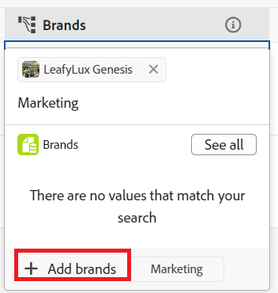

<!--update the metadata with real information when making this available in TOC and in the left nav-->

# 创建记录

此页面上的信息引用了尚未公开的功能。 它仅在“预览”环境中对所有客户可用。 在每月发布到生产环境后，生产环境中为启用快速发布的客户提供了相同的功能。

有关快速发布的信息，请参阅[为您的组织启用或禁用快速发布](/help/quicksilver/administration-and-setup/set-up-workfront/configure-system-defaults/enable-fast-release-process.md)。

{{planning-important-intro}}

在Adobe Workfront Planning中，记录是记录类型的实例。

您可以通过执行以下操作之一来创建记录：

* [从表视图的记录类型页面添加记录](#create-records-by-adding-them-to-a-record-type-in-a-record-type-table)
* [从外部列表中复制并粘贴记录列表](#create-records-by-copying-and-pasting-them-from-an-external-list)
* [从表视图复制记录](#create-records-by-duplicating-them)
* [在连接其他记录时创建记录](#create-records-as-you-connect-them)
* [通过向记录类型提交请求表单来创建记录](#create-records-by-submitting-a-request-form-to-a-record-type)
* [从CSV或Excel文件导入记录类型时创建记录](#create-records-when-importing-record-types-from-a-csv-or-excel-file)
* [使用自动创建记录](#create-records-by-using-automations)

有关管理表或时间线视图中的记录的信息，请参阅以下文章：

* [管理表视图](/help/quicksilver/planning/views/manage-the-table-view.md)
* [管理时间线视图](/help/quicksilver/planning/views/manage-the-timeline-view.md)

## 访问要求

+++ 展开以查看Workfront Planning的访问要求。

您必须具有以下权限才能执行本文中的步骤：

<table style="table-layout:auto"> 
<col> 
</col> 
<col> 
</col> 
<tbody> 
    <tr> 
<tr> 
<td> 
   
 产品
 </td> 
   <td> 
   <ul><li>
 Adobe Workfront
</li> 
   <li>
 Adobe Workfront规划
</li></ul></td> 
  </tr>   
<tr> 
   <td role="rowheader">
Adobe Workfront计划*
</td> 
   <td> 

以下任意Workfront计划：
 
<ul><li>选择</li> 
<li>Prime</li> 
<li>Ultimate</li></ul> 

Workfront Planning不适用于旧版Workfront计划
 
   </td> 
<tr> 
   <td role="rowheader">
Adobe Workfront规划包*
</td> 
   <td> 

任何 
 

有关每个Workfront计划中包括的内容的更多信息，请联系您的Workfront客户经理。 
 
   </td> 
 <tr> 
   <td role="rowheader">
Adobe Workfront平台
</td> 
   <td> 

贵组织的Workfront实例必须载入Adobe Unified Experience，才能访问Workfront Planning的所有功能。
 

有关详细信息，请参阅<a href="/help/quicksilver/workfront-basics/navigate-workfront/workfront-navigation/adobe-unified-experience.md">适用于Workfront的Adobe Unified Experience</a>。 
 
   </td> 
   </tr> 
  </tr> 
  <tr> 
   <td role="rowheader">
Adobe Workfront许可证*
</td> 
   <td> 标准
   
Workfront计划不适用于旧版Workfront许可证
 
  </td> 
  </tr> 
  <tr> 
   <td role="rowheader">
访问级别配置
</td> 
   <td> 
Adobe Workfront Planning没有访问级别控制
 
   
在将记录连接到要创建的对象类型（项目和项目组合）时，在Workfront中编辑对这些对象的访问权限。 
  
</td> 
  </tr> 
<tr> 
   <td role="rowheader">
对象权限
</td> 
   <td> 
管理要向其中添加记录的工作区的权限。 
  
   
系统管理员对所有工作区具有权限，包括他们未创建的工作区

   
管理Workfront对象（项目组合）的权限以添加子对象（项目）。

   </td> 
  </tr> 
<tr> 
   <td role="rowheader">
布局模板
</td> 
   <td> 
必须为所有用户(包括Workfront管理员)分配一个布局模板，该模板应包括主菜单中的Planning区域 
 </td> 
  </tr> 
</tbody> 
</table>

*有关Workfront访问要求的详细信息，请参阅Workfront文档中的[访问要求](/help/quicksilver/administration-and-setup/add-users/access-levels-and-object-permissions/access-level-requirements-in-documentation.md)。

+++

## 通过将记录添加到记录类型表中的记录类型来创建记录

您可以在记录类型页面的表格视图中创建记录。

有关编辑记录信息的信息，请参阅[编辑记录](/help/quicksilver/planning/records/edit-records.md)。

{{step1-to-planning}}

1. 单击要在其中添加记录的工作区。

   工作区将打开，记录类型显示为卡片。

1. 单击记录类型卡片。 有关创建记录类型的信息，请参阅[创建记录类型](/help/quicksilver/planning/architecture/create-record-types.md)。

   记录类型页面将在您上次访问的视图中打开。 默认情况下，将在表格视图中打开记录类型页面。
所选类型的所有记录都将显示在视图中。

1. （视情况而定）根据显示的视图，执行以下操作之一：

   * 从表格视图中：

      * 在表的最后一行中单击&#x200B;**新建记录**

      * 在键盘上从表格的任意列或行单击&#x200B;**Shift + Enter**。 这会在您开始的记录下添加一个空行。
      * 将鼠标悬停在记录的主字段上，单击该字段右侧的&#x200B;**更多**&#x200B;菜单，然后单击&#x200B;**在上方插入记录**&#x200B;或&#x200B;**在下方插入记录**。

     

   * 从任何视图中：

      * 单击页面右上角的&#x200B;**新建记录**。 记录预览框打开。

     Workfront会自动将缩略图和封面图像上传到每张新记录。 您可以稍后修改这些图像。 有关信息，请参阅以下文章：

      * [将封面图像添加到记录](/help/quicksilver/planning/records/add-a-cover-image-to-a-record.md)
      * [向记录添加缩略图](/help/quicksilver/planning/records/add-thumbnails-to-records.md)

1. 开始在您在预览框中看到的字段中键入有关新记录的信息。

   >[!NOTE]
   >
   >  * 记录没有必填字段。 但是，我们建议您为记录的主要字段添加信息，因为在将记录相互链接时，识别记录会很有帮助。 有关主字段的详细信息，请参阅[管理表视图](/help/quicksilver/planning/views/manage-the-table-view.md)和[主字段概述](/help/quicksilver/planning/fields/primary-field-overview.md)。
   >
   >  * 引用其他记录类型或计算字段的字段为只读字段。

1. （视情况而定）在表中添加记录时，继续添加每行的信息，然后在键盘上单击&#x200B;**Enter**&#x200B;以保存更改。

   或

   单击新记录的名称或记录名称左侧的&#x200B;**打开详细信息**&#x200B;图标中的打开详细信息图标。 在表中打开包含记录详细信息的预览。

   >[!TIP]
   >
   >当名称字段是主字段时，您只能从记录的名称字段访问&#x200B;**打开详细信息**&#x200B;图标。

1. 开始编辑记录预览中的记录信息。 Workfront会自动保存您所做的更改。
1. （可选）单击记录预览右上角的&#x200B;**在新标签中打开**&#x200B;图标以新标签中打开记录页面。 继续编辑记录页面上的记录。 有关信息，请参阅[编辑记录](/help/quicksilver/planning/records/edit-records.md)。

1. （可选）在将新记录或其信息添加到表视图时，使用以下键盘快捷键可撤消或重做添加新记录或其信息：

   * CTRL + Z(Mac为⌘ + Z)可撤消更改
   * 按CTRL + Shift + Z(对于Mac，按⌘ + Shift + Z)可重做更改

<!-- this is not possible anymore: 

## Create records by connecting them from another application

You can import records from other applications by linking them to existing records. This creates a linked record for the other application's connected object. 

1. Create a record type, as described in the [Create record types](/help/quicksilver/planning/architecture/create-record-types.md).

1. Create records for the record type you created in the previous step. For information, see the section [Create records by manually adding them to a record type](#create-records-by-manually-adding-them-to-a-record-type) in this article. 

1. Create a connection to an object type from another application for the record type you created. For information, see [Connect record types](/help/quicksilver/planning/architecture/connect-record-types.md).

1. Add objects from another application to the records you created above using the linked record field you created in the previous step. For information, see [Connect records](/help/quicksilver/planning/records/connect-records.md). 

    The following items are created in Workfront Planning:

    * A read-only record type that refers to the other application's record type you linked to in the connected record field. 

      For example, if you connect a Planning record type to Workfront project, a read-only record type named "Workfront project" is created in the same workspace. You can access the read-only Workfront record types from the table view of the Planning records you're linking from. 
   
-->

## 通过从外部列表中复制和粘贴记录来创建记录

1. 开始在“表”视图中创建记录，如[通过手动将记录添加到本文中的记录类型](#create-records-by-manually-adding-them-to-a-record-type)来创建记录一节中所述。

   确保表视图具有要使用新记录信息填充的列（或字段）。

1. 在表的最后一行中单击&#x200B;**新建&lt;记录类型名称>**，以向表中添加您想要的新记录数量的新行。

   例如，如果要粘贴来自其他应用程序的10条新记录的信息，请向表格视图添加10行。

1. 在另一个应用程序中，创建要导入的记录列表。

   例如，您可以使用Excel电子表格来创建列表。

   该列表应包含表格格式的信息。

   >[!TIP]
   >
   > 列表的列应包含有关您在Workfront中拥有的现有字段的信息。
   >
   > 确保您已在Workfront中创建了所需的字段，并且工作表中的信息以与Workfront中每个字段信息匹配的正确格式显示。

1. 从另一个应用程序中，选择多个行和列，然后将信息粘贴到记录类型表格视图中，从第一个新记录开始。

   将在Workfront Planning区域中导入以下信息：

   * 行包含新记录
   * 列填充记录字段的信息。

## 通过复制记录创建记录

有关复制记录的信息，请参阅[复制记录](/help/quicksilver/planning/records/copy-or-duplicate-records.md)。

## 连接记录时创建记录

从其它记录连接时，可以创建以下对象类型：

* Workfront Planning记录
* Workfront对象

本节介绍在将记录与其他记录连接时如何创建Workfront Planning记录。

>[!NOTE]
>
>在将Workfront项目和项目组合连接到Workfront Planning记录时创建Planning项目和项目组合，与在从其他记录连接它们时创建Planning记录类似。
>
>有关从Workfront Planning创建Workfront对象的信息，请参阅将Workfront对象连接到记录时[从Workfront Planning创建这些对象](/help/quicksilver/planning/records/create-workfront-objects-from-workfront-planning.md)。

您必须具备以下条件，才能通过从现有记录连接来添加新记录：

* 连接的记录类型。 有关信息，请参阅[连接记录类型](/help/quicksilver/planning/architecture/connect-record-types.md)。
* 记录。
* Workfront Planning和Workfront中的正确访问和权限，如本文的[访问要求](#access-requirements)部分所述。

要在从其他记录连接记录时创建记录，请执行以下操作：

1. 开始连接Workfront Planning记录，如文章[连接记录](/help/quicksilver/planning/records/connect-records.md)中所述。 您可以从以下区域连接记录：

   * Workfront Planning的以下区域中的连接字段：

      * 表格视图
      * 记录的详细信息页面或预览框

   * Workfront中项目、项目组合或项目群的“规划”部分中的连接字段。

     有关信息，请参阅[管理来自Workfront对象的记录连接](/help/quicksilver/planning/records/manage-records-in-planning-section.md)。

1. （视情况而定）如果在尝试连接时找不到记录，请单击“**+添加”**

   或
开始键入名称，然后单击**+添加**。 **+ Add**&#x200B;按钮后跟您连接到的记录类型的名称。 例如，将品牌添加到现有营销活动时，“添加品牌”。 您键入的名称还遵循“添加”按钮。

   <!--remove the first part of the step above to say just Click Add when the button will be persistent, for preview and production-->

   

   将创建记录并将其添加到连接的记录字段。

   >[!IMPORTANT]
   >
   >* 从记录中连接项目、项目组合和项目群时，只能在Workfront中创建它们。
   >
   >* 从Workfront Planning中的记录连接组或公司时，无法创建组或公司。
   > 

1. （可选）转到您创建其记录的记录类型的表格视图。 新记录将显示在视图的最后一行。
1. （可选）开始在表视图中添加新记录的信息
或
单击其名称可打开详细信息页面并在其中添加信息。

## 通过向记录类型提交请求表单来创建记录

当有人为记录类型创建请求表单并与您共享指向该记录类型的链接后，您可以提交一个请求，为记录类型创建记录。

有关信息，请参阅[在Adobe Workfront Planning中创建和管理申请表单](/help/quicksilver/planning/requests/create-request-form.md)。

Workfront用户和组织外部的用户均可向Planning记录类型提交请求并创建记录（如果它们具有指向请求表单的链接）。

有关信息，请参阅[提交Adobe Workfront计划请求以创建记录](/help/quicksilver/planning/requests/submit-requests.md)。

## 从CSV或Excel文件导入记录类型时创建记录

在使用CSV或Excel文件导入记录类型时，可以导入记录。

有关信息，请参阅[创建记录类型](/help/quicksilver/planning/architecture/create-record-types.md)。

## 使用自动化创建记录

您可以在Workfront Planning中配置自动处理，激活自动处理后，创建从Planning记录触发的记录。 创建的记录会自动连接到从中触发自动化的记录。

您可以在Workfront Planning的记录页面中配置和激活自动化。 创建的连接记录将放置到运行自动化的记录类型的连接字段中。

有关信息，请参阅[使用Adobe Workfront Planning记录自动化创建对象](/help/quicksilver/planning/records/create-wf-objects-using-planning-automations.md)。

