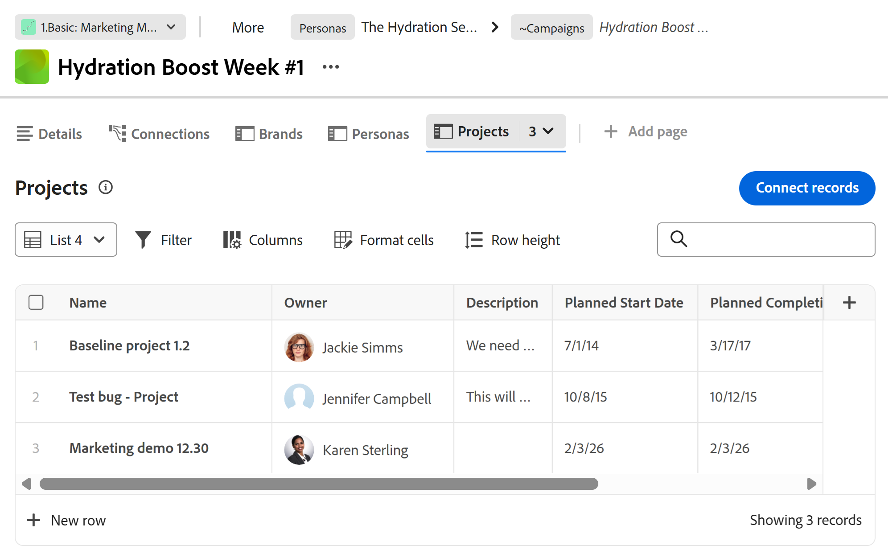
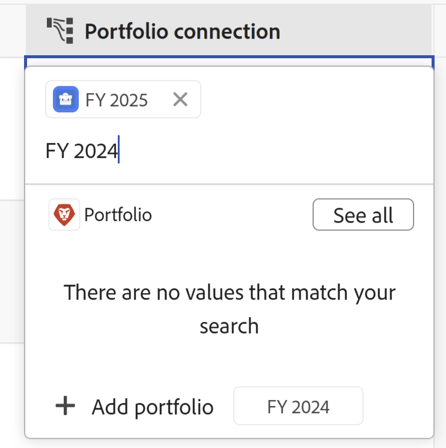

<!--update the metadata with real information when making this available in TOC and in the left nav-->

# 在将Workfront对象连接到记录时，从Workfront Planning创建这些对象

<!-- update the title (and all the links to this article) at preview, to be this: Create Workfront objects from Workfront Planning as you connect them to records-->
<!-- remove preview and production at release time-->

此页面上突出显示的信息是指尚未普遍可用的功能。 它仅在“预览”环境中对所有客户可用。 在每月发布到生产环境后，生产环境中为启用快速发布的客户提供了相同的功能。

有关快速发布的信息，请参阅[为您的组织启用或禁用快速发布](/help/quicksilver/administration-and-setup/set-up-workfront/configure-system-defaults/enable-fast-release-process.md)。

{{planning-important-intro}}

您可以通过以下方式从Workfront Planning创建Adobe Workfront对象：

* 从Planning记录连接Workfront对象时

  本文介绍了在从Planning记录连接Workfront对象时，如何从Workfront Planning创建这些对象。
* 当您从记录的页面使用自动化时。

  有关使用自动化创建Workfront对象的信息，请参阅[使用Adobe Workfront Planning记录自动化创建对象](/help/quicksilver/planning/records/create-wf-objects-using-planning-automations.md)。

>[!IMPORTANT]
>
>将以下Workfront对象与Planning记录连接后，您可以从Workfront Planning创建这些对象：
>
>* 项目
>* 项目组合
>* 项目群
>
>您可以将以下Workfront对象与Planning记录连接，但不能在连接过程中创建它们：
>
>* 组
>* 公司
>

将和创建Workfront对象连接到Workfront Planning记录时，请考虑以下事项：

* 您可以从连接字段从Workfront Planning的以下区域连接Workfront项目、项目组合、程序、组和公司：

   * 记录类型的表格视图
   * 记录的详细信息页面或预览框
   * 记录的“连接”选项卡

* 您可以从Workfront Planning的以下区域创建项目：

   * 记录类型的表格视图
   * 连接字段中记录的详细信息区域
   * 记录的已连接记录页面，在“详细信息”区域

* 您可以从Workfront Planning的以下区域创建项目组合和程序：

   * 记录类型的表格视图
   * 连接字段中记录的详细信息区域

有关将Planning记录与Workfront对象连接的信息，请参阅[连接记录](/help/quicksilver/planning/records/connect-records.md)。

## 访问要求

+++ 展开以查看访问要求。 

<table style="table-layout:auto"> 
<col> 
</col> 
<col> 
</col> 
<tbody> 
    <tr> 
<tr> 
<td> 
   
 产品
 </td> 
   <td> 
   <ul><li>
 Adobe Workfront
</li> 
   <li>
 Adobe Workfront规划
</li></ul></td> 
  </tr>   
<tr> 
   <td role="rowheader">
Adobe Workfront计划*
</td> 
   <td> 

以下任意Workfront计划：
 
<ul><li>选择</li> 
<li>Prime</li> 
<li>Ultimate</li></ul> 

Workfront Planning不适用于旧版Workfront计划
 
   </td> 
<tr> 
   <td role="rowheader">
Adobe Workfront规划包*
</td> 
   <td> 

任何 
 

有关每个Workfront计划中包括的内容的更多信息，请联系您的Workfront客户经理。 
 
   </td> 
 <tr> 
   <td role="rowheader">
Adobe Workfront平台
</td> 
   <td> 

贵组织的Workfront实例必须载入Adobe Unified Experience才能访问Workfront Planning。
 

有关详细信息，请参阅<a href="/help/quicksilver/workfront-basics/navigate-workfront/workfront-navigation/adobe-unified-experience.md">适用于Workfront的Adobe Unified Experience</a>。 
 
   </td> 
   </tr> 
  </tr> 
  <tr> 
   <td role="rowheader">
Adobe Workfront许可证*
</td> 
   <td> 标准
   
Workfront计划不适用于旧版Workfront许可证
 
  </td> 
  </tr> 
  <tr> 
   <td role="rowheader">
访问级别配置
</td> 
   <td> 
Adobe Workfront Planning没有访问级别控制
 
   
编辑访问权限，访问权限：在Workfront中为要创建的对象类型（项目、项目组合、项目群）创建对象。 
  
</td> 
  </tr> 
<tr> 
   <td role="rowheader">
对象权限
</td> 
   <td> 
管理要添加记录的工作区和记录类型的权限。 
  
   
系统管理员对所有工作区具有权限，包括他们未创建的工作区

   
管理Workfront对象（项目组合）的权限以添加子对象（项目）。

   </td> 
  </tr> 
</tbody> 
</table>

*有关Workfront访问要求的详细信息，请参阅Workfront文档中的[访问要求](/help/quicksilver/administration-and-setup/add-users/access-levels-and-object-permissions/access-level-requirements-in-documentation.md)。

+++

## 将Workfront对象与Workfront Planning中的记录连接时创建这些对象的先决条件

您必须具备以下条件，才能通过从现有记录连接项目或项目组合来添加新项目或项目组合：

* 记录连接到Workfront项目、项目组合或项目的类型。 有关信息，请参阅[连接记录类型](/help/quicksilver/planning/architecture/connect-record-types.md)。
* 连接到Workfront对象的记录类型的记录。 有关信息，请参阅[创建记录](/help/quicksilver/planning/records/create-records.md)。
* Workfront Planning和Workfront中的正确访问和权限，如本文的[访问要求](#access-requirements)部分所述。

## 将项目与Workfront Planning中的记录连接时创建项目

在Workfront Planning中将项目与Workfront Planning中的记录连接时，您可以在Planning的以下区域创建项目：

* 记录类型的表视图或连接字段中记录的详细信息区域
* 记录的“已连接”记录页，位于记录的“详细信息”区域

### 从记录的详细信息区域或记录类型的表视图创建项目

要在从其他记录连接项目时创建项目，请执行以下操作：

1. 转到记录的详细信息页面或记录类型的表，然后开始将Workfront Planning记录与Workfront项目连接，如文章[连接记录](/help/quicksilver/planning/records/connect-records.md)中所述。

1. （视情况而定）单击&#x200B;**添加项目**
或
开始键入项目的名称，如果找不到，请单击&#x200B;**添加项目**。 添加按钮后跟您键入的项目名称。

   

   将打开&#x200B;**创建项目**&#x200B;框。

1. （可选）更新&#x200B;**项目名称**。 默认情况下，从记录中连接项目时，将按照您作为搜索项添加的内容来命名项目。
1. （可选）选择&#x200B;**项目模板**。 如果不选择模板，Workfront将创建一个不含任务的空白项目。
1. 单击&#x200B;**创建**。
1. （视情况而定）如果您选择从模板创建项目，请按照文章[使用模板创建项目](/help/quicksilver/manage-work/projects/create-projects/create-project-from-template.md)中的步骤完成添加项目。

   将创建新项目并将其添加到所选记录的已连接字段中。

1. （可选）在Workfront规划中单击新项目的名称，以在Workfront中打开项目页面，并对项目进行其他更新。

### 从记录的“连接的记录”页面创建项目

1. 在表格视图中将Project对象类型与Workfront Planning记录类型连接。

   有关信息，请参阅[连接记录类型](/help/quicksilver/planning/architecture/connect-record-types.md)。

1. 单击任意视图中的记录名称。 “详细信息”预览框打开。

1. 为项目添加&#x200B;**连接的记录页**。

   有关信息，请参阅文章[管理记录页布局](/help/quicksilver/planning/records/manage-the-record-page.md)中的“将连接的记录页添加到记录”部分。

   “连接的记录”页显示在表视图中。 连接的项目将显示在表中。

   

1. 单击项目表中的&#x200B;**新行**&#x200B;以添加项目。

   只能在此区域添加空白项目。 无法使用模板添加项目。
1. （可选）单击表视图中的项目名称以在Workfront中打开该项目并添加更多信息。

## 将项目组合与Workfront Planning中的记录连接时创建项目组合

您可以从记录类型的表视图或记录的详细信息页面创建项目组合。

要在从Planning记录连接项目组合时创建项目组合，请执行以下操作：

1. 转到记录的详细信息页面或记录类型的表，然后开始将Workfront Planning记录与Workfront项目组合连接，如文章[连接记录](/help/quicksilver/planning/records/connect-records.md)中所述。

1. （视情况而定）单击&#x200B;**添加项目组合**

   或

   开始键入项目组合的名称，如果找不到，请单击&#x200B;**添加项目组合**。 “添加”按钮后跟您键入的项目组合名称。

   

   将创建项目组合并将其添加到所选记录的连接字段。

1. （可选）在Workfront Planning中单击新项目组合的名称，以在Workfront中打开项目组合页面，并对项目组合进行其他更新。

## 在将程序与Workfront Planning中的记录连接时创建程序

您可以从记录类型的表视图或记录的“详细信息”页创建程序。

要在从Planning记录连接程序时创建程序，请执行以下操作：

1. 转到记录的详细信息页面或记录类型的表，然后开始将Workfront Planning记录与Workfront项目组合连接，如文章[连接记录](/help/quicksilver/planning/records/connect-records.md)中所述。

1. 单击&#x200B;**添加程序**

   或

   开始键入项目的名称，如果找不到，请单击&#x200B;**添加项目**。 “添加”按钮后跟您键入的程序名。

   

   将打开&#x200B;**创建程序**&#x200B;框。

1. 更新&#x200B;**项目名称**。 这是必填字段。
1. 从下拉列表中选择&#x200B;**Portfolio**，或者开始键入项目组合的名称，然后在此项目组合显示在列表中时将其选定。 这是必填字段。
1. 单击&#x200B;**创建**。

   将创建项目并将其添加到所选记录的连接字段中。

1. （可选）单击Workfront Planning中新项目的名称，以在Workfront中打开该项目页面，并对其做出其他更新。

