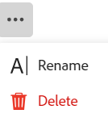

# 删除记录

<!--take Preview and Production references out at release-->

<!--The highlighted information on this page refers to functionality not yet generally available. It is available only in the Preview environment for all customers. After the monthly releases to Production, the same features are also available in the Production environment for customers who enabled fast releases.    

For information about fast releases, see [Enable or disable fast releases for your organization](/help/quicksilver/administration-and-setup/set-up-workfront/configure-system-defaults/enable-fast-release-process.md). -->

{{planning-important-intro}}

您可以删除Adobe Workfront Planning中不再相关的记录。 删除的记录删除后，您可以在30天内恢复这些记录。 有关恢复已删除记录的信息，请参阅[恢复已删除的记录](/help/quicksilver/planning/records/restore-deleted-records.md)。

## 访问要求

+++ 展开以查看访问要求。

您必须具有以下权限才能执行本文中的步骤：

<table style="table-layout:auto"> 
<col> 
</col> 
<col> 
</col> 
<tbody> 
    <tr> 
<tr> 
<td> 
   
 产品
 </td> 
   <td> 
   <ul><li>
 Adobe Workfront
</li> 
   <li>
 Adobe Workfront规划
</li></ul></td> 
  </tr>   
<tr> 
   <td role="rowheader">
Adobe Workfront计划*
</td> 
   <td> 

以下任意Workfront计划：
 
<ul><li>选择</li> 
<li>Prime</li> 
<li>Ultimate</li></ul> 

Workfront Planning不适用于旧版Workfront计划
 
   </td> 
<tr> 
   <td role="rowheader">
Adobe Workfront规划包*
</td> 
   <td> 

任何 
 

有关每个Workfront计划中包括的内容的更多信息，请联系您的Workfront客户经理。 
 
   </td> 
 <tr> 
   <td role="rowheader">
Adobe Workfront平台
</td> 
   <td> 

贵组织的Workfront实例必须载入Adobe Unified Experience，才能访问Workfront Planning的所有功能。
 

有关详细信息，请参阅<a href="/help/quicksilver/workfront-basics/navigate-workfront/workfront-navigation/adobe-unified-experience.md">适用于Workfront的Adobe Unified Experience</a>。 
 
   </td> 
   </tr> 
  </tr> 
  <tr> 
   <td role="rowheader">
Adobe Workfront许可证*
</td> 
   <td>
 标准

   
Workfront计划不适用于旧版Workfront许可证
 
  </td> 
  </tr> 
  <tr> 
   <td role="rowheader">
访问级别配置
</td> 
   <td> 
Adobe Workfront Planning没有访问级别控制
   
</td> 
  </tr> 
<tr> 
   <td role="rowheader">
对象权限
</td> 
   <td>   
为工作区<!--and record type--> </a>贡献或更高权限 
  
   
系统管理员对所有工作区具有权限，包括他们未创建的工作区
 </td> 
  </tr> 
<tr> 
   <td role="rowheader">
布局模板
</td> 
   <td> 
必须为所有用户(包括Workfront管理员)分配一个布局模板，该模板应包括主菜单中的Planning区域。 
 </td> 
  </tr> 
</tbody> 
</table>

*有关Workfront访问要求的详细信息，请参阅Workfront文档中的[访问要求](/help/quicksilver/administration-and-setup/add-users/access-levels-and-object-permissions/access-level-requirements-in-documentation.md)。

+++

## 有关删除记录的注意事项

* 您可以删除您或其他用户创建的记录。
* 您无法恢复生产环境中已删除的记录。 您可以在“预览”环境中恢复已删除的记录。
* 如果删除的记录链接到其他记录，则不会删除链接的记录，但也会删除来自已删除记录的信息。
* 您无法从时间轴或日历视图中删除记录。

## 删除记录

您可以从以下区域删除记录：

* [从记录的页面](#delete-a-record-from-the-records-page)
* [从记录类型的表视图中](#delete-a-record-from-the-record-type-table-view)

### 从记录的页面中删除记录

{{step1-to-planning}}

1. 单击要删除其记录的工作区。

   工作区将打开，记录类型显示为卡片。

1. 单击记录类型卡片。

   此时将打开记录类型页面。
1. 执行下列操作之一：

   * 在“表”视图中，单击记录的名称。
   * 在“表”视图中，将鼠标悬停在记录名称上，单击&#x200B;**更多**&#x200B;菜单，然后单击&#x200B;**查看**

     
   * 在“时间轴”视图中，单击记录栏。

   此时将打开记录页面。

1. 单击记录名称右侧的&#x200B;**更多**&#x200B;菜单，然后单击&#x200B;**删除**，再次&#x200B;**删除**&#x200B;以进行确认。

    <!--ensure the options have not changed or been renamed-->
删除记录。
1. （可选且有条件）如果删除“预览”环境中的记录，请转到记录页面的表视图，单击该视图右上角的&#x200B;**撤消**&#x200B;图标，然后单击&#x200B;**最近删除的记录**&#x200B;以恢复删除的记录。

有关恢复已删除记录的信息，请参阅[恢复已删除的记录](/help/quicksilver/planning/records/restore-deleted-records.md)。

### 从记录类型表格视图中删除记录

{{step1-to-planning}}

1. 单击要删除其记录的工作区。

   工作区将打开，记录类型显示为卡片。

1. 单击记录类型卡片。

   此时将打开记录类型页面。
1. （视情况而定）从表左上角的&#x200B;**视图**&#x200B;下拉菜单中，选择表视图。 这应为默认视图，除非您在上次访问时查看了时间轴视图中的记录类型。

   与所选记录类型关联的记录将显示在表格视图中。
1. 执行下列操作之一：

   * 右键单击记录行，然后单击&#x200B;**删除**。
   * 单击记录名称右侧的&#x200B;**更多**&#x200B;菜单，然后单击&#x200B;**删除**。

     

   * 单击&#x200B;**打开详细信息**&#x200B;图标打开包含记录详细信息的框，然后单击记录名称右侧的&#x200B;**更多** ，然后&#x200B;**删除**。

   删除记录。

1. （可选）执行以下操作之一以撤消或重做删除记录：

   * 单击&#x200B;**撤消**&#x200B;图标，然后单击&#x200B;**最近删除的**&#x200B;以恢复删除的记录。 有关恢复已删除记录的信息，请参阅[恢复已删除的记录](/help/quicksilver/planning/records/restore-deleted-records.md)。
   * 使用以下键盘快捷键可撤消或重做删除记录：

      * 按CTRL + Z(对于Mac，按⌘ + Z)可撤消删除记录
      * 按CTRL + Shift + Z(对于Mac，按⌘ + Shift + Z)可重做删除记录

