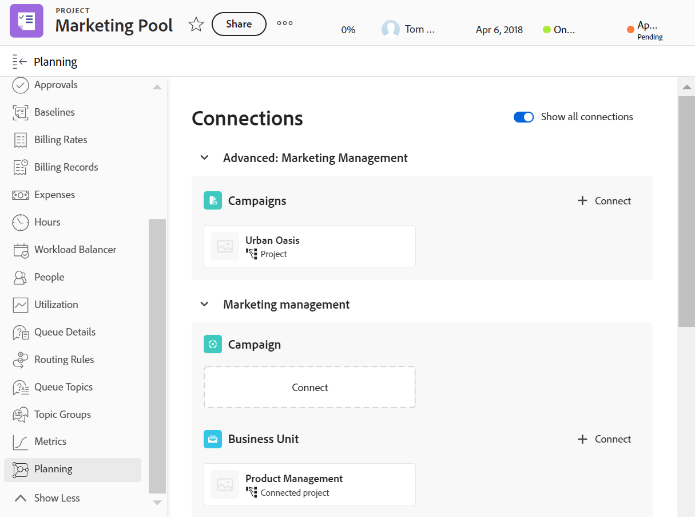

<!--update the metadata with real information when making this available in TOC and in the left nav-->

<!--add also Group and Company when they are available-->

<!-- opening the Details preview and page is not possible yet - hid those steps, but add them when released-->

# 管理Adobe Workfront对象“计划”部分中的记录

{{planning-important-intro}}

您可以在左侧面板的Adobe Workfront对象的Planning部分中显示连接到Workfront对象的记录。

“规划”部分适用于以下Workfront对象：

* 项目
* 项目组合
* 项目群
<!--* Group
* Company-->

## 访问要求

+++ 展开以查看Workfront Planning的访问要求。

<table style="table-layout:auto">
 <col>
 </col>
 <col>
 </col>
 <tbody>
    <tr>
<tr>
<td>
   
 产品
 </td>
   <td>
   
 Adobe Workfront
 </td>
  </tr>  
 <td role="rowheader">
Adobe Workfront协议
</td>
   <td>

您的组织必须注册到Workfront Planning的早期访问阶段 

   </td>
  </tr>
  <tr>
   <td role="rowheader">
Adobe Workfront计划
</td>
   <td>

任何

   </td>
  </tr>
  <tr>
   <td role="rowheader">
Adobe Workfront许可证*
</td>
   <td>
   
新增：标准

   或
   
当前：计划
 
  </td>
  </tr>

<tr>
   <td role="rowheader">
访问级别配置
</td>
   <td> 
查看或更高权限的项目、项目群和Portfolio
  
</td>
  </tr>
<tr>
   <td role="rowheader">
权限
</td>
   <td> 
在Workfront中，查看项目、项目组合或项目群的权限或更高的权限</a> 
 
   
在Workfront Planning、Contribute或更高的工作区权限中</a> 
  
   
系统管理员有权访问所有Workfront Planning工作区，包括他们未创建的工作区

</td>
  </tr>
<tr>
   <td role="rowheader">
布局模板
</td>
   <td> 
您的Workfront或组管理员必须将主菜单中的规划区域和左侧面板中的规划部分添加到您的布局模板中。 有关信息，请参阅<a href="/help/quicksilver/planning/access/access-overview.md">访问概述</a>。 
  
</td>
  </tr>

</tbody>
</table>

*有关详细信息，请参阅Workfront文档中的[访问要求](/help/quicksilver/administration-and-setup/add-users/access-levels-and-object-permissions/access-level-requirements-in-documentation.md)。

+++

## 关于Workfront对象Planning部分的注意事项

* Workfront Planning记录类型必须连接到Workfront对象类型。

* 必须至少有一个记录连接到一个Workfront对象，才能在Workfront中查看记录。

  有关信息，请参阅以下文章：

   * [连接记录类型](/help/quicksilver/planning/architecture/connect-record-types.md)
   * [连接记录](/help/quicksilver/planning/records/connect-records.md)
* 您可以查看Workfront对象中的Planning部分，即使没有与Workfront对象关联的记录也是如此。
* 当至少有一个记录连接到Workfront对象时，您可以在Planning部分中，将Planning记录与Workfront中的Workfront对象连接。

## 管理“计划”部分中的记录

{{step1-to-planning}}

1. 单击工作区的卡片。

   工作区将打开，记录类型显示为卡片。

1. 单击连接到Workfront项目、项目组合或项目群的记录类型的卡。
1. 在表格视图或记录的详细信息页面中，转到与Workfront对象有连接的已连接记录字段。 有关信息，请参阅[连接记录](/help/quicksilver/planning/records/connect-records.md)。
1. 在连接的记录字段中单击Workfront对象的名称。
对象的页面将在Workfront中打开。

1. 单击左侧面板中的&#x200B;**Planning**。

   >[!NOTE]
   >
   >   您的Workfront或组管理员必须将“规划”部分添加到您的布局模板中，然后才能为Workfront项目、项目组合或项目群显示规划部分。

   此时将显示Planning部分，其中包含下列信息：

   * 连接的记录显示在包含以下信息的各个卡片上：
      * 记录名称
      * 记录缩略图
      * 在Workfront Planning中显示的已连接记录字段的名称。
   * 记录会显示在各自的工作区中。

   

1. 单击记录卡以显示有关记录的更多信息。 此时将显示记录预览框。
1. （可选）开始修改记录预览框中的字段。 您的更改会自动保存。
1. （可选）单击预览框右上角的&#x200B;**在新标签中打开**&#x200B;图标以打开记录的详细信息页面。 此时将在Workfront Planning中打开记录的详细信息页面。
1. 将鼠标悬停在记录卡上，然后单击断开连接记录图标&#x200B;**-**，然后单击&#x200B;**断开连接**。
出现以下情况：
   * 记录不再连接到Workfront对象。
   * Workfront对象也将从Workfront Planning中的记录的“已连接”字段中删除。
   * 连接到Planning记录的Workfront查找字段的值也会被删除。
1. 单击&#x200B;**连接**&#x200B;以连接更多记录。

   >[!NOTE]
   >
   >   “连接”按钮仅显示您拥有Contribute权限的工作区。<!--they might replace this with one button at the top of the page. Rephrase-->

1. 单击要连接的记录。 出现以下情况：

   * 记录会立即连接到Workfront对象，并显示在Planning部分中。
   * Workfront对象将添加到Workfront Planning记录的已连接字段中。
   * 连接到Planning记录的Workfront查找字段的值会在Workfront Planning中填充。

<!--add more steps here for what happens after clicking Connect-->
