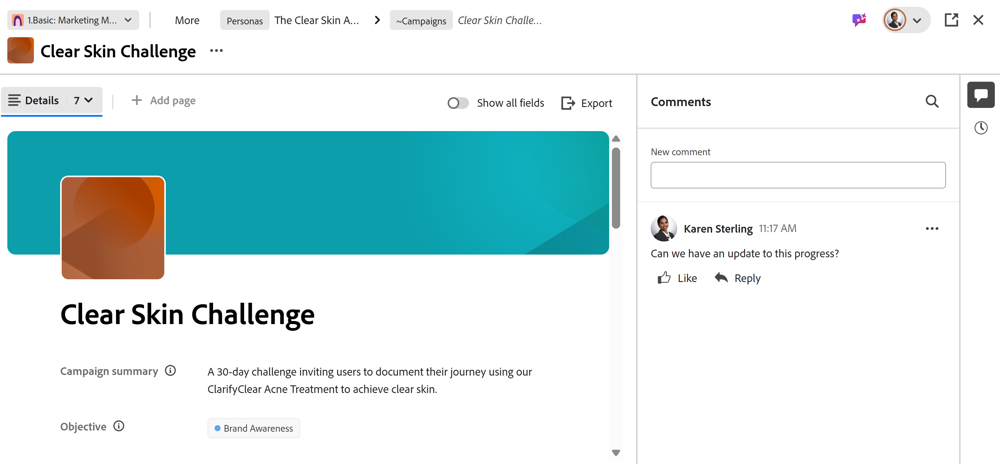
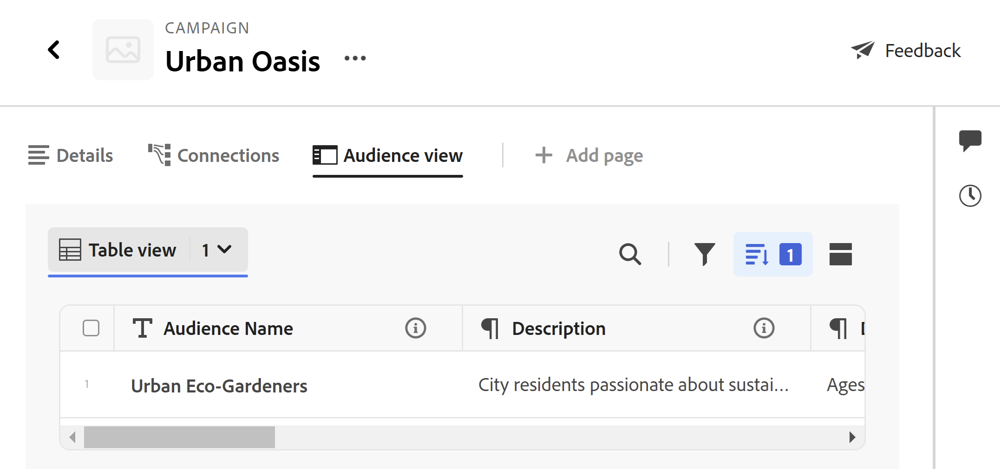

# 管理记录页面布局

此页面上的信息引用了尚未公开的功能。 它仅在“预览”环境中对所有客户可用。 在每月发布到生产环境后，生产环境中为启用快速发布的客户提供了相同的功能。

有关快速发布的信息，请参阅[为您的组织启用或禁用快速发布](/help/quicksilver/administration-and-setup/set-up-workfront/configure-system-defaults/enable-fast-release-process.md)。

{{planning-important-intro}}

您可以在Adobe Workfront Planning中编辑记录预览和页面的布局。

记录预览是记录类型视图中显示的记录页面的较小视图。

当您更改记录预览和页面的布局时，更改会影响相同类型的所有记录的预览框和详细信息页面。

本文介绍了如何更改记录预览框或记录页面的布局和外观。 有关编辑记录的信息，请参阅[编辑记录](/help/quicksilver/planning/records/edit-records.md)。

必须先创建记录类型和记录，然后才能开始编辑记录页。

有关信息，请参阅以下文章：

* [创建记录类型](/help/quicksilver/planning/architecture/create-record-types.md)

* [创建记录](/help/quicksilver/planning/records/create-records.md)

## 访问要求

+++ 展开以查看Workfront Planning的访问要求。

您必须具有以下权限才能执行本文中的步骤：

<table style="table-layout:auto">
 <col>
 </col>
 <col>
 </col>
 <tbody>
    <tr>
<tr>
<td>
   
 产品
 </td>
   <td>
   <ul><li>
 Adobe Workfront
</li>
   <li>
 Adobe Workfront规划
</li></ul></td>
  </tr>  
 <tr>
   <td role="rowheader">
Adobe Workfront计划*
</td>
   <td>

以下任意Workfront计划：

<ul><li>选择</li>
<li>Prime</li>
<li>Ultimate</li></ul>

Workfront Planning不适用于旧版Workfront计划

   </td>

<tr>
   <td role="rowheader">
Adobe Workfront规划包*
</td>
   <td>

任何

有关每个Workfront计划中包括的内容的更多信息，请联系您的Workfront客户经理。 

   </td>

<tr>
   <td role="rowheader">
Adobe Workfront平台
</td>
   <td>

贵组织的Workfront实例必须载入AdobeUnified Experience，才能访问Workfront Planning的所有功能。

有关详细信息，请参阅<a href="/help/quicksilver/workfront-basics/navigate-workfront/workfront-navigation/adobe-unified-experience.md">AdobeWorkfront的Unified Experience</a>。 

   </td>

</tr>
  </tr>
  <tr>
   <td role="rowheader">
Adobe Workfront许可证*
</td>
   <td>
   
标准

   
Workfront计划不适用于旧版Workfront许可证

  </td>
  </tr>
  <tr>
   <td role="rowheader">
访问级别配置
</td>
   <td> 
Adobe Workfront Planning没有访问级别控制
  
</td>
  </tr>
<tr>
   <td role="rowheader">
对象权限
</td>
   <td>
   
管理工作区</a>的权限 
  
   
系统管理员对所有工作区具有权限，包括他们未创建的工作区
 
  </td>
  </tr>
<tr>
   <td role="rowheader">
布局模板
</td>
   <td> 
必须为包括Workfront管理员在内的所有用户分配一个布局模板，该布局模板包括主菜单的“规划”区域以及项目、项目组合和项目群的“规划”区域。 
 有关详细信息，请参阅<a href="/help/quicksilver/planning/access/access-overview.md">Adobe计划访问概述</a>。 
  
  
</td>
  </tr>
 </tbody>
</table>

*有关Workfront访问要求的详细信息，请参阅Workfront文档中的[访问要求](/help/quicksilver/administration-and-setup/add-users/access-levels-and-object-permissions/access-level-requirements-in-documentation.md)。

+++

## 有关编辑记录页面的注意事项

* 默认情况下，记录的详细信息和预览页面显示与该记录关联的所有字段。

* 您不能在预览或详细信息页面中为记录添加新字段。 您必须在表格视图中添加新字段，才能在预览和详细信息页面中显示它们。

* 您可以将部分添加到记录预览或详细信息页面，以按通用标准组织信息并使其更易于查找。

* 以下更改将影响同一类型的所有记录，并且访问这些记录的所有用户都可以看到这些更改：

   * 重新排列字段
   * 添加或删除部分

* 显示在记录预览中所做的更改会立即显示在记录详细信息页面中。 在记录页面中所做的更改也会显示在记录预览框中。

* 向记录添加封面图像或缩略图不是记录预览或页面整体布局的一部分。 您可以为每个记录添加唯一的封面图像或缩略图。 有关信息，请参阅[将封面图像添加到记录](/help/quicksilver/planning/records/add-a-cover-image-to-a-record.md)和[将缩略图添加到记录](/help/quicksilver/planning/records/add-thumbnails-to-records.md)。

## 向记录预览或页面添加分区

向记录页添加节时，请考虑以下事项：

* 一个页面上可以具有的节数没有限制。
* 分区不能为空。 在一个部分中，必须至少有一个字段。
* 可以将字段从一个区域拖放到另一个区域。 有关详细信息，请参阅本文中记录预览或详细信息页面中的[重新排列字段](#rearrange-fields-in-the-record-preview-or-details-page)部分。
* 从分区中删除所有字段时，该分区将自动删除且无法恢复。

要将节添加到记录预览或页面，请执行以下操作：

{{step1-to-planning}}

1. 单击工作区的卡片。

   工作区将打开，记录类型显示为卡片。

1. 单击记录类型卡片。

   此时将打开记录类型页面。

1. 从任何类型的视图中，单击记录的名称

   或

   从表格视图中，单击第一列中的&#x200B;**打开详细信息**&#x200B;图标。

   记录的预览将在视图中打开。

   

1. （可选）单击记录预览右上角的&#x200B;**在新标签中打开**&#x200B;图标以在新标签中打开记录页面。

   此时将打开记录页面。 默认情况下，将打开“详细信息”选项卡。

   

1. 在记录预览或页面的&#x200B;**详细信息**&#x200B;选项卡中，将鼠标悬停在字段左侧的空格上，然后单击&#x200B;**添加节**&#x200B;图标以添加节。
1. 单击该节的名称并用名称替换&#x200B;**无标题节**，然后单击Enter。 在部分下显示的字段自动成为新部分的一部分。
1. 开始将字段拖放到新部分，如本文中记录预览或详细信息页面](#rearrange-fields-in-the-record-preview-or-details-page)中的[重新排列字段部分所述。

1. （可选）将鼠标悬停在节名称上并单击&#x200B;**更多**&#x200B;菜单。

   
1. （可选）执行以下操作之一以编辑部分：

   * 单击&#x200B;**重命名**&#x200B;以重命名该节

     >[!TIP]
     >
     > 通过单击名称，可以内联重命名截面。

   * 单击&#x200B;**上移**&#x200B;将分区上移一个位置

     或

     单击&#x200B;**下移**以将节下移一个位置。
部分中的所有字段都会随部分一起移动。

   * 单击&#x200B;**删除**&#x200B;以删除该节。 该部分已被删除，无法恢复。 访问此类型记录的所有用户将不再查看已删除的分区。

1. 单击区域名称左侧的向下箭头可将其折叠，单击向右箭头可将其展开。
默认情况下，所有部分都处于扩展状态。

1. （可选）单击节名称左侧的&#x200B;**抓取**&#x200B;图标，然后将其拖放到所需位置。

   对于查看记录的所有用户，相同类型的所有记录的预览和页面中的区段新位置都会更新。

   对部分和字段顺序的所有更改都将自动保存。

1. （可选）单击&#x200B;**导出**&#x200B;菜单以将“详细信息”选项卡导出到Word或PDF文件。 有关详细信息，请参阅[导出记录的详细信息](/help/quicksilver/planning/records/export-the-record-page.md)。

1. （可选）单击&#x200B;**详细信息**&#x200B;选项卡旁边的&#x200B;**连接**&#x200B;选项卡。 在单击“**连接**”选项卡之前，您可能必须单击“**更多**”。

   连接到选定记录的所有记录或对象都显示在记录类型或它们所属应用程序的名称下。

   

1. （可选）选择“连接”选项卡右上角的&#x200B;**显示所有记录**&#x200B;设置。 所有连接的记录类型都会显示，包括尚未连接任何记录的类型。 默认情况下，此切换处于取消选中状态，并且隐藏没有连接记录的记录类型。

1. （可选）单击&#x200B;**连接**&#x200B;以将更多记录添加到连接的记录类型。 有关详细信息，请参阅[连接记录](/help/quicksilver/planning/records/connect-records.md)。

1. （可选）将鼠标悬停在记录卡片上，单击断开连接记录图标&#x200B;**-**，然后单击&#x200B;**断开连接**。 <!--this is copied to the Manage the Planning page in Workfront article; update in both articles-->
出现以下情况：
   * 记录不再连接到Workfront对象。
   * Workfront对象也将从Workfront Planning中的记录的“已连接”字段中删除。
   * 连接到Planning记录的Workfront查找字段的值也会被删除。

## 重新排列记录详细信息选项卡中的字段

{{step1-to-planning}}

1. 单击工作区的卡片。

   工作区将打开，记录类型显示为卡片。

1. 单击记录类型卡片。

   此时将打开记录类型页面。

1. 从任何类型的视图中，单击记录的名称

   或

   从表格视图中，单击第一列中的&#x200B;**打开详细信息**&#x200B;图标。

   记录的预览将在视图中打开。

   

1. （可选）单击记录预览右上角的&#x200B;**在新标签中打开**&#x200B;图标 <!--check the icon; they are changing it-->以在新标签中打开记录页面。

   默认情况下将打开记录的&#x200B;**详细信息**&#x200B;选项卡。

   

1. 在记录&#x200B;**详细信息**&#x200B;选项卡中，单击字段名称左侧的&#x200B;**抓取**&#x200B;图标，然后将其拖放到所需位置。<!--You can drag and drop fields to another section. You must have at least one field in a section.-->

   对于查看记录的所有用户，字段的新位置会在相同类型的所有记录的预览和页面中更新。

   自动对记录预览或页面保存布局所做的所有更改。

## 将“已连接”视图页面添加到记录的页面

您可以将“已连接”视图页面添加到记录的页面。

您无法将“已连接”视图页面添加到记录的预览区域。

已连接的视图页面在表格视图中显示一个已连接的记录页面。 表格视图是只读的。

您可以为每个连接的记录类型添加一个“连接的视图”页。 <!--edit this when we can remove fields from this page-->

添加“连接的视图”页：

1. 在记录页面视图中，单击记录名称以将其打开，然后单击预览页面右上角的“在新标签中打开”图标。
1. 单击&#x200B;**添加页面** > **连接的视图**。
1. 添加&#x200B;**页面名称**，然后单击&#x200B;**创建**。

   在新选项卡中向记录页面添加一个附加页面。
1. 搜索或单击列表中连接的记录或对象类型的名称。
您选择的记录类型的表格视图会显示，并且连接的记录会显示在表格视图中。
表格视图是只读的。

   
1. （可选）双击选项卡的名称

   或

   将鼠标悬停在该选项卡的名称上，单击&#x200B;**更多** ，然后单击&#x200B;**重命名**&#x200B;以重命名为新的“连接的视图”选项卡。
1. （可选）使用工具栏中的任何视图元素来管理表格视图。 有关信息，请参阅[管理表视图](/help/quicksilver/planning/views/manage-the-table-view.md)。

<!--
## Add a Brief page to a record's page

You can add a Brief page to the record's preview or pages. 

Brief pages contain the same information as the Details tab, in a read-only format. <!--edit this when we can remove fields from this page-->

<!--
1. From a record's page view, click the name of a record to open its preview or page.
1. Click **Add page** > **Brief**. 
1. Add the **Page name**, then click **Create**. 
-->

