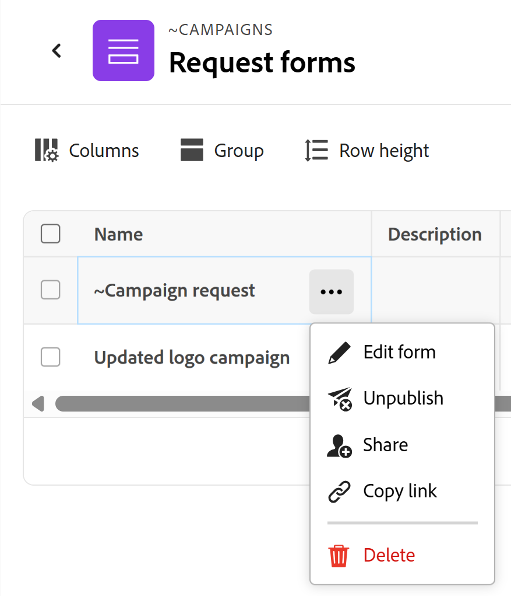

# 在Adobe Workfront Planning中创建和管理申请表单

<!--update the metadata with real information when making this available in TOC and in the left nav-->

<!--take Preview and Production references at Production time-->

此页面上高亮显示的信息引用了尚未公开的功能。 它仅在“预览”环境中对所有客户可用。 在每月发布到生产环境后，生产环境中为启用快速发布的客户提供了相同的功能。

有关快速发布的信息，请参阅[为您的组织启用或禁用快速发布](/help/quicksilver/administration-and-setup/set-up-workfront/configure-system-defaults/enable-fast-release-process.md)。

{{planning-important-intro}}

您可以创建请求表单，并将其与Adobe Workfront Planning中的记录类型相关联。 然后，您可以与他人共享该表单，他们也可以提交创建该类型记录的请求。

本文介绍了工作区管理员如何创建与记录类型关联的请求表单。

有关向记录类型提交请求以创建记录的信息，请参阅[提交Adobe Workfront Planning请求以创建记录](/help/quicksilver/planning/requests/submit-requests.md)。

## 访问要求

+++ 展开以查看本文中各项功能的访问要求。 

<table style="table-layout:auto"> 
<col> 
</col> 
<col> 
</col> 
<tbody> 
<tr> 
   <td role="rowheader">
Adobe Workfront包
</td> 
   <td> 
<ul><li>
任何Workfront包
</li>
与
<li>
任何规划包
</li></ul>
或
<ul><li>
任何工作流包
</li>
与
<li>
任何规划包
</li></ul>
   </td> </tr>

</tr> 
  <tr> 
   <td role="rowheader">
Adobe Workfront许可证
</td> 
   <td>
标准
 
  </td> 
  </tr> 
  <tr> 
   <td role="rowheader">
对象权限
</td> 
   <td>   
管理对工作区或记录类型</a>的权限 
  
   
系统管理员对所有工作区具有权限，包括他们未创建的工作区
  </td> 
  </tr>  
</tbody> 
</table>

有关Workfront访问要求的详细信息，请参阅Workfront文档中的[访问要求](/help/quicksilver/administration-and-setup/add-users/access-levels-and-object-permissions/access-level-requirements-in-documentation.md)。

+++

## 请求表单中字段和值显示限制

提交请求后，某些字段在请求表单中的显示方式以及它们的值以后在记录或请求详细信息页面中的显示方式均存在限制。

有关提交Workfront Planning请求的信息，请参阅[提交Adobe Workfront Planning请求以创建记录](/help/quicksilver/planning/requests/submit-requests.md)。

* 以下是对某些字段在请求表单、请求表单创建的记录或请求详细信息页面中的显示方式的限制：

   * 您不能向请求表单添加以下类型的字段：

      * 创建者，上次修改者，批准者
      * 创建日期，上次修改日期，批准日期
      * Workfront对象的查找字段
      * Workfront Planning已连接记录的查找字段

* 以下是在请求表单生成器中显示字段格式的方式，以及在记录或请求详细信息页面中字段值的格式设置方式之间的差异：

   * “货币”、“数字”和“百分比”字段在表单生成器中显示为单行文本字段类型。

     但是，字段格式将保留，并且字段值将在提交请求后、记录类型和请求详细信息页面中显示为货币、数字和百分比。

* 下面描述了某些字段值如何在请求表单和请求详细信息页面上显示：

   * 不保留货币、数字和百分比字段的特殊格式。 例如，对于这些区域中的这些字段值，不保留小数精度。
   * 人员字段值显示为ID。
   * 未引用其他字段或计算的公式字段不显示任何值。 例如，公式为`STRING`的字段显示“N/A”值。
   * 引用币种字段的公式字段显示值，不考虑汇率。
   * “段落”字段的值在请求表单上显示“不适用”值，并且在请求详细信息页面中显示html标记而不是带格式的文本。

## 创建请求表单

要创建请求表单，您必须开始创建表单、设置表单详细信息，然后通过发布和共享表单来完成。

### 开始创建请求表单

您可以从与表单<!--span class="preview">, or from the Requests area of Workfront.-->关联的记录类型创建请求表单。

#### 根据记录类型创建请求表单

{{step1-to-planning}}

1. 单击要在其中添加记录的工作区。

   工作区将打开，记录类型显示为卡片。

1. 单击记录类型卡片。 有关创建记录类型的信息，请参阅[创建记录类型](/help/quicksilver/planning/architecture/create-record-types.md)。

   记录类型页面将在您上次访问的视图中打开。 默认情况下，将在表格视图中打开记录类型页面。

1. 单击页眉中记录类型名称右侧的&#x200B;**更多**&#x200B;菜单，然后单击&#x200B;**创建请求表单**&#x200B;或&#x200B;**管理请求表单**（如果已拥有表单且要创建其他表单）。
1. （视情况而定）如果要添加其他表单，请单击&#x200B;**新建请求表单**。

   此时将打开“创建请求表单”框。

1. 在创建请求表单框中，更新请求表单的名称。 默认情况下，表单的名称为&#x200B;**无标题表单**。<!--check this; you logged a bug to rename it to 'Untitled request form' but was it fixed?-->
1. （可选）为请求表单添加&#x200B;**描述**。

   <!--Not possible yet: The Description is visible when you access the request form from the Requests area of Workfront.-->

1. 单击&#x200B;**创建**。

   此时将在“表单”选项卡中打开选定记录类型的请求表单。
1. 继续[配置表单](#configure-the-form)。

<!--

#### Create a request form from the Requests area of Workfront

1. Click the **[!UICONTROL Main Menu]** icon  in the upper-right corner of Adobe Workfront, or (if available), click the **[!UICONTROL Main Menu]** icon  in the upper-left corner, then click **Requests**.
1. In the upper-right corner of the screen, click **Request forms**.
1. (Conditional) If you are editing an existing request form, select it from the list, then continue to [Configure the form](#confgure-the-form).
1. If you are creating a new request form, in the upper-right corner of the screen, click **New request form**.

   The Create request form box opens

1. In the Create request form box, update the name of the request form. By default, the name of the form is **Untitled form**. 
1. In the Object types field, select the record type that the request form will be associated with. Record types are grouped into the workspace that they exist within.
1. (Optional) Add a **Description** for the request form. 

1. Click **Create**. 

   The request form for the selected record type opens in the Form tab.
1. Continue to [Set up details for the request form](#set-up-details-for-the-request-form).

-->

### 设置申请表单的详细信息

表单详细信息分为选项卡。

* **表单**&#x200B;选项卡允许您向表单添加字段和内容元素
* **配置**&#x200B;选项卡允许您设置表单的批准流程并设置请求完成选项&lt;。
  <!--* The **Automations** tab allows you to automate what will occur based on features of the request made with the form.-->

#### 设置表单详细信息

1. 开始创建或编辑请求表单，如[开始创建请求表单](#begin-creating-a-request-form)部分中所述。

   此时将在“表单”选项卡中打开选定记录类型的请求表单。

   

   默认情况下，请求表单包含以下信息：

   * 所选记录类型的表视图中可用的记录字段。<!--they are working on removing the limitation below-->

   * **默认的分区**：这是Workfront应用于请求表单的默认分区界限。 所有记录字段都显示在&#x200B;**默认部分**&#x200B;区域。
   * **主题**&#x200B;字段：将在Workfront中标识该请求的字段。 “主题”字段的配置和值不可编辑。

     >[!NOTE]
     >
     >* **Subject**&#x200B;字段在请求表单上可见时需要值。 但是，如果需要，您可以删除&#x200B;**主题**&#x200B;字段，而请求者在提交请求时将不会在表单上看到该字段。
     >* 当请求表单中缺少“主题”字段，但未来记录的名称具有“名称”字段时，将自动为请求名称分配与创建的记录相同的名称。
     >* 当请求表单中缺少“主题”和“名称”字段时，请求使用以下模式命名： `< Record name > request form < Entry date of the request >`；记录名为&#x200B;**无标题**。

   * 与记录类型关联的所有字段。

     向此记录类型提交请求的每个人均可看到请求表单中包含的字段。

1. （可选）将鼠标悬停在要删除的表单上的任何字段上，然后单击&#x200B;**x**&#x200B;图标以删除它们。 它们已添加到表单左侧的&#x200B;**字段**&#x200B;选项卡中。

   例如，删除&#x200B;**主题**&#x200B;字段，因为此字段在Workfront Planning中不可见。<!--remove this example if this becomes visible in Planning?-->

1. （可选）要从表单中删除&#x200B;**默认节**，请执行以下操作：

   1. 从“默认部分”中删除所有字段。
   1. 单击&#x200B;**内容元素**&#x200B;并添加新分区，然后为该分区添加名称。
   1. 向新部分添加字段。
   1. 单击&#x200B;**x**&#x200B;图标可删除&#x200B;**默认部分**。
1. 单击任意字段，然后使用表单右侧面板中的控件定义其大小或以下任何信息：

   * **标签**：这是显示在请求表单中的字段名称。 这不会更改记录字段的名称。
   * **说明**：添加有关该字段的更多信息。
   * **生成必填字段**：选定后，该字段必须具有值。 否则，无法提交表单。
   * **添加逻辑**：定义必须满足哪些条件才能显示或隐藏字段。

   >[!TIP]
   >
   >   选择表单上的字段后，每个字段的字段类型都会显示在右侧面板的顶部。
   >     

1. （可选）单击表单左侧的&#x200B;**内容元素**&#x200B;选项卡，然后添加以下任意元素：

   * **描述性文本**
   * **分区界限**

   有关生成自定义表单的详细信息，请参阅[创建自定义表单](/help/quicksilver/administration-and-setup/customize-workfront/create-manage-custom-forms/form-designer/design-a-form/design-a-form.md)。

1. （可选）单击&#x200B;**预览**&#x200B;以查看当其他用户使用表单提交新记录时，该表单将如何显示给其他用户。
1. 如果要配置表单的更多详细信息，请继续[设置配置详细信息](#set-up-configuration-details)，或转到[完成请求表单创建](#complete-request-form-creation)。

#### 设置配置详细信息

在配置选项卡上，您可以设置批准流程，并配置何时将从此表单创建的请求标记为“已完成”。

1. 开始创建或编辑请求表单，如[开始创建请求表单](#begin-creating-a-request-form)部分中所述。

   此时将在“表单”选项卡中打开选定记录类型的请求表单。
1. （可选）设置任何表单详细信息，如[设置表单详细信息](#set-up-form-details)中所述。

1. （可选）单击&#x200B;**配置**&#x200B;选项卡，然后将至少一个用户或团队添加到&#x200B;**审批者**&#x200B;字段，以审批此记录表单的新请求。

   

   <!--below bullet list is duplicated in the Add approval to a request form article-->

   * 将请求表单与批准者关联时，任何新请求都必须首先由所有批准者批准，然后才能生成新记录。
   * 您可以将一个或多个批准者添加到请求表单。
   * 如果至少有一位审批者拒绝了请求，则该请求会被拒绝，并且不会创建记录。
   * 在批准或拒绝请求之前，所有批准者都必须做出决定。
   * 如果将团队设置为批准者，则只需从团队中做出一个决策。

     有关将审批添加到请求表单的详细信息，请参阅[将审批添加到请求表单](/help/quicksilver/planning/requests/add-approval-to-request-form.md)。

1. （视情况而定）如果希望在任何一位批准者批准记录后创建记录，请选中&#x200B;**仅需要一个决策**&#x200B;复选框。

1. 选择在创建请求的对象时还是完成请求的对象时，是否希望将从此表单创建的请求标记为完成。
1. （视情况而定）如果已选择在请求对象完成时将请求标记为完成，请选择指示对象完成时间的字段和值。 例如，当创建的对象的状态设置为Complete时，您可以选择字段Status和值Complete以完成请求。
1. 继续<!--[Set up Automations details](#set-up-configuration-details) if you want to configure more details for the form, or go to -->[完成请求表单创建](#complete-request-form-creation)。

<!--
 

#### Set up Automations

You can configure automations in Adobe Workfront Planning that, when activated, create objects in Workfront or records in Workfront Planning when triggered from a Planning record. 

For information on creating automations in other areas of Workfront Planning, see [Configure Adobe Workfront Planning automations](/help/quicksilver/planning/records/configure-automations-to-create-records.md).

1. On the automation's details page, update the following fields in the **Triggers** section: 

   * **Trigger**: Select the action that will trigger the automation. Currently, the only available trigger for request form automation is `When request object status equals pending creation`.

1. Update the following fields in the **Actions** section: 

   * **Actions**: Select the action that you want Workfront to perform when triggering the automation. This is a required field. 
   Currently, the only available Action for request form automation is `Create record`.

     >[!TIP]
     >
     >After you saved the automation, you can no longer change the action selected in this field.
1. Continue to  [Complete request form creation](#complete-request-form-creation).

-->

### 完成请求表单创建

1. 按照[开始创建请求表单](#begin-creating-a-request-form)和[设置请求表单的详细信息](#set-up-details-for-the-request-form)中的说明创建并设置表单。
1. （可选）单击标题中表单名称右侧的&#x200B;**更多**&#x200B;菜单，然后单击&#x200B;**编辑**&#x200B;以更新表单名称。

1. 单击&#x200B;**发布**&#x200B;发布表单并获取其唯一链接。

   出现以下情况：

   * **发布**&#x200B;按钮已删除。
   * **取消发布**&#x200B;按钮已添加到表单中。 单击此按钮将阻止访问表单。
   * **共享**&#x200B;按钮已添加到表单。
   * 该表单将在Workfront主菜单的请求区域中可用。

1. 单击&#x200B;**共享**&#x200B;以与他人共享表单。

   有关共享请求表单的信息，请参阅本文中的[共享请求表单](#share-a-request-form)部分
1. 单击标题中表单名称左侧的向左箭头以关闭表单。

   将打开&#x200B;**请求表单**&#x200B;表格视图，并将表单添加到其中。

## 管理现有请求表单

1. 单击要在其中管理请求表单的工作区。

   工作区将打开，记录类型显示为卡片。

1. 单击记录类型卡片。 有关创建记录类型的信息，请参阅[创建记录类型](/help/quicksilver/planning/architecture/create-record-types.md)。

   记录类型页面将在您上次访问的视图中打开。 默认情况下，将在表格视图中打开记录类型页面。

1. 单击页眉中记录类型名称右侧的&#x200B;**更多**&#x200B;菜单，然后单击&#x200B;**管理请求表单**。

   与记录类型关联的所有请求表单都会显示在表格视图中。

1. （可选）将鼠标悬停在表视图中请求表单的名称上，然后单击表单名称右侧的&#x200B;**更多**&#x200B;菜单，然后单击以下任一项：

   * **编辑表单**：单击此项可进一步编辑表单上的信息。
   * **取消发布**：单击此项可取消发布将表单从Workfront的“请求”区域删除的表单。
   * **共享**：单击此项可修改谁有权访问该表单。
   * **复制链接**：单击此项可快速复制请求表单的链接，而无需打开表单。
   * **删除**：单击此项可删除表单。 使用该表单添加的所有请求和记录都不会被删除。 无法恢复表单。

   来自请求表单列表的请求表单上的

1. 单击标题中&#x200B;**请求表单**&#x200B;左侧的左箭头以关闭请求表单表。

   此时将打开记录类型页面。
1. （可选且有条件）单击标题中记录类型名称右侧的&#x200B;**更多**&#x200B;菜单，然后执行以下操作之一：

   1. 单击&#x200B;**更新请求表单**&#x200B;以对该请求表单进行任何更改，然后单击请求表单以打开并编辑它。
   1. 单击&#x200B;**将链接复制到请求表单**&#x200B;以与其他人共享该表单的链接。

1. （可选）转到Workfront中的&#x200B;**请求**&#x200B;区域并找到共享表单以提交请求。 有关信息，请参阅[提交Adobe Workfront计划请求以创建记录](/help/quicksilver/planning/requests/submit-requests.md)。

## 共享请求表单

1. 按照本文中[为记录类型](#create-a-request-form-for-a-record-type)创建请求表单一节中的说明创建请求表单。
1. 单击记录类型页面上请求表单名称右侧的&#x200B;**更多**&#x200B;菜单。
1. 单击&#x200B;**共享**&#x200B;以与他人共享表单。

1. 要在内部共享表单，请选择&#x200B;**内部共享**&#x200B;选项卡，在&#x200B;**授予权限以提交此表单**&#x200B;字段中搜索用户、团队、工作角色、组或公司的名称，然后当表单出现在列表中时将其选定。 默认情况下，将为每个实体选择&#x200B;**提交**&#x200B;权限。

   

1. （可选）单击实体名称后面的下拉菜单，然后单击&#x200B;**删除**&#x200B;以从列表中删除它们并停止与它们共享表单。

   >[!NOTE]
   >
   >除了团队、组、公司和职位角色之外，您只能与已添加到Adobe Admin Console的用户共享。 您无法添加仅限Workfront的用户。 有关信息，请参阅[在Adobe Admin Console中管理用户](/help/quicksilver/administration-and-setup/add-users/create-and-manage-users/admin-console.md)。

1. 在可以通过此表单&#x200B;**提交请求的**&#x200B;部分中，从以下选项中进行选择，以指示哪些类型的用户可以访问此表单：

   * 仅受邀人员可访问
   * 任何对工作区具有查看或更高访问权限的人员
   * 任何对工作区具有贡献或更高访问权限的人员
1. （可选）单击&#x200B;**复制链接**&#x200B;以将指向表单的链接与具有此类访问权限的用户共享。 该链接将会复制到您的剪贴板中。
1. 要公开共享表单，请选择&#x200B;**公共共享**&#x200B;选项卡，然后启用&#x200B;**创建公共链接**&#x200B;设置。

   

   >[!WARNING]
   >
   >* 启用&#x200B;**创建公共链接**&#x200B;设置后，任何人都可以访问表单并提交新记录，甚至组织外没有Workfront帐户的人也可访问。
   >
   >* 不能公开共享包含以下字段类型的表单：
   >
   >     * Workfront或AEM Assets连接
   >     * 人员
   >

1. 选择&#x200B;**链接到期日期**。

   您可以选择自当前日期起180天内的将来日期。

   >[!TIP]
   >
   >共享日期过期后，请求表单在Workfront的请求区域中不再可用，并且与其他用户共享的链接也不再可访问。

   链接过期后，用户会收到错误消息，您必须更新链接日期并生成要共享的新链接，之后用户才能再次访问表单。

1. （可选且有条件）单击&#x200B;**保存**&#x200B;以保存表单的共享详细信息。
1. （视情况而定）如果之前已保存表单，请单击&#x200B;**复制链接**。

   表单共享选项已保存，并且链接已复制到您的剪贴板。 您现在可以与其他人共享。

   有关使用请求表单链接创建记录的信息，请参阅[提交Adobe Workfront Planning请求](/help/quicksilver/planning/requests/submit-requests.md)。

1. 单击&#x200B;**表单**&#x200B;选项卡右下角的&#x200B;**保存**&#x200B;以保存表单。
