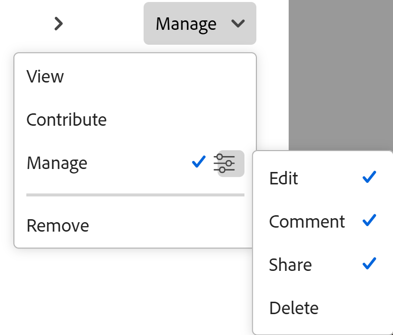

# 共享计划请求

<!--add to TOC, and miniTOC-->

此页面上的信息引用了尚未公开的功能。 它仅在“预览”环境中对所有客户可用。 在发布到“预览”版之后，启用了“快速发布”的客户的生产环境中每月还会提供相同的功能。

有关快速发布的信息，请参阅[为您的组织启用或禁用快速发布](/help/quicksilver/administration-and-setup/set-up-workfront/configure-system-defaults/enable-fast-release-process.md)。

{{planning-important-intro}}

提交Planning请求后，您可以控制谁可以看到它、谁可以处理它，以及允许每个人员或团队执行哪些操作。 这可以让适当的人员专注于适当的请求，并确保他们只能采取与其职责相称的行动。

## 访问权限要求

+++ 展开可查看本文所述功能的访问权限要求。 

<table style="table-layout:auto"> 
<col> 
</col> 
<col> 
</col> 
<tbody> 
<tr> 
   <td role="rowheader">
Adobe Workfront 包
</td> 
   <td> 

带规划包的任何Workfront或工作流
 
或

作为独立产品购买时的任何Workfront Planning
 
 </tr> 
  <tr> 
   <td role="rowheader">
Adobe Workfront许可证
</td> 
   <td>
“任一”
 
  </td> 
  </tr> 
  <tr> 
   <td role="rowheader">
Adobe计划许可证
</td> 
   <td>
“任一”
 
  </td> 
  </tr> 
  <tr> 
   <td role="rowheader">
访问级别配置
</td> 
   <td> 
当您同时具有Workflow和Planning包时，必须将工作流和Planning许可证类型添加到访问级别
   
</td> 
  </tr> 
  <tr> 
   <td role="rowheader">
对象权限
</td> 
   <td>   
查看或更高权限的工作区和记录类型（如果您是Workfront用户）
  </td> 
  </tr>  
</tbody> 
</table>

有关Workfront访问要求的详细信息，请参阅Workfront文档中的[访问要求](/help/quicksilver/administration-and-setup/add-users/access-levels-and-object-permissions/access-level-requirements-in-documentation.md)。

+++

## 共享请求时的注意事项

* 您可以向请求的用户授予以下权限：

  * 查看：用户只能看到请求。
  * Contribute：用户可以查看、编辑和评论请求。
  * 管理：用户可以查看、编辑、注释和删除请求。

* 系统会自动向请求者授予对其提交的请求的“管理”访问权限，除非管理员配置了其他默认值。

  有关信息，请参阅[创建请求表单](/help/quicksilver/planning/requests/create-request-form.md)。

* Workfront管理员可以访问和管理所有请求。
* 对记录类型具有“管理”访问权限的用户将继承对该记录类型接收表单以及通过该表单提交的每个请求的“管理”访问权限。
* 拥有请求权限的任何人都可以共享权限级别相同或更低级别的请求。

  具有Contribute权限的用户无法向任何其他用户授予该请求的“管理”权限。

* 不同的人员和团队可以对同一请求拥有不同的访问级别。
* 权限可以通过多个实体分配。 如果用户对请求具有Contribute权限，但其组或工作角色具有“查看”权限，则他们将保留最高级别的权限，即Contribute。

## 共享请求

确保您使用的是新的请求体验。

1. {{step1-to-requests}}
1. 找到Planning请求，然后单击该请求以将其打开。
1. 单击&#x200B;**共享**。

   将为所选请求打开&#x200B;**共享**&#x200B;框。

   

1. 在&#x200B;**授予此请求字段的访问权限**&#x200B;中，开始键入用户、团队、角色、组或公司的名称，并在该名称显示在列表上时单击它。

   列表中只显示活动实体。
1. 从每个实体名称右侧的下拉菜单中，选择以下权限级别之一：

   * 管理
   * 贡献
   * 视图
1. （可选）对于每个权限级别，单击粒度权限图标，然后选择或取消选择任何粒度权限，如&#x200B;**编辑**、**评论**、**共享**&#x200B;或&#x200B;**删除**。

   
1. 单击&#x200B;**保存**。

   该请求将与您选择的实体共享。

