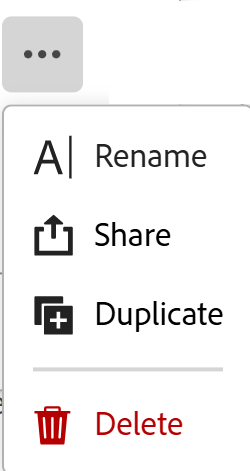

# 删除记录视图

<!--
The highlighted information on this page refers to functionality not yet generally available. It is available only in the Preview environment for all customers. After the release to Preview, the same features are also available monthly in the Production environment for customers who enabled fast releases.    

For information about fast releases, see [Enable or disable fast releases for your organization](/help/quicksilver/administration-and-setup/set-up-workfront/configure-system-defaults/enable-fast-release-process.md). 
-->

{{planning-important-intro}}

您可以删除在Adobe Workfront Planning中不再使用的记录视图。

该视图将为所有有权访问它的用户删除。 无法恢复已删除的视图。

不能删除记录类型的原始表格视图。

## 访问权限要求

+++ 展开以查看本文中各项功能的访问要求。 

<table style="table-layout:auto"> 
<col> 
</col> 
<col> 
</col> 
<tbody> 
    <tr> 
<tr> 
</tr>   
<tr> 
   <td role="rowheader">
Adobe Workfront 包
</td> 
   <td> 
<ul> 
<li>
带规划包的任何Workfront或工作流
</li>
或
<li>
作为独立产品购买时的任何Planning包
</li></ul>
   </td> </tr>
  <tr> 
   <td role="rowheader">
Adobe Workfront许可证
</td> 
   <td>
工作流标准

   </td> 
  </tr> 
<tr> 
   <td role="rowheader">
Adobe计划许可证
</td> 
   <td>
规划标准

   </td> 
  </tr> 
<tr> 
   <td role="rowheader">
访问级别配置
</td> 
   <td> 
当您同时具有Workflow和Planning包时，必须将工作流和Planning许可证类型添加到访问级别
   
</td> 
  </tr> 
  <tr> 
   <td role="rowheader">
对象权限
</td> 
   <td>   
管理视图的权限
  
</td> 
  </tr>  
</tbody> 
</table>

有关Workfront访问要求的详细信息，请参阅Workfront文档中的[访问要求](/help/quicksilver/administration-and-setup/add-users/access-levels-and-object-permissions/access-level-requirements-in-documentation.md)。

+++   

<!--
Old:
<table style="table-layout:auto"> 
<col> 
</col> 
<col> 
</col> 
<tbody> 
    <tr> 
<tr> 
<td> 
   
 Products
 </td> 
   <td> 
   <ul><li>
 Adobe Workfront
</li> 
   <li>
 Adobe Workfront Planning
</li></ul></td> 
  </tr>   
<tr> 
   <td role="rowheader">
Adobe Workfront plan*
</td> 
   <td> 

Any of the following Workfront plans:
 
<ul><li>Select</li> 
<li>Prime</li> 
<li>Ultimate</li></ul> 

Workfront Planning is not available for legacy Workfront plans
 
   </td> 
<tr> 
   <td role="rowheader">
Adobe Workfront Planning package*
</td> 
   <td> 

Any 
 

For more information about what is included in each Workfront Planning plan, contact your Workfront account manager. 
 
   </td> 
 <tr> 
   <td role="rowheader">
Adobe Workfront platform
</td> 
   <td> 

Your organization's instance of Workfront must be onboarded to the Adobe Unified Experience to be able to access Workfront Planning.
 

For more information, see <a href="/help/quicksilver/workfront-basics/navigate-workfront/workfront-navigation/adobe-unified-experience.md">Adobe Unified Experience for Workfront</a>. 
 
   </td> 
   </tr> 
  </tr> 
  <tr> 
   <td role="rowheader">
Adobe Workfront license*
</td> 
   <td>
 Standard 

   
Workfront Planning is not available for legacy Workfront licenses
 
  </td> 
  </tr> 
  <tr> 
   <td role="rowheader">
Access level configuration
</td> 
   <td> 
You must add both a Workflow and a Planning license type to the access level when you have both a Workflow and a Planning package
   
</td> 
  </tr> 
<tr> 
   <td role="rowheader">
Object permissions
</td> 
   <td>   
Manage permissions to a view
  
   </td> 
  </tr> 
</tbody> 
</table>
-->

## 删除记录视图

{{step1-to-planning}}

1. 单击工作区的卡片。

   工作区将打开，记录类型显示为卡片。

1. 单击记录类型卡片。

   此时将打开记录类型页面。

   默认情况下，所选类型的所有记录都会显示在表格视图中。

1. 在视图的选项卡中，单击视图的选项卡，将鼠标悬停在下拉菜单中的视图上，单击&#x200B;**更多**&#x200B;菜单，然后单击&#x200B;**删除**。

   

1. 单击&#x200B;**删除**&#x200B;以确认。

   所有有权访问记录区域的用户都将删除该视图。
