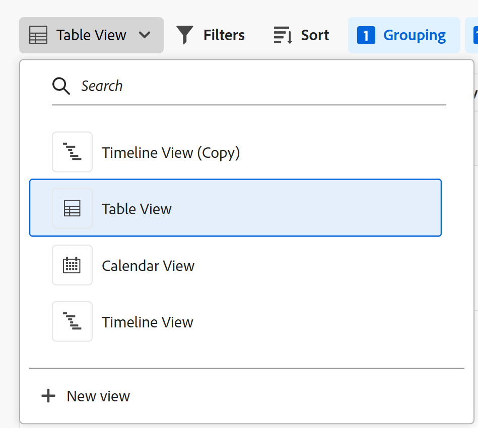

# 管理记录视图

<!--

The highlighted information on this page refers to functionality not yet generally available. It is available only in the Preview environment for all customers. After the monthly releases to Production, the same features are also available in the Production environment for customers who enabled fast releases.    

For information about fast releases, see [Enable or disable fast releases for your organization](/help/quicksilver/administration-and-setup/set-up-workfront/configure-system-defaults/enable-fast-release-process.md). 

-->

{{planning-important-intro}}

在Adobe Workfront Planning区域中选择记录类型后，您可以在以下视图中显示该类型的所有记录：

* 表

  有关详细信息，请参阅[管理表视图](/help/quicksilver/planning/views/manage-the-table-view.md)。

* 时间线

  有关详细信息，请参阅[管理时间线视图](/help/quicksilver/planning/views/manage-the-timeline-view.md)。

* 日程表

  有关详细信息，请参阅[管理日历视图](/help/quicksilver/planning/views/manage-the-calendar-view.md)。

本文介绍了有关记录视图的以下信息：

* [创建和编辑视图](#create-or-edit-record-views)
* [在视图中启用实时状态指示器](#enable-the-real-time-presence-indicator-in-a-view)
  <!--* [Add a view as a favorite](#add-a-view-as-a-favorite) - not possible yet-->

有关管理Workfront Planning记录视图的更多信息，另请参阅以下文章：

* [删除记录视图](/help/quicksilver/planning/views/delete-record-views.md)
* [复制记录视图](/help/quicksilver/planning/views/duplicate-record-views.md)
* [共享视图](/help/quicksilver/planning/access/share-views.md)

## 访问要求

+++ 展开以查看本文中各项功能的访问要求。 

<table style="table-layout:auto"> 
<col> 
</col> 
<col> 
</col> 
<tbody> 
    <tr> 
<tr> 
</tr>   
<tr> 
   <td role="rowheader">
Adobe Workfront包
</td> 
   <td> 

任何Workfront和任何Planning包

任何工作流和任何计划包

有关每个Workfront Planning包中所包含内容的更多信息，请联系您的Workfront客户代表。 
 
   </td> 
  <tr> 
   <td role="rowheader">
Adobe Workfront许可证
</td> 
   <td>
 用于创建和删除视图的标准

   
更新视图元素的参与者或更高版本

  </td> 
  </tr> 
  <tr> 
   <td role="rowheader">
对象权限
</td> 
   <td>   
管理视图的权限
  
   
查看对视图的权限以临时更改视图设置或复制它
 </td> 
  </tr> 
<tr>
   <td role="rowheader">
版面模板
</td>
   <td> 必须为具有轻度或参与者许可证的用户分配一个包括Planning的布局模板。
   
默认情况下，标准用户和系统管理员已启用Planning区域。

</li></ul>
</td>
  </tr> 
</tbody> 
</table>

有关Workfront访问要求的详细信息，请参阅Workfront文档中的[访问要求](/help/quicksilver/administration-and-setup/add-users/access-levels-and-object-permissions/access-level-requirements-in-documentation.md)。

+++

<!--Old:
<table style="table-layout:auto"> 
<col> 
</col> 
<col> 
</col> 
<tbody> 
    <tr> 
<tr> 
<td> 
   
 Products
 </td> 
   <td> 
   <ul><li>
 Adobe Workfront
</li> 
   <li>
 Adobe Workfront Planning
</li></ul></td> 
  </tr>   
<tr> 
   <td role="rowheader">
Adobe Workfront plan*
</td> 
   <td> 

Any of the following Workfront plans:
 
<ul><li>Select</li> 
<li>Prime</li> 
<li>Ultimate</li></ul> 

Workfront Planning is not available for legacy Workfront plans
 
   </td> 
<tr> 
   <td role="rowheader">
Adobe Workfront Planning package*
</td> 
   <td> 

Any 
 

For more information about what is included in each Workfront Planning plan, contact your Workfront account manager. 
 
   </td> 
 <tr> 
   <td role="rowheader">
Adobe Workfront platform
</td> 
   <td> 

Your organization's instance of Workfront must be onboarded to the Adobe Unified Experience to be able to access Workfront Planning.
 

For more information, see <a href="/help/quicksilver/workfront-basics/navigate-workfront/workfront-navigation/adobe-unified-experience.md">Adobe Unified Experience for Workfront</a>. 
 
   </td> 
   </tr> 
  </tr> 
  <tr> 
   <td role="rowheader">
Adobe Workfront license*
</td> 
   <td>
 Standard to create and delete views

   
Contributor or higher to update view elements

   
Workfront Planning is not available for legacy Workfront licenses
 
  </td> 
  </tr> 
  <tr> 
   <td role="rowheader">
Access level configuration
</td> 
   <td> 
There are no access level controls for Adobe Workfront Planning
   
</td> 
  </tr> 
<tr> 
   <td role="rowheader">
Object permissions
</td> 
   <td>   
Manage permissions to a view
  
   
View permissions to a view to temporarily change the view settings or to duplicate it
 </td> 
  </tr> 
<tr>
   <td role="rowheader">
Layout template
</td>
   <td> Users with a Light or Contributor license must be assigned a layout template that includes Planning.
   
Standard users and System Administrators have the Planning areas enabled by default.

</li></ul>
</td>
  </tr>
</tbody> 
</table>-->

## 使用记录视图时的注意事项

* Workfront Planning中的视图特定于记录类型。 不能将同一视图应用于两种不同的记录类型。
* 您创建的视图仅对您以及与您共享这些视图的用户可见。
* 当您修改或删除视图时，将会修改该视图，并删除具有该视图权限的所有用户。
* 每个用户最多可创建100个视图。 您可以为记录类型显示100多个视图，但一个用户只能创建100个视图。
* 虽然某些视图元素可以应用于同一记录的多个视图，但它们对每个记录视图都是唯一的：

   * 筛选条件
   * 分组（针对表格和时间线视图）
   * 条形图外观（用于时间轴和日历视图）

  例如，在表格视图中创建筛选器时，筛选器结果仅在选定视图（表格视图）中可见，而不在与记录类型关联的所有视图中可见。

  >[!TIP]
  >
  >某些视图元素并非对所有视图都可用。

## 记录视图之间的异同

下表显示了表、时间轴和日历视图之间的异同：

<!--some of these are NOT available right now; if you make this public, comment out the ones not there-->

| 功能 | 表格视图 | 时间线视图 | 日程表视图 |
|-----------------------------------------------------------------------|------------|---------------|--------------|
| 在列表或表中显示记录 | ✓ |              | |
| 默认情况下，将所有字段显示为表中的列 | ✓ |              |    |
| 隐藏或显示字段（或列） | ✓ |               |    |
| 编辑每个记录的字段值 | ✓ |               |             |
| 将记录添加为视图中的新行 | ✓ |               |        |
| 在视图中添加字段作为新列 | ✓ |               |         |
| 从外部列表中复制行并将其粘贴到表中 | ✓ |               |          |
| 在时间轴中显示记录 |            | ✓ |             |
| 筛选记录 | ✓ | ✓ | ✓ |
| 显示日历中的记录 |           |              | ✓ |
| 组记录 | ✓ | ✓ |  |
| 排序记录 | ✓ |              |  |
| 颜色代码记录 | ✓ | ✓ | ✓ |
| 颜色代码分组 |           | ✓ |  |
| 搜索特定记录 | ✓ | ✓ |  |
| 与他人共享视图 | ✓ | ✓ | ✓ |
| 从视图打开记录的页面 | ✓ | ✓ |    |
| 按年份和季度显示记录 |           | ✓ |    |
| 按月显示记录 |           | ✓ | ✓ |
| 按周显示记录 |           |               | ✓ |
| 从视图中导出信息 | ✓ |               |    |
| 全屏显示 | ✓ | ✓ | ✓ |
| 在视图中创建记录 | ✓ | ✓ | ✓ |

## 创建或编辑视图 {#create-or-edit-views}

{{step1-to-planning}}

1. 单击工作区的卡片。

   工作区将打开，记录类型显示为卡片。

1. 单击记录类型卡片。

   此时将打开记录类型页面。

   默认情况下，所选类型的所有记录都会显示在表格视图中。

1. 单击当前视图名称旁边的下拉图标，然后单击&#x200B;**+新建视图**。

1. 从以下视图类型中选择：

   * 表
   * 时间线
   * 日程表

1. 选择视图类型，然后单击&#x200B;**创建**。 新视图将添加到下拉菜单中。

   >[!TIP]
   >
   >创建记录类型时，缺省情况下还会创建表格视图。
   >
   >要创建时间轴或日历视图，您为其构建视图的记录类型必须至少有两个日期字段。
   >
   >否则，“时间轴”和“日历”选项将灰显。
   >  

   

1. （可选）要编辑现有视图，请单击当前视图名称右侧的下拉菜单，然后在&#x200B;**搜索**&#x200B;字段中键入视图名称，然后按键盘上的Enter键。
1. （可选）从视图下拉菜单中，按首选项的顺序拖放视图。

   

1. （视情况而定）创建时间线或日历视图时，单击&#x200B;**下一步**。

   默认情况下，Workfront会为视图提供以下名称之一：

   * `Table < number >`
   * `Timeline < number >`
   * `Calendar < number >`

   该数字是自动生成的增量。

1. （视情况而定）为将在时间轴或日历视图中显示的记录选择&#x200B;**开始**&#x200B;和&#x200B;**结束日期**。

   >[!NOTE]
   >
   >    您可以从记录日期字段中选择，或从连接的记录或对象类型中选择查找日期字段。
   >
   >在连接记录类型时选择查找字段时，必须为日期字段使用聚合(MAX或MIN)。 仅添加聚合器允许您使用连接的日期作为时间轴和日历视图的开始和结束日期。
   >
   >有关信息，请参阅[连接记录类型](/help/quicksilver/planning/architecture/connect-record-types.md)。

1. 单击&#x200B;**创建**。

   该视图将显示为新选项卡。 视图会按照其创建或与您共享时的时间顺序显示。
1. （可选）单击最后一个视图旁边的&#x200B;**更多**&#x200B;菜单以显示所选记录类型的所有视图。

   其他视图显示在最后一个视图选项卡之后的&#x200B;**更多**&#x200B;菜单下。 **更多**&#x200B;菜单旁边的数字显示其他视图的数量。
1. （可选）要在创建视图后重命名视图，请单击“视图”下拉菜单，然后单击&#x200B;**更多**&#x200B;菜单 > **重命名**&#x200B;以更新视图名称

   或

   双击视图名称并开始键入新名称。 <!--ensure there is not another saving step here?!-->

1. （可选）单击&#x200B;**全屏**&#x200B;图标以全屏方式打开任何视图，然后单击&#x200B;**退出全屏**&#x200B;图标或键盘上的Escape以退出全屏。

1. （可选）要管理特定类型的视图，请参阅以下文章：

   * [管理表视图](/help/quicksilver/planning/views/manage-the-table-view.md)
   * [管理时间线视图](/help/quicksilver/planning/views/manage-the-timeline-view.md)
   * [管理日历视图](/help/quicksilver/planning/views/manage-the-calendar-view.md)

## 在视图中启用实时显示状态指示器

您可以按照视图中的实时状态指示器，查看其他用户是否与您同时编辑记录。

默认情况下，与编辑记录信息的其他用户头像将显示在所有记录视图的右上角。

显示表格视图时，还可以查看查看查看记录时其他用户正在编辑的字段。

有关详细信息，请参阅[管理表视图](/help/quicksilver/planning/views/manage-the-table-view.md)。

<!--## Add a view as a favorite - this is not possible yet-->
