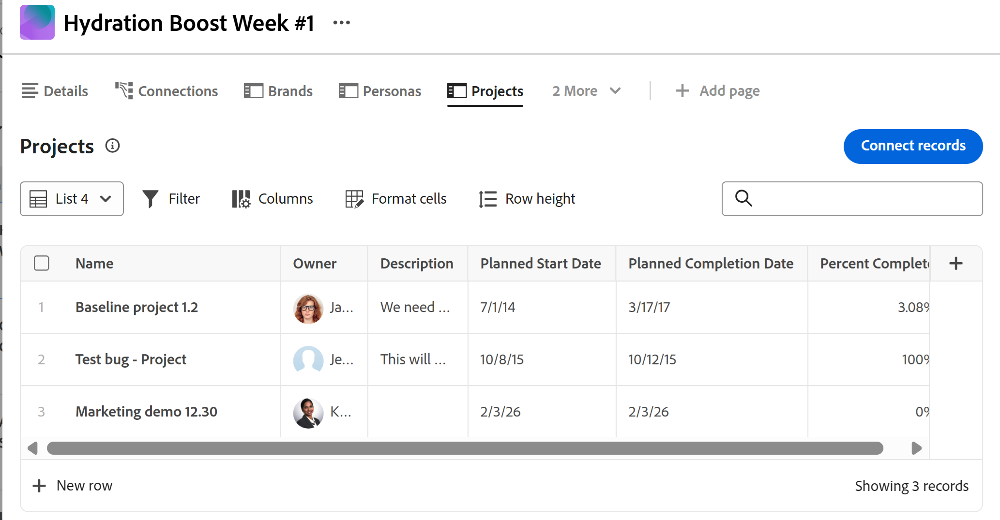
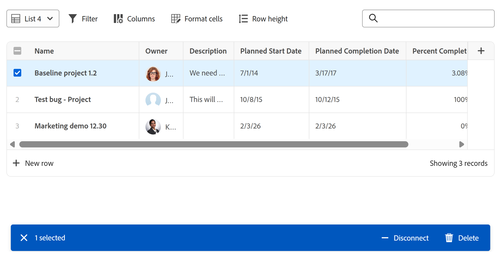

# 在Adobe Workfront Planning中管理列表视图

<!--The information highlighted on this page refers to functionality not yet generally available. It is available only in the Preview environment for all customers. After the monthly releases to Production, the same features are also available in the Production environment for customers who enabled fast releases.    

For information about fast releases, see [Enable or disable fast releases for your organization](/help/quicksilver/administration-and-setup/set-up-workfront/configure-system-defaults/enable-fast-release-process.md). -->

{{planning-important-intro}}

在Adobe Workfront Planning的记录的“连接的记录”页面中访问对象时，您可以在列表视图中显示对象及其字段。

本文介绍了如何在记录的“连接的记录”页面中创建或编辑列表视图，以及如何编辑视图中的对象。

## 访问权限要求

+++ 展开以查看本文中各项功能的访问要求。 

<table style="table-layout:auto"> 
<col> 
</col> 
<col> 
</col> 
<tbody> 
    <tr> 
<tr> 
</tr>   
<tr> 
   <td role="rowheader">
Adobe Workfront 包
</td> 
   <td> 

任何Workfront和任何Planning包

任何工作流和任何计划包

有关每个Workfront Planning包中所包含内容的更多信息，请联系您的Workfront客户代表。 
 
   </td> 
  <tr> 
   <td role="rowheader">
Adobe Workfront许可证
</td> 
   <td>
 用于创建和删除视图的标准

   
更新视图元素的参与者或更高版本

  </td> 
  </tr> 
  <tr> 
   <td role="rowheader">
对象权限
</td> 
   <td>   
管理视图的权限
  
   
查看对视图的权限以临时更改视图设置或复制它
 </td> 
  </tr> 
<tr>
   <td role="rowheader">
版面模板
</td>
   <td> 必须为具有轻度或参与者许可证的用户分配一个包括Planning的布局模板。
   
默认情况下，标准用户和系统管理员已启用Planning区域。

</li></ul>
</td>
  </tr> 
</tbody> 
</table>

有关Workfront访问要求的详细信息，请参阅Workfront文档中的[访问要求](/help/quicksilver/administration-and-setup/add-users/access-levels-and-object-permissions/access-level-requirements-in-documentation.md)。

+++ 

## 有关列表视图的注意事项

* 您不能在列表视图的记录类型页中查看记录。 在记录的“连接的记录”页中查看下列对象时，只能在列表视图中显示这些对象：

   * Workfront项目

  有关创建连接的记录页面的信息，请参阅[将连接的记录页面添加到记录](/help/quicksilver/planning/records/add-a-connected-records-page-to-a-record.md)。
* 在记录的已连接记录页面中查看列表视图之前，您必须将Workfront项目与Planning记录类型连接。 有关信息，请参阅[连接记录类型](/help/quicksilver/planning/architecture/connect-record-types.md)。
* 列表视图与增强型列表类似。 有关详细信息，请参阅[使用增强列表](/help/quicksilver/workfront-basics/navigate-workfront/use-lists/enhanced-lists.md)。

## 管理列表视图 {#manage-a-list-view}

有关在Workfront中管理列表视图的详细信息，请参阅[使用增强列表](/help/quicksilver/workfront-basics/navigate-workfront/use-lists/enhanced-lists.md)。

{{step1-to-planning}}

1. 单击工作区信息卡，然后单击记录类型信息卡。
1. 从任何视图中，单击记录的名称以打开记录的预览或详细信息页面。
1. 为已连接项目添加&#x200B;**已连接记录页**，如文章[将已连接记录页添加到记录](/help/quicksilver/planning/records/add-a-connected-records-page-to-a-record.md)中所述。

   “连接的记录”页面在列表视图中显示与记录连接的项目。

   <!--add new screen shot when they release Row colors/ special formatting for rows-->

   

1. （可选）执行以下操作之一以修改列表视图：

   1. 展开列表右上角的下拉视图菜单以选择其他视图，或单击&#x200B;**新建视图**&#x200B;并创建另一个视图。

      视图在整个系统中共享。 如果您为一个记录类型创建项目视图，则可以在显示所连接项目的其他记录类型上查看该视图。

   1. 将鼠标悬停在现有视图的名称上，然后单击&#x200B;**更多**&#x200B;菜单，然后单击下列选项之一：
      * **重命名**，为视图提供一个新名称
      * **共享**，以与他人共享视图
      * **删除**，以删除该视图。

      >[!NOTE]
      >
      >* 您必须对视图具有管理权限才能编辑、共享或删除该视图。
      >
      >* 不能修改系统视图。
      >
      <!--* You can reset a view that was shared with you after you modified it to restore its original preferences, or you can copy it with your changes and share the copy. For more information, see [Use enhanced lists](/help/quicksilver/workfront-basics/navigate-workfront/use-lists/enhanced-lists.md). 
        -->
   1. 单击&#x200B;**筛选器**&#x200B;图标将筛选器添加到视图。 结果会立即在列表中过滤。 您无法保存并命名筛选器。 在将来的访问页面时，将会记住过滤器，并且这些过滤器是共享视图的一部分。
   1. 单击&#x200B;**列**&#x200B;图标以选择要显示或隐藏的列。
   1. 将鼠标悬停在列名上，单击该列名左侧的向下箭头，然后单击下列选项之一：
      * **重命名**，为列添加&#x200B;**自定义标签**。 Workfront中原始字段的名称不会更改。
      * **排序**，按所选字段对列表进行排序。 在列标题中添加了表示排序方向的排序图标。
   1. 单击列表右上角的&#x200B;**+**&#x200B;图标在列表中添加或删除列，然后单击&#x200B;**保存**。

      **列管理器**&#x200B;打开。

      您只能将现有字段添加到列表视图。
不能删除第一列中显示的列表视图中的主字段。

   <!--
    1. Click **Row colors** <!-insert icon and edit the name of the icon if they changed it->. The **Format** box opens. <!-change the name of the box when they update it->
        Do the following: 
        

        1. Define the formatting conditions in the **If** area by clicking **Add condition**, then select a field you want to format by and choose a field value. 
            >[!TIP]
            >
            >Only field visible in the list view are available for conditional formatting.
        1. (Optional) Click **Add condition** in the If area to add more conditions. 
        1. Click the **Or** connector between conditions to change to **And**. **Or** is the default connector.  
        1. In the **Format** area, select a field to indicate which column will be formatted. <!-edit this area, if it changes names???->
        1. Click on the color circle to expand and choose another color.
        1. Turn on the **Apply to row** setting to apply the formatting to the entire row that meets the conditions. 
        1. (Optional) Click **Clear all** to remove all formatting.
            The formatting is applies immediately.
        1. Click outside the **Format** box to close it. 
            This returns you to the list view. There is a blue dot next to the **Row colors** icon to indicate that the view has special formatting applied. <!-might need to edit the icon name and get a screen shot of the icon with the dot and insert it here->
        

    -->

1. （可选）在列表右上角的搜索框中添加关键字以搜索项目。

   与搜索词匹配的项目会在列表中突出显示。
1. （可选）要将更多项添加到列表并自动将它们连接到所选记录，请执行下列操作之一：

   * 单击列表右上角的&#x200B;**连接记录**&#x200B;以添加现有项。
   * 单击列表底部的&#x200B;**新行**&#x200B;以添加新项。
1. 单击列表中已连接项目的名称，以在其他浏览器选项卡中将其打开。
1. 双击列表中的单元格以编辑字段信息，然后按Enter保存更改。

   某些字段为只读。 例如，项目的完成百分比是由系统计算的字段，您无法手动进行编辑。

1. 将鼠标悬停在列表中项目的名称上，然后单击&#x200B;**更多**&#x200B;菜单[更多菜单](assets/more-menu.png)，然后单击&#x200B;**查看**&#x200B;以在其他选项卡中打开项目

   或

   选择一个或多个项目，并注意列表底部的操作栏，然后单击以下项之一：

   * **删除**&#x200B;以删除项目。 删除项目会断开它与记录的连接，并将其移到Workfront的回收站。 Workfront管理员最多可以在删除项目后30天内恢复这些已删除的项目。
   * **断开连接**&#x200B;以断开项目与记录的连接。 断开项目连接会将其及其查找字段的所有值从当前记录中删除。

   “连接的记录”页面列表视图中的

