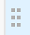
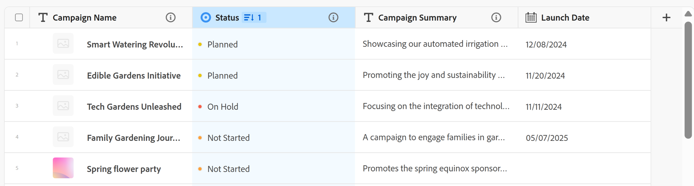

# 管理表视图

此页面上突出显示的信息是指尚未普遍可用的功能。 它仅在“预览”环境中对所有客户可用。 在每月发布到生产环境后，生产环境中为启用快速发布的客户提供了相同的功能。

有关快速发布的信息，请参阅[为您的组织启用或禁用快速发布](/help/quicksilver/administration-and-setup/set-up-workfront/configure-system-defaults/enable-fast-release-process.md)。

{{planning-important-intro}}

访问Adobe Workfront Planning中的记录类型页面时，您可以在表格视图中显示记录及其字段。

有关记录视图以及如何管理它们的信息，请参阅[管理记录视图](/help/quicksilver/planning/views/manage-record-views.md)。

本文介绍了以下信息：

* [在表格视图中创建或编辑列和行](#manage-a-table-view)
* [为表视图启用实时状态指示器](#enable-the-real-time-presence-indicator)
* [将表视图导出为CSV或Excel文件](#export-the-table-view)

## 访问要求

+++ 展开以查看访问要求。

您必须具有以下权限才能执行本文中的步骤：

<table style="table-layout:auto"> 
<col> 
</col> 
<col> 
</col> 
<tbody> 
    <tr> 
<tr> 
<td> 
   
 产品
 </td> 
   <td> 
   <ul><li>
 Adobe Workfront
</li> 
   <li>
 Adobe Workfront规划
</li></ul></td> 
  </tr>   
<tr> 
   <td role="rowheader">
Adobe Workfront计划*
</td> 
   <td> 

以下任意Workfront计划：
 
<ul><li>选择</li> 
<li>Prime</li> 
<li>Ultimate</li></ul> 

Workfront Planning不适用于旧版Workfront计划
 
   </td> 
<tr> 
   <td role="rowheader">
Adobe Workfront规划包*
</td> 
   <td> 

任何 
 

有关每个Workfront计划中包括的内容的更多信息，请联系您的Workfront客户经理。 
 
   </td> 
 <tr> 
   <td role="rowheader">
Adobe Workfront平台
</td> 
   <td> 

贵组织的Workfront实例必须载入Adobe Unified Experience，才能访问Workfront Planning的所有功能。
 

有关详细信息，请参阅<a href="/help/quicksilver/workfront-basics/navigate-workfront/workfront-navigation/adobe-unified-experience.md">适用于Workfront的Adobe Unified Experience</a>。 
 
   </td> 
   </tr> 
  </tr> 
  <tr> 
   <td role="rowheader">
Adobe Workfront许可证*
</td> 
   <td>
 标准 

   
Workfront计划不适用于旧版Workfront许可证
 
  </td> 
  </tr> 
  <tr> 
   <td role="rowheader">
访问级别配置
</td> 
   <td> 
Adobe Workfront Planning没有访问级别控制
   
</td> 
  </tr> 
<tr> 
   <td role="rowheader">
对象权限
</td> 
   <td>   
管理视图的权限
  
   
查看视图的权限以临时更改视图设置、复制、或导出它
 </td> 
  </tr> 
<tr> 
   <td role="rowheader">
版面模板
</td> 
   <td> 
在生产环境中，必须将所有用户（包括系统管理员）分配到包含Planning区域的布局模板。

在预览环境中，标准用户和系统管理员默认启用Planning区域。
</td> 
  </tr> 
</tbody> 
</table>

*有关Workfront访问要求的详细信息，请参阅Workfront文档中的[访问要求](/help/quicksilver/administration-and-setup/add-users/access-levels-and-object-permissions/access-level-requirements-in-documentation.md)。

+++

## 使用表视图编辑记录

只能在表格视图中编辑记录信息。

有关编辑表视图中的记录的详细信息，请参阅[编辑记录](/help/quicksilver/planning/records/edit-records.md)。

## 管理表视图 {#manage-a-table-view}

创建表视图时，选定类型的所有记录都会显示在表中。 每一行是一个唯一记录，每一列是一个记录字段。 默认情况下，显示所有字段和所有记录。

要管理表视图，请执行以下操作：

1. 创建表视图，如文章[管理记录视图](/help/quicksilver/planning/views/manage-record-views.md)中所述。

   

   

1. （可选）单击&#x200B;**行高**，然后从以下选项中进行选择以修改表行的高度：
   * 短
   * 中
   * 高

1. 更新以下视图元素，如以下子部分所述：
   * [列（或字段）](#add-columns-or-fields)
   * [行（或记录）](#add-rows-or-records)
   * [过滤器](#add-filters)
   * [排序](#add-a-sort)
   * [分组](#add-groupings)
   * [行颜色](#add-row-colors)
   * [实时在线状态指示器](#enable-the-real-time-presence-indicator)

### 添加列（或字段） {#add-columns}

表格视图的列标题显示与视图中记录关联的字段。 表格视图中显示的字段也会显示在记录的“详细信息”部分中。

有关详细信息，请参阅[编辑记录](/help/quicksilver/planning/records/edit-records.md)。

<!--this is not available yet:You can display record fields (or columns) in both a table and a timeline view. However, the number of columns displayed in the table of the timeline view is limited and you cannot add columns in addition to those selected by default.-->

向视图添加列与向记录类型添加字段相同。

在一个表格视图中最多可添加500个字段（或列）。

1. 转到记录类型页面并单击表视图选项卡，或单击&#x200B;**+视图**&#x200B;以添加新视图，然后选择&#x200B;**表**。

1. 开始添加字段（或列），如[创建字段](/help/quicksilver/planning/fields/create-fields.md)一文中所述。

   您添加的列对访问记录类型的所有用户都可见，并且作为新字段添加到记录的页面上。

1. 执行以下操作之一以重新排序表中的列：

   * 抓住列标题并将其拖放到所需位置。 在您对表格进行其他调整之前，您移动的列会以蓝色背景短暂显示。

   * 单击表格工具栏中的&#x200B;**字段**，然后按所需顺序拖放这些字段，然后单击&#x200B;**字段可见性和顺序**&#x200B;框外部以将其关闭。

     

     >[!TIP]
     >
     >* 默认情况下，“名称”字段始终是表视图中的第一个字段。 将此字段视为主字段。
     >
     >* 不能将“名称”字段移动到另一个位置，除非指定另一个字段作为主字段。 有关详细信息，请继续执行步骤4。<!--accurate?-->
     >
     >

   * 通过更改主字段将第一列中的字段替换为其他字段。 有关详细信息，请继续执行步骤4。<!--accurate?-->

1. （可选）将鼠标悬停在表第一列中任何未显示的字段的列标题中的字段名称上，单击字段名称右侧的向下箭头，然后单击“**设置为主字段**”。

   

1. 单击&#x200B;**设置字段**&#x200B;以确认。

   该字段将成为主字段，这意味着它将显示为表视图的第一列。 前一个主字段移至第二列。

   主要字段成为记录的标题，显示在记录页面的标题区域中，以及记录显示的任何位置。 例如，记录标题显示在连接的字段和所有视图中。 有关主字段的详细信息，请参阅[主字段概述](/help/quicksilver/planning/fields/primary-field-overview.md)。

1. 单击并拖动列分隔线，然后将它们拖放到所需位置以增加列的宽度。

   >[!TIP]
   >
   >您对列宽和顺序所做的更改是永久性的，并且所有访问记录类型的用户都可以看到这些更改。

1. 将鼠标悬停在列标题上，单击向下箭头，然后单击&#x200B;**隐藏字段**

   或

   单击表格工具栏中的&#x200B;**字段**，并禁用与要隐藏的字段（或列）相关联的切换功能。 将显示&#x200B;**字段可见性和顺序**&#x200B;框。

   >[!TIP]
   >
   >隐藏字段的数量显示在工具栏中的字段图标的左侧。

1. 单击&#x200B;**字段**&#x200B;图标，然后启用与要显示在表格列中的字段关联的切换。 默认显示所有字段。

1. 执行以下操作可快速查找与关键字匹配的记录：

   1. 单击&#x200B;**搜索**&#x200B;图标并开始键入与屏幕上显示的记录的任何字段相关联的关键字。 正确匹配的数量显示在搜索项目旁边，具有正确匹配的字段会高亮显示。

      

      您可以使用屏幕上可见的任何单词或特殊字符。

      不能使用与表格视图中隐藏的字段关联的关键字。

   1. 在键盘上按&#x200B;**Enter**&#x200B;键以转到下一个找到的字段。

   1. （可选）如果有多个匹配项，请单击搜索关键字右侧的向上箭头和向下箭头以查找表中的所有匹配项。

   1. 单击搜索框中的&#x200B;**x**&#x200B;图标以清除搜索关键字。

### 添加行（或记录） {#add-rows}

表格视图的行显示所选记录类型的单个记录。

对于记录类型，最多可以有50,000条记录（或行）。

1. 转到记录类型页面并单击表视图选项卡，或单击&#x200B;**+视图**&#x200B;以添加新视图，然后选择&#x200B;**表**。

1. 开始添加记录（或行），如[创建记录](/help/quicksilver/planning/records/create-records.md)一文中所述。

   您在表视图中添加的记录会立即保存，并且所有对工作区具有“查看”或更高权限的用户都可以看到这些记录。

1. （可选）向每条记录添加缩略图，单击表右上角的&#x200B;**字段**，然后选择用于&#x200B;**缩略图**&#x200B;字段的切换开关以将其显示在主字段的左侧。 默认情况下，该复选框处于取消选中状态。

   有关信息，请参阅[将缩略图添加到记录](/help/quicksilver/planning/records/add-thumbnails-to-records.md)。

1. （可选）选择一行中的一个或多个记录，然后将&#x200B;**句柄**&#x200B;图标拖放到记录左侧以重新排列行。

   >[!NOTE]
   >
   >如果对表视图至少应用一种排序，则无法对行重新排序。
   >
   >您对行顺序所做的更改对访问记录类型的所有用户均可见

<!-- this section below links from the timeline view; consider splitting them if they become different-->

### 添加过滤器 {#add-filters}

过滤器可帮助您减少屏幕上显示的信息量。

在表格视图中使用过滤器时，请考虑以下事项：

<!-- this list is almost identical to the one for the table view - update both-->

* 为表格视图创建的筛选器在应用于同一记录类型时独立于时间轴视图中的筛选器。

* 这些过滤器对于您选择的视图是唯一的。 同一记录类型的两个表视图可以应用不同的筛选器。 查看同一表格视图的两个用户会看到当前应用的同一筛选器。

* 您不能将您构建和应用的过滤器命名为表视图。

* 删除筛选器会将其从与您访问相同记录类型的任何人中移除，并使用与您使用的相同视图。

* 向表格视图添加筛选器与向时间轴视图添加筛选器相同。

* 您可以按连接的记录字段或查找字段进行筛选。

* 您可以按显示多个值的查找字段进行筛选。

* 您可以引用与当前记录类型相距最多4级的字段。 例如，如果您正在为“活动”记录类型创建过滤器，并且活动连接到产品记录类型，而产品记录类型连接到营销活动记录类型，而营销活动记录类型又连接到Workfront项目，则您可以在为活动记录类型创建的过滤器中引用项目的预算。

要将过滤器添加到表格视图，请执行以下操作：

1. 为记录类型页面创建表视图，如文章[管理记录视图](/help/quicksilver/planning/views/manage-record-views.md)中所述。
1. 选择一个表视图，然后单击该表右上角的&#x200B;**筛选器**。
1. 单击&#x200B;**添加条件**&#x200B;并添加以下信息：

   * **选择要按<!-- the tip below might change-->筛选的字段**

   * **选择一个选项**（或筛选器修饰符）以定义字段必须满足哪种条件

     下表显示了每种字段类型的可用修饰符。

     <table>
        <thead>
        <tr>
            <th><b>字段类型</b></th>
            <th><b>修饰符</b></th>
        </tr>
        </thead>
        <tbody>
        <tr>
            <td>单行、段落、公式 </td>
            <td>
包含

            
不包含

            
是

            
不是

            
为空

            
不为空
</td>
        </tr>
        <tr><td>单选</td>
            <td>
是

            
不是

            
是任何

            
不是任何

            
为空

            
不为空
</td>
        </tr>
        <tr>
            <td>多选，人员</td>
            <td>
具有任何

            
包含所有

            
正好

            
没有

            
为空

            
不为空
</td>
        </tr>
        <tr>
            <td>数字、百分比、货币</td>
            <td>
=

            
≠

            
 &lt; 

            
&gt;

            
≤

            
≥

            
为空

            
不为空
</td>
        </tr>
        <tr>
            <td>日期</td>
            <td>
是

            
不是

            
晚于

            
早于

            
介于

非介于

            
为空

不为空
</td>
        </tr>

     <tr>
            <td>复选框</td>
            <td>
是

        </tr>
        </tbody>
        </table>

   * 为所选字段选择值。

   

   您可以添加的筛选条件数量没有限制。

1. （可选）单击&#x200B;**添加条件**&#x200B;以添加其他筛选选项并重复上述步骤。 应用的过滤器数显示在过滤器图标的左侧。
1. 单击以下运算符以指示连接筛选条件的方式以及应如何应用：

   * **AND**：必须满足所有指定的条件。
   * **OR**：必须满足任何指定的条件。 这是默认选项。

   1. （可选）在多个条件分组之间添加其他&#x200B;**AND**&#x200B;或&#x200B;**OR**&#x200B;运算符。

      

   系统会自动过滤记录列表。 <!--at this time, you can't name and save the filter - but will this change?!-->
   <!-- asked on the task for the simple filters whether there is a limitation for how many statements a filter can have?!-->

1. （可选）单击&#x200B;**x**&#x200B;图标可删除筛选条件。
1. （可选）单击&#x200B;**筛选器**&#x200B;以关闭筛选器框。<!--right now you cannot "clear all" for filters, but this might come later-->

### 添加排序 {#sort-information}

通过应用排序，您可以按指定顺序组织信息。

您可以对以下信息进行排序：

* 表格视图中的所有记录。<!--or timeline view. ***********verify this is the case for the timeline view*********************-->
  <!--* All groupings. - this is not available yet-->

在表视图中排序记录时，请考虑以下事项：

<!-- if this is available for the timeline view, update both when you update one-->

* 排序对于您选择的视图是唯一的。 同一记录类型的两个表视图可以应用不同的排序标准。 查看同一表格视图的两个用户会看到当前应用的相同排序。

* 不能对您生成的排序进行命名并应用于表视图。

* 当您导航离开时，您创建的排序将保留。

* 您可以按记录类型的表视图中显示的字段数进行排序。

* 您不能按连接的记录字段进行排序，但可以按连接的记录类型的查找字段进行排序。

* 当按具有多个值（尚未由聚合器汇总）的查找字段进行排序时，将使用第一个值进行排序。

* 删除分类标准会将其从与您访问相同记录类型的任何人中移除，并使用与您使用的相同视图。

* 您可以引用与当前记录类型相距最多4级的字段。 例如，如果您正在为“活动”记录类型创建排序，并且活动连接到产品记录类型，而产品记录类型连接到营销活动记录类型，而营销活动记录类型又连接到Workfront项目，则您可以在为活动记录类型创建的排序中引用项目的“状态”。

要对<!--ungrouped (add this when sorting for groupings will be available-->记录进行排序，请执行以下操作：

1. 创建表视图，如文章[管理记录视图](/help/quicksilver/planning/views/manage-record-views.md)中所述。
1. 单击表右上角的&#x200B;**排序**&#x200B;图标

   或

   将鼠标悬停在表视图中的列名称上，单击列标题名称右侧的向下箭头，然后单击&#x200B;**按此字段排序**。 该字段将作为排序选择添加到表格视图右上角的排序图标中。

1. （视情况而定）在&#x200B;**记录排序依据**&#x200B;框中，单击建议的字段之一，或单击&#x200B;**选择其他字段**&#x200B;并搜索其他字段，然后在列表显示该字段时单击它。

   排序将自动应用于表格视图，并且记录显示按您选择的标准排序。

   <!-- add a step that you can rearrange the sorting fields here, when this will be possible-->

1. （可选）单击&#x200B;**添加条件**，然后重复上述步骤以按其他字段进行排序。

   要排序的字段数显示在工具栏右上角排序图标的左侧。 您只能选择显示在表格视图列中的字段。

1. （可选）在&#x200B;**记录排序依据**&#x200B;框中，单击排序字段右侧的&#x200B;**x**&#x200B;图标以移除排序

   或

   单击&#x200B;**全部清除**&#x200B;可从排序中删除所有字段。

1. 单击&#x200B;**记录排序依据**&#x200B;框外部以将其关闭。

   

   表格中显示的信息根据您选择的标准排序。

   为排序选择的字段显示一个排序图标，后跟一个数字，指示应用排序的顺序。

### 添加分组 {#add-groupings}

<!--this section exists in the timeline view too, but the display is slightly different, so I kept both steps; consider updating both sections if any updates to groupings are introduced-->

将分组应用于视图时，您可以按类似的信息对记录进行分组。

在表格视图中添加分组与向时间轴视图添加分组类似。

请考虑以下事项：

* 可以在表格视图和时间线视图中应用分组。 表格视图的分组独立于相同记录类型的时间线视图中的分组。
* 您可以在视图中应用3个级别的分组。 这些记录按您选择的分组顺序分组。
&lt;！—*在使用API时，您最多可以应用4个级别的分组。  — 现在查看此项 — >
* 这些分组对于您选择的视图是唯一的。 同一记录类型的两个表视图可以应用不同的分组。 查看同一表格视图的两个用户会看到当前应用的相同分组。
* 不能为表视图命名您构建的分组。
* 删除分组会将其从与您访问相同记录类型以及显示与您相同视图的任何人中删除。
* 您可以编辑分组下列出的记录。
* 您可以按连接的记录字段或查找字段分组。
* 当按查找字段对具有多个值（尚未由聚合器汇总）的字段进行分组时，记录将按字段值的每个唯一组合进行分组。
* 您可以引用与当前记录类型相距最多4级的字段。 例如，如果要为活动记录类型创建分组，并且活动连接到产品记录类型，而产品记录类型连接到营销活动记录类型，而营销活动记录类型又连接到Workfront项目，则可以在为活动记录类型创建的分组中引用项目的状态。
<!--checking into this: * You can apply up to 4 levels of grouping when using the API. -->
<!-- checking also into this: * You cannot group by a Paragraph-type field.-->

要添加分组，请执行以下操作：

1. 为记录类型创建时间线视图，如[管理记录视图](/help/quicksilver/planning/views/manage-record-views.md)一文中所述。
1. 单击表视图右上角的&#x200B;**分组**。

   

1. 单击其中一个建议的字段，或单击&#x200B;**选择其他字段**，搜索其他字段，然后在列表显示该字段时单击它。

   该分组将自动应用于表，并且记录显示在分组分离行下。

1. （可选）单击&#x200B;**添加条件**&#x200B;并重复上述步骤以添加最多3个分组。

   为分组选择的字段数将显示在分组图标旁边。

   

1. （可选）在&#x200B;**按**&#x200B;对记录进行分组框中，单击为分组选择的字段右侧的&#x200B;**x**&#x200B;图标以删除该分组

   或

   单击&#x200B;**全部清除**&#x200B;可删除所有字段。

1. 单击&#x200B;**按**&#x200B;分组记录框外部以将其关闭。
1. （可选）单击任何分组末尾的&#x200B;**+新记录**&#x200B;以添加新记录，然后刷新页面以将新记录添加到相应的分组。<!--this might need to be changed when they add the Refresh button on the toolbar of the table view-->

<!-- this is not available yet: 

To sort grouped records: 

1. Create a view, as described in [Create or edit record views](#create-or-edit-record-views). 
1. ************************* add steps here for sorting grouped records****************

-->

### 添加行颜色

1. （可选）单击&#x200B;**行颜色**&#x200B;以定义条件并选择为表行配置不同的颜色。

1. 单击&#x200B;**添加颜色**，然后&#x200B;**选择要确定其值的字段**。

   例如，要以绿色显示状态为“活动”的促销活动，请选择&#x200B;**状态**，然后为字段选择修饰符和值。

   

1. 单击所选条件左上角的拾色器下拉菜单，选取条件的颜色，然后单击拾色器框外部将其关闭。

   

1. （可选）单击&#x200B;**添加条件**&#x200B;以向第一组条件添加更多字段和值

   或

   单击&#x200B;**添加颜色**&#x200B;以添加一组新的条件并标识新的颜色。

   例如，您可以通过定义一组新条件，以黄色显示处于Planning状态的促销活动。

   

1. （可选）打开“行颜色”框右上角的&#x200B;**应用到整行**&#x200B;设置。 满足条件的整行会自动以选定的颜色显示。

   >[!NOTE]
   >
   >* 如果“应用到整行”设置处于关闭状态，则只有“主”字段的左侧显示具有选定颜色的窄颜色指示器。 默认情况下，该设置处于关闭状态。
   >
   >* 在表格视图中选择了至少一个分组时，不能将行颜色应用到整行。

1. 单击&#x200B;**行颜色**&#x200B;框外部以将其关闭。 颜色会自动应用。

### 启用实时在线状态指示器

默认情况下，与编辑记录信息的其他用户头像将显示在所有记录视图的右上角。

显示表格视图时，还可以查看查看查看记录时其他用户正在编辑的字段。

1. 转到记录类型页面并打开任意视图。
1. （视情况而定）如果同时有其他用户编辑所选类型的记录，则其头像将显示在视图的右上角。
1. 单击头像旁边的下拉菜单，然后选择&#x200B;**显示协作者**&#x200B;切换开关。 默认情况下，该切换处于选中状态。

   

1. （视情况而定）打开表格视图，另一个人正在主动编辑的字段会以对应于表格视图中其头像轮廓的颜色突出显示。

   如果头像的高亮颜色为灰色，则用户在30秒前停止了主动编辑记录。

   

   >[!TIP]
   >
   >您可以从任何视图中选择&#x200B;**显示协作者**&#x200B;切换开关。 他人当前编辑的字段仅在表格视图中列出。

## 导出表格视图

您可以将表格视图中的信息导出为CSV或Excel文件。

导出表视图时，请考虑以下事项：

* 导出到Excel文件中的信息将保留应用于Workfront Planning中的表格视图的筛选器、分组和排序。 分组在CSV文件中不可见。

* 导出的文件不支持缩略图和自定义行颜色。

* 仅导出在Workfront界面中可见的字段。 隐藏字段不导出。

要从表格视图或记录类型导出信息，请执行以下操作：

1. 转到记录类型页面，然后单击表格视图选项卡。
1. 将鼠标悬停在表视图选项卡的名称上，然后单击&#x200B;**更多**&#x200B;菜单。

   视图上的
1. 单击&#x200B;**导出**，然后选择以下格式之一：

   * Excel
   * CSV

   >[!IMPORTANT]
   >
   >当在屏幕上显示不同的视图时，不能从表格视图导出信息。 要访问“更多”菜单中的“导出”选项，必须显示要导出的表格视图。

   文件已下载到您的计算机。

1. （可选）转到计算机上的下载文件夹并找到下载的文件。

   导出文件的名称遵循以下格式：

   `Name of the view - name of the record type`

   例如，促销活动记录类型的表视图会生成一个名为`Table view - Campaigns`的文件。

   文件显示以下信息：

   * 在Excel文件中，列标题以黑色突出显示
   * 在Workfront界面中可见的所有字段，均按相同的标准进行排序和过滤
   * 分组将保留在Excel文件中

   您现在可以与其他人共享导出的文件，或将其附加到任何通信。

