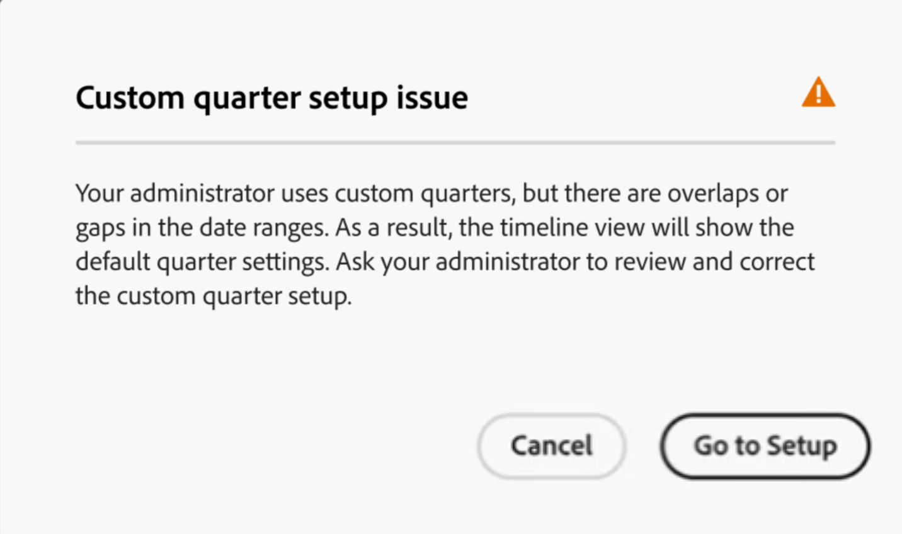
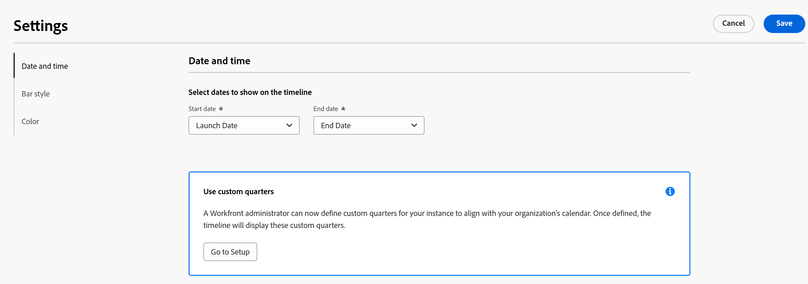

# 管理时间线视图

<!--remove preview and production references at production-->

此页面上高亮显示的信息引用了尚未公开的功能。 它仅在“预览”环境中对所有客户可用。 在每月发布到生产环境后，生产环境中为启用快速发布的客户提供了相同的功能。

有关快速发布的信息，请参阅[为您的组织启用或禁用快速发布](/help/quicksilver/administration-and-setup/set-up-workfront/configure-system-defaults/enable-fast-release-process.md)。

{{planning-important-intro}}

访问Adobe Workfront Planning中的记录类型页面时，可在时间轴视图中显示记录。

有关记录视图的信息，请参阅[管理记录视图](/help/quicksilver/planning/views/manage-record-views.md)。

## 访问要求

+++ 展开以查看访问要求。 

<table style="table-layout:auto"> 
<col> 
</col> 
<col> 
</col> 
<tbody> 
    <tr> 
<tr> 
<td> 
   
 产品
 </td> 
   <td> 
   <ul><li>
 Adobe Workfront
</li> 
   <li>
 Adobe Workfront规划
</li></ul></td> 
  </tr>   
<tr> 
   <td role="rowheader">
Adobe Workfront计划*
</td> 
   <td> 

以下任意Workfront计划：
 
<ul><li>选择</li> 
<li>Prime</li> 
<li>Ultimate</li></ul> 

Workfront Planning不适用于旧版Workfront计划
 
   </td> 
<tr> 
   <td role="rowheader">
Adobe Workfront规划包*
</td> 
   <td> 

任何 
 

有关每个Workfront计划中包括的内容的更多信息，请联系您的Workfront客户经理。 
 
   </td> 
 <tr> 
   <td role="rowheader">
Adobe Workfront平台
</td> 
   <td> 

贵组织的Workfront实例必须载入Adobe Unified Experience才能访问Workfront Planning。
 

有关详细信息，请参阅<a href="/help/quicksilver/workfront-basics/navigate-workfront/workfront-navigation/adobe-unified-experience.md">适用于Workfront的Adobe Unified Experience</a>。 
 
   </td> 
   </tr> 
  </tr> 
    <td role="rowheader">
Adobe Workfront许可证*
</td> 
   <td>
 用于创建和删除视图的标准

   
更新视图元素的参与者或更高版本

   
Workfront计划不适用于旧版Workfront许可证
 
  </td> 
  </tr> 
  <tr> 
   <td role="rowheader">
访问级别配置
</td> 
   <td> 
Adobe Workfront Planning没有访问级别控制
   
</td> 
  </tr> 
<tr> 
   <td role="rowheader">
对象权限
</td> 
   <td>   
管理视图的权限
  
   
查看对视图的权限以临时更改视图设置或复制它
 </td> 
  </tr> 
<tr>
   <td role="rowheader">
版面模板
</td>
   <td> 必须为具有轻度或参与者许可证的用户分配一个包括Planning的布局模板。
   
默认情况下，标准用户和系统管理员已启用Planning区域。

</li></ul>
</td>
  </tr>
</tbody> 
</table>

*有关Workfront访问要求的详细信息，请参阅Workfront文档中的[访问要求](/help/quicksilver/administration-and-setup/add-users/access-levels-and-object-permissions/access-level-requirements-in-documentation.md)。

+++     

## 管理时间线视图 {#manage-a-timeline-view}

创建时间线视图时，所选记录类型的所有记录都按时间顺序显示在时间线中。

请考虑以下事项：

* 仅当至少有两个日期字段与记录类型关联时，才能创建时间轴视图。 当有一个或没有与记录类型关联的日期字段时，“时间轴”视图选项将灰显。

  构建时间线视图时，您可以从以下日期字段中选择：

   * 记录日期
   * 记录系统生成的字段：创建日期、上次修改日期
   * 来自连接的记录或对象类型的查找日期（仅在连接记录或对象类型时为其添加了聚合器时）
* 根据与记录关联的日期，在以下场景中，某些记录可能不会显示在时间轴视图中：

   * 当开始日期和结束日期没有值时
   * 当“开始”或“结束”日期没有值时
   * 当开始日期在结束日期之后时

要管理时间线视图，请执行以下操作：

1. 转到要查看其时间线的记录类型页面。
1. 创建时间线视图，如[管理记录视图](/help/quicksilver/planning/views/manage-record-views.md)一文中所述。

   

   与所选记录类型关联的记录在时间轴中显示为条形，默认情况下，这些记录按其开始日期的时间顺序排序。

   >[!TIP]
   >
   >    时间轴中记录的排序在压缩视图中不可见。

1. （视情况而定）如果您的管理员启用了自定义季度，并且Workfront检测到自定义季度配置方式存在问题，则您在打开时间线视图时可能会收到警告。

   存在以下情况：

   * 如果检测到季度日期之间存在间隔或重叠，您可能会收到通知，告知您现在可以设置自定义季度，并且这些季度可能需要编辑。

     

     >[!TIP]
     >
     >此消息应仅在您的组织购买后立即显示，在购买前已启用了计划和自定义季度。 为您的组织启用Workfront规划后，不允许季度之间出现重叠和间隔。

   * 如果季度已部分设置，并且同一年中的某些月份缺失，您可能会在滚动显示本年度其余时间需要使用缺失的季度来设置缺失的季度时收到通知。

   

   每个用户会显示一次有关自定义季度的警告消息。

   >[!NOTE]
   >
   >如果未正确保存自定义季度，则时间线视图将显示经典季度。
   >在“设置”区域中设置自定义季度后，时间线视图显示自定义季度，而不是传统季度。
   >有关信息，请参阅[启用自定义季度](/help/quicksilver/administration-and-setup/set-up-workfront/configure-system-defaults/enable-custom-quarters-projects.md)。

1. （视情况而定）如果您是Workfront管理员，请单击&#x200B;**转到设置**&#x200B;以设置您的季度。 如果没有，请单击“确定”**&#x200B;**，然后要求您的Workfront管理员设置自定义季度。

   >[!TIP]
   >
   >仅对Workfront管理员显示“转到设置”按钮。

1. （可选且有条件）记录名称被截断时，将鼠标悬停在记录栏上会显示记录的全名和其他信息。 有关在时间轴中设置记录栏截断的信息，请参阅本文中的[编辑时间轴视图设置](#edit-the-timeline-view-settings)部分。

1. 执行以下操作之一可在时间轴中导航：

   * 单击左上角的左右图标，或使用水平滚动在时间轴中前后移动。 刷新页面将保留所选的时间范围。
   * 单击右上角的&#x200B;**今天**，将时间线居中到今天的日期。
   * 从时间范围下拉菜单中选择以下选项之一以更新时间增量并更新视图：

      * **年**：显示有年指示的季度和月。
      * **季度**：显示有季度指示的月和周。
      * **月**：显示周和日。
1. （可选）单击&#x200B;**切换到紧凑视图**&#x200B;可显示日期在同一行上不相交的记录。<!--check to see if they updated the name of the setting here-->
1. （视情况而定）如果将模式更改为&#x200B;**紧凑**，请单击&#x200B;**切换到标准**&#x200B;视图以单独行显示记录。 **Standard**&#x200B;选项是默认选项。 <!--check to see if they updated the name of the setting here-->

1. 执行以下操作可快速查找与关键字匹配的记录：

   1. 单击&#x200B;**搜索**&#x200B;图标并开始键入与屏幕上显示的记录的任何字段相关联的关键字。 正确匹配的数量显示在搜索项目旁边，具有正确匹配的记录会高亮显示。

      

      您可以使用屏幕上可见的任何单词或特殊字符。

      不能使用与不在时间轴视图中显示的字段关联的关键字。

   1. 在键盘上按Enter键以转到下一个找到的字段。
   1. （可选）如果有多个匹配项，请单击搜索关键字右侧的向上箭头和向下箭头以查找表中的所有匹配项。
   1. 单击搜索框中的&#x200B;**x**&#x200B;图标以清除搜索关键字。

   1. （可选）单击&#x200B;**全屏**&#x200B;图标以全屏方式打开视图，然后单击&#x200B;**退出全屏**&#x200B;图标或键盘上的Escape以退出全屏。 

1. （可选）单击&#x200B;**划分**&#x200B;以在时间轴上显示连接的记录。

   有关信息，请参阅本文中的[使用划分功能在时间线视图](#break-down-connected-records-in-the-timeline-view)中显示连接的记录。
1. 要在时间轴视图中创建记录或编辑其日期，请执行下列操作之一：

   * 双击时间轴上的任意位置以创建记录。

     有关信息，请参阅[创建记录](/help/quicksilver/planning/records/create-records.md)。

   * 单击记录栏的左边距或右边距，然后将其拖放到新位置。 调整记录栏的大小会立即更新其开始或结束日期。

   * 拖放记录以更新它们在时间轴中的位置和日期。 移动记录的栏会立即更新其开始和结束日期。
     有关信息，请参阅[编辑记录](/help/quicksilver/planning/records/edit-records.md)。

1. 更新以下视图元素，如以下子部分所述：
   * [过滤器](#add-filters)
   * [分组](#add-grouping)
   * [设置](#edit-the-timeline-view-settings)
     <!--* [Sort](#add-sort) not yet in timeline; also check the anchor and make sure it's correct-->

### 添加过滤器

您可以使用过滤器减少屏幕上显示的信息量。

在时间线视图中使用过滤器时，请考虑以下事项：

<!-- this list is almost identical to the one for the table view - update both-->

* 您为时间轴视图创建的筛选器与应用于同一记录类型的任何其他视图中的筛选器独立工作。

* 这些过滤器对于您选择的视图是唯一的。 同一记录类型的两个时间轴视图可以应用不同的筛选器。

* 查看同一时间轴视图的两个用户会看到当前应用的同一过滤器。

* 您无法为时间线视图命名您构建的过滤器。

* 删除筛选器会将其从与您访问相同记录类型以及显示与您相同的视图的任何人中删除。

* 您可以按连接的记录字段或查找字段进行筛选。
* 您可以按显示多个值的查找字段进行筛选。

要将过滤器添加到时间线视图，请执行以下操作：

1. 为记录类型页面创建时间线视图，如文章[管理记录视图](/help/quicksilver/planning/views/manage-record-views.md)中所述。
1. 选择一个时间线视图，然后单击表右上角的&#x200B;**筛选器**。
1. 单击&#x200B;**添加条件**&#x200B;并添加以下信息：

   * **选择要按**&#x200B;筛选的字段<!-- the tip below might change-->

   * **选择一个选项**（或筛选器修饰符）以定义字段必须满足哪种条件

     下表显示了每种字段类型的可用修饰符。

     <table>
        <thead>
        <tr>
            <th><b>字段类型</b></th>
            <th><b>修饰符</b></th>
        </tr>
        </thead>
        <tbody>
        <tr>
            <td>单行、段落、公式 </td>
            <td>
包含

            
不包含

            
是

            
不是

            
为空

            
不为空
</td>
        </tr>
        <tr><td>单选</td>
            <td>
是

            
不是

            
是任何

            
不是任何

            
为空

            
不为空
</td>
        </tr>
        <tr>
            <td>多选，人员</td>
            <td>
具有任何

            
包含所有

            
正好

            
没有

            
为空

            
不为空
</td>
        </tr>
        <tr>
            <td>数字、百分比、货币</td>
            <td>
=

            
≠

            
 &lt; 

            
&gt;

            
≤

            
≥

            
为空

            
不为空
</td>
        </tr>
        <tr>
            <td>日期</td>
            <td>
是

            
不是

            
晚于

            
早于

            
介于

非介于

            
为空

不为空
</td>
        </tr>

     <tr>
            <td>复选框</td>
            <td>
是

        </tr>
        </tbody>
        </table>

   * 为所选字段选择值。

   

   您可以添加的筛选条件数量没有限制。

1. （可选）单击&#x200B;**添加条件**&#x200B;以添加其他筛选选项并重复上述步骤。 应用的筛选器数显示在&#x200B;**筛选器**&#x200B;图标的左侧。
1. 单击左侧的以下运算符以指示连接和应应用过滤器条件的方式：

   * **AND**：必须满足所有指定的条件。
   * **OR**：必须满足任何指定的条件。
这是默认选项。

   1. （可选）添加其他筛选器分组并由&#x200B;**AND**&#x200B;或&#x200B;**OR**&#x200B;运算符加入它们。

      

   系统会根据您的筛选条件自动筛选记录列表。 <!--at this time, you can't name and save the filter - but will this change?!-->
   <!-- asked on the task for the simple filters whether there is a limitation for how many statements a filter can have?!-->

1. （可选）单击&#x200B;**x**&#x200B;图标可删除筛选条件。
1. （可选）单击&#x200B;**筛选器**&#x200B;或页面上的任何其他位置以关闭筛选器框。<!--right now you cannot "clear all" for filters, but this might come later-->

### 添加分组

<!-- groupings are almost identical between this view and table  but they display a little differently, so I kept the steps for both; update in both places if they make changes to groupings-->

将分组应用于视图时，您可以按类似的信息对记录进行分组。

在时间线视图中使用分组时，请考虑以下事项：

* 可以在表格视图和时间线视图中应用分组。 表格视图的分组独立于相同记录类型的时间线视图中的分组。
* 您可以在视图中应用3个级别的分组。 这些记录按您选择的分组顺序分组。
&lt;!—*在使用API时，您最多可以应用4个级别的分组。  — 现在查看此项 — >
* 这些分组对于您选择的视图是唯一的。 同一记录类型的两个表视图可以应用不同的分组。 查看同一表格视图的两个用户会看到当前应用的相同分组。
* 不能为表视图命名您构建的分组。
* 删除分组会将其从与您访问相同记录类型以及显示与您相同视图的任何人中删除。
* 您可以编辑分组下列出的记录。
* 您可以按连接的记录字段或查找字段分组。
* 当按查找字段对具有多个值（尚未由聚合器汇总）的字段进行分组时，记录将按字段值的每个唯一组合进行分组。
* 您可以引用与当前记录类型相距最多4级的字段。 例如，如果要为活动记录类型创建分组，并且活动连接到产品记录类型，而产品记录类型连接到营销活动记录类型，而营销活动记录类型又连接到Workfront项目，则可以在为活动记录类型创建的分组中引用项目的状态。
* 分组按其值的字母顺序列出。
<!--checking into this: * You can apply up to 4 levels of grouping when using the API. -->
<!-- checking also into this: * You cannot group by a Paragraph-type field.-->

要在时间轴视图中添加分组，请执行以下操作：

1. 为记录类型创建时间线视图，如[管理记录视图](/help/quicksilver/planning/views/manage-record-views.md)一文中所述。
1. 单击时间轴视图右上角的&#x200B;**分组**。

   

1. 单击其中一个建议的字段，或单击&#x200B;**选择其他字段**，搜索其他字段，然后在列表显示该字段时单击它。

   分组将自动应用于时间轴，并且记录显示在分组框中。

1. （可选）重复上述步骤以添加最多3个分组。

   为分组选择的字段数将显示在“分组”图标旁边。

   

1. 在&#x200B;**按**&#x200B;对记录进行分组框中，按正确的顺序拖放分组。

1. （可选）在&#x200B;**按**&#x200B;对记录进行分组框中，单击为分组选择的字段右侧的&#x200B;**x**&#x200B;图标以删除该分组

   或

   单击&#x200B;**全部清除**&#x200B;可删除所有字段。

1. 单击&#x200B;**按**&#x200B;分组记录框外部以将其关闭。
1. （可选）单击&#x200B;**Settings**，然后单击&#x200B;**Color**&#x200B;进行颜色代码分组。 有关详细信息，请参阅本文中的[编辑时间线视图设置](#edit-the-timeline-view-settings)部分。

<!-- 

### Add sort

this is not possible right now; if this is the same functionality as the table view, document it there and link from here. 

-->

### 编辑时间线视图设置 {#edit-the-timeline-view-settings}

更新时间线视图设置，以指示信息在视图的时间线部分中显示什么及如何显示。

1. 为记录类型创建时间线视图，如[管理记录视图](/help/quicksilver/planning/views/manage-record-views.md)一文中所述。
1. 单击&#x200B;**设置**。
1. 单击左侧面板中的&#x200B;**日期和时间**，然后选择要显示在时间轴上的&#x200B;**开始日期**&#x200B;和&#x200B;**结束日期**。 您可以选择默认的“开始”和“结束”日期，也可以选择任何可用的日期字段。

   表示记录的条形图从您为开始日期指定的日期开始，结束日期对应于结束日期。

   >[!NOTE]
   >
   >* 对于开始日期或结束日期没有值或者开始日期晚于结束日期的记录，不会显示在时间轴视图中。
   >
   >* 如果使用“细分”选项显示附加记录，则起始日期和终止日期是主记录的起始日期和终止日期。 您无法在此区域为连接的记录选择开始日期和结束日期。

1. （视情况而定，可选）如果您是Workfront管理员，请单击&#x200B;**使用自定义季度**&#x200B;框中的&#x200B;**转到设置**&#x200B;以转到设置区域并设置自定义季度。 设置自定义季度后，您可以在时间轴视图中显示它们，而不是经典季度。 如果您不是Workfront管理员，则可以向管理员请求为您的组织启用自定义季度。

   有关信息，请参阅[启用自定义季度](/help/quicksilver/administration-and-setup/set-up-workfront/configure-system-defaults/enable-custom-quarters-projects.md)。

   

   >[!TIP]
   >
   >仅对Workfront管理员显示“转到设置”按钮。

1. 单击左侧面板中的&#x200B;**栏样式**&#x200B;以指示要在记录栏上显示的信息。

   使用“标准”视图中的“划分”选项时，您可以定义主记录以及所连接记录的条形图样式。

   默认情况下会选择记录的主字段（或标题），如在记录的表格视图中定义的那样。
   <!--adjust this when the primary field is released??-->

1. （可选且视情况而定）如果您将缩略图添加到记录，请选择&#x200B;**缩略图**&#x200B;选项以在记录栏中显示与记录关联的图像。

   >[!NOTE]
   >
   >    必须先在表格视图中添加缩略图，然后才能在时间轴视图中显示它们。 有关详细信息，请参阅[将缩略图添加到记录](/help/quicksilver/planning/records/add-thumbnails-to-records.md)。

1. 单击&#x200B;**添加字段**，然后在&#x200B;**搜索字段**&#x200B;框中单击，然后单击要添加的字段。

   >[!TIP]
   >
   >   * 必须先创建这些字段，然后才能将其添加到记录栏。
   > 
   >   * 您必须至少选择一个字段。 默认情况下已选择&#x200B;**名称**。
   >
   >   * 您最多可以添加5个字段。

   右侧将显示时间轴上栏的外观。

   

1. （可选且有条件）如果在“标准”模式下显示时间轴，请选择&#x200B;**截断栏详细信息**&#x200B;设置。 选中后，记录栏上的信息将被截断，仅当将鼠标悬停在记录栏上时，才会完全显示信息。 默认情况下，此设置处于取消选中状态，记录信息会完全显示在栏中。

   

   >[!TIP]
   >
   >在紧凑模式下显示时间轴视图时，“截断栏详细信息”设置不可用。
   >

1. 单击左侧面板中的&#x200B;**颜色**，以自定义时间轴中记录和分组的颜色。

   

   在“标准”视图中使用划分选项时，您可以定义主记录的颜色以及连接的记录的颜色。

1. （视情况而定，可选）如果向时间轴视图添加了分组，请从以下选项中进行选择，以在&#x200B;**设置分组颜色**&#x200B;部分中设置分组的颜色：

   * **默认（灰色）**：分组的颜色设置为灰色。 这是默认设置。
   * **字段值**：分组的颜色与您分组依据的字段的颜色匹配。

     >[!NOTE]
     >
     >    * 您只能将颜色与具有颜色编码选项的字段匹配。 例如，可以将颜色与“状态”字段匹配，或可与颜色关联的选项进行匹配。
     >    
     >    * 不能将颜色与链接记录或对象类型中的查找字段匹配。

   例如，多选或单选字段可以具有颜色编码选项。

   如果按没有颜色编码选项的字段分组，则分组颜色保持灰色。

   >[!TIP]
   >
   >如果未将分组添加到时间轴视图，则不会显示此部分。

1. 在&#x200B;**设置记录颜色**&#x200B;部分中，从以下选项中进行选择以设置记录的颜色：

   * **记录类型**：记录的颜色与您选择的记录类型的颜色相匹配。 这是默认选项。
   * **字段值**：记录的颜色与您指定的字段的颜色匹配。 继续执行步骤10。<!--ensure this stays accurate-->
   * **分组**：记录的颜色与您为分组指定的颜色相匹配。 当未将分组应用于时间轴视图时，此选项将灰显。
   * **无**：记录显示在白色栏中。

1. （视情况而定）如果您为记录颜色选择了&#x200B;**字段值**，请从&#x200B;**将记录颜色与**&#x200B;下拉菜单中选择一个字段。

   时间线视图中的

   下拉菜单中仅显示具有颜色编码选项的字段。

   例如，多选或单选字段可以具有颜色编码选项。

   如果对于所选的记录类型没有带颜色编码选项的字段，则此选项将灰显。

1. （可选）如果您使用&#x200B;**划分**&#x200B;选项，请为时间轴中显示的每个连接记录重复步骤4。

1. 单击&#x200B;**保存**。

   这些记录将按照您选择的规范显示在时间轴视图中。

### 在时间轴视图中划分连接的记录

使用“划分”功能，可以在记录的时间线视图中显示连接的记录。 按连接划分记录允许您查看其他连接记录的时间表，并了解它们可能会如何影响记录的性能和截止日期。

#### 使用划分功能时的注意事项

* 可以在时间轴视图的选定记录类型的记录下显示连接的记录或对象。
* 仅当在“标准”模式下查看记录时，才可以在时间轴视图中显示连接的记录。 在时间轴视图的紧凑模式下，不能使用划分选项。
* 使用“划分”功能，可在时间轴视图中显示以下内容：
   * 连接到所选记录类型的Workfront Planning记录。
   * 连接到所选记录类型的Workfront对象类型或Experience Manager资源。
   * Workfront Planning记录或其他应用程序中连接到连接到选定记录类型的记录的对象。

     例如，您可以将营销活动连接到项目组合。 此外，您还可以将另一个记录类型“产品”与项目以及营销活动相关联。 构建营销活动时间线视图时，您可以按项目组合、产品和项目细分营销活动。

* 您不能显示仅连接到Workfront中的Workfront对象，但未连接到Workfront Planning记录类型的对象类型。 您只能显示Workfront Planning中连接的对象或记录类型。

  例如，任务连接到Workfront中的项目。 使用“细分”功能，您可以在Planning中显示与营销活动相关的项目，但不能显示与Workfront项目相关的任务。

  如果要在Workfront Planning记录类型的时间线视图中显示项目组合和项目，则项目组合和项目都必须连接到Planning记录，或连接到其时间线视图由您管理的Planning记录的记录。
* 您只能显示与至少两个日期字段关联的记录类型。
* 要在时间轴视图中显示的记录类型的日期字段必须在所选记录类型的表视图中可见，如查找字段。
* 要在时间轴视图中显示的记录类型的开始日期和结束日期必须按时间顺序排列。 例如，如果记录的开始日期为1月31日，结束日期为1月1日，则它不会显示在时间线视图中。 有关详细信息，请参阅本文中的[管理时间线视图](#manage-a-timeline-view)部分。
* 您可以在记录的划分中包含5种记录类型的限制。

#### 划分连接的记录

1. 为记录类型创建时间线视图，如[管理记录视图](/help/quicksilver/planning/views/manage-record-views.md)一文中所述。
1. 在&#x200B;**标准**&#x200B;或&#x200B;**紧凑**&#x200B;模式中，单击时间轴视图右上角的&#x200B;**划分**。
1. 展开&#x200B;**选择链接记录类型**&#x200B;框并选择连接的记录类型。<!--add a new screen shot - submitted a bug to remove the "the"-->

   

   时间线视图上的

   

   >[!TIP]
   >
   >    如果您没有任何连接的记录，或者连接的记录至少没有两个日期字段，则&#x200B;**选择链接记录类型**&#x200B;框不可用。

1. 选择&#x200B;**开始日期**&#x200B;和&#x200B;**结束日期字段**。

   >[!TIP]
   >
   >    开始和结束日期必须是连续的。 如果结束日期早于开始日期，则时间轴中不会显示任何记录。

   如果所选记录与其他记录连接，则时间轴中的选定记录栏上将显示一个向右箭头。
1. 单击向右箭头可展开记录类型并显示其连接。<!--update screen shot at production-->

   在时间线视图中

   >[!IMPORTANT]
   >
   >    当您在划分中显示多个连接的记录时，它们不是按层级顺序排列的。
   >
   >例如，如果您查看的是营销策划的时间表，您在划分中添加了产品，然后又添加了“项目”，则“项目”不一定首先与“产品”关联。
   >
   >产品和项目群都必须连接到营销策划，才能显示为划分选项的选项，您可以按任意顺序将它们添加到划分。

1. （视情况而定）如果您正在以紧凑模式查看时间轴，请单击&#x200B;**切换视图**。 划分在&#x200B;**紧凑**&#x200B;模式下不可见。

   >[!TIP]
   >
   >选择&#x200B;**不要在**&#x200B;切换到标准视图中再次显示此信息&#x200B;**？**&#x200B;框，然后切换视图。
   >
   >只有当前浏览器才会记住此首选项。 如果您更改浏览器或计算机，则必须再次选择此首选项。
   >
   >在将视图切换为“标准”并在视图中显示连接的记录后，不能恢复为“紧凑”模式。
1. （可选）重复上述步骤以添加更多连接的记录。

