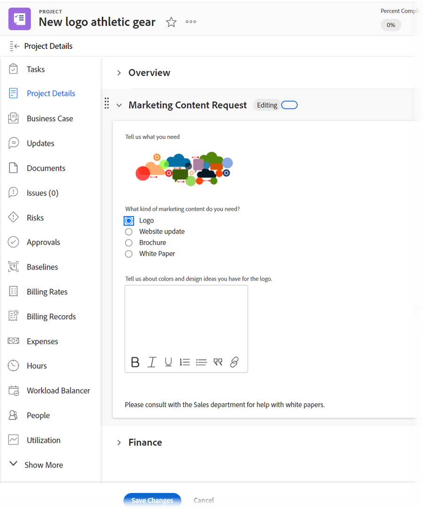
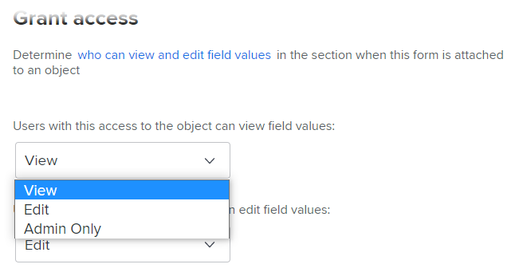

# 自定义表单增强功能

22.2版本中对管理自定义表单进行了以下重要增强。

## 添加资产小组件

您可以在自定义表单中嵌入图像。 这允许您以更具交互性和可视性的方式与自定义表单用户通信。 即将推出其他构件类型。


将包含小部件的自定义表单附加到对象后，使用该对象的用户可以在以下区域看到该表单：

* 对象的“详细信息”区域（例如，对于项目，“项目详细信息”区域）&#x200B;。

  

* 对象的“编辑”框(如果它具有新的Adobe Workfront Experience外观)（例如，“编辑项目”和“编辑任务”框）&#x200B;。

  

目前，用户无法在以下区域中看到构件：&#x200B;

* 列表和报告
* 主页和摘要
* 对象的编辑框(如果它没有新的Adobe Workfront Experience外观)（例如，编辑费用框）
* Workfront&#x200B;移动设备应用程序

## 将自定义表单与多个对象类型关联

您可以将多个对象类型与任何新的自定义表单关联：


或任何现有的自定义表单：


这允许您创建单个自定义表单，用于项目、任务、问题以及自定义表单支持的任何其他类型的对象。

在转换问题或任务时，这尤其有用，因为您可以将自定义表单及其数据传递到转换的对象。 您不再需要为各种对象类型创建和维护同一自定义表单的精确副本，请手动将自定义表单添加到项目中。

>[!INFO]
>
>**示例：**
>
>某人提交了一个内部IT请求（问题），并提供了有关附加自定义表单中所需内容的详细信息。
>
>您将问题转换为将处理该问题的用户的项目。
>
>由于包含提交者详细信息的自定义表单与问题和项目对象类型都相关联，因此自定义表单和所有这些详细信息在转换期间都会转移到项目中。

>[!NOTE]
>
>转换后，自定义表单必须已经与要转换到的对象类型关联。

创建或编辑多对象自定义表单时，请考虑以下事项：

* [分区界限的权限选项](#permission-options-for-section-breaks)
* [计算的自定义字段兼容性](#calculated-custom-field-compatibility)
* [从自定义表单中删除对象类型时请小心](#caution-about-deleting-an-object-type-from-a-custom-form)

### 分区界限的权限选项

“问题”、“任务”、“项目”和“用户”对象类型可用的分区界限权限选项集比所有其他对象类型的权限选项集具有更多的权限选项：“受限编辑”。


可用于所有其他对象类型(“Portfolio”、“文档”、“项目群”、“费用”、“公司”、“开发周期”、“记帐记录”和“组”)的一组分区界限权限不包括“有限编辑”：



在与来自这两个组的对象类型相关联的自定义表单中，系统使用一组适用于所有对象类型的通用分区界限权限。 特别是，此公用集代替了“有限编辑”权限选项的“编辑”权限选项，而不是使用“有限编辑”权限选项。 “编辑”选项与所有对象类型兼容。

当您关联使用权限选项不同于自定义表单上现有其他对象类型的对象类型时，将会显示一条消息，允许您切换到用于表单的通用权限选项集。 此更改将应用于所有字段，即使它们不在分区界限下。

### 计算的自定义字段兼容性

在多对象自定义表单中，如果计算字段引用了可用于表单的所有关联对象类型（例如{name}、{description}和{entryDate}，它们可用于多个对象类型）的字段，则无论您将数据附加到哪个对象，数据都会正确计算。

例如，如果您有一个用于项目和问题的多对象表单，并且您添加了一个包含{name}表达式的计算字段，那么当您将表单添加到项目时，该字段将显示项目名称，而您将此表单添加到任务的任务名称。

与对象不兼容的字段在表单上将显示不适用。

>[!INFO]
>
>**示例：**&#x200B;在与Task对象类型关联的自定义表单中，您创建一个计算自定义字段，该字段引用内置字段“分配给：姓名”，这样当表单附加到任务时，它就可以显示负责的主要分配人的姓名：
>
>```
>Assigned To: Name{assignedTo}.{name}
>```
>
>稍后，将Project对象类型添加到自定义表单。 出现一条警告消息，指明Project对象类型与计算的自定义字段不兼容。 这是因为“分派至”字段不适用于项目。

发生这种情况时，您可以执行以下操作之一：

* 从自定义表单中删除两个不兼容项目之一 — 对象类型或引用的字段。
* 保留这两个项目，并将通配符筛选器变量`$$OBJCODE`用作IF表达式中的条件，以创建两个不同版本的In Charge字段。 这允许字段成功运行，无论表单附加到哪种类型的对象。

  使用上面的示例，尽管项目没有内置的“分配给：姓名”字段，但有一个内置的“所有者”字段（该字段自动填充项目创建者的姓名，除非有人手动更改此名称）。 因此，在您的自定义负责字段中，当自定义表单附加到项目时，您可以使用如下所示的`$$OBJCODE`来引用“所有者”字段，当表单附加到任务时，使用“分配给：姓名”字段：

  ```
  IF($$OBJCODE="PROJ",{owner}.{name},{assignedTo}.{name})
  ```

>[!NOTE]
>
>  如果在字段名称前添加对象类型，它将引用对象的父对象，因此您无法将`{project}.{name}`用于项目，但可以将其用于任务。


有关`$$OBJCODE`等变量的详细信息，请参阅[通配符筛选器变量概述](/help/quicksilver/reports-and-dashboards/reports/reporting-elements/understand-wildcard-filter-variables.md)。

### 从自定义表单中删除对象类型时请小心

您可以随时删除自定义表单上的对象类型，但应谨慎执行此操作。 如果用户已经将自定义表单附加到要删除的对象类型，并向其添加数据，则在删除表单上的该对象类型时，将会永久删除这些数据。

此外，没有通知系统来提醒使用自定义表单的人该表单已被删除。

有关详细信息，请参阅[从系统中删除自定义字段或构件](/help/quicksilver/administration-and-setup/customize-workfront/create-manage-custom-forms/delete-a-custom-field.md)。
