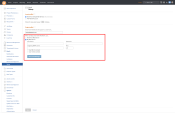

# 删除自定义SMTP作为外发电子邮件选项

在20.3版本（定于2020年8月发布）中，Adobe Workfront正在转为使用新的电子邮件系统，该系统将大大提高您电子邮件投放在Workfront更新和通知方面的可靠性。 因此，客户将无法再使用自己的SMTP电子邮件服务器将其电子邮件从Workfront平台中继到目标收件人。 所有电子邮件都将直接从Workfront Mail Server发送。

通过以系统管理员身份登录并导航到设置>电子邮件>设置，可访问此功能。 以下是突出显示该功能的屏幕截图：

此屏幕截图中突出显示的设置将自动过渡到在20.3版本中使用Workfront Mail Server选项。

如果已配置自定义SMTP邮件服务器， **我们强烈建议您联系IT团队** 以确保系统中传入电子邮件不会阻止来自notifications@my.workfront.com的电子邮件。 您还可以参考配置防火墙以获取有关流量和电子邮件来自哪些IP地址的详细信息。

如果您有任何其他问题或疑虑，请联系 [Workfront支持团队](https://one.workfront.com/s/support?language=en_US).
