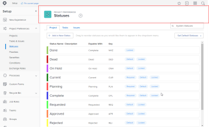

# 21.2管理员增强功能

本页介绍了在21.2版本中对“预览”环境所做的所有管理员增强。 这些增强功能将在2021年5月10日这一周的“生产”环境中提供。 有关21.2版本的所有可用更改列表，请参阅[21.2版本概述](../../../product-announcements/product-releases/21.2-release-activity/21-2-release-overview.md)。

## 对于管理员：查看有关Workfront中更多区域的审核日志信息

在审核日志区域，您现在可以跟踪Workfront中多个区域的更改并进行故障排除。 现在，当用户执行以下任一操作时，系统会生成审核日志条目：

* 创建、更改、删除或共享自定义表单
* 创建、更改、删除或共享自定义字段
* 创建、更改或删除自定义分区
* 创建、更改或删除汇率
* 创建、更改或删除工作角色
* 创建、更改或删除优先级
* 创建、更改或删除严重程度
* 创建、更改或删除条件
* 更改项目偏好设置或者创建或删除自定义季度
* 更改任务和问题偏好设置

有关详细信息，请参阅[审核日志](../../../administration-and-setup/add-users/create-and-manage-users/audit-logs.md)。

此功能现已包含在新Workfront Experience的[管理员基础知识部分，第2部分：项目设置](https://experienceleague.adobe.com/en/docs/workfront-learn/tutorials-workfront/home) Workfront One学习路径中。

## 对于组管理员：改进了移动子组的控件并更新了工具栏

>[!NOTE]
>
>仅在新的Adobe Workfront Experience中可用。

我们已在“设置”的“子组”区域中进行以下改进。

* 为了让您快速重组所管理的组，我们添加了一个“添加子组”工具栏按钮，通过它可创建新子组并移动现有子组。

  有关详细信息，请参阅[管理子组](../../../administration-and-setup/manage-groups/create-and-manage-subgroups/manage-subgroups.md)。

* 现在，子组区域中的工具栏使列表与新Workfront Experience中的其他现代化列表一致。 选择组时，图标表示工具栏中的可用功能。

## 管理员的新增功能：更新了“时间表和小时首选项”页面上的外观

为了改善“时间表和小时首选项”页面上的体验，我们更新了用户界面，以匹配Workfront其他位置更现代的外观和风格。

节和单个选项更容易阅读，因为它们用更垂直的空格分隔。

2个单选按钮选项的标签被拆分，因此它们不会太长 — 现在，每个标签的第二部分都是单独行上的信息消息。

有关时间表和小时首选项的信息，请参阅[配置时间表和小时首选项](../../../administration-and-setup/set-up-workfront/configure-timesheets-schedules/timesheet-and-hour-preferences.md)。

## 对于组管理员：“组”区域中的列表改进

>[!NOTE]
>
>仅在新的Adobe Workfront Experience中可用。

在“设置”中的“组”区域进行了两项改进，即编排列表与新Workfront Experience中其他现代化列表一致：

* 选择组时，图标表示工具栏中的可用功能。
* 在组列表中，列、排序和层次结构具有您在其他列表中惯用的新外观。 此外，默认情况下，列表在单个页面上最多显示2,000个项目，而不是100个。

有关整个Workfront中现代化列表的信息，请参阅[修改列表的显示方式](../../../workfront-basics/navigate-workfront/use-lists/modify-list-display.md)。

有关组区域的信息，请参阅[管理组](../../../administration-and-setup/manage-groups/manage-groups.md)。

## 对于组管理员：从设置中的组区域创建和编辑程序

>[!NOTE]
>
>仅在新的Adobe Workfront Experience中可用。

我们将继续让您更轻松地在一个位置管理您的组及其关联的对象。 现在，您可以从“设置”的“组”区域查看和使用组的程序。 这样，您就不必转至“程序”区域来管理组的程序。 它会将您正在使用的组程序列表与系统中的其他程序分开。

有关详细信息，请参阅[创建、修改和查看组的程序](../../../administration-and-setup/manage-groups/work-with-group-objects/create-and-modify-a-groups-programs.md)。

## 对于管理员：在设置区域中刷新了标头

>[!NOTE]
>
>仅在新的Adobe Workfront Experience中可用。

为了更好地指导管理员如何在设置区域并维护Adobe Workfront的一致性，我们更新了设置标头，以包含以下内容：

* 一个大型彩色徽章，标记每个设置页面和子页面
* 每个子页面名称上方的层次结构信息（例如，在单个组的页面上）
* 现代化的字体样式和大小

  

有关设置区域的详细信息，请参阅[管理和设置](../../../administration-and-setup/administration-and-setup.md)。

## 对于组管理员：从“组”页面查看和管理更多组对象

>[!NOTE]
>
>此功能仅在新的Adobe Workfront Experience中可用

我们将继续让您更轻松地在一个位置管理您的组及其关联的对象。 现在，您可以在“设置”的“组”区域中查看和使用组的公司、团队和项目组合。 这样，您就不必转至这些对象的各种“设置”页面，即可为您的组管理这些对象。 它会将您正在查看的组对象列表与系统中其他组的对象列表分开。

有关更多信息，请参阅以下文章：

* [创建和修改组的公司](../../../administration-and-setup/manage-groups/work-with-group-objects/create-and-modify-a-groups-companies.md)
* [创建和修改组的项目](../../../administration-and-setup/manage-groups/work-with-group-objects/create-and-modify-a-groups-portfolios.md)
* [创建和修改组的团队](../../../administration-and-setup/manage-groups/work-with-group-objects/create-and-modify-a-groups-teams.md)

## 组管理员的新增功能：分配组时间表配置文件

现在，可以更轻松地为您管理的组管理时间表配置文件。 您不仅可以创建时间表配置文件，还可以将其分配给您的组或您的组中的单个成员。 即使在访问级别未启用时间表和小时选项时也是如此。

在此之前，需要启用时间表和小时选项才能分配时间表配置文件。 但这可能不是每个组管理员的理想选择，因为它授予查看和编辑系统中所有时间表和小时信息的权限。 如果您不需要此级别的访问权限，现在您可以管理组的时间表配置信息。

有关详细信息，请参阅[创建、编辑和分配时间表配置文件](../../../timesheets/create-and-manage-timesheets/create-timesheet-profiles.md)。

有关访问级别中的时间表和小时选项的信息，请参阅[授予用户对特定区域的管理访问权限](../../../administration-and-setup/add-users/configure-and-grant-access/grant-users-admin-access-certain-areas.md)。

## 对于管理员：设置用户在对象列表中看到的筛选器、视图和分组

使用新Workfront Experience中的布局模板，您现在可以设置用户在整个Workfront的对象列表中看到的默认筛选器、视图和分组。

例如，您可以将其更改为“我的主团队”，而不是将“筛选器”列表控件保留设置为“全部”。 这样，无论用户何时查看对象列表，该列表都只包括与用户团队关联的对象。

以前，无法自定义这些默认值，因此对于筛选器，它们始终设置为“全部”；对于视图，它们设置为“标准”；对于分组，它们设置为“无”。 新功能的一个额外好处是，如果用户不需要这三个设置，可以向用户隐藏它们。

有关详细信息，请参阅[使用布局模板自定义筛选器、视图和分组](../../../administration-and-setup/customize-workfront/use-layout-templates/customize-fvg-list-controls-layout-template.md)。

此功能现已包含在Workfront One上的新Workfront Experience第3部分：控制和界面体验](https://experienceleague.adobe.com/en/docs/workfront-learn/tutorials-workfront/home)学习路径的[管理员基础知识中。

## 管理员的新增功能：轻松列出当前使用自定义字段的报告

>[!NOTE]
>
>此功能已于2021年3月4日发布到生产环境。

当您需要编辑或删除可能已在一些Adobe Workfront报表中实施的自定义字段时，请务必评估这些报表是否需要调整，以便在您做出更改后继续正常工作。

您可以在自定义Forms区域中添加自定义视图，新增显示哪些报表正在使用特定自定义字段的报表列。

以前，如果没有此列，您必须使用文本模式手动创建报告，或者使用其他解决方法来查找报告中使用了哪些自定义字段。 如果贵组织使用许多自定义字段，则此操作会既困难又繁琐。

有关详细信息，[查看使用特定自定义字段或小部件的所有报告](../../../administration-and-setup/customize-workfront/create-manage-custom-forms/view-all-reports-that-use-a-particular-custom-field.md)。

## 对于组管理员：在一个位置查看和管理组及其对象

>[!NOTE]
>
>此功能仅在新的Adobe Workfront Experience中可用

现在，当您在“设置”的“组”区域中查看组时，可以更轻松地管理组。 新的更多菜单可让您快速编辑、复制或删除组，而无需返回组页面。 有关详细信息，请参阅[管理组](../../../administration-and-setup/manage-groups/create-and-manage-groups/manage-a-group.md)。

此外，您还可以从组的页面查看和使用组的布局模板、计划、时间表配置文件和子组成员。 这样，您就不必转至这些对象的各种“设置”页面，即可为您的组管理这些对象。 它使您的组对象列表与系统中其他组的对象列表分开。

有关更多信息，请参阅以下文章：

* [创建和修改组的布局模板](../../../administration-and-setup/manage-groups/work-with-group-objects/create-and-modify-a-groups-layout-templates.md)
* [创建和修改组的计划](../../../administration-and-setup/manage-groups/work-with-group-objects/create-and-modify-a-groups-schedules.md)
* [创建和管理组的时间表配置文件](../../../administration-and-setup/manage-groups/work-with-group-objects/create-and-modify-a-groups-timesheet-profiles.md)
* [查看和管理子组成员](../../../administration-and-setup/manage-groups/create-and-manage-subgroups/view-and-manage-subgroup-members.md)

## 管理员的新增功能：自定义表单字段中提供了更多文本格式选项

当用户键入允许设置格式的自定义表单字段时，除了粗体、斜体和下划线外，他们现在还可以使用项目符号、编号、超链接和块引号来组织文本。

