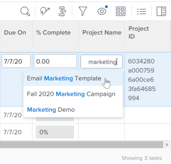

# 21. 2个报表增强功能

本页介绍了21.2版本对“预览”环境所做的所有报表增强。 这些增强功能将在2021年5月10日这一周的“生产”环境中提供。 有关21.2版本的所有可用更改列表，请参阅[21.2版本概述](../../../product-announcements/product-releases/21.2-release-activity/21-2-release-overview.md)。

## 限制在项目和报告中编辑小时

为了在项目和小时报表的“小时”选项卡上提供对小时编辑的更多控制，我们添加了一个设置，允许Workfront管理员将小时编辑限制为小时所有者和系统管理员。

以前，在访问级别中启用时间表和小时数的用户可以编辑小时数。

有关详细信息，请参阅[配置工时表和小时首选项](../../../administration-and-setup/set-up-workfront/configure-timesheets-schedules/timesheet-and-hour-preferences.md)。

## 更新列表和报告中“工作总揽”字段的新外观

>[!NOTE]
>
>此功能仅在新的Adobe Workfront Experience中可用。

为了与新Workfront Experience中其他区域的现代外观匹配，已更改更新列表和报告中“工作总揽”字段的样式。 此重新设计包括：

* 用户个人资料图片、工作角色和团队的圆形头像
* 没有配置文件图片的用户的首字母显示
* 新建工作角色图标
* 高级工作分配的新“人员”图标
* 新的“受限访问”图标
* 其他次要设计更改

有关列表中分配的更多信息，请参阅[分配任务](../../../manage-work/tasks/assign-tasks/assign-tasks.md)或[分配问题](../../../manage-work/issues/manage-issues/assign-issues.md)。

## 更新列表和报告中的预输入字段的新外观

>[!NOTE]
>
>2021年5月20日从生产环境中临时删除。

>[!NOTE]
>
>此功能仅在新的Adobe Workfront Experience中可用。

为了与新Workfront Experience中其他区域的现代外观匹配，已更改更新列表和报告中的预输入字段的样式。 这些更改包括：

* 已从字段中移除预输入图标。
* 现在，当您单击预输入字段时，建议菜单会在您输入文本之前显示。
* 建议菜单对值的长度更有响应，现在，当满足字符限制时，这些值会在末尾被截断，而不是在值中间被截断。

有关更新的列表的信息，请参阅文章[Adobe Workfront中的列表入门](../../../workfront-basics/navigate-workfront/use-lists/view-items-in-a-list.md)中的[更新列表与旧列表之间的差异](../../../workfront-basics/navigate-workfront/use-lists/view-items-in-a-list.md#updated)部分。

## 系统更新报告

新的日志条目报表允许您深入查看系统更新，从而为您提供了更好的可审核性，包括：

* 项目、任务或问题的状态更改
* 已删除的任务或问题
* 自定义字段中的值
* 计划完成日期
* 项目所有者更改

例如，您可以设置此报告显示特定自定义字段周围的活动，包括自定义字段的项目、首次输入值时、该值是什么、字段更新时、以前的值是什么、新输入的值是什么、哪些用户完成了这些操作等。

以前，您只能通过Workfront API报告系统更新。

要了解有关此报告及其用途的更多信息，请参阅[日志条目报告更新区域](../../../reports-and-dashboards/reports/creating-and-managing-reports/create-journal-entry-report.md)。

