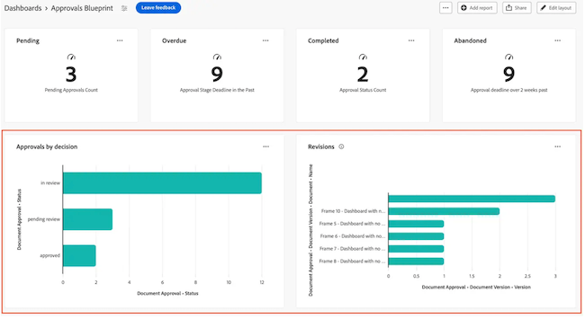

# 构建图表报告

>[!IMPORTANT]
>
>画布功能板目前仅适用于参与Beta测试阶段的用户。 有关详细信息，请参阅[画布功能板测试版信息](/help/quicksilver/product-announcements/betas/canvas-dashboards-beta/canvas-dashboards-beta-information.md)。

您可以构建图表报表并将其添加到画布功能板，以条形、柱形、折线图或饼形图形式显示您的数据。

+++ 展开以查看访问要求。

<table style="table-layout:auto"> 
<col> 
</col> 
<col> 
</col> 
<tbody> 
<tr> 
   <td role="rowheader">
Adobe Workfront计划
</td> 
   <td> 

任何 
 
   </td> 
<tr> 
 <tr> 
   <td role="rowheader">
Adobe Workfront许可证
</td> 
   <td> 

当前：计划 
 

新增：标准
 
   </td> 
   </tr> 
  </tr> 
  <tr> 
   <td role="rowheader">
访问级别配置
</td> 
   <td>
编辑对报告、功能板和日历的访问权限

  </td> 
  </tr>  
</tbody> 
</table>

有关此表中信息的更多详细信息，请参阅Workfront文档中的[访问要求](/help/quicksilver/administration-and-setup/add-users/access-levels-and-object-permissions/access-level-requirements-in-documentation.md)。
+++

## 先决条件

必须先创建功能板，然后才能构建图表报表。

## 在画布功能板中构建图表报告

有许多配置选项可用于构建图表报告。 在本节中，我们将引导您完成创建规则库的常规过程。

{{step1-to-dashboards}}

1. 在左侧面板中，单击&#x200B;**画布功能板**。

1. 单击右上角的&#x200B;**新建仪表板**。

1. 在&#x200B;**创建仪表板**&#x200B;框中，输入仪表板的&#x200B;**名称**&#x200B;和&#x200B;**描述**。

1. 单击&#x200B;**创建**。

1. 在&#x200B;**添加报告**&#x200B;框中，选择&#x200B;**创建报告**。

1. 在左侧，选择&#x200B;**图表**。

1. 单击右上角的&#x200B;**创建报告**。

1. （可选）请按照以下步骤配置&#x200B;**详细信息**&#x200B;部分：

   1. 输入报告&#x200B;**名称**。

   1. 输入报告&#x200B;**描述**。

   1. 如果需要，请取消选中&#x200B;**将额外的系列显示为“其他”**&#x200B;框。

      >[!NOTE]
      >
      >图表中可以显示的系列数已达到上限。 选中此框后，任何超出限制的系列都将合并到图表中的&#x200B;**其他**&#x200B;分组中。

1. 按照以下步骤配置&#x200B;**生成图表**&#x200B;部分：

   1. 在左侧面板中，单击&#x200B;**生成图表** 图标。

   1. 在&#x200B;**图表类型**&#x200B;下拉列表中，选择要创建的图表类型：

      * **栏**
      * **列**
      * **行**
      * **饼图**

   1. 在&#x200B;**列类型**&#x200B;下拉列表中，选择列类型：
      * **简单**
      * **多系列**
      * **栈叠**

   1. 在第一部分中选择&#x200B;**更新字段**&#x200B;按钮，然后查找并选择包含将在图表中汇总的数据的字段。
   1. 在&#x200B;**聚合类型**&#x200B;下拉列表中，选择数据如何汇总以生成图表输出。

   1. 选择第二部分下的&#x200B;**更新字段**&#x200B;按钮，然后查找并选择要在图表中显示的第二个字段。

1. 按照以下步骤配置&#x200B;**筛选器**&#x200B;部分：

   1. 在左侧面板中，单击&#x200B;**筛选器**图标。
   1. 选择&#x200B;**编辑筛选器**。
   1. 单击&#x200B;**添加条件**，然后指定要作为筛选依据的字段以及定义该字段必须符合何种条件的修饰符。
   1. （可选）单击&#x200B;**添加筛选器组**&#x200B;以添加另一组筛选条件。 集合之间的缺省运算符是AND。 单击运算符以将其更改为OR。

1. 按照以下步骤配置&#x200B;**明细列设置**&#x200B;部分：

   1. 在左侧面板中，单击&#x200B;**向下钻取列** 图标。 图表中的字段会自动显示为右侧预览部分中的列。

   1. （可选）要更新任何现有的列配置，请在&#x200B;**当前列**&#x200B;部分中选择要更新的列，然后更新所需的信息（例如，标签、链接状态和条件）。

   1. 单击&#x200B;**添加列**，然后选择要显示为表中列的字段。 对要添加的每个列重复此过程。

1. 按照以下步骤配置&#x200B;**深入分析组设置**&#x200B;部分：

   1. 在左侧面板中，单击&#x200B;**群组设置** 图标。

   1. 单击&#x200B;**添加分组**&#x200B;按钮，然后选择要创建为分组的字段。

1. 单击&#x200B;**保存**&#x200B;以创建报告并将其添加到仪表板。

## 构建图表报告示例

在此部分中，我们将介绍相关步骤，以创建按项目所有者显示过期任务的柱状图。

{{step1-to-dashboards}}

1. 在左侧面板中，单击&#x200B;**画布功能板**。

1. 单击右上角的&#x200B;**新建仪表板**。

1. 在&#x200B;**创建仪表板**&#x200B;框中，输入仪表板的&#x200B;**名称**&#x200B;和&#x200B;**描述**。

1. 单击&#x200B;**创建**。

1. 在&#x200B;**添加报告**&#x200B;框中，选择&#x200B;**创建报告**。

1. 在左侧，选择&#x200B;**图表**。

1. 单击右上角的&#x200B;**创建报告**。

1. 按照以下步骤配置&#x200B;**详细信息**&#x200B;部分：

   1. 输入报告&#x200B;**名称**（例如&#x200B;*项目所有者的过期任务*）。

   1. 输入报告&#x200B;**描述**。

1. 按照以下步骤配置&#x200B;**生成图表**&#x200B;部分：

   1. 在左侧面板中，单击&#x200B;**生成图表**&#x200B;图标。

   1. 在&#x200B;**图表类型**&#x200B;下拉列表中，选择&#x200B;**列**。

   1. 在&#x200B;**列类型**&#x200B;下拉列表中，选择&#x200B;**简单**。

   1. 选择&#x200B;**底部(X)轴**&#x200B;部分下的&#x200B;**更新字段**&#x200B;按钮，然后找到并选择&#x200B;**任务** > **项目** > **所有者** > **名称**&#x200B;字段。

      

   1. 单击&#x200B;**左(Y)轴**&#x200B;部分下的&#x200B;**选择字段**&#x200B;按钮，然后找到并选择&#x200B;**任务** > **名称**&#x200B;字段。

   1. 在&#x200B;**聚合类型**&#x200B;下拉列表中，选择&#x200B;**计数**。

      

1. 按照以下步骤配置&#x200B;**筛选器**&#x200B;部分：

   1. 在左侧面板中，单击&#x200B;**筛选器**&#x200B;图标。

   1. 选择&#x200B;**编辑筛选器**。

   1. 单击&#x200B;**添加条件**。

   1. 单击空条件区域，然后选择&#x200B;**选择字段**。

   1. 选择&#x200B;**完成百分比**&#x200B;字段。

   1. 在&#x200B;**运算符**&#x200B;下拉列表中，选择&#x200B;**小于**，然后在计算器字段中输入&#x200B;*100*。

   1. 单击&#x200B;**添加条件**，然后单击&#x200B;**选取字段**。

   1. 选择&#x200B;**计划完成日期**&#x200B;字段。

   1. 在&#x200B;**运算符**&#x200B;下拉列表中，选择&#x200B;**小于**。

   1. 将&#x200B;**设置相对日期**&#x200B;切换为&#x200B;**ON**。

   1. 在求值器字段中输入&#x200B;*$$TODAY*。

      

1. 按照以下步骤配置&#x200B;**明细列设置**&#x200B;部分：

   1. 在左侧面板中，单击&#x200B;**向下钻取列** 图标。 图表中的字段会自动显示为右侧预览部分中的列。

   1. 单击&#x200B;**添加列**，然后选择&#x200B;**分配给** > **名称**&#x200B;字段。

   1. 单击&#x200B;**添加列**，然后选择&#x200B;**计划开始日期**&#x200B;字段。

   1. 单击&#x200B;**添加列**，然后选择&#x200B;**规划完成日期**&#x200B;字段。

   1. 单击&#x200B;**添加列**，然后选择&#x200B;**上次更新日期**&#x200B;字段。

   1. （可选）要显示更新时间，请在&#x200B;**当前列**&#x200B;字段中选择&#x200B;**上次更新日期**&#x200B;选项，然后在&#x200B;**日期格式**&#x200B;下拉列表中选择时间值选项。

1. 按照以下步骤配置&#x200B;**深入分析组设置**&#x200B;部分：

   1. 在左侧面板中，单击&#x200B;**群组设置** 图标。

   1. 单击&#x200B;**添加分组**&#x200B;按钮，然后选择&#x200B;**项目** > **名称**&#x200B;字段。

1. 单击&#x200B;**保存**&#x200B;以创建报告并将其添加到仪表板。