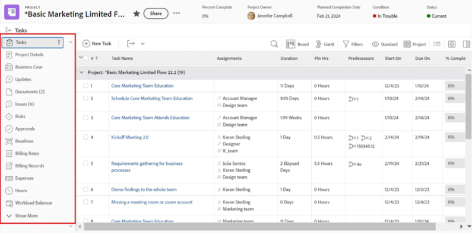

# 将画布功能板添加到布局模板

>[!IMPORTANT]
>
>画布功能板目前仅适用于参与Beta测试阶段的用户。 在此阶段，部分功能可能无法完成或无法按预期工作。 请按照“画布功能板测试版”概述文章中[提供反馈](/help/quicksilver/product-announcements/betas/canvas-dashboards-beta/canvas-dashboards-beta-information.md#provide-feedback)部分的说明提交任何有关您体验的反馈。 
>&#x200B;>请注意，以下云提供商未提供此测试版：
>
>* 自带Amazon Web Services密钥
>* Azure
>* Google Cloud Platform

您可以将画布功能板添加到布局模板，以便该功能板替换主页登陆页面、出现在对象的左侧面板中，或者固定到整个Adobe Workfront的顶部栏中。

## 访问要求

+++ 展开以查看访问要求。 

<table style="table-layout:auto"> 
<col> 
</col> 
<col> 
</col> 
<tbody> 
<tr> 
   <td role="rowheader">
Adobe Workfront计划
</td> 
   <td> 

任何 
 
   </td> 
<tr> 
 <tr> 
   <td role="rowheader">
Adobe Workfront许可证
</td> 
   <td> 

当前：计划 
 

新增：标准
 
   </td> 
   </tr> 
  </tr> 
  <tr> 
   <td role="rowheader">
访问级别配置
</td> 
   <td>
编辑对报告、功能板和日历的访问权限

  </td> 
  </tr> 
    </tr>  
        <tr> 
   <td role="rowheader">
对象权限
</td> 
   <td>
管理仪表板的权限

  </td> 
  </tr> 
</tbody> 
</table>

有关此表中信息的更多详细信息，请参阅Workfront文档中的[访问要求](/help/quicksilver/administration-and-setup/add-users/access-levels-and-object-permissions/access-level-requirements-in-documentation.md)。
+++

## 向左侧面板添加画布功能板

{{step-1-to-setup}}

1. 在左侧面板中，选择&#x200B;**界面**，然后选择&#x200B;**布局模板**。

1. 在&#x200B;**布局模板**&#x200B;页面上，选择一个模板。

1. 在“模板详细信息”页面的&#x200B;**自定义用户看到的内容**&#x200B;下拉列表中，选择要将仪表板添加到的对象。

   

1. 向下滚动到&#x200B;**左侧面板**&#x200B;部分的底部，然后单击&#x200B;**添加仪表板**。

1. 在&#x200B;**添加自定义仪表板**&#x200B;框中，输入&#x200B;**快速链接**&#x200B;名称。

1. 在&#x200B;**选择仪表板**&#x200B;下拉列表中，选择&#x200B;**画布仪表板**。

1. 在&#x200B;**选择仪表板**&#x200B;右侧的下拉菜单中，选择要添加到左侧面板的画布仪表板。

1. 单击&#x200B;**添加**。 仪表板显示在左侧面板部分。

1. 单击&#x200B;**保存**。

   >[!NOTE]
   >
   >放置到工作对象(如项目、任务、问题、Portfolio或项目群)上时，每个报表中显示的结果将限制为该对象中可用的记录。

## 将画布功能板添加到顶部栏

{{step-1-to-setup}}

1. 在左侧面板中，选择&#x200B;**界面**，然后选择&#x200B;**布局模板**。

1. 在&#x200B;**布局模板**&#x200B;页面上，选择一个模板。

1. 在&#x200B;**顶部导航区域**&#x200B;部分中，单击&#x200B;**添加新pin**，然后在下拉列表中选择&#x200B;**添加仪表板**。

1. 在&#x200B;**固定页面**&#x200B;框中，输入&#x200B;**快速链接名称**。

1. 在&#x200B;**选择仪表板**&#x200B;下拉列表中，选择&#x200B;**画布仪表板**。

1. 在&#x200B;**选择仪表板**&#x200B;右侧的下拉菜单中，选择要添加到顶部栏的画布仪表板。

1. 单击&#x200B;**添加**。 操控板显示在顶部栏中。

1. 单击&#x200B;**保存**。

## 添加画布仪表板作为主页登陆页面

{{step-1-to-setup}}

1. 在左侧面板中，选择&#x200B;**界面**，然后选择&#x200B;**布局模板**。

1. 在&#x200B;**布局模板**&#x200B;页面上，选择一个模板。

1. 在&#x200B;**顶部导航区域**&#x200B;部分中，单击&#x200B;**选择登陆页面**，然后在下拉列表中选择&#x200B;**添加仪表板**。

1. 在&#x200B;**添加自定义仪表板**&#x200B;框中，输入&#x200B;**快速链接名称**。

1. 在&#x200B;**选择仪表板**&#x200B;下拉列表中，选择&#x200B;**画布仪表板**。

1. 在&#x200B;**选择仪表板**&#x200B;右侧的下拉列表中，选择要添加为主页登陆页面的画布仪表板。

1. 单击&#x200B;**添加**。

1. 单击&#x200B;**保存**。
