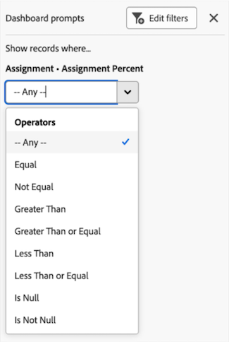

# 筛选画布功能板

>[!IMPORTANT]
>
>画布功能板目前仅适用于参与Beta测试阶段的用户。 在此阶段，部分功能可能无法完成或无法按预期工作。 请按照“画布功能板测试版”概述文章中[提供反馈](/help/quicksilver/product-announcements/betas/canvas-dashboards-beta/canvas-dashboards-beta-information.md#provide-feedback)部分的说明提交任何有关您体验的反馈。 
>&#x200B;>如果您对可能的错误或技术问题有反馈，请向Workfront支持提交票证。 有关详细信息，请参阅[联系客户支持](/help/quicksilver/workfront-basics/tips-tricks-and-troubleshooting/contact-customer-support.md)。 
>&#x200B;>请注意，以下云提供商未提供此测试版：
>
>* 自带Amazon Web Services密钥
>* Azure
>* Google Cloud Platform

您可以将过滤器应用到包含提示的画布功能板。 提示可充当过滤器修饰符，用于应用附加过滤条件，以便进一步缩小结果的范围。 每次应用过滤器时都可以修改这些提示，使您能够调整显示的结果，而无需编辑仪表板或每个单独报告的主要过滤条件。

## 访问要求

+++ 展开以查看本文中各项功能的访问要求。 

<table style="table-layout:auto"> 
<col> 
</col> 
<col> 
</col> 
<tbody> 
<tr> 
   <td role="rowheader">
Adobe Workfront包
</td> 
   <td> 

任何 
 
   </td> 
<tr> 
 <tr> 
   <td role="rowheader">
Adobe Workfront许可证
</td> 
   <td> 

标准
 

规划
 
   </td> 
   </tr> 
  </tr> 
  <tr> 
   <td role="rowheader">
访问级别配置
</td> 
   <td>
编辑对报告、功能板和日历的访问权限

  </td> 
  </tr> 
    </tr>  
        <tr> 
   <td role="rowheader">
对象权限
</td> 
   <td>
管理仪表板的权限

  </td> 
  </tr> 
</tbody> 
</table>

有关此表中信息的更多详细信息，请参阅Workfront文档中的[访问要求](/help/quicksilver/administration-and-setup/add-users/access-levels-and-object-permissions/access-level-requirements-in-documentation.md)。
+++

## 先决条件

必须先创建功能板，然后才能对其进行筛选。

有关详细信息，请参阅[创建画布功能板](/help/quicksilver/reports-and-dashboards/canvas-dashboards/create-dashboards/create-dashboards.md)。

## 筛选功能板

请按列出的顺序执行以下步骤，以筛选功能板：

* [第1部分：创建功能板过滤器](#part-1-create-a-dashboard-filter)
* [第2部分：创建仪表板提示](#part-2-define-a-dashboard-prompt)
* [第3部分：应用仪表板提示](#step-3-apply-a-dashboard-prompt)

>[!NOTE]
>
>仪表板过滤器将应用于未禁用仪表板级别过滤器的所有报表。  通过展开每个报表的“操作”菜单并选择&#x200B;**禁用筛选器**&#x200B;选项，可以排除应用了仪表板级别筛选器的单个报表。

### 第1部分：创建功能板过滤器

借助功能板筛选器，您可以对功能板上可用的所有报表应用通用筛选器，而无需修改每个报表的筛选器。

>[!NOTE]
>
>这些过滤器只能由对功能板具有管理访问权限的用户配置。

{{step1-to-dashboards}}

1. 在左侧面板中，单击&#x200B;**画布功能板**。

1. 在&#x200B;**画布功能板**&#x200B;页面上，选择要将过滤器应用到的功能板。

1. 在仪表板详细信息页面的左上角，单击&#x200B;**筛选器**。 将打开过滤器侧面板。

1. 选择&#x200B;**编辑筛选器**。 **仪表板筛选器**&#x200B;对话框打开。

1. （可选）要添加规则，请执行以下步骤：

   1. 选择规则框右侧的&#x200B;**编辑**&#x200B;图标。

      

   1. 单击&#x200B;**添加条件**，然后添加以下信息：
      * 选择一个要作为筛选依据的字段。
      * 选择一个选项（或筛选器修饰符）以定义字段必须满足的条件类型。

   1. （可选）单击&#x200B;**添加筛选器组**&#x200B;以添加另一组筛选条件。 集合之间的缺省运算符是AND。 单击运算符以将其更改为OR。

1. 继续执行[第2部分：创建仪表板提示](#part-2-define-a-dashboard-prompt)。

### 第2部分：定义仪表板提示

功能板提示为用户提供了将其他自定义筛选条件应用于功能板上可用报表的选项。

>[!NOTE]
>
>仪表板提示选项只能由对仪表板具有管理权限的用户配置。

1. 要添加提示，请执行以下步骤：

   1. 选择&#x200B;**添加提示**。 新字段显示在屏幕的右侧。

   1. 在&#x200B;**自定义标签**&#x200B;字段中输入标签。

   1. 通过键入字段名称，然后在提示出现在列表中时将其选中，选择您希望提示所基于的字段。 

1. 要添加自定义提示，请执行以下步骤：

   1. 选择&#x200B;**添加自定义提示**。 新字段显示在屏幕的右侧。

   1. （可选）在&#x200B;**自定义标签**&#x200B;字段中输入新标签。 默认情况下，已分配标签&#x200B;*新建自定义提示*。

   1. 单击&#x200B;**添加新选项**。

   1. 在&#x200B;**选项值**&#x200B;字段中输入提示名称。

   1. 单击&#x200B;**添加条件**，然后指定要作为筛选依据的字段以及定义该字段必须符合何种条件的修饰符。

      >[!NOTE]
      >
      >只能使用文本模式编辑自定义提示的条件。 这允许在单个字段中应用多个条件。

   1. （可选）单击&#x200B;**添加筛选器组**&#x200B;以添加另一组筛选条件。 集合之间的缺省运算符是AND。 单击运算符以将其更改为OR。

1. 单击&#x200B;**保存**&#x200B;以将筛选器应用到仪表板。

1. 继续执行[第3部分：应用仪表板提示](#step-3-apply-a-dashboard-prompt)。

### 步骤3：应用仪表板提示

所有有权访问功能板的用户都可以在创建筛选器和提示后将功能板提示应用于画布功能板。

{{step1-to-dashboards}}

1. 在左侧面板中，单击&#x200B;**画布功能板**。

1. 在&#x200B;**画布功能板**&#x200B;页面上，选择要将提示应用到的功能板。

1. 在仪表板详细信息页面的左上角，单击&#x200B;**筛选器**。 将打开过滤器侧面板。

1. 在&#x200B;**显示记录……**&#x200B;部分中，为显示的一个或多个提示选择条件。 应用了提示，并且在报告小部件的角落显示应用了&#x200B;**功能板筛选器**&#x200B;标记。
   

1. 单击右上角的&#x200B;**关闭**&#x200B;图标以隐藏面板。
