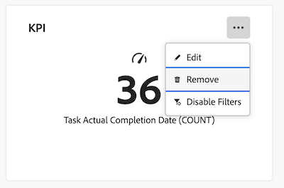

# 删除画布仪表板中的报告

>[!IMPORTANT]
>
>画布功能板目前仅适用于参与Beta测试阶段的用户。 在此阶段，部分功能可能无法完成或无法按预期工作。 请按照“画布功能板测试版”概述文章中[提供反馈](/help/quicksilver/product-announcements/betas/canvas-dashboards-beta/canvas-dashboards-beta-information.md#provide-feedback)部分的说明提交任何有关您体验的反馈。 
>&#x200B;>如果您对可能的错误或技术问题有反馈，请向Workfront支持提交票证。 有关详细信息，请参阅[联系客户支持](/help/quicksilver/workfront-basics/tips-tricks-and-troubleshooting/contact-customer-support.md)。 
>&#x200B;>请注意，以下云提供商未提供此测试版：
>
>* 自带Amazon Web Services密钥
>* Azure
>* Google Cloud Platform

创建画布功能板并将报表添加到其中后，您可以删除不再适用于该特定功能板的旧报表。

删除报告是永久性的。 如果在删除报告后需要重新添加报告，则需要重新创建报告。

## 访问要求

+++ 展开以查看访问要求。 

<table style="table-layout:auto"> 
<col> 
</col> 
<col> 
</col> 
<tbody> 
<tr> 
   <td role="rowheader">
Adobe Workfront计划
</td> 
   <td> 

任何 
 
   </td> 
<tr> 
 <tr> 
   <td role="rowheader">
Adobe Workfront许可证
</td> 
   <td> 

当前：计划 
 

新增：标准
 
   </td> 
   </tr> 
  </tr> 
  <tr> 
   <td role="rowheader">
访问级别配置
</td> 
   <td>
编辑对报告、功能板和日历的访问权限

  </td> 
  </tr>  
      <tr> 
   <td role="rowheader">
对象权限
</td> 
   <td>
管理仪表板的权限

  </td> 
  </tr>
</tbody> 
</table>

有关此表中信息的更多详细信息，请参阅Workfront文档中的[访问要求](/help/quicksilver/administration-and-setup/add-users/access-levels-and-object-permissions/access-level-requirements-in-documentation.md)。
+++

## 先决条件

您必须先将报表应用于仪表板，然后才能将其删除。

有关详细信息，请参阅[创建画布仪表板](/help/quicksilver/reports-and-dashboards/canvas-dashboards/create-dashboards/create-dashboards.md)。

## 删除报告

>[!WARNING]
>
>删除报告后，便无法恢复。 
>&#x200B;>如果您将现有的经典报告添加到画布仪表板，则从仪表板中删除它不会删除原始报告。

{{step1-to-dashboards}}

1. 在左侧面板中，单击&#x200B;**画布功能板**。

1. 在&#x200B;**画布功能板**&#x200B;页面上，选择包含要删除的报告的功能板。

1. 在仪表板详细信息页面上，单击要删除的报告小部件右上角的&#x200B;**更多** 图标。

1. 选择&#x200B;**删除**。
   

1. 在&#x200B;**删除报表**&#x200B;对话框中，单击&#x200B;**删除**。
