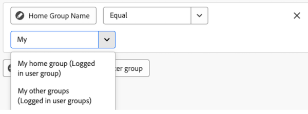

# 在画布功能板中编辑报告过滤器

>[!IMPORTANT]
>
>画布功能板目前仅适用于参与Beta测试阶段的用户。 在此阶段，部分功能可能无法完成或无法按预期工作。 请按照“画布功能板测试版”概述文章中[提供反馈](/help/quicksilver/product-announcements/betas/canvas-dashboards-beta/canvas-dashboards-beta-information.md#provide-feedback)部分的说明提交任何有关您体验的反馈。 
>>请注意，以下云提供商未提供此测试版：
>
>* 自带Amazon Web Services密钥
>* Azure
>* Google Cloud Platform

将报表过滤器应用于画布功能板后，即可编辑这些报表过滤器，以更新随着项目进展而显示的数据。

## 访问要求

+++ 展开以查看访问要求。 

<table style="table-layout:auto"> 
<col> 
</col> 
<col> 
</col> 
<tbody> 
<tr> 
   <td role="rowheader">
Adobe Workfront计划
</td> 
   <td> 

任何 
 
   </td> 
<tr> 
 <tr> 
   <td role="rowheader">
Adobe Workfront许可证
</td> 
   <td> 

当前：计划 
 

新增：标准
 
   </td> 
   </tr> 
  </tr> 
  <tr> 
   <td role="rowheader">
访问级别配置
</td> 
   <td>
编辑对报告、功能板和日历的访问权限

  </td> 
  </tr>  
        <tr> 
   <td role="rowheader">
对象权限
</td> 
   <td>
管理仪表板的权限

  </td> 
  </tr>
</tbody> 
</table>

有关此表中信息的更多详细信息，请参阅Workfront文档中的[访问要求](/help/quicksilver/administration-and-setup/add-users/access-levels-and-object-permissions/access-level-requirements-in-documentation.md)。
+++

## 先决条件

您必须先将过滤器添加到报表，然后才能进行编辑。

## 编辑报告过滤器

>[!NOTE]
>
>有许多可用的配置工具可用于构建和编辑报告过滤器。 有关这些工具的更多信息，请参阅本文中的以下部分：[编辑报表过滤器时的注意事项](#considerations-when-editing-a-report-filter)。

{{step1-to-dashboards}}

1. 在左侧面板中，单击&#x200B;**画布功能板**。

1. 在&#x200B;**画布功能板**&#x200B;页面上，单击包含要编辑的筛选器的报表右上角的&#x200B;**更多** 图标，然后选择&#x200B;**编辑**。

   

1. 在&#x200B;**配置**&#x200B;对话框的左侧，选择&#x200B;**筛选器**&#x200B;面板。

1. 单击&#x200B;**编辑筛选器**。

1. 选择要编辑的字段或修改量，然后根据需要调整当前选择。

   

1. （可选）单击&#x200B;**添加筛选器组**&#x200B;以添加另一组筛选条件。 集合之间的缺省运算符是AND。 单击运算符以将其更改为OR。

1. 单击&#x200B;**保存**。

## 编辑报表过滤器时的注意事项

### 基于日期的通配符筛选变量

基于日期的通配符选项可与任何日期筛选器属性结合使用。 有关向报表中添加基于日期的通配符的信息，请参阅文章[使用基于日期的通配符来泛化报表](../../../reports-and-dashboards/reports/reporting-elements/use-date-based-wildcards-generalize-reports.md)。

>[!NOTE]
>
>如果创建的日期和时间计算不包括时间部分，或者使用日期通配符$$TODAY或$$NOW，则系统将根据协调世界时(UTC)区域使用日期，而不是根据您的本地时区。 这可能会导致意外的日期结果。

您可以从以下基于日期的通配符中进行选择：

<table style="table-layout:auto"> 
 <col> 
 <col> 
 <tbody> 
  <tr valign="top"> 
   <td width="100" role="rowheader"> 
<strong>$$今天</strong> 
 </td> 
   <td> 
我们建议您使用此通配符构建日期敏感型过滤器，以避免在明天、下周或下个月再次构建过滤器。
 
例如，如果要显示今天之前到期的所有任务，可以在任务筛选器中使用以下规则： <em>计划开始日期小于$$TODAY</em>。
 
$$TODAY始终等于当天的午夜。
 </td> 
  </tr> 
  <tr valign="top"> 
   <td width="100" role="rowheader"> 
<strong>$$NOW</strong> 
 </td> 
   <td> 
这与$$TODAY通配符类似，但包含当前日期和时间。 $$NOW等于当前日期和时间。
 
例如，如果您希望显示截至当前时间提供的所有小时条目，则可以在小时过滤器中使用以下规则执行此操作：<em>计划开始日期小于$$NOW</em>。
 
注意：资源规划者不支持此通配符。
 </td> 
  </tr> 
 </tbody> 
</table>

要指示不同的时间段和不同的时间点（将来或过去），您可以将上面的通配符与以下内容结合使用：

| 属性 |   |
|---|---|
| **q** | 日历季度 |
| **小时** | 小时 |
| **天** | 天 |
| **w** | 周 |
| **分钟** | 月 |
| **y** | 年 |

{style="table-layout:auto"}

| **限定符** | |
|---|---|
| **b** | 期间开始（没有指定属性，默认为一周的开始：星期日） |
| **e** | 期间结束（没有指定属性，默认为一周的结束：星期六） |

{style="table-layout:auto"}

| **操作员** | |
|---|---|
| **+** | 向通配符值添加值 |
| **-** | 从通配符值中减去值 |

{style="table-layout:auto"}

例如，通配符`$$TODAYb+2w`引用“从本周开始的2周”。 通配符*`$$NOW+2h`表示“从现在起的2小时”。

### 登录用户通配符筛选器变量

* 筛选用户`name`属性时，您将查看&#x200B;**我（已登录的用户）**&#x200B;选项。

  

* 在筛选组`name`属性时，您将查看要在筛选条件中使用的&#x200B;**我的主组（已登录的用户组）**&#x200B;和&#x200B;**我的其他组（已登录的用户组）**&#x200B;选项。

  

* 在筛选团队`name`属性时，您将查看可在筛选条件中选择的&#x200B;**我的默认团队（已登录的用户团队）**&#x200B;和&#x200B;**我的其他团队（已登录的用户团队）**&#x200B;选项。

  

### 引用子对象

其他列、筛选器选项和分组属性的可用关系通常仅限于Workfront对象层次结构中较高的对象，或者在报表的基本实体对象上具有单个选择。 这种情况有一些例外，其中包括：

* 项目>任务
* 文档审批>文档审批阶段
* 文档审批阶段>文档审批阶段参与者

使用上面列出的任何父子关系时，您将在表中看到连接到父对象的每个子记录的一行。

### 按字段类型划分的字段运算符

+++ 展开以查看按字段类型划分的字段运算符列表。 

<table>
    <tr>
        <td><b>字段类型</b></td>
        <td><b>示例</b></td>
       <td><b>操作员</b></td>
        <td><b>通配符</b></td>
    </tr>
    <tr>
        <td>对象/引用名称</td>
        <td>任何本机名称属性或自定义查找</td>
              <td><ul>
        <li>等于</li>
        <li>不等于</li>
        <li>包含</li>
          <li>不包含</li>
            <li>为空</li>
              <li>不为空</li>
        </ul></td>
        <td>用户：名称
        <ul>
        <li>我（已登录的用户）</li>
        </ul>
        组：名称
        <ul>
          <li>我的家庭组（登录用户组）</li>
            <li>我的其他群组（已登录用户群组）</li>
          </ul>
          团队：名称
                  <ul>
          <li>我的默认团队（登录用户的团队）</li>
            <li>我的其他团队（登录用户的团队）</li>
          </ul>
        </td>
    </tr>
    <tr>
        <td>字符串/文本输入 </td>
                <td>项目：描述</td>
                      <td><ul>
             <li>等于</li>
        <li>不等于</li>
        <li>包含</li>
          <li>不包含</li>
            <li>为空</li>
              <li>不为空</li>
        </ul></td>
        <td></td>
    </tr>
    <tr>
        <td>整数/双精度</td>
             <td>项目：计划小时数
         任务：完成百分比</td>
              <td><ul>
        <li>等于</li>
        <li>不等于</li>
        <li>大于</li>
          <li>大于或等于</li>
          <li>小于</li>
          <li>小于或等于</li>
            <li>为空</li>
              <li>不为空</li>
        </ul></td>
        <td></td>
    </tr>
       <tr>
        <td> 日期/日期时间 </td>
                    <td>项目：计划开始日期
         小时：输入日期</td>
              <td><ul>
        <li>等于</li>
        <li>不等于</li>
        </ul></td>
        <td>通过切换<b>设置相对日期</b>选项，您可以应用相对日期通配符，使报表更动态，并根据常见的日期时段进行自我调整。 
         <ul><li>$$今天</li>
         <li>$$NOW</li>
         </ul>
        </td>
    </tr>
       <tr>
        <td>布尔型 </td>
                  <td>项目：具有文档
         任务：关键
         用户：处于活动状态</td>
        <td><ul>
        <li>等于</li>
        <li>不等于</li>
        </ul></td>
        <td> </td>
    </tr>
   </table>

+++
