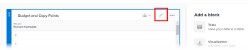

# 在报告画布中添加或编辑表块

表格以可过滤、分组和排序的列的形式显示字段信息。

## 先决条件

在开始之前，您必须注册报告画布测试版。 有关详细信息，请参阅[报告画布测试版：概述](/help/quicksilver/product-announcements/betas/canvas-dashboards-beta/reporting-canvas-beta-overview.md)。

## 添加或编辑表块

1. 单击Adobe Workfront右上角的&#x200B;**主菜单**&#x200B;图标，然后单击&#x200B;**报表**。
1. 单击&#x200B;**新建报告**。

   或

   转到现有报表，单击报表标题中的&#x200B;**更多**&#x200B;图标，然后单击&#x200B;**编辑**。

1. 在屏幕右侧的&#x200B;**添加块**&#x200B;下：

   将&#x200B;**表**&#x200B;图标直接拖到画布上所需的位置。

   或

   双击&#x200B;**表**&#x200B;图标以将表添加到画布顶部。

   >[!TIP]
   >
   >可以通过拖动块拐角手柄来更改块放置后的大小。

1. 在表标题中单击&#x200B;**无标题的表**，然后键入该表的标题。

   

1. 单击表块中心的&#x200B;**编辑**&#x200B;以配置表。

   >[!NOTE]
   >
   >如果表已经是画布的一部分（例如在编辑现有报告时），**编辑**&#x200B;按钮不会显示在块的中央。 要编辑该表，请改为单击表标题中的&#x200B;**编辑**&#x200B;图标。
   >

1. 在右侧的&#x200B;**字段**&#x200B;面板中，找到要作为列添加到表中的字段，然后将其拖动到所需位置，或双击该字段以将其添加为表中的最后一列。

   您可以在&#x200B;**搜索**&#x200B;框中键入文本以按名称查找特定字段。 您还可以使用此框下的两个下拉菜单，将显示的字段列表缩小到以下一项或两项：

   * 与所需字段关联的对象类型，如项目或任务
   * 所需的字段类型，如日期或货币

   对要添加为列的每个字段重复此步骤。

   >[!TIP]
   >
   >可以通过将选定列拖到新位置来更改表中列的顺序。

1. 执行以下任一操作以进一步配置表：

   * **添加公式字段**：单击&#x200B;**字段**&#x200B;列表顶部的&#x200B;**新建+**。 有关创建公式字段的更多说明，请参阅[在报表画布中生成公式字段](../../../reports-and-dashboards/reporting-canvas/table-blocks/create-formula-field.md)。
   * **添加筛选器**：将您希望对表进行筛选的字段拖到表上方的&#x200B;**筛选器**&#x200B;部分。 有关设置筛选规则的更多信息，请参阅[在报告画布中筛选表](../../../reports-and-dashboards/reporting-canvas/table-blocks/configure-filter-rules-for-table.md)。
   * **按特定属性对行进行分组**：将您希望对表进行分组的字段拖到表上方的&#x200B;**组**&#x200B;部分中。 有关创建行组的详细信息，请参阅报表画布中的[组表行](../../../reports-and-dashboards/reporting-canvas/table-blocks/group-rows-in-table.md)。
