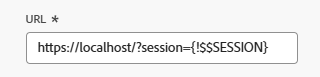
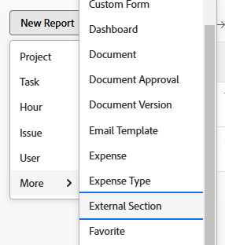

# 在功能板中嵌入外部网页

<!--Audited: 01/2025-->

您可以将外部网页嵌入到功能板中，以提供对其他系统或Adobe Workfront中相关信息的访问。

例如，如果贵组织有一个基于Web的文档存储库、Wiki或其他内容管理系统，其中包含通过URL定期访问的项目信息，则可以通过在功能板上创建外部页面将该信息显示到Workfront中。

>[!IMPORTANT]
>
>* 出于安全原因，某些网站不允许您将网页作为iframe嵌入。 如果要嵌入到仪表板中的网页不允许这样做，则该页面不会显示在仪表板中。 但是，您仍然可以通过单击功能板的名称来访问外部页面。\
>\
>要允许嵌入您拥有的网站，请与Web管理员合作调整&#x200B;**X-Frame-Options**&#x200B;设置。 有关详细信息，请参阅[X-Frame-Options](https://developer.mozilla.org/en-US/docs/Web/HTTP/Headers/X-Frame-Options)。
>
>
>* 仪表板中不再支持将仪表板页面嵌入外部页面。 虽然不会自动修改现有功能板以删除这些外部页面，但在删除或更改引用之前，无法保存对包含此类引用的功能板所做的任何修改。
>  &#x200B;> 具体而言，不再支持以下Workfront.com子域：
>
>     * /&#x200B;功能板
>     * /dashboard/:ID&#x200B;
>     * /portfolio/:ID/content-dashboard__:dashboardID&#x200B;
>     * /program/:ID/content-dashboard__:dashboardID&#x200B;
>     * /project/:ID/content-dashboard__:dashboardID&#x200B;
>     * /task/:ID/content-dashboard__:dashboardID&#x200B;
>     * /template/:ID/content-dashboard__:dashboardID&#x200B;
>     * /templatetask/:ID/content-dashboard__:dashboardID&#x200B;
>     * /resourcemanagement/:ID/
>     * content-dashboard__:dashboardID&#x200B;
>     * /team/:ID/content-dashboard__:dashboardID&#x200B;
>     * /iteration/:ID/content-dashboard__:dashboardID&#x200B;
>     * /requests/:ID/content-dashboard__:dashboardID&#x200B;
>     * /group/:ID/content-dashboard__:dashboardID&#x200B;
>     * /billingrecord/:ID/content-dashboard__:dashboardID
>
>作为替代解决方案，请考虑在您的信息板中包含列表报告，如[将报告添加到信息板](/help/quicksilver/reports-and-dashboards/dashboards/creating-and-managing-dashboards/add-report-dashboard.md)中所述

## 访问要求

+++ 展开以查看本文中各项功能的访问要求。

<table style="table-layout:auto"> 
 <col> 
 <col> 
 <tbody> 
  <tr> 
   <td role="rowheader">Adobe Workfront包</td> 
   <td> 
任何
 </td> 
  </tr> 
  <tr> 
   <td role="rowheader">Adobe Workfront许可证</td> 
   <td> 
      
标准

      
规划

   </td> 
  </tr> 
  <tr> 
   <td role="rowheader">访问级别配置</td> 
   <td> 
编辑对报告、功能板和日历的访问权限
</td> 
  </tr>  
  <tr> 
   <td role="rowheader">对象权限</td> 
   <td> 
编辑对功能板的访问权限
 </td> 
  </tr> 
 </tbody> 
</table>

有关此表中信息的更多详细信息，请参阅Workfront文档中的[访问要求](/help/quicksilver/administration-and-setup/add-users/access-levels-and-object-permissions/access-level-requirements-in-documentation.md)。

+++

## 先决条件

必须先创建功能板，然后才能在其中嵌入外部页面。

有关创建功能板的信息，请参阅[创建功能板](../../../reports-and-dashboards/dashboards/creating-and-managing-dashboards/create-dashboard.md)。

## 在功能板中嵌入外部页面

>[!IMPORTANT]
>
>如果不再需要某个外部页面，您可以从功能板中删除该页面。 但是，在Workfront中创建外部页面后，您无法删除该页面。 您只能使用API删除外部页面。 有关详细信息，请参阅[从功能板中删除外部页面](../../../reports-and-dashboards/dashboards/creating-and-managing-dashboards/remove-external-page-from-dashboard.md)。

1. 找到要在Workfront中显示的页面的URL，并复制位于地址栏中的URL。

   >[!NOTE]
   >
   >如果您要与Workfront对象共享URL，请记住，某些URL会随着时间的推移而过期。 例如，文档URL在打开后过期。 这是作为一项安全措施配置的，并且从设计角度来看，它们被视为非静态URL，不应共享。

{{step1-to-dashboards}}

1. 要编辑现有仪表板，请选择要嵌入网站页面的仪表板，单击&#x200B;**仪表板操作**，然后单击&#x200B;**编辑**
或\
   要创建新仪表板，请单击&#x200B;**新建仪表板**。\
   有关创建仪表板的详细信息，请参阅[创建仪表板](../../../reports-and-dashboards/dashboards/creating-and-managing-dashboards/create-dashboard.md)。

1. 单击&#x200B;**选择布局/添加报告/添加日历**&#x200B;区域下的&#x200B;**添加外部页面**。

   

   显示&#x200B;**添加外部页面**&#x200B;框。

1. 指定有关外部页面的以下信息：

   * **名称**：为仪表板添加名称。
   * **描述**：添加有关仪表板的详细信息，以识别它包含的信息。 保存后，该描述将显示在仪表板上，供有权查看该描述的每个人查看。
   * **URL**：将您之前复制的URL粘贴到此字段中。

     您可以指定以下类型的URL：

      * 指向网页的https（加密）URL。\
        只有使用URL加载的https（加密）页面。\
        

      * 包含特定网站会话信息的模板URL。\
        例如：*https://localhost/?session={！$$SESSION}*
您必须登录到指定的网站才能显示外部页面。\
        有关如何从Workfront获取SessionID的信息，请参阅[API基础知识](../../../wf-api/general/api-basics.md)。\
        出于安全原因，Workfront管理员可能会通过不允许在外部页面中使用会话信息的方式配置您的系统首选项。 在这种情况下，外部页面不会在功能板上加载。\
        有关系统安全首选项的详细信息，请参阅[配置系统安全首选项](../../../administration-and-setup/manage-workfront/security/configure-security-preferences.md)。\
        

     >[!WARNING]
     >
     >使用SessionID是不安全的，因此不建议使用。
     >

   * **高度**：键入大于0的数字以定义外部页面在仪表板上占用的空间。 默认高度为500。

1. 单击&#x200B;**保存**。

   该页面会自动添加到功能板。

   如果您创建其他功能板，则可以找到此外部页面并将其添加到其他功能板。 创建或编辑功能板时，您可以在可用报告和日历列表中找到所有现有的外部页面。

   <!--
    *** This is linked to: Creating Dashboards, and Editing Dashboards.
   -->

## 更新仪表板中的外部页面

要更新功能板中使用的外部页面的信息，请执行以下操作：

{{step1-to-dashboards}}

1. 单击要更新的仪表板名称以将其打开，然后单击&#x200B;**仪表板操作**，然后单击&#x200B;**编辑**。

   将打开&#x200B;**仪表板详细信息**&#x200B;框。

1. 在&#x200B;**仪表板详细信息**&#x200B;框的&#x200B;**选择布局/添加报告**&#x200B;区域中，找到要更新的外部页面，将鼠标悬停在其上方，然后单击&#x200B;**编辑**&#x200B;图标。\
   

1. 在&#x200B;**编辑外部页面**&#x200B;框中，更新要更改的字段，然后单击&#x200B;**保存**。
1. （可选）单击&#x200B;**删除**&#x200B;图标以从仪表板中删除外部页面。 有关详细信息，请参阅[从功能板中删除外部页面](../../../reports-and-dashboards/dashboards/creating-and-managing-dashboards/remove-external-page-from-dashboard.md)。
1. 单击&#x200B;**保存+关闭**。

## 在报表中查看外部页面

您可以在外部页面报表中查看Workfront中的所有外部页面。

{{step1-to-reports}}

1. 单击&#x200B;**新建报表** >选择&#x200B;**外部节**。

   

1. （可选）更新报表的视图、过滤器或分组选项卡。

   有关详细信息，请参阅[创建自定义报表](../../../reports-and-dashboards/reports/creating-and-managing-reports/create-custom-report.md)。

1. 单击&#x200B;**保存+关闭**。

   您可以在新的报表中查看与系统中任何外部页面关联的名称和URL。

