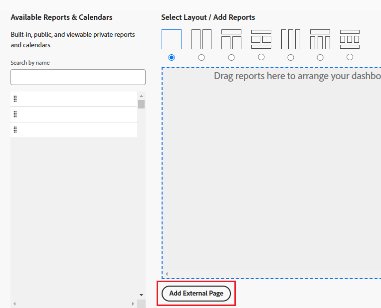

# 在功能板中嵌入请求队列

<!-- Audited: 1/2025 -->

您可以将新请求队列嵌入到功能板中，以便让用户直接访问请求队列，而无需转到请求区域。

例如，如果您有一个开放给整个组织的请求队列，如技术支持队列，或每个人均必须定期访问的PTO请求队列，则直接将请求队列插入他们的某个仪表板中可能会方便快捷、轻松地进行访问。 此设置的过程与在仪表板上创建外部页面的过程类似。

首先，您需要获取请求队列的URL。 其次，您可以通过添加外部页面将URL嵌入仪表板中。

## 访问权限要求

+++ 展开可查看本文所述功能的访问权限要求。 

<table style="table-layout:auto"> 
 <col> 
 <col> 
 <tbody> 
  <tr> 
   <td role="rowheader">Adobe Workfront 包</td> 
   <td> 
“任一”
 </td> 
  </tr> 
  <tr> 
   <td role="rowheader">Adobe Workfront许可证</td> 
   <td> 
      
标准

      
规划

   </td> 
  </tr> 
  <tr> 
   <td role="rowheader">访问级别配置</td> 
   <td> 
编辑对报告、功能板和日历的访问权限
</td> 
  </tr>  
  <tr> 
   <td role="rowheader">对象权限</td> 
   <td> 
管理仪表板的权限
 </td> 
  </tr> 
 </tbody> 
</table>

有关此表中信息的更多详细信息，请参阅Workfront文档中的[访问要求](/help/quicksilver/administration-and-setup/add-users/access-levels-and-object-permissions/access-level-requirements-in-documentation.md)。

+++

## 先决条件

Both of the following must be created before you can embed a request queue in a dashboard:

* **仪表板**：有关创建仪表板的信息，请参阅[创建仪表板](../../../reports-and-dashboards/dashboards/creating-and-managing-dashboards/create-dashboard.md)。

* **请求队列**：有关创建请求队列的信息，请参阅[创建请求队列](../../../manage-work/requests/create-and-manage-request-queues/create-request-queue.md)

## 获取请求队列的URL {#obtain-the-url-of-the-request-queue}

您可以通过多种方式获取请求队列的URL，具体取决于您希望在用户从仪表板访问请求队列时向其展示的请求队列部分。

* [获取能够更改请求类型的特定队列主题的链接](#obtain-a-link-to-a-specific-queue-topic-with-ability-to-change-the-request-type)

* [获取到请求队列的链接以及更改请求类型的功能](#obtain-a-link-to-a-request-queue-and-ability-to-change-the-request-type)

* [获取请求队列的链接，该链接无法更改请求类型](#obtain-a-link-to-a-request-queue-with-no-ability-to-change-the-request-type)

### 获取特定队列主题的链接，该链接能够更改请求类型 {#obtain-a-link-to-a-specific-queue-topic-with-ability-to-change-the-request-type}

当您与其他用户共享指向特定队列主题的链接时，请求表单将在他们提交请求时需要使用的确切队列主题处打开。 当用户在记录特定请求队列的请求时可能不确定要选择哪个队列主题时，此功能非常有用。

如果需要，用户可以更改请求类型或选择其他主题。 还会显示“请求”区域的导航。

1. Click the **Main Menu** > **Requests** > **New Request**.
1. Continue selecting topic groups and queue topics until you reach the queue you want to share on the dashboard, if you want to share specific queue. For information about submitting requests, see [Create and submit Adobe Workfront requests](../../../manage-work/requests/create-requests/create-submit-requests.md).

   >[!TIP]
   >
   >选择主题组和队列主题是可选的。

1. 单击“新建请求”区域右上角的&#x200B;**共享路径**。

   当在屏幕上显示时，这会复制指向请求队列或队列主题的链接。 用户可以更新请求类型或任何可用的主题组和队列主题。

   

### Obtain a link to a request queue and ability to change the request type {#obtain-a-link-to-a-request-queue-and-ability-to-change-the-request-type}

When you share a link to a request type, the request type is selected for the user. This is helpful when users need to choose from multiple topic groups or queue topics for the same request type. Users can change the request type and choose another one. The navigation of the Requests area also displays.

1. 转至指定为请求队列的项目。

   有关从项目创建请求队列的信息，请转至[创建请求队列](../../../manage-work/requests/create-and-manage-request-queues/create-request-queue.md)。

1. 转到&#x200B;**队列详细信息**。
1. 复制您在&#x200B;**直接访问URL**&#x200B;字段中找到的代码。

   该代码应类似于以下内容：

   `https://<yourdomain>.my.workfront.com/requests/new?activeTab=tab-new-helpRequest&projectID=50062d6f000849c95ab3513c0e84a51e&path=`

   这是指向与所选项目关联的请求队列的链接。 已预先选择请求类型。

   Users can select any topic group or queue topic they need, or they can choose another request type.

   

### Obtain a link to a request queue with no ability to change the request type {#obtain-a-link-to-a-request-queue-with-no-ability-to-change-the-request-type}

When you share a link to a preselected request type, the request type is selected for the user and cannot be changed (it is dimmed). 用户可以选择所需的主题组或队列主题。 当您不希望用户查看和选择其他请求类型时，这非常有用。 请求区域的导航不显示。

1. 转至指定为请求队列的项目。

   有关从项目创建请求队列的信息，请转到[创建请求队列](../../../manage-work/requests/create-and-manage-request-queues/create-request-queue.md)。

1. 转到&#x200B;**队列详细信息**。
1. Copy the code that you find in the **Embedded Code** field.

   该代码应类似于以下内容：

   `<iframe src="https://<yourdomain>my.workfront.com/requests/newRequestEmbedded?projectID=612518c7000404462d3bc9a0bc09fa71" frameborder="0" width="500" height="600"></iframe>`

1. 编辑代码以仅保留以下信息：

   `https://<yourdomain>.my.workfront.com/requests/newRequestEmbedded?projectID=612518c7000404462d3bc9a0bc09fa71`

   >[!TIP]
   >
   >在非Workfront应用程序中嵌入代码时，可以添加`<samp>iframe </samp>`标记。

   这是指向与所选项目关联的请求队列的链接。 “Request Type”（请求类型）是预先选定的，无法更改。

   用户可以为所选请求类型选择所需的任何主题组或队列主题。 用户无法选择其他请求类型。

   

## 在仪表板中嵌入请求队列

您可以将请求队列或嵌套在请求队列下的队列主题的链接嵌入到仪表板中，以使用户能够直接访问输入的请求。

1. 使用本文的[获取请求队列](#obtain-the-url-of-the-request-queue)部分中描述的方法之一获取请求队列URL。

1. 单击&#x200B;**主菜单** > **仪表板** > **新仪表板**。

1. 为仪表板键入&#x200B;**名称**。 这是必填字段。

1. Click **Add External Page**.

   

1. In the **Add External Page** box, edit the following fields:

   * **名称**：输入要显示在仪表板上的请求队列的名称。 这是必填字段。

   * **描述**：输入有关此外部页面显示的描述。 这不是必填字段，仅用于报告目的。 它不会显示在仪表板中。

   * **URL**：粘贴您使用步骤1中所述的方法之一获取的URL。

   * **Height**: enter the height of the external page. This defines how much space the external page containing the request queue occupies on the dashboard. This is a required field and the default value is 500.

1. 单击&#x200B;**保存**。

1. 单击&#x200B;**保存+关闭**。

   请求队列在仪表板中显示为单独的仪表板组件。

1. （可选）单击&#x200B;**仪表板操作**，然后单击&#x200B;**编辑**，将报告、日历或其他外部页面添加到同一仪表板。

   有关将组件添加到仪表板的信息，请参阅[创建仪表板](../../../reports-and-dashboards/dashboards/creating-and-managing-dashboards/create-dashboard.md)。

<!--
<ol data-mc-conditions="QuicksilverOrClassic.Draft mode">
<li value="1"> 
Click the <strong>Main Menu</strong> > Requests >&nbsp;<strong>New Request</strong>. 
 </li>
<li class="preview" value="2" data-mc-conditions="QuicksilverOrClassic.Quicksilver"> 
Continue entering the request.&nbsp;For information about submitting requests, see <a href="../../../manage-work/requests/create-requests/create-submit-requests.md" class="MCXref xref">Create and submit Adobe Workfront requests</a>. 
 </li>
<li value="3"> 
Select the <strong>Request Type</strong> for the queue you would like added to the dashboard.
 </li>
<li value="4"> 
(Optional) Select a Queue Topic and a Topic Group. Depending on how the project manager set up the request queue, the names of these fields are different in each Workfront instance.
 </li>
<li class="preview" value="5" data-mc-conditions="QuicksilverOrClassic.Quicksilver"> 
Click <strong>Share path</strong> to obtain a shared link from the request queue you want to embed on a dashboard.
 
For information about sharing a request queue, see <a href="../../../manage-work/requests/create-requests/share-link-to-request-queue.md" class="MCXref xref">Share a link to a request queue</a>
 </li>
<li value="6"> 
For example, enter a URL similar to one of the following: 
 </li>
</ol>
-->
