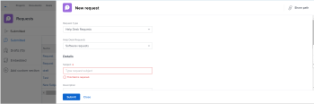

# 在功能板中嵌入请求队列

<!-- Audited: 1/2025 -->

您可以将新请求队列嵌入到功能板中，以便让用户直接访问请求队列，而无需转到请求区域。

例如，如果您有一个开放给整个组织的请求队列，如技术支持队列，或每个人均必须定期访问的PTO请求队列，则直接将请求队列插入他们的某个仪表板中可能会方便快捷、轻松地进行访问。 设置此功能的过程与在功能板上创建外部页面的过程类似。

首先，您需要获取请求队列的URL。 其次，您可以通过添加外部页面将URL嵌入到功能板中。

## 访问要求

+++ 展开以查看本文中各项功能的访问要求。

您必须具有以下权限才能执行本文中的步骤：

<table style="table-layout:auto"> 
 <col> 
 <col> 
 <tbody> 
  <tr> 
   <td role="rowheader"><strong>Adobe Workfront计划</strong></td> 
   <td> 
任何
 </td> 
  </tr> 
  <tr> 
   <td role="rowheader"><strong>Adobe Workfront许可证</strong></td> 
   <td> 
      
新增：

         <ul>
         <li>
标准
</li>
         </ul>
      
当前：

         <ul>
         <li>
计划
</li>
         </ul>
   </td> 
  </tr> 
  <tr> 
   <td role="rowheader"><strong>访问级别配置</strong></td> 
   <td> 
编辑对报告、功能板和日历的访问权限
 </td> 
  </tr> 
  <tr> 
   <td role="rowheader"><strong>对象权限</strong></td> 
   <td> 
管理仪表板的权限
 </td> 
  </tr> 
 </tbody> 
</table>

有关信息，请参阅Workfront文档中的[访问要求](/help/quicksilver/administration-and-setup/add-users/access-levels-and-object-permissions/access-level-requirements-in-documentation.md)。

+++

## 先决条件

在将请求队列嵌入功能板之前，必须创建以下两项内容：

* **仪表板**：有关创建仪表板的信息，请参阅[创建仪表板](../../../reports-and-dashboards/dashboards/creating-and-managing-dashboards/create-dashboard.md)。

* **请求队列**：有关创建请求队列的信息，请参阅[创建请求队列](../../../manage-work/requests/create-and-manage-request-queues/create-request-queue.md)

## 获取请求队列的URL {#obtain-the-url-of-the-request-queue}

您可以通过多种方式获取请求队列的URL，具体取决于您希望在用户从仪表板访问请求队列时向其展示的请求队列部分。

* [获取能够更改请求类型的特定队列主题的链接](#obtain-a-link-to-a-specific-queue-topic-with-ability-to-change-the-request-type)

* [获取到请求队列的链接以及更改请求类型的功能](#obtain-a-link-to-a-request-queue-and-ability-to-change-the-request-type)

* [获取指向无法更改请求类型的请求队列的链接](#obtain-a-link-to-a-request-queue-with-no-ability-to-change-the-request-type)

### 获取能够更改请求类型的特定队列主题的链接 {#obtain-a-link-to-a-specific-queue-topic-with-ability-to-change-the-request-type}

与其他用户共享指向特定队列主题的链接时，将在用户提交请求时需要使用的确切队列主题处打开请求表单。 当用户不确定在记录特定请求队列的请求时要选择哪个队列主题时，此选项非常有用。

如果需要，用户可以更改请求类型或选择其他主题。 此外，还会显示请求区域的导航。

1. 单击&#x200B;**主菜单** > **请求** > **新请求**。
1. 如果要共享特定队列，请继续选择主题组和队列主题，直到到达要在仪表板上共享的队列。 有关提交请求的信息，请参阅[创建并提交Adobe Workfront请求](../../../manage-work/requests/create-requests/create-submit-requests.md)。

   >[!TIP]
   >
   >选择主题组和队列主题是可选的。

1. 单击“新建请求”区域右上角的&#x200B;**共享路径**。

   当在屏幕上显示时，这会复制指向请求队列或队列主题的链接。 用户可以更新请求类型或任何可用的主题组和队列主题。

   

### 获取请求队列的链接以及更改请求类型的功能 {#obtain-a-link-to-a-request-queue-and-ability-to-change-the-request-type}

当您共享指向请求类型的链接时，将为用户选择请求类型。 当用户需要为同一请求类型从多个主题组或队列主题中进行选择时，这非常有用。 用户可以更改请求类型并选择其他类型。 此外，还会显示请求区域的导航。

1. 转至指定为请求队列的项目。

   有关从项目创建请求队列的信息，请转到[创建请求队列](../../../manage-work/requests/create-and-manage-request-queues/create-request-queue.md)。

1. 转到&#x200B;**队列详细信息**。
1. 复制您在&#x200B;**直接访问URL**&#x200B;字段中找到的代码。

   该代码应类似于以下内容：

   `https://<yourdomain>.my.workfront.com/requests/new?activeTab=tab-new-helpRequest&projectID=50062d6f000849c95ab3513c0e84a51e&path=`

   这是指向与所选项目关联的请求队列的链接。 已预先选择请求类型。

   用户可以选择所需的任何主题组或队列主题，也可以选择其他请求类型。

   

### 获取指向无法更改请求类型的请求队列的链接 {#obtain-a-link-to-a-request-queue-with-no-ability-to-change-the-request-type}

当您共享指向预选请求类型的链接时，将为用户选择请求类型并且无法更改（该类型呈灰显状态）。 用户可以选择所需的主题组或队列主题。 当您不希望用户查看和选择其他请求类型时，这非常有用。 请求区域的导航不显示。

1. 转至指定为请求队列的项目。

   有关从项目创建请求队列的信息，请转到[创建请求队列](../../../manage-work/requests/create-and-manage-request-queues/create-request-queue.md)。

1. 转到&#x200B;**队列详细信息**。
1. 复制您在&#x200B;**嵌入的代码**&#x200B;字段中找到的代码。

   该代码应类似于以下内容：

   `<iframe src="https://<yourdomain>my.workfront.com/requests/newRequestEmbedded?projectID=612518c7000404462d3bc9a0bc09fa71" frameborder="0" width="500" height="600"></iframe>`

1. 编辑代码以仅保留以下信息：

   `https://<yourdomain>.my.workfront.com/requests/newRequestEmbedded?projectID=612518c7000404462d3bc9a0bc09fa71`

   >[!TIP]
   >
   >在嵌入代码到Workfront以外的应用程序时，您可以添加`<samp>iframe </samp>`标记。

   这是指向与所选项目关联的请求队列的链接。 请求类型是预先选定的，无法更改。

   用户可以为所选请求类型选择所需的任何主题组或队列主题。 用户无法选择其他请求类型。

   

## 在功能板中嵌入请求队列

您可以将指向请求队列或嵌套在请求队列下的队列主题的链接嵌入到仪表板中，以便用户直接访问输入的请求。

1. 使用本文的[获取请求队列URL](#obtain-the-url-of-the-request-queue)部分中所述的方法之一获取请求队列URL。

1. 单击&#x200B;**主菜单** > **仪表板** > **新仪表板**。

1. 键入仪表板的&#x200B;**名称**。 这是必填字段。

1. 单击&#x200B;**添加外部页面**。

   

1. 在&#x200B;**添加外部页面**&#x200B;框中，编辑以下字段：

   * **名称**：输入要显示在仪表板上的请求队列的名称。 这是必填字段。

   * **描述**：输入有关此外部页面显示的描述。 这不是必填字段，仅用于报告目的。 它不会显示在仪表板中。

   * **URL**：粘贴您使用步骤1中所述的方法之一获取的URL。

   * **高度**：输入外部页面的高度。 这会定义包含请求队列的外部页面在功能板上占用的空间。 这是必填字段，默认值为500。

1. 单击&#x200B;**保存**。

1. 单击&#x200B;**保存+关闭**。

   请求队列在功能板中显示为一个单独的功能板组件。

1. （可选）单击&#x200B;**仪表板操作**，然后单击&#x200B;**编辑**，将报告、日历或其他外部页面添加到同一仪表板。

   有关将组件添加到仪表板的信息，请参阅[创建仪表板](../../../reports-and-dashboards/dashboards/creating-and-managing-dashboards/create-dashboard.md)。

<!--
<ol data-mc-conditions="QuicksilverOrClassic.Draft mode">
<li value="1"> 
Click the <strong>Main Menu</strong> > Requests >&nbsp;<strong>New Request</strong>. 
 </li>
<li class="preview" value="2" data-mc-conditions="QuicksilverOrClassic.Quicksilver"> 
Continue entering the request.&nbsp;For information about submitting requests, see <a href="../../../manage-work/requests/create-requests/create-submit-requests.md" class="MCXref xref">Create and submit Adobe Workfront requests</a>. 
 </li>
<li value="3"> 
Select the <strong>Request Type</strong> for the queue you would like added to the dashboard.
 </li>
<li value="4"> 
(Optional) Select a Queue Topic and a Topic Group. Depending on how the project manager set up the request queue, the names of these fields are different in each Workfront instance.
 </li>
<li class="preview" value="5" data-mc-conditions="QuicksilverOrClassic.Quicksilver"> 
Click <strong>Share path</strong> to obtain a shared link from the request queue you want to embed on a dashboard.
 
For information about sharing a request queue, see <a href="../../../manage-work/requests/create-requests/share-link-to-request-queue.md" class="MCXref xref">Share a link to a request queue</a>
 </li>
<li value="6"> 
For example, enter a URL similar to one of the following: 
 </li>
</ol>
-->
