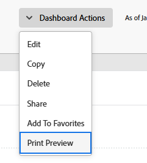

# 导出功能板

您可以使用Web浏览器中提供的打印选项将功能板导出为.pdf文件。

>[!NOTE]
>
>从网页打印内容时，内容的格式可能会受到影响。\
>例如，功能板中报表的标题可能会从报表列表中的行中剪掉。

## 访问要求

您必须具备以下条件：

<table style="table-layout:auto"> 
 <col> 
 <col> 
 <tbody> 
  <tr> 
   <td role="rowheader"><strong>Adobe Workfront计划*</strong></td> 
   <td> 
任意
 </td> 
  </tr> 
  <tr> 
   <td role="rowheader"><strong>Adobe Workfront许可证*</strong></td> 
   <td> 
工作或更高
 </td> 
  </tr> 
  <tr> 
   <td role="rowheader"><strong>访问级别配置*</strong></td> 
   <td> 
查看对报表、功能板和日历的访问权限
 
注意：如果您仍然没有访问权限，请咨询Workfront管理员，他们是否在您的访问级别设置了其他限制。 有关Workfront管理员如何更改访问级别的信息，请参阅 <a href="../../../administration-and-setup/add-users/configure-and-grant-access/create-modify-access-levels.md" class="MCXref xref">创建或修改自定义访问级别</a>.
 </td> 
  </tr> 
  <tr> 
   <td role="rowheader"><strong>对象权限</strong></td> 
   <td> 
查看功能板的权限
 
有关请求其他访问权限的信息，请参阅 <a href="../../../workfront-basics/grant-and-request-access-to-objects/request-access.md" class="MCXref xref">请求对对象的访问 </a>.
 </td> 
  </tr> 
 </tbody> 
</table>

&#42;要了解您拥有的计划、许可证类型或访问权限，请联系您的Workfront管理员。

## 先决条件

必须先创建功能板，然后才能将其导出。

有关创建功能板的信息，请参阅 [创建功能板](../../../reports-and-dashboards/dashboards/creating-and-managing-dashboards/create-dashboard.md).

## 将功能板导出为.pdf文件：

1. 转到要导出的功能板。
1. 单击 **功能板操作**，然后选择 **打印**.

   

   打开打印对话框。

1. 根据您的Web浏览器，选择相应的打印选项以完成.pdf。 文件导出：

   <table style="table-layout:auto"> 
    <col> 
    <col> 
    <thead> 
     <tr> 
      <th>Web浏览器</th> 
      <th>打印对话框选择</th> 
     </tr> 
    </thead> 
    <tbody> 
     <tr> 
      <td>Google Chrome</td> 
      <td> 
       <ol> 
        <li value="1">在 <strong>目标</strong> 字段，选择 <strong>另存为PDF</strong>，然后修改要更改的任何其他打印选项。</li> 
        <li value="2">单击<strong>保存</strong>。</li> 
        <li value="3">（可选）编辑 <strong>文件名</strong>，然后为文件选择新文件夹目标。</li> 
        <li value="4">单击 <strong>保存</strong> 将.pdf文件保存到硬盘。  </li> 
       </ol> </td> 
     </tr> 
     <tr> 
      <td>Internet Explorer、Microsoft Edge和Mozilla Firefox</td> 
      <td> 
注意：如果您使用的是Internet Explorer 11版，则在未安装第三方插件的情况下可能无法使用“打印”PDF功能。
 
       <ol> 
        <li value="1">在 <strong>打印机</strong> 或 <strong>选择打印机</strong> 字段，选择 <strong>Microsoft打印到PDF</strong>，然后修改要更改的任何其他打印选项。</li> 
        <li value="2">单击 <strong>打印</strong>.</li> 
        <li value="3">输入 <strong>文件名</strong></li> 
        <li value="4">（可选）为文件选择新文件夹目标。</li> 
        <li value="5">单击<strong>保存</strong>。</li> 
       </ol> </td> 
     </tr> 
     <tr> 
      <td>Safari</td> 
      <td> 
       <ol> 
        <li value="1">单击左下角的下拉箭头，然后选择 <strong>另存为PDF</strong>.</li> 
        <li value="2">输入 <strong>文件名</strong>.</li> 
        <li value="3">（可选）修改要更改的其他打印选项，包括为文件选择新的文件夹目标。</li> 
        <li value="4">单击<strong>保存</strong>。</li> 
       </ol> </td> 
     </tr> 
    </tbody> 
   </table>
