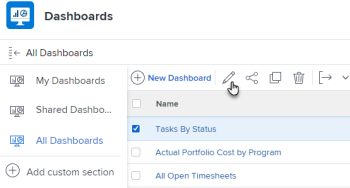

# 从功能板中删除外部页面

如果不再需要某个外部页面，您可以从功能板中删除该页面。

但是，在Adobe Workfront中创建外部页面后，您无法删除该页面。 您只能使用API删除外部页面。 有关Workfront API的信息，请参阅[API基础知识](../../../wf-api/general/api-basics.md)。 有关创建外部页面的信息，请参阅[在仪表板中嵌入外部网页](../../../reports-and-dashboards/dashboards/creating-and-managing-dashboards/embed-external-web-page-dashboard.md)。

## 访问要求

您必须具有以下权限才能执行本文中的步骤：

<table style="table-layout:auto"> 
 <col> 
 <col> 
 <tbody> 
  <tr> 
   <td role="rowheader"><strong>Adobe Workfront计划*</strong></td> 
   <td> 
任何
 </td> 
  </tr> 
  <tr> 
   <td role="rowheader"><strong>Adobe Workfront许可证*</strong></td> 
   <td> 
计划 
 </td> 
  </tr> 
  <tr> 
   <td role="rowheader"><strong>访问级别配置*</strong></td> 
   <td> 
编辑对报告、功能板和日历的访问权限
 
注意：如果您仍然没有访问权限，请咨询Workfront管理员是否对您的访问级别设置了其他限制。 有关Workfront管理员如何修改您的访问级别的信息，请参阅<a href="../../../administration-and-setup/add-users/configure-and-grant-access/create-modify-access-levels.md" class="MCXref xref">创建或修改自定义访问级别</a>。
 </td> 
  </tr> 
  <tr> 
   <td role="rowheader"><strong>对象权限</strong></td> 
   <td> 
管理仪表板的权限
 
有关请求其他访问权限的信息，请参阅<a href="../../../workfront-basics/grant-and-request-access-to-objects/request-access.md" class="MCXref xref">请求访问对象</a>。
 </td> 
  </tr> 
 </tbody> 
</table>

&#42;要了解您拥有什么计划、许可证类型或访问权限，请与Workfront管理员联系。

## 从功能板删除外部页面

1. 单击&#x200B;**主菜单**&#x200B;图标，然后单击&#x200B;**功能板**。
1. 选择要从中删除外部页面的仪表板，然后单击&#x200B;**编辑** 。

   

1. 在屏幕右侧，找到要删除的外部页面，然后单击&#x200B;**删除**&#x200B;图标。

   

1. 单击左下角的&#x200B;**保存+关闭**。

   这会从选定的功能板中删除外部页面。 外部页面保留在Workfront中，并可从报表访问。 有关信息，请参阅[在功能板中嵌入外部网页](../../../reports-and-dashboards/dashboards/creating-and-managing-dashboards/embed-external-web-page-dashboard.md)一文中的“在报表中查看外部页面”部分。
