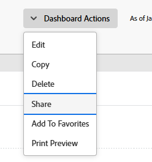

# 共享功能板

<!-- Audited: 1/2025 -->

在分配访问级别时，您的Adobe Workfront管理员会授予用户查看或编辑功能板的权限。 有关授予对问题的访问权限的详细信息，请参阅[授予对报告、功能板和日历的访问权限](../../../administration-and-setup/add-users/configure-and-grant-access/grant-access-reports-dashboards-calendars.md)。

除了授予用户的访问级别之外，您还可以授予他们查看或管理您有权共享的特定功能板的权限。 有关访问级别和权限的详细信息，请参阅[访问级别和权限如何协同工作](../../../administration-and-setup/add-users/access-levels-and-object-permissions/how-access-levels-permissions-work-together.md)。

权限特定于Workfront中的一个项目，并定义您可以对该项目执行的操作。

>[!NOTE]
>
>Workfront管理员可以为系统中的任何项目为所有用户添加或删除权限，而无需成为这些项目的所有者。

## 访问要求

+++ 展开以查看本文中各项功能的访问要求。

要共享对象，必须具备以下条件：

<table style="table-layout:auto"> 
 <col> 
 <col> 
 <tbody> 
  <tr> 
   <td role="rowheader"><strong>Adobe Workfront计划</strong></td> 
   <td> 
任何 
 </td> 
  </tr> 
  <tr> 
   <td role="rowheader"><strong>Adobe Workfront许可证</strong></td> 
    <td> 
      
新增：

         <ul>
         <li>
浅色或更高
</li>
         </ul>
      
当前：

         <ul>
         <li>
审核或更高
</li>
         </ul>
   </td> 
  </tr> 
  <tr> 
   <td role="rowheader"><strong>访问级别配置</strong></td> 
   <td> 
查看对报告、功能板和日历的访问权
 </td> 
  </tr> 
  <tr> 
   <td role="rowheader"><strong>对象权限</strong></td> 
   <td> 
查看仪表板或更高权限
 </td> 
  </tr> 
 </tbody> 
</table>

有关信息，请参阅Workfront文档中的[访问要求](/help/quicksilver/administration-and-setup/add-users/access-levels-and-object-permissions/access-level-requirements-in-documentation.md)。

+++

## 先决条件

必须先创建功能板，然后才能共享它。

有关创建功能板的信息，请参阅[创建功能板](../../../reports-and-dashboards/dashboards/creating-and-managing-dashboards/create-dashboard.md)。

## 关于共享功能板的注意事项

除了下面的注意事项外，另请参阅[共享报告、功能板和日历](../../../workfront-basics/grant-and-request-access-to-objects/permissions-reports-dashboards-calendars.md)。

* 默认情况下，功能板的创建者具有管理权限。

* 您可以与其他个人、团队、组、职位角色或公司共享您创建的功能板。 您还可以共享他人创建并与您共享的仪表板。
* 您还可以通过使其在系统范围内可见，将其与整个组织共享。
* 您可以共享单个仪表板，也可以从列表共享多个仪表板。
* 共享功能板时，默认情况下，用户将继承对功能板中所有报表对象的查看权限。

  有关Workfront中对象层次结构的详细信息，请参阅[了解Adobe Workfront中的对象](../../../workfront-basics/navigate-workfront/workfront-navigation/understand-objects.md)。

  有关查看继承权限的信息，请参阅[查看对象的继承权限](../../../workfront-basics/grant-and-request-access-to-objects/view-inherited-permissions-on-objects.md)。

## 共享功能板

从列表中共享一个或几个功能板是相同的。

1. 转到仪表板列表并选择一个或多个仪表板，然后单击&#x200B;**共享** 。

   或

   单击一个仪表板的名称，然后单击&#x200B;**仪表板操作** > **共享**。

   

1. 在&#x200B;**添加人员、团队、角色、组或公司**&#x200B;字段中，开始键入要与其共享仪表板的用户、团队、角色、组或公司的名称，然后在该名称出现在下拉列表中时单击该名称。
1. （可选）要使系统中的所有用户均可访问仪表板，请单击“共享”对话框中的&#x200B;**只有受邀的人才能访问**&#x200B;下拉菜单，然后选择&#x200B;**系统中的每个人都可以查看**。

1. 单击&#x200B;**保存**。
