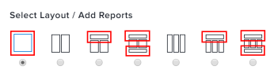

# 了解报告在功能板上的显示方式

您可以管理添加到功能板的报告在功能板上的显示方式。

有关编辑仪表板上报告布局的信息，请参阅[创建仪表板](../../../reports-and-dashboards/dashboards/creating-and-managing-dashboards/create-dashboard.md)。

在创建报告时，您可以选择应在功能板上显示的报告列。 如果要始终在仪表板上显示报告的所有列，请确保在创建报告时为每个列指定该值。

有关选择应在仪表板上显示报告哪些列的详细信息，请参阅[创建自定义报告](../../../reports-and-dashboards/reports/creating-and-managing-reports/create-custom-report.md)。

## 在仪表板上显示报告的所有列

当为占据仪表板全部宽度的仪表板区域选择报告时，默认情况下，报告的所有列都会显示在仪表板上。\

## 在仪表板上仅显示报告的第一列

当为仪表板的某个区域选择报告时，该区域的宽度小于仪表板的全宽，则默认情况下，只有报告的第一列会显示在仪表板上。\

