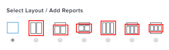

# 了解报表如何在功能板上显示

<!-- Audited: 1/2025 -->

您可以管理添加到功能板的报表的显示方式。 创建或编辑功能板时，您可以从七个布局选项中选择一个，这些选项指定可以在功能板上放置报表的区域。 请仔细考虑您的功能板布局选择，因为太多的列或某些面板（如AI Assistant）会影响可用显示空间并使您的功能板难以查看。

有关编辑功能板上的报表布局的信息，请参阅[创建功能板](../../../reports-and-dashboards/dashboards/creating-and-managing-dashboards/create-dashboard.md)。

## 仪表板布局区域中的默认报表列

某些布局选项具有限制默认显示的报表列数的报表放置区域。 在创建或编辑报表时，您可以通过单击&#x200B;[!UICONTROL **列设置**]&#x200B;中的&#x200B;[!UICONTROL **高级选项**]，手动选择应在仪表板的这些区域显示的报表列。 如果要在仪表板中显示报表的所有列，请确保为报表的每个列指定该列，或将报表放置在默认情况下显示所有报表列的区域。

有关选择应在功能板上显示报表的哪些列的详细信息，请参阅[创建自定义报表](../../../reports-and-dashboards/reports/creating-and-managing-reports/create-custom-report.md)。

### 默认情况下显示报表中所有列的区域

当为仪表板占据仪表板整个宽度的区域选择报表时，默认情况下，报表的所有列都会显示在仪表板上。\

### 默认情况下仅显示报表第一列的区域

如果为功能板的某个区域选择报表，而该区域所占用的宽度小于功能板的整个宽度，则默认情况下，功能板上只显示报表的第一列。\

