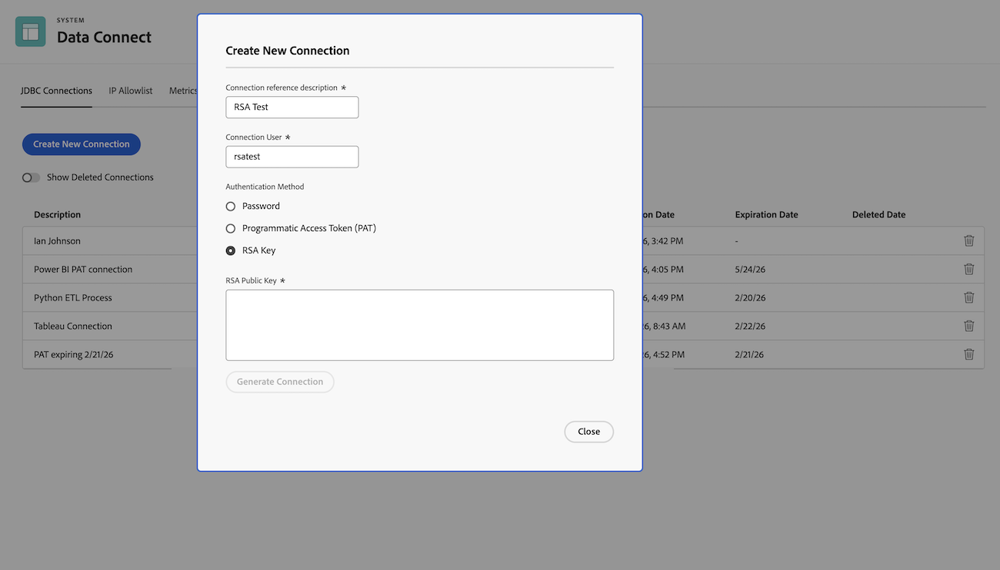

# 为Snowflake创建Reader帐户或连接

要访问Data Connect数据，您必须首先为贵组织创建Snowflake读取器（或服务）帐户，然后为要访问Data Connect的每个用户或工具创建新连接。

创建连接后，您可以通过在“现有连接”选项卡下的“数据连接”页面（“主菜单”>“设置”>“系统”>“数据连接”）上单击该连接，找到其关联的URL和用户名。

有关将新创建的连接与外部产品结合使用的信息，请参阅[建立与Workfront Data Connect的连接](/help/quicksilver/reports-and-dashboards/data-lake/share-data-externally.md)。

## 访问权限要求

+++ 展开以查看访问要求。 

<table style="table-layout:auto"> 
 <col> 
 <col> 
 <tbody> 
  <tr> 
   <td role="rowheader">Adobe Workfront 包</td> 
   <td>
Ultimate

    
工作流 Ultimate

   </td>
  </tr> 
  <tr> 
   <td role="rowheader">Adobe Workfront许可证</td> 
   <td>
   
标准

   
规划
</td> 
  </tr> 
  <tr> 
   <td role="rowheader">访问级别配置</td> 
   <td> 
您必须是Workfront管理员
</td> 
  </tr> 
 </tbody> 
</table>

有关此表中信息的更多详细信息，请参阅Workfront文档中的[访问要求](/help/quicksilver/administration-and-setup/add-users/access-levels-and-object-permissions/access-level-requirements-in-documentation.md)。

+++

## 创建读者帐户

在开始创建连接之前，必须为您的组织创建新的Snowflake读取器帐户。

>[!IMPORTANT]
>
>每个组织只需完成此流程一次。 如果&#x200B;**创建Reader帐户**&#x200B;按钮不存在于下面描述的位置，则表示已创建您的读者帐户。

要创建读取器帐户，请执行以下操作：

1. 单击Adobe Workfront右上角的&#x200B;**[!UICONTROL 主菜单]**&#x200B;图标，或（如果可用）单击左上角的&#x200B;**[!UICONTROL 主菜单]**&#x200B;图标，然后单击&#x200B;**设置**。

1. 在左侧面板中，单击&#x200B;**系统** > **数据连接**。

1. 单击&#x200B;**创建Reader帐户**&#x200B;按钮开始创建贵组织的读者帐户。 该过程是自动的，但可能需要长达24小时才能完成。

1. 完成后，将显示一个对话框窗口，说明您的阅读器帐户现在处于活动状态。 刷新浏览器页面以获得对&#x200B;**新建连接**&#x200B;按钮的访问权限。

## 创建连接

>[!IMPORTANT]
>
>2026年6月，使用多重身份验证(MFA)将需要用户名/密码凭据。 我们建议转换到基于RSA或PAT的身份验证模式，服务用户帐户用于将数据从Data Connect加载到第三方可视化工具、数据处理者和脚本中，这些工具在身份验证过程中不适用于MFA。

1. 单击Adobe Workfront右上角的&#x200B;**[!UICONTROL 主菜单]**&#x200B;图标，或（如果可用）单击左上角的&#x200B;**[!UICONTROL 主菜单]**&#x200B;图标，然后单击&#x200B;**设置**。

1. 在左侧面板中，单击&#x200B;**系统** > **数据连接**。

1. 单击&#x200B;**新建连接**。

1. 在出现的窗口中，在&#x200B;**连接引用描述**&#x200B;中输入连接名称，在&#x200B;**连接用户**&#x200B;中输入用户名，然后单击&#x200B;**生成连接**。

    {width="500"}

1. 为您的连接选择身份验证方法：
   * [密码身份验证](#password-authentication)
   * [程序化访问令牌身份验证](#programmatic-access-token-authentication)
   * [RSA密钥身份验证](#rsa-key-authentication)

### 密码身份验证

1. 单击&#x200B;**密码**，然后单击&#x200B;**生成连接**。

1. 生成&#x200B;**默认密码**&#x200B;以及可通过Snowflake查看您的数据的URL。 您需要将密码与您选择首次登录到Snowflake的用户名结合使用，因此请确保同时记录该密码和URL。 选中声明已完成此操作的框，然后单击&#x200B;**关闭**。

    {width="500"}

1. 使用浏览器打开Snowflake以导航到上一步的URL，输入您选择的用户名和上一步的默认密码，然后单击&#x200B;**登录**。

1. 首次成功登录后，系统将提示您选择新密码。 在&#x200B;**新密码**&#x200B;和&#x200B;**确认密码**&#x200B;字段中输入您选择的密码，然后单击&#x200B;**提交**。

    {width="300"}

1. 您现在可以使用用户名和新密码访问Snowflake中的Data Connect数据湖或您选择的业务可视化工具。

### 程序化访问令牌身份验证

1. 单击&#x200B;**编程访问令牌**。

1. 在&#x200B;**到期日期**&#x200B;字段中输入令牌的到期日期。 您可以选择未来最多365天的到期日期。

1. 单击&#x200B;**生成连接**。

1. 将生成可用于身份验证的PAT令牌，并会提供您的Snowflake环境URL。 您可以使用提供的PAT和用户名从第三方可视化工具或数据处理者连接到Snowflake。 请确保您保留了该文件的记录以及URL。 选中声明已完成此操作的框，然后单击&#x200B;**关闭**。

   

### RSA密钥身份验证

1. 单击&#x200B;**RSA密钥**。

1. 在&#x200B;**RSA公钥**&#x200B;字段中输入RSA公钥。

1. 单击&#x200B;**生成连接**。

1. 将生成连接，并提供您的Snowflake环境URL。 您可以使用提供的RSA密钥和用户名从第三方可视化工具或数据处理者连接到Snowflake。

您需要将RSA密钥与您选择登录到Snowflake的用户名结合使用，因此请确保同时记录此密钥和URL。 选中声明已完成此操作的框，然后单击&#x200B;**关闭**。

## 撤销读取者帐户

1. 单击Adobe Workfront右上角的&#x200B;**[!UICONTROL 主菜单]**&#x200B;图标，或（如果可用）单击左上角的&#x200B;**[!UICONTROL 主菜单]**&#x200B;图标，然后单击&#x200B;**设置**。

1. 在左侧面板中，单击&#x200B;**系统** > **数据访问**。

1. 单击要撤销的帐户右侧的垃圾桶图标。

1. 在出现的窗口中，选中确认框，然后单击&#x200B;**删除**。
