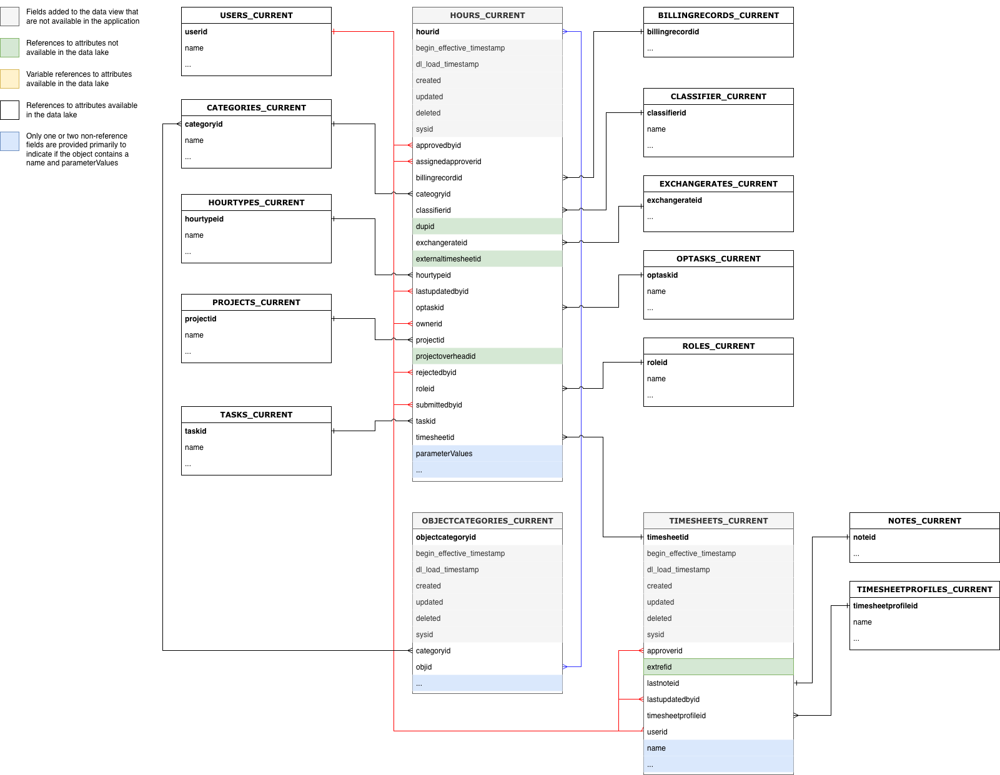

# Workfront Data Connect数据字典

本页包含有关Workfront Data Connect中数据的结构和内容的信息。

>[!NOTE]
>
>Data Connect中的数据每4小时刷新一次，因此最近的更改可能不会立即反映出来。

## 视图类型

在Data Connect中，您可以利用多种视图类型以可提供最多insight的方式查看Workfront数据。

* **当前视图**

  “当前”视图反映的数据与Workfront中存在的数据、每个对象及其当前状态类似。 但是，与Workfront相比，它可以以低得多的延迟进行导航。

* **事件视图**

  “事件”视图将跟踪Workfront中的每个更改记录：即，每次对象更改状态时，都将创建一个记录，以显示更改的时间、进行更改的人员以及更改的内容。 因此，此视图对于时间点比较非常有用。 此视图仅包含过去三年的记录。

* **每日历史记录视图**

  “每日历史记录”视图提供了“事件”视图的缩写版本，它以每日为基础显示每个对象的状态，而不是每个单独事件发生时的状态。 因此，该视图对趋势分析非常有用。

<!-- Custom view -->

## 实体关系图

Workfront中的对象（因此也就是Data Connect数据湖中的对象）不仅由其各个值定义，而且由其与其他对象的关系定义。

下面的实体关系图(ERD)为核心Workfront对象提供了数据连接中对象关系的高级映射。

>[!IMPORTANT]
>
>这些图以单个对象为中心，并不表示整个Workfront应用程序的完整实体关系图。 
>这些图旨在提供如何使用关系将数据连接到相邻对象的示例。

### 实体关系图示例

+++ 展开以查看示例图表

>[!TIP]
>
>若要查看图表的详细信息，请右键单击该图像，然后选择&#x200B;**在新选项卡中打开图像**。

### 分配

### 文档和文档审批

### 小时和工时表

### 问题

### 项目

### 任务

### 用户

+++

## 日期类型

有许多日期对象提供有关特定事件发生时间的信息。

* `DL_LOAD_TIMESTAMP`：此日期在成功完成数据刷新后更新，并包括提供最新版本记录的刷新作业开始的时间戳。
* `CALENDAR_DATE`：此日期仅存在于“每日历史记录”视图中。 “每日历史记录”视图记录了`CALENDAR_DATE`中指定的每个日期在11:59 UTC时的数据外观。
* `BEGIN_EFFECTIVE_TIMESTAMP`：此日期同时存在于“事件”和“每日历史记录”视图中，表示记录成为应用程序中当前值的时间。
* `END_EFFECTIVE_TIMESTAMP`：此日期同时存在于“事件”和“每日历史记录”视图中，并且记录记录何时记录将当前行中的值&#x200B;_从_&#x200B;更改为其他行中的值。 要允许在`BEGIN_EFFECTIVE_TIMESTAMP`和`END_EFFECTIVE_TIMESTAMP`上的查询之间查询，此值从不为null，即使没有新值也是如此。 如果记录仍然有效（表示值未更改），`END_EFFECTIVE_TIMESTAMP`的值将为2300-01-01。

## Workfront术语表和说明

下表将Workfront中的对象名称（以及它们在接口和API中的名称）与Data Connect中的等效名称相关联，并包含每个对象与其他Workfront对象的参考字段。

>[!NOTE]
>
>可以将新字段添加到对象视图，而无需提前通知，以支持Workfront应用程序不断演变的数据需求。如果下游数据收件人未准备好在添加列时处理其他列，我们建议不要使用“SELECT”查询。 
>如果需要重命名或删除列，我们将提前通知这些更改。

### 访问级别

<table>
    <thead>
        <tr>
            <th>Workfront实体名称</th>
            <th>界面引用</th>
            <th>API 参考</th>
            <th>API标签</th>
            <th>数据湖视图</th>
        </tr>
      </thead>
      <tbody>
        <tr>
            <td>访问级别</td>
            <td>访问级别</td>
            <td>ACSLVL</td>
            <td>访问级别</td>
            <td>ACCESSLEVELS_CURRENT ACCESSLEVELS_DAILY_HISTORY ACCESSLEVELS_EVENT</td>
        </tr>
      </tbody>
</table>
<table>
    <thead>
        <tr>
            <th>主/外键</th>
            <th>类型</th>
            <th>相关表</th>
            <th>相关字段</th>
        </tr>
    </thead>
    <tbody>
        <tr>
             <td>ACCESSLEVELID</td>
             <td>PK</td>
             <td>-</td>
             <td>-</td>
        </tr>
        <tr>
             <td>APPGLOBALID</td>
             <td>-</td>
             <td colspan="2">不是关系；用于内部应用目的</td>
        </tr>
        <tr>
             <td>LASTUPDATEDBYID</td>
             <td>FK</td>
             <td>USERS_CURRENT</td>
             <td>用户ID</td>
        </tr>
        <tr>
             <td>LEGACYACCESSLEVELID</td>
             <td>-</td>
             <td colspan="2">不是关系；用于内部应用目的</td>
        </tr>
        <tr>
             <td>对象ID</td>
             <td>FK</td>
             <td>变量，基于OBJCODE</td>
             <td>OBJCODE字段中标识的对象的主键/ID</td>
        </tr>
        <tr>
             <td>SYSID</td>
             <td>-</td>
             <td colspan="2">不是关系；用于内部应用目的</td>
        </tr>
    </tbody>
</table>

### 访问规则

<table>
    <thead>
        <tr>
            <th>Workfront实体名称</th>
            <th>界面引用</th>
            <th>API 参考</th>
            <th>API标签</th>
            <th>数据湖视图</th>
        </tr>
      </thead>
      <tbody>
        <tr>
            <td>访问规则</td>
            <td>共享</td>
            <td>ACSRUL</td>
            <td>共享</td>
            <td>ACCESSRULES_CURRENT ACCESSRULES_DAILY_HISTORY ACCESSRULES_EVENT</td>
        </tr>
      </tbody>
</table>
<table>
    <thead>
        <tr>
            <th>主/外键</th>
            <th>类型</th>
            <th>相关表</th>
            <th>相关字段</th>
        </tr>
    </thead>
    <tbody>
        <tr>
             <td>ACCESSORID</td>
             <td>FK</td>
             <td>变量，基于ACCESSOROBJCODE</td>
             <td>ACCESSOROBJCODE字段中标识的对象的主键/ID</td>
        </tr>
        <tr>
             <td>ACCESSRULEID</td>
             <td>PK</td>
             <td>-</td>
             <td>-</td>
        </tr>
        <tr>
             <td>ANCESTORID</td>
             <td>PK</td>
             <td>变量，基于ANCESTOROBJCODE</td>
             <td>ANCESTOROBJCODE字段中标识的对象的主键/ID</td>
        </tr>
        <tr>
             <td>LASTUPDATEDBYID</td>
             <td>FK</td>
             <td>USERS_CURRENT</td>
             <td>用户ID</td>
        </tr>
        <tr>
             <td>SECURITYOBJID</td>
             <td>FK</td>
             <td>变量，基于SECURITYOBJCODE</td>
             <td>SECURITYOBJCODE字段中标识的对象的主键/ID</td>
        </tr>
        <tr>
             <td>SYSID</td>
             <td>-</td>
             <td colspan="2">不是关系；用于内部应用目的</td>
        </tr>
    </tbody>
</table>

### 批准路径

<table>
    <thead>
        <tr>
            <th>Workfront实体名称</th>
            <th>界面引用</th>
            <th>API 参考</th>
            <th>API标签</th>
            <th>数据湖视图</th>
        </tr>
      </thead>
      <tbody>
        <tr>
            <td>批准路径</td>
            <td>批准路径</td>
            <td>ARVPTH</td>
            <td>审批</td>
            <td>APPROVALPATHS_CURRENT APPROVALPATHS_DAILY_HISTORY APPROVALPATHS_EVENT</td>
        </tr>
      </tbody>
</table>
<table>
    <thead>
        <tr>
            <th>主/外键</th>
            <th>类型</th>
            <th>相关表</th>
            <th>相关字段</th>
        </tr>
    </thead>
    <tbody>
        <tr>
             <td>APPROVALPATHID</td>
             <td>PK</td>
             <td>-</td>
             <td>-</td>
        </tr>
        <tr>
             <td>APPROVALPROCESSID</td>
             <td>FK</td>
             <td>APPROVALPROCESSES_CURRENT</td>
             <td>APPROVALPROCESSID</td>
        </tr>
        <tr>
             <td>ENTEREDBYID</td>
             <td>FK</td>
             <td>USERS_CURRENT</td>
             <td>用户ID</td>
        </tr>
        <tr>
             <td>全局路径ID</td>
             <td>-</td>
             <td colspan="2">不是关系；用于内部应用目的</td>
        </tr>
        <tr>
             <td>LASTUPDATEDBYID</td>
             <td>FK</td>
             <td>USERS_CURRENT</td>
             <td>用户ID</td>
        </tr>
        <tr>
             <td>SYSID</td>
             <td>-</td>
             <td colspan="2">不是关系；用于内部应用目的</td>
        </tr>
    </tbody>
</table>

### 审批流程

<table>
    <thead>
        <tr>
            <th>Workfront实体名称</th>
            <th>界面引用</th>
            <th>API 参考</th>
            <th>API标签</th>
            <th>数据湖视图</th>
        </tr>
      </thead>
      <tbody>
        <tr>
            <td>审批流程</td>
            <td>审批流程</td>
            <td>ARVPRC</td>
            <td>审批流程</td>
            <td>APPROVALPROCESSES_CURRENT APPROVALPROCESSES_DAILY_HISTORY APPROVALPROCESSES_EVENT</td>
        </tr>
      </tbody>
</table>
<table>
    <thead>
        <tr>
            <th>主/外键</th>
            <th>类型</th>
            <th>相关表</th>
            <th>相关字段</th>
        </tr>
    </thead>
    <tbody>
        <tr>
             <td>APPROVALPROCESSID</td>
             <td>PK</td>
             <td>-</td>
             <td>-</td>
        </tr>
        <tr>
             <td>ENTEREDBYID</td>
             <td>FK</td>
             <td>USERS_CURRENT</td>
             <td>用户ID</td>
        </tr>
        <tr>
             <td>LASTUPDATEDBYID</td>
             <td>FK</td>
             <td>USERS_CURRENT</td>
             <td>用户ID</td>
        </tr>
        <tr>
             <td>SYSID</td>
             <td>-</td>
             <td colspan="2">不是关系；用于内部应用目的</td>
        </tr>
    </tbody>
</table>

### 审批步骤

<table>
    <thead>
        <tr>
            <th>Workfront实体名称</th>
            <th>界面引用</th>
            <th>API 参考</th>
            <th>API标签</th>
            <th>数据湖视图</th>
        </tr>
      </thead>
      <tbody>
        <tr>
            <td>审批步骤</td>
            <td>审批步骤</td>
            <td>ARVSTP</td>
            <td>审批阶段</td>
            <td>APPROVALSTEPS_CURRENT APPROVALSTEPS_DAILY_HISTORY APPROVALSTEPS_EVENT</td>
        </tr>
      </tbody>
</table>
<table>
    <thead>
        <tr>
            <th>主/外键</th>
            <th>类型</th>
            <th>相关表</th>
            <th>相关字段</th>
        </tr>
    </thead>
    <tbody>
        <tr>
             <td>APPROVALPATHID</td>
             <td>FK</td>
             <td>APPROVALPATH_CURRENT</td>
             <td>APPROVALPATHID</td>
        </tr>
        <tr>
             <td>APPROVALSTEPID</td>
             <td>PK</td>
             <td>-</td>
             <td>-</td>
        </tr>
        <tr>
             <td>SYSID</td>
             <td>-</td>
             <td colspan="2">不是关系；用于内部应用目的</td>
        </tr>
    </tbody>
</table>

### 审批者状态

<table>
    <thead>
        <tr>
            <th>Workfront实体名称</th>
            <th>界面引用</th>
            <th>API 参考</th>
            <th>API标签</th>
            <th>数据湖视图</th>
        </tr>
      </thead>
      <tbody>
        <tr>
            <td>审批者状态</td>
            <td>审批者状态</td>
            <td>ARVSTS</td>
            <td>ApproverStatus</td>
            <td>APPROVERSTATUSES_CURRENT APPROVERSTATUSES_DAILY_HISTORY APPROVERSTATUSES_EVENT</td>
        </tr>
      </tbody>
</table>
<table>
    <thead>
        <tr>
            <th>主/外键</th>
            <th>类型</th>
            <th>相关表</th>
            <th>相关字段</th>
        </tr>
    </thead>
    <tbody>
        <tr>
             <td>APPROVERSTATUSID</td>
             <td>PK</td>
             <td>-</td>
             <td>-</td>
        </tr>
        <tr>
             <td>APPROVABLEOBJID</td>
             <td>FK</td>
             <td>变量，基于APPROVABLEOBJCODE</td>
             <td>APPROVABLEOBJCODE字段中标识的对象的主键/ID</td>
        </tr>
        <tr>
             <td>APPROVALSTEPID</td>
             <td>FK</td>
             <td>APPROVALSTEPS_CURRENT</td>
             <td>APPROVALSTEPID</td>
        </tr>
        <tr>
             <td>APPROVEDBYID</td>
             <td>FK</td>
             <td>USERS_CURRENT</td>
             <td>用户ID</td>
        </tr>
        <tr>
             <td>DELEGATEUSERID</td>
             <td>FK</td>
             <td>USERS_CURRENT</td>
             <td>用户ID</td>
        </tr>
        <tr>
             <td>LASTUPDATEDBYID</td>
             <td>FK</td>
             <td>USERS_CURRENT</td>
             <td>用户ID</td>
        </tr>
        <tr>
             <td>OPTASKID</td>
             <td>FK</td>
             <td>OPTASKS_CURRENT</td>
             <td>OPTASKID</td>
        </tr>
        <tr>
             <td>OVERRIDDENUSERID</td>
             <td>FK</td>
             <td>USERS_CURRENT</td>
             <td>用户ID</td>
        </tr>
        <tr>
             <td>PROJECTID</td>
             <td>FK</td>
             <td>项目当前</td>
             <td>PROJECTID</td>
        </tr>
        <tr>
             <td>STEPAPPROVERID</td>
             <td>FK</td>
             <td>USERS_CURRENT</td>
             <td>用户ID</td>
        </tr>
        <tr>
             <td>SYSYID</td>
             <td>-</td>
             <td colspan="2">不是关系；用于内部应用目的</td>
        </tr>
        <tr>
             <td>TASKID</td>
             <td>FK</td>
             <td>任务_当前</td>
             <td>TASKID</td>
        </tr>
        <tr>
             <td>WILDCARDUSERID</td>
             <td>FK</td>
             <td>USERS_CURRENT</td>
             <td>用户ID</td>
        </tr>
    </tbody>
</table>

### 任务

<table>
    <thead>
        <tr>
            <th>Workfront实体名称</th>
            <th>界面引用</th>
            <th>API 参考</th>
            <th>API标签</th>
            <th>数据湖视图</th>
        </tr>
      </thead>
      <tbody>
        <tr>
            <td>任务</td>
            <td>任务</td>
            <td>分配</td>
            <td>任务</td>
            <td>ASSIGNMENTS_CURRENT ASSIGNMENTS_DAILY_HISTORY ASSIGNMENTS_EVENT</td>
        </tr>
      </tbody>
</table>
<table>
    <thead>
        <tr>
            <th>主/外键</th>
            <th>类型</th>
            <th>相关表</th>
            <th>相关字段</th>
        </tr>
    </thead>
    <tbody>
        <tr>
             <td>ASSIGNEDBYID</td>
             <td>FK</td>
             <td>USERS_CURRENT</td>
             <td>用户ID</td>
        </tr>
        <tr>
             <td>ASSIGNEDTOID</td>
             <td>FK</td>
             <td>USERS_CURRENT</td>
             <td>用户ID</td>
        </tr>
        <tr>
             <td>ASSIGNMENTID</td>
             <td>PK</td>
             <td>-</td>
             <td>-</td>
        </tr>
        <tr>
             <td>类别ID</td>
             <td>FK</td>
             <td>CATEGORY_CURRENT</td>
             <td>类别ID</td>
        </tr>
        <tr>
             <td>CLASSIFIERID</td>
             <td>FK</td>
             <td>CLASSIFIER_CURRENT</td>
             <td>CLASSIFIERID</td>
        </tr>
      <tr>
             <td>LASTUPDATEDBYID</td>
             <td>FK</td>
             <td>USERS_CURRENT</td>
             <td>用户ID</td>
        </tr>
        <tr>
             <td>OPTASKID</td>
             <td>FK</td>
             <td>OPTASKS_CURRENT</td>
             <td>OPTASKID</td>
        </tr>
        <tr>
             <td>PRIVATERATECARDID</td>
             <td>FK</td>
             <td>RATECARD_CURRENT</td>
             <td>RATECARDID</td>
        </tr>
        <tr>
             <td>PROJECTID</td>
             <td>FK</td>
             <td>项目当前</td>
             <td>PROJECTID</td>
        </tr>
        <tr>
             <td>角色ID</td>
             <td>FK</td>
             <td>ROLES_CURRENT</td>
             <td>角色ID</td>
        </tr>
        <tr>
             <td>TASKID</td>
             <td>FK</td>
             <td>任务_当前</td>
             <td>TASKID</td>
        </tr>
        <tr>
             <td>TEAMID</td>
             <td>FK</td>
             <td>团队当前</td>
             <td>TEAMID</td>
        </tr>
    </tbody>
</table>

### 等待审批

<table>
    <thead>
        <tr>
            <th>Workfront实体名称</th>
            <th>界面引用</th>
            <th>API 参考</th>
            <th>API标签</th>
            <th>数据湖视图</th>
        </tr>
      </thead>
      <tbody>
        <tr>
            <td>等待审批</td>
            <td>等待审批</td>
            <td>AWAPVL</td>
            <td>等待审批</td>
            <td>AWAITINGAPPROVALS_CURRENT AWAITINGAPPROVALS_DAILY_HISTORY AWAITINGAPPROVALS_EVENT</td>
        </tr>
      </tbody>
</table>
<table>
    <thead>
        <tr>
            <th>主/外键</th>
            <th>类型</th>
            <th>相关表</th>
            <th>相关字段</th>
        </tr>
    </thead>
    <tbody>
        <tr>
             <td>ACCESSREQUESTID</td>
             <td>-</td>
             <td colspan="2">当前不支持访问请求表</td>
        </tr>
        <tr>
             <td>可批准ID</td>
             <td>FK</td>
             <td>-</td>
             <td colspan="2">不是关系；用于内部应用目的</td>
        </tr>
        <tr>
             <td>APPROVERID</td>
             <td>FK</td>
             <td>USERS_CURRENT</td>
             <td>用户ID</td>
        </tr>
        <tr>
             <td>AWAITINGAPPROVALID</td>
             <td>PK</td>
             <td>-</td>
             <td>-</td>
        </tr>
        <tr>
             <td>DOCUMENTID</td>
             <td>FK</td>
             <td>DOCUMENTS_CURRENT</td>
             <td>DOCUMENTID</td>
        </tr>
        <tr>
             <td>DOCUMENTVERSIONID</td>
             <td>FK</td>
             <td>DOCUMENTVERSIONS_CURRENT</td>
             <td>DOCUMENTVERSIONID</td>
        </tr>
        <tr>
             <td>OPTASKID</td>
             <td>FK</td>
             <td>OPTASKS_CURRENT</td>
             <td>OPTASKID</td>
        </tr>
        <tr>
             <td>PROJECTID</td>
             <td>FK</td>
             <td>项目当前</td>
             <td>PROJECTID</td>
        </tr>
        <tr>
             <td>角色ID</td>
             <td>FK</td>
             <td>ROLES_CURRENT</td>
             <td>角色ID</td>
        </tr>
        <tr>
             <td>SUBMITTEDBYID</td>
             <td>FK</td>
             <td>USERS_CURRENT</td>
             <td>用户ID</td>
        </tr>
        <tr>
             <td>SYSID</td>
             <td>-</td>
             <td colspan="2">不是关系；用于内部应用目的</td>
        </tr>
        <tr>
             <td>TASKID</td>
             <td>FK</td>
             <td>任务_当前</td>
             <td>TASKID</td>
        </tr>
        <tr>
             <td>TEAMID</td>
             <td>FK</td>
             <td>团队当前</td>
             <td>TEAMID</td>
        </tr>
        <tr>
             <td>时间表ID</td>
             <td>FK</td>
             <td>TIMESHEETS_CURRENT</td>
             <td>时间表ID</td>
        </tr>
        <tr>
             <td>用户ID</td>
             <td>FK</td>
             <td>USERS_CURRENT</td>
             <td>用户ID</td>
        </tr>
    </tbody>
</table>

### 基准

<table>
    <thead>
        <tr>
            <th>Workfront实体名称</th>
            <th>界面引用</th>
            <th>API 参考</th>
            <th>API标签</th>
            <th>数据湖视图</th>
        </tr>
      </thead>
      <tbody>
        <tr>
            <td>基准</td>
            <td>基准</td>
            <td>BLIN</td>
            <td>基准</td>
            <td>BASELINES_CURRENT BASELINES_DAILY_HISTORY BASELINES_EVENT</td>
        </tr>
      </tbody>
</table>
<table>
    <thead>
        <tr>
            <th>主/外键</th>
            <th>类型</th>
            <th>相关表</th>
            <th>相关字段</th>
        </tr>
    </thead>
    <tbody>
        <tr>
             <td>BASELINEID</td>
             <td>PK</td>
             <td>-</td>
             <td>-</td>
        </tr>
        <tr>
             <td>EXCHANGERATEID</td>
             <td>FK</td>
             <td>EXCHANGERATES_CURRENT</td>
             <td>EXCHANGERATEID</td>
        </tr>
        <tr>
             <td>PROJECTID</td>
             <td>FK</td>
             <td>项目当前</td>
             <td>PROJECTID</td>
        </tr>
        <tr>
             <td>SYSID</td>
             <td>-</td>
             <td colspan="2">不是关系；用于内部应用目的</td>
        </tr>
    </tbody>
</table>

### 基线任务

<table>
    <thead>
        <tr>
            <th>Workfront实体名称</th>
            <th>界面引用</th>
            <th>API 参考</th>
            <th>API标签</th>
            <th>数据湖视图</th>
        </tr>
      </thead>
      <tbody>
        <tr>
            <td>基线任务</td>
            <td>基线任务</td>
            <td>BSTSK</td>
            <td>基线任务</td>
            <td>BASELINETASKS_CURRENT BASELINETASKS_DAILY_HISTORY BASELINETASKS_EVENT</td>
        </tr>
      </tbody>
</table>
<table>
    <thead>
        <tr>
            <th>主/外键</th>
            <th>类型</th>
            <th>相关表</th>
            <th>相关字段</th>
        </tr>
    </thead>
    <tbody>
        <tr>
             <td>BASELINEID</td>
             <td>FK</td>
             <td>基线_当前</td>
             <td>BASELINEID</td>
        </tr>
        <tr>
             <td>BASELINETASKID</td>
             <td>PK</td>
             <td>-</td>
             <td>-</td>
        </tr>
        <tr>
             <td>EXCHANGERATEID</td>
             <td>FK</td>
             <td>EXCHANGERATES_CURRENT</td>
             <td>EXCHANGERATEID</td>
        </tr>
        <tr>
             <td>PROJECTID</td>
             <td>FK</td>
             <td>项目当前</td>
             <td>PROJECTID</td>
        </tr>
        <tr>
             <td>SYSID</td>
             <td>-</td>
             <td colspan="2">不是关系；用于内部应用目的</td>
        </tr>
        <tr>
             <td>TASKID</td>
             <td>FK</td>
             <td>任务_当前</td>
             <td>TASKID</td>
        </tr>
    </tbody>
</table>

### 计费费率

<table>
    <thead>
        <tr>
            <th>Workfront实体名称</th>
            <th>界面引用</th>
            <th>API 参考</th>
            <th>API标签</th>
            <th>数据湖视图</th>
        </tr>
      </thead>
      <tbody>
        <tr>
            <td>计费费率</td>
            <td>费率或覆盖率</td>
            <td>费率</td>
            <td>计费费率</td>
            <td>RATES_CURRENT RATES_DAILY_HISTORY RATES_EVENT</td>
        </tr>
      </tbody>
</table>
<table>
    <thead>
        <tr>
            <th>主/外键</th>
            <th>类型</th>
            <th>相关表</th>
            <th>相关字段</th>
        </tr>
    </thead>
    <tbody>
        <tr>
             <td>ASSIGNMENTID</td>
             <td>FK</td>
             <td>ASSIGNATIONS_CURRENT</td>
             <td>ASSIGNMENTID</td>
        </tr>
        <tr>
             <td>CLASSIFIERID</td>
             <td>FK</td>
             <td>CLASSIFIER_CURRENT</td>
             <td>CLASSIFIERID</td>
        </tr>
        <tr>
             <td>EXCHANGERATEID</td>
             <td>FK</td>
             <td>EXCHANGERATES_CURRENT</td>
             <td>EXCHANGERATEID</td>
        </tr>
        <tr>
             <td>NLBRCATEGORYID</td>
             <td>FK</td>
             <td>NLBRCATEGORIES_CURRENT</td>
             <td>NLBRCATEGORYID</td>
        </tr>
        <tr>
             <td>NONLABORRESOURCEID</td>
             <td>FK</td>
             <td>NONLABORRESOURCES_CURRENT</td>
             <td>NONLABORRESOURCEID</td>
        </tr>
        <tr>
             <td>对象ID</td>
             <td>FK</td>
             <td>变量，基于OBJCODE</td>
             <td>OBJCODE字段中标识的对象的主键/ID</td>
        </tr>
        <tr>
             <td>PROJECTID</td>
             <td>FK</td>
             <td>项目当前</td>
             <td>PROJECTID</td>
        </tr>
        <tr>
             <td>RATECARDID</td>
             <td>FK</td>
             <td>RATECARD_CURRENT</td>
             <td>RATECARDID</td>
        </tr>
        <tr>
             <td>RATEID</td>
             <td>PK</td>
             <td>-</td>
             <td>-</td>
        </tr>
        <tr>
             <td>角色ID</td>
             <td>FK</td>
             <td>ROLES_CURRENT</td>
             <td>角色ID</td>
        </tr>
        <tr>
             <td>SOURCERATECARDID</td>
             <td>FK</td>
             <td>RATECARD_CURRENT</td>
             <td>RATECARDID</td>
        </tr>
        <tr>
             <td>SYSID</td>
             <td>-</td>
             <td colspan="2">不是关系；用于内部应用目的</td>
        </tr>
        <tr>
             <td>TEMPLATEID</td>
             <td>FK</td>
             <td>TEMPLATES_CURRENT</td>
             <td>TEMPLATEID</td>
        </tr>
        <tr>
             <td>用户ID</td>
             <td>FK</td>
             <td>USERS_CURRENT</td>
             <td>用户ID</td>
        </tr>
    </tbody>
</table>

### 账单记录

<table>
    <thead>
        <tr>
            <th>Workfront实体名称</th>
            <th>界面引用</th>
            <th>API 参考</th>
            <th>API标签</th>
            <th>数据湖视图</th>
        </tr>
      </thead>
      <tbody>
        <tr>
            <td>账单记录</td>
            <td>账单记录</td>
            <td>帐单</td>
            <td>账单记录</td>
            <td>BILLINGRECORDS_CURRENT BILLINGRECORDS_DAILY_HISTORY BILLINGRECORDS_EVENT</td>
        </tr>
      </tbody>
</table>
<table>
    <thead>
        <tr>
            <th>主/外键</th>
            <th>类型</th>
            <th>相关表</th>
            <th>相关字段</th>
        </tr>
    </thead>
    <tbody>
        <tr>
             <td>BILLINGRECORDID</td>
             <td>PK</td>
             <td>-</td>
             <td>-</td>
        </tr>
        <tr>
             <td>类别ID</td>
             <td>FK</td>
             <td>CATEGORY_CURRENT</td>
             <td>类别ID</td>
        </tr>
        <tr>
             <td>EXCHANGERATEID</td>
             <td>FK</td>
             <td>EXCHANGERATES_CURRENT</td>
             <td>EXCHANGERATEID</td>
        </tr>
        <tr>
             <td>INVOICEID</td>
             <td>-</td>
             <td colspan="2">当前不支持发票表</td>
        </tr>
        <tr>
             <td>LASTUPDATEDBYID</td>
             <td>FK</td>
             <td>USERS_CURRENT</td>
             <td>用户ID</td>
        </tr>
        <tr>
             <td>PROJECTID</td>
             <td>FK</td>
             <td>项目当前</td>
             <td>PROJECTID</td>
        </tr>
        <tr>
             <td>SYSID</td>
             <td>-</td>
             <td colspan="2">不是关系；用于内部应用目的</td>
        </tr>
    </tbody>
</table>

### 预订

<table>
    <thead>
        <tr>
            <th>Workfront实体名称</th>
            <th>界面引用</th>
            <th>API 参考</th>
            <th>API标签</th>
            <th>数据湖视图</th>
        </tr>
      </thead>
      <tbody>
        <tr>
            <td>预订</td>
            <td>预订</td>
            <td>预订</td>
            <td>预订</td>
            <td>BOOKINGS_CURRENT BOOKINGS_DAILY_HISTORY BOOKINGS_EVENT</td>
        </tr>
      </tbody>
</table>
<table>
    <thead>
        <tr>
            <th>主/外键</th>
            <th>类型</th>
            <th>相关表</th>
            <th>相关字段</th>
        </tr>
    </thead>
    <tbody>
        <tr>
             <td>BOOKINGID</td>
             <td>PK</td>
             <td>-</td>
             <td>-</td>
        </tr>
        <tr>
             <td>ENTEREDBYID</td>
             <td>FK</td>
             <td>USERS_CURRENT</td>
             <td>用户ID</td>
        </tr>
        <tr>
             <td>LASTUPDATEDBYID</td>
             <td>FK</td>
             <td>USERS_CURRENT</td>
             <td>用户ID</td>
        </tr>
        <tr>
             <td>NLBRCATEGORYID</td>
             <td>FK</td>
             <td>NLBRCATEGORIES_CURRENT</td>
             <td>NLBRCATEGORYID</td>
        </tr>
        <tr>
             <td>NONLABORRESOURCEID</td>
             <td>FK</td>
             <td>NONLABORRESOURCES_CURRENT</td>
             <td>NONLABORRESOURCEID</td>
        </tr>
        <tr>
             <td>对象ID</td>
             <td>FK</td>
             <td>变量，基于OBJCODE</td>
             <td>OBJCODE字段中标识的对象的主键/ID</td>
        </tr>
        <tr>
             <td>PROJECTID</td>
             <td>FK</td>
             <td>项目当前</td>
             <td>PROJECTID</td>
        </tr>
        <tr>
             <td>SYSID</td>
             <td>-</td>
             <td colspan="2">不是关系；用于内部应用目的</td>
        </tr>
        <tr>
             <td>TASKID</td>
             <td>FK</td>
             <td>任务_当前</td>
             <td>TASKID</td>
        </tr>
        <tr>
             <td>TEMPLATEID</td>
             <td>FK</td>
             <td>TEMPLATES_CURRENT</td>
             <td>TEMPLATEID</td>
        </tr>
        <tr>
             <td>TEMPLATETASKID</td>
             <td>FK</td>
             <td>TEMPLATETASKS_CURRENT</td>
             <td>TEMPLATETASKID</td>
        </tr>
        <tr>
             <td>TOPOBJID</td>
             <td>FK</td>
             <td>变量，基于TOPOBJCODE</td>
             <td>TOPOBJCODE字段中标识的对象的主键/ID</td>
        </tr>
    </tbody>
</table>

### 企业轮廓

<table>
    <thead>
        <tr>
            <th>Workfront实体名称</th>
            <th>界面引用</th>
            <th>API 参考</th>
            <th>API标签</th>
            <th>数据湖视图</th>
        </tr>
      </thead>
      <tbody>
        <tr>
            <td>企业轮廓</td>
            <td>企业轮廓</td>
            <td>BSNPRF</td>
            <td>业务配置文件</td>
            <td>BUSINESSPROFILE_CURRENT BUSINESSPROFILE_DAILY_HISTORY BUSINESSPROFILE_EVENT</td>
        </tr>
      </tbody>
</table>
<table>
    <thead>
        <tr>
            <th>主/外键</th>
            <th>类型</th>
            <th>相关表</th>
            <th>相关字段</th>
        </tr>
    </thead>
    <tbody>
        <tr>
             <td>ACCESSLEVELID</td>
             <td>FK</td>
             <td>ACCESSLEVELS_CURRENT</td>
             <td>ACCESSLEVELID</td>
        </tr>
        <tr>
             <td>BUSINESSPROFILEID</td>
             <td>PK</td>
             <td>-</td>
             <td>-</td>
        </tr>
        <tr>
             <td>ENTEREDBYID</td>
             <td>FK</td>
             <td>USERS_CURRENT</td>
             <td>用户ID</td>
        </tr>
        <tr>
             <td>GROUPID</td>
             <td>FK</td>
             <td>组_当前</td>
             <td>GROUPID</td>
        </tr>
        <tr>
             <td>LASTUPDATEDBYID</td>
             <td>FK</td>
             <td>USERS_CURRENT</td>
             <td>用户ID</td>
        </tr>
        <tr>
             <td>SYSID</td>
             <td>-</td>
             <td colspan="2">不是关系；用于内部应用目的</td>
        </tr>
    </tbody>
</table>

### 业务规则

<table>
    <thead>
        <tr>
            <th>Workfront实体名称</th>
            <th>界面引用</th>
            <th>API 参考</th>
            <th>API标签</th>
            <th>数据湖视图</th>
        </tr>
      </thead>
      <tbody>
        <tr>
            <td>业务规则</td>
            <td>业务规则</td>
            <td>BSNRUL</td>
            <td>业务规则</td>
            <td>BUSINESSRULE_CURRENT BUSINESSRULE_DAILY_HISTORY BUSINESSRULE_EVENT</td>
        </tr>
      </tbody>
</table>
<table>
    <thead>
        <tr>
            <th>主/外键</th>
            <th>类型</th>
            <th>相关表</th>
            <th>相关字段</th>
        </tr>
    </thead>
    <tbody>
        <tr>
             <td>BUSINESSRULEID</td>
             <td>PK</td>
             <td>-</td>
             <td>-</td>
        </tr>
        <tr>
             <td>ENTEREDBYID</td>
             <td>FK</td>
             <td>USERS_CURRENT</td>
             <td>用户ID</td>
        </tr>
        <tr>
             <td>LASTUPDATEDBYID</td>
             <td>FK</td>
             <td>USERS_CURRENT</td>
             <td>用户ID</td>
        </tr>
        <tr>
             <td>SYSID</td>
             <td>-</td>
             <td colspan="2">不是关系；用于内部应用目的</td>
        </tr>
    </tbody>
</table>

### 类别

<table>
    <thead>
        <tr>
            <th>Workfront实体名称</th>
            <th>界面引用</th>
            <th>API 参考</th>
            <th>API标签</th>
            <th>数据湖视图</th>
        </tr>
      </thead>
      <tbody>
        <tr>
            <td>类别</td>
            <td>自定义表单</td>
            <td>CTGY</td>
            <td>类别</td>
            <td>CATEGORIES_CURRENT CATEGORIES_DAILY_HISTORY CATEGORIES_EVENT</td>
        </tr>
      </tbody>
</table>
<table>
    <thead>
        <tr>
            <th>主/外键</th>
            <th>类型</th>
            <th>相关表</th>
            <th>相关字段</th>
        </tr>
    </thead>
    <tbody>
        <tr>
             <td>类别ID</td>
             <td>PK</td>
             <td>-</td>
             <td>-</td>
        </tr>
        <tr>
             <td>ENTEREDBYID</td>
             <td>FK</td>
             <td>USERS_CURRENT</td>
             <td>用户ID</td>
        </tr>
        <tr>
             <td>GROUPID</td>
             <td>FK</td>
             <td>组_当前</td>
             <td>GROUPID</td>
        </tr>
        <tr>
             <td>LASTUPDATEDBYID</td>
             <td>FK</td>
             <td>USERS_CURRENT</td>
             <td>用户ID</td>
        </tr>
        <tr>
             <td>SYSID</td>
             <td>-</td>
             <td colspan="2">不是关系；用于内部应用目的</td>
        </tr>
    </tbody>
</table>

### 类别参数

<table>
    <thead>
        <tr>
            <th>Workfront实体名称</th>
            <th>界面引用</th>
            <th>API 参考</th>
            <th>API标签</th>
            <th>数据湖视图</th>
        </tr>
      </thead>
      <tbody>
        <tr>
            <td>类别参数</td>
            <td>自定义表单字段</td>
            <td>CTGYPA</td>
            <td>类别参数</td>
            <td>CATEGORIESPARAMETERS_CURRENT CATEGORIESPARAMETERS_DAILY_HISTORY CATEGORIESPARAMETERS_EVENT</td>
        </tr>
      </tbody>
</table>
<table>
    <thead>
        <tr>
            <th>主/外键</th>
            <th>类型</th>
            <th>相关表</th>
            <th>相关字段</th>
        </tr>
    </thead>
    <tbody>
        <tr>
             <td>CATEGORIESPARAMETERID</td>
             <td>PK</td>
             <td>-</td>
             <td>-</td>
        </tr>
        <tr>
             <td>类别ID</td>
             <td>FK</td>
             <td>CATEGORY_CURRENT</td>
             <td>类别ID</td>
        </tr>
        <tr>
             <td>PARAMETERGROUPID</td>
             <td>FK</td>
             <td>参数组_当前</td>
             <td>PARAMETERGROUPID</td>
        </tr>
        <tr>
             <td>参数</td>
             <td>FK</td>
             <td>PARAMETERS_CURRENT</td>
             <td>参数</td>
        </tr>
        <tr>
             <td>SYSID</td>
             <td>-</td>
             <td colspan="2">不是关系；用于内部应用目的</td>
        </tr>
    </tbody>
</table>

### 分类器

<table>
    <thead>
        <tr>
            <th>Workfront实体名称</th>
            <th>界面引用</th>
            <th>API 参考</th>
            <th>API标签</th>
            <th>数据湖视图</th>
        </tr>
      </thead>
      <tbody>
        <tr>
            <td>分类器</td>
            <td>位置</td>
            <td>CLSF</td>
            <td>位置</td>
            <td>CLASSIFIER_CURRENT CLASSIFIER_DAILY_HISTORY CLASSIFIER_EVENT</td>
        </tr>
      </tbody>
</table>
<table>
    <thead>
        <tr>
            <th>主/外键</th>
            <th>类型</th>
            <th>相关表</th>
            <th>相关字段</th>
        </tr>
    </thead>
    <tbody>
        <tr>
             <td>CLASSIFIERID</td>
             <td>PK</td>
             <td>-</td>
             <td>-</td>
        </tr>
        <tr>
             <td>ENTEREDBYID</td>
             <td>FK</td>
             <td>USERS_CURRENT</td>
             <td>用户ID</td>
        </tr>
        <tr>
             <td>LASTUPDATEDBYID</td>
             <td>FK</td>
             <td>USERS_CURRENT</td>
             <td>用户ID</td>
        </tr>
        <tr>
             <td>PARENTID</td>
             <td>FK</td>
             <td>CLASSIFIER_CURRENT</td>
             <td>CLASSIFIERID</td>
        </tr>
        <tr>
             <td>SYSID</td>
             <td>-</td>
             <td colspan="2">不是关系；用于内部应用目的</td>
        </tr>
    </tbody>
</table>

### 公司

<table>
    <thead>
        <tr>
            <th>Workfront实体名称</th>
            <th>界面引用</th>
            <th>API 参考</th>
            <th>API标签</th>
            <th>数据湖视图</th>
        </tr>
      </thead>
      <tbody>
        <tr>
            <td>公司</td>
            <td>公司</td>
            <td>CMPY</td>
            <td>公司</td>
            <td>COMPANIES_CURRENT COMPANIES_DAILY_HISTORY COMPANIES_EVENT</td>
        </tr>
      </tbody>
</table>
<table>
    <thead>
        <tr>
            <th>主/外键</th>
            <th>类型</th>
            <th>相关表</th>
            <th>相关字段</th>
        </tr>
    </thead>
    <tbody>
        <tr>
             <td>类别ID</td>
             <td>FK</td>
             <td>CATEGORY_CURRENT</td>
             <td>类别ID</td>
        </tr>
        <tr>
             <td>COMPANYID</td>
             <td>PK</td>
             <td>-</td>
             <td>-</td>
        </tr>
        <tr>
             <td>ENTEREDBYID</td>
             <td>FK</td>
             <td>USERS_CURRENT</td>
             <td>用户ID</td>
        </tr>
        <tr>
             <td>GROUPID</td>
             <td>FK</td>
             <td>组_当前</td>
             <td>GROUPID</td>
        </tr>
        <tr>
             <td>LASTUPDATEDBYID</td>
             <td>FK</td>
             <td>USERS_CURRENT</td>
             <td>用户ID</td>
        </tr>
        <tr>
             <td>PRIVATERATECARDID</td>
             <td>FK</td>
             <td>RATECARD_CURRENT</td>
             <td>RATECARDID</td>
        </tr>
        <tr>
             <td>SYSID</td>
             <td>-</td>
             <td colspan="2">不是关系；用于内部应用目的</td>
        </tr>
    </tbody>
</table>

### 自定义季度

<table>
    <thead>
        <tr>
            <th>Workfront实体名称</th>
            <th>界面引用</th>
            <th>API 参考</th>
            <th>API标签</th>
            <th>数据湖视图</th>
        </tr>
      </thead>
      <tbody>
        <tr>
            <td>自定义季度</td>
            <td>自定义季度</td>
            <td>CSTQRT</td>
            <td>自定义季度</td>
            <td>CUSTOMQUARTERS_CURRENT CUSTOMQUARTERS_DAILY_HISTORY CUSTOMQUARTERS_EVENT</td>
        </tr>
      </tbody>
</table>
<table>
    <thead>
        <tr>
            <th>主/外键</th>
            <th>类型</th>
            <th>相关表</th>
            <th>相关字段</th>
        </tr>
    </thead>
    <tbody>
        <tr>
             <td>CUSTOMQUARTERID</td>
             <td>PK</td>
             <td>-</td>
             <td>-</td>
        </tr>
        <tr>
             <td>SYSID</td>
             <td>-</td>
             <td colspan="2">不是关系；用于内部应用目的</td>
        </tr>
    </tbody>
</table>

### 自定义枚举

<table>
    <thead>
        <tr>
            <th>Workfront实体名称</th>
            <th>界面引用</th>
            <th>API 参考</th>
            <th>API标签</th>
            <th>数据湖视图</th>
        </tr>
      </thead>
      <tbody>
        <tr>
            <td>CustomEnum</td>
            <td>条件、优先级、严重性、状态</td>
            <td>系统</td>
            <td>自定义枚举</td>
            <td>CUSTOMENUMS_CURRENT CUSTOMENUMS_DAILY_HISTORY CUSTOMENUMS_EVENT</td>
        </tr>
      </tbody>
</table>
<table>
    <thead>
        <tr>
            <th>主/外键</th>
            <th>类型</th>
            <th>相关表</th>
            <th>相关字段</th>
        </tr>
    </thead>
    <tbody>
        <tr>
             <td>CUSTOMENUMID</td>
             <td>PK</td>
             <td>-</td>
             <td>-</td>
        </tr>
        <tr>
             <td>ENTEREDBYID</td>
             <td>FK</td>
             <td>USERS_CURRENT</td>
             <td>用户ID</td>
        </tr>
        <tr>
             <td>GROUPID</td>
             <td>FK</td>
             <td>组_当前</td>
             <td>GROUPID</td>
        </tr>
        <tr>
             <td>LASTUPDATEDBYID</td>
             <td>FK</td>
             <td>USERS_CURRENT</td>
             <td>用户ID</td>
        </tr>
        <tr>
             <td>SYSID</td>
             <td>-</td>
             <td colspan="2">不是关系；用于内部应用目的</td>
        </tr>
    </tbody>
</table>

>[!NOTE]
>
>记录类型通过`enumClass`属性标识。 以下是所需的类型： 
><ul><li>CONDITION_OPTASK</li>
>&gt;<li>CONDITION_PROJ</li>
>&gt;<li>CONDITION_TASK</li>
>&gt;<li>PRIORITY_OPTASK</li>
>&gt;<li>PRIORITY_PROJ</li>
>&gt;<li>PRIORITY_TASK</li>
>&gt;<li>SEVERITY_OPTASK</li>
>&gt;<li>STATUS_OPTASK</li>
>&gt;<li>STATUS_PROJ</li>
>&gt;<li>STATUS_TASK</li></ul>

### 文档

<table>
    <thead>
        <tr>
            <th>Workfront实体名称</th>
            <th>界面引用</th>
            <th>API 参考</th>
            <th>API标签</th>
            <th>数据湖视图</th>
        </tr>
      </thead>
      <tbody>
        <tr>
            <td>文档</td>
            <td>文档</td>
            <td>DOCU</td>
            <td>文档</td>
            <td>DOCUMENTS_CURRENT DOCUMENTS_DAILY_HISTORY DOCUMENTS_EVENT</td>
        </tr>
      </tbody>
</table>
<table>
    <thead>
        <tr>
            <th>主/外键</th>
            <th>类型</th>
            <th>相关表</th>
            <th>相关字段</th>
        </tr>
    </thead>
    <tbody>
        <tr>
             <td>类别ID</td>
             <td>FK</td>
             <td>CATEGORY_CURRENT</td>
             <td>类别ID</td>
        </tr>
        <tr>
             <td>CHECKEDOUTBYID</td>
             <td>FK</td>
             <td>USERS_CURRENT</td>
             <td>用户ID</td>
        </tr>
        <tr>
             <td>DOCUMENTID</td>
             <td>PK</td>
             <td>-</td>
             <td>-</td>
        </tr>
        <tr>
             <td>DOCUMENTREQUESTID</td>
             <td>-</td>
             <td colspan="2">当前不支持文档请求表</td>
        </tr>
        <tr>
             <td>EXCHANGERATEID</td>
             <td>FK</td>
             <td>EXCHANGERATES_CURRENT</td>
             <td>EXCHANGERATEID</td>
        </tr>
        <tr>
             <td>ITERATIONID</td>
             <td>FK</td>
             <td>ITERATIONS_CURRENT</td>
             <td>ITERATIONID</td>
        </tr>
        <tr>
             <td>LASTNOTEID</td>
             <td>FK</td>
             <td>注释_当前</td>
             <td>NOTEID</td>
        </tr>
        <tr>
             <td>LASTUPDATEDBYID</td>
             <td>FK</td>
             <td>USERS_CURRENT</td>
             <td>用户ID</td>
        </tr>
        <tr>
             <td>NOTEID</td>
             <td>FK</td>
             <td>注释_当前</td>
             <td>NOTEID</td>
        </tr>
        <tr>
             <td>对象ID</td>
             <td>FK</td>
             <td>变量，基于OBJCODE</td>
             <td>OBJCODE字段中标识的对象的主键/ID</td>
        </tr>
        <tr>
             <td>OPTASKID</td>
             <td>FK</td>
             <td>OPTASKS_CURRENT</td>
             <td>OPTASKID</td>
        </tr>
        <tr>
             <td>OWNERID</td>
             <td>FK</td>
             <td>USERS_CURRENT</td>
             <td>用户ID</td>
        </tr>
        <tr>
             <td>PORTFOLIOID</td>
             <td>FK</td>
             <td>项目组合_当前</td>
             <td>PORTFOLIOID</td>
        </tr>
        <tr>
             <td>PROGRAMID</td>
             <td>FK</td>
             <td>程序_当前</td>
             <td>PROGRAMID</td>
        </tr>
        <tr>
             <td>PROJECTID</td>
             <td>FK</td>
             <td>项目当前</td>
             <td>PROJECTID</td>
        </tr>
        <tr>
             <td>RELEASEVERSIONID</td>
             <td>-</td>
             <td colspan="2">当前不支持版本表</td>
        </tr>
        <tr>
             <td>SYSID</td>
             <td>-</td>
             <td colspan="2">不是关系；用于内部应用目的</td>
        </tr>
        <tr>
             <td>TASKID</td>
             <td>FK</td>
             <td>任务_当前</td>
             <td>TASKID</td>
        </tr>
        <tr>
             <td>TEMPLATEID</td>
             <td>FK</td>
             <td>TEMPLATES_CURRENT</td>
             <td>TEMPLATEID</td>
        </tr>
        <tr>
             <td>TEMPLATETASKID</td>
             <td>FK</td>
             <td>TEMPLATETASKS_CURRENT</td>
             <td>TEMPLATETASKID</td>
        </tr>
        <tr>
             <td>TOPOBJID</td>
             <td>FK</td>
             <td>变量，基于TOPOBJCODE</td>
             <td>TOPOBJCODE字段中标识的对象的主键/ID</td>
        </tr>
        <tr>
             <td>用户ID</td>
             <td>FK</td>
             <td>USERS_CURRENT</td>
             <td>用户ID</td>
        </tr>
    </tbody>
</table>

### 文档审批

<table>
    <thead>
        <tr>
            <th>Workfront实体名称</th>
            <th>界面引用</th>
            <th>API 参考</th>
            <th>API标签</th>
            <th>数据湖视图</th>
        </tr>
      </thead>
      <tbody>
        <tr>
            <td>文档审批</td>
            <td>文档审批</td>
            <td>DOCAPL</td>
            <td>文档审批</td>
            <td>DOCAPPROVALS_CURRENT DOCAPPROVALS_DAILY_HISTORY DOCAPPROVALS_EVENT</td>
        </tr>
      </tbody>
</table>
<table>
    <thead>
        <tr>
            <th>主/外键</th>
            <th>类型</th>
            <th>相关表</th>
            <th>相关字段</th>
        </tr>
    </thead>
    <tbody>
        <tr>
             <td>APPROVERID</td>
             <td>FK</td>
             <td>USERS_CURRENT</td>
             <td>用户ID</td>
        </tr>
        <tr>
             <td>DOCAPPROVALID</td>
             <td>PK</td>
             <td>-</td>
             <td>-</td>
        </tr>
        <tr>
             <td>DOCUMENTID</td>
             <td>FK</td>
             <td>DOCUMENTS_CURRENT</td>
             <td>DOCUMENTID</td>
        </tr>
        <tr>
             <td>NOTEID</td>
             <td>FK</td>
             <td>注释_当前</td>
             <td>NOTEID</td>
        </tr>
        <tr>
             <td>REQUESTORID</td>
             <td>FK</td>
             <td>USERS_CURRENT</td>
             <td>用户ID</td>
        </tr>
        <tr>
             <td>SYSID</td>
             <td>-</td>
             <td colspan="2">不是关系；用于内部应用目的</td>
        </tr>
    </tbody>
</table>

### 文档审批（新）

有限的客户可用性

<table>
    <thead>
        <tr>
            <th>Workfront实体名称</th>
            <th>界面引用</th>
            <th>API 参考</th>
            <th>API标签</th>
            <th>数据湖视图</th>
        </tr>
      </thead>
      <tbody>
        <tr>
            <td>文档审批</td>
            <td>审批</td>
            <td>不适用</td>
            <td>不适用</td>
            <td>APPROVAL_CURRENT APPROVAL_DAILY_HISTORY APPROVAL_EVENT</td>
        </tr>
      </tbody>
</table>
<table>
    <thead>
        <tr>
            <th>主/外键</th>
            <th>类型</th>
            <th>相关表</th>
            <th>相关字段</th>
        </tr>
    </thead>
    <tbody>
        <tr>
             <td class="key">批准</td>
             <td>PK</td>
             <td>-</td>
             <td>注意：这也是与审批关联的DOCUMENTVERSION对象的ID。</td>
        </tr>
        <tr>
             <td class="key">ASSETID</td>
             <td>FK</td>
             <td>变量，基于ASSETTYPE</td>
             <td>ASSETTYPE字段中标识的对象的主键/ID</td>
        </tr>
        <tr>
             <td class="key">CREATORID</td>
             <td>FK</td>
             <td>USERS_CURRENT</td>
             <td>用户ID</td>
        </tr>
        <tr>
             <td class="key">EAUTHTENANTID</td>
             <td>-</td>
             <td colspan="2">不是关系；用于内部应用目的</td>
        </tr>
        <tr>
             <td class="key">PRODUCTID</td>
             <td>-</td>
             <td colspan="2">不是关系；用于内部应用目的</td>
        </tr>
        <tr>
             <td class="key">REALCREATORID</td>
             <td>FK</td>
             <td>USERS_CURRENT</td>
             <td>用户ID</td>
        </tr>
    </tbody>
</table>

### 文档审批阶段（新）

有限的客户可用性

<table>
    <thead>
        <tr>
            <th>Workfront实体名称</th>
            <th>界面引用</th>
            <th>API 参考</th>
            <th>API标签</th>
            <th>数据湖视图</th>
        </tr>
      </thead>
      <tbody>
        <tr>
            <td>文档审批阶段</td>
            <td>审批阶段</td>
            <td>不适用</td>
            <td>不适用</td>
            <td>APPROVAL_STAGE_CURRENT APPROVAL_STAGE_DAILY_HISTORY APPROVAL_STAGE_EVENT</td>
        </tr>
      </tbody>
</table>
<table>
    <thead>
        <tr>
            <th>主/外键</th>
            <th>类型</th>
            <th>相关表</th>
            <th>相关字段</th>
        </tr>
    </thead>
    <tbody>
        <tr>
             <td class="key">批准</td>
             <td>FK</td>
             <td>APPROVAL_CURRENT</td>
             <td>批准</td>
        </tr>
        <tr>
             <td class="key">批准ID</td>
             <td>PK</td>
             <td>-</td>
             <td>-</td>
        </tr>
        <tr>
             <td class="key">CREATORID</td>
             <td>FK</td>
             <td>USERS_CURRENT</td>
             <td>用户ID</td>
        </tr>
        <tr>
             <td class="key">对象ID</td>
             <td class="type">FK</td>
             <td class="relatedtable">变量，基于OBJCODE</td>
             <td>OBJCODE字段中标识的对象的主键/ID</td>
        </tr>
    </tbody>
</table>

### 文档审批阶段参与者（新）

有限的客户可用性

<table>
    <thead>
        <tr>
            <th>Workfront实体名称</th>
            <th>界面引用</th>
            <th>API 参考</th>
            <th>API标签</th>
            <th>数据湖视图</th>
        </tr>
      </thead>
      <tbody>
        <tr>
            <td>文档审批阶段参与者</td>
            <td>批准决策</td>
            <td>不适用</td>
            <td>不适用</td>
            <td>APPROVAL_STAGE_PARTICIPANT_CURRENT APPROVAL_STAGE_PARTICIPANT_DAILY_HISTORY APPROVAL_STAGE_PARTICIPANT_EVENT</td>
        </tr>
      </tbody>
</table>
<table>
    <thead>
        <tr>
            <th>主/外键</th>
            <th>类型</th>
            <th>相关表</th>
            <th>相关字段</th>
        </tr>
    </thead>
    <tbody>
        <tr>
             <td class="key">批准</td>
             <td>FK</td>
             <td>APPROVAL_CURRENT</td>
             <td>批准</td>
        </tr>
        <tr>
             <td class="key">APPROVALSTAGEPARTICIPANTID/td&gt;
             <td>PK</td>
             <td>-</td>
             <td>-</td>
        </tr>
        <tr>
             <td class="key">ASSETID</td>
             <td>FK</td>
             <td>变量，基于ASSETTYPE</td>
             <td>ASSETTYPE字段中标识的对象的主键/ID</td>
        </tr>
        <tr>
             <td class="key">DECISIONUSERID</td>
             <td>FK</td>
             <td>USERS_CURRENT</td>
             <td>用户ID</td>
        </tr>
        <tr>
             <td class="key">对象ID</td>
             <td class="type">FK</td>
             <td class="relatedtable">变量，基于OBJCODE</td>
             <td>OBJCODE字段中标识的对象的主键/ID</td>
        </tr>
        <tr>
             <td class="key">PARTICIPANTID</td>
             <td>FK</td>
             <td class="relatedtable">变量，基于PARTICIPANTTYPE</td>
             <td>PARTICIPANTTYPE字段中标识的对象的主键/ID</td>
        </tr>
        <tr>
             <td class="key">REALREQUESTORID</td>
             <td>FK</td>
             <td>USERS_CURRENT</td>
             <td>用户ID</td>
        </tr>
        <tr>
             <td class="key">REALUSERID</td>
             <td>FK</td>
             <td>USERS_CURRENT</td>
             <td>用户ID</td>
        </tr>
        <tr>
             <td class="key">REQUESTORID</td>
             <td>FK</td>
             <td>USERS_CURRENT</td>
             <td>用户ID</td>
        </tr>
        <tr>
             <td class="key">STAGEID</td>
             <td>FK</td>
             <td>APPROVAL_STAGE_CURRENT</td>
             <td>STAGEID</td>
        </tr>
    </tbody>
</table>

### 文档文件夹

<table>
    <thead>
        <tr>
            <th>Workfront实体名称</th>
            <th>界面引用</th>
            <th>API 参考</th>
            <th>API标签</th>
            <th>数据湖视图</th>
        </tr>
      </thead>
      <tbody>
        <tr>
            <td>文档文件夹</td>
            <td>文档文件夹</td>
            <td>DOCFLD</td>
            <td>文档文件夹</td>
            <td>DOCFOLDERS_CURRENT DOCFOLDERS_DAILY_HISTORY DOCFOLDERS_EVENT</td>
        </tr>
      </tbody>
</table>
<table>
    <thead>
        <tr>
            <th>主/外键</th>
            <th>类型</th>
            <th>相关表</th>
            <th>相关字段</th>
        </tr>
    </thead>
    <tbody>
        <tr>
             <td>DOCFOLDERID</td>
             <td>PK</td>
             <td>-</td>
             <td>-</td>
        </tr>
        <tr>
             <td>ENTEREDBYID</td>
             <td>FK</td>
             <td>USERS_CURRENT</td>
             <td>用户ID</td>
        </tr>
        <tr>
             <td>ISSUEID</td>
             <td>FK</td>
             <td>OPTASKS_CURRENT</td>
             <td>OPTASKID</td>
        </tr>
        <tr>
             <td>ITERATIONID</td>
             <td>FK</td>
             <td>ITERATIONS_CURRENT</td>
             <td>ITERATIONID</td>
        </tr>
        <tr>
             <td>LINKEDFOLDERID</td>
             <td>FK</td>
             <td>LINKEDFOLDERS_CURRENT</td>
             <td>LINKEDFOLDERID</td>
        </tr>
        <tr>
             <td>PARENTID</td>
             <td>FK</td>
             <td>DOCFOLDERS_CURRENT</td>
             <td>DOCFOLDERID</td>
        </tr>
        <tr>
             <td>PORTFOLIOID</td>
             <td>FK</td>
             <td>项目组合_当前</td>
             <td>PORTFOLIOID</td>
        </tr>
        <tr>
             <td>PROGRAMID</td>
             <td>FK</td>
             <td>程序_当前</td>
             <td>PROGRAMID</td>
        </tr>
        <tr>
             <td>PROJECTID</td>
             <td>FK</td>
             <td>项目当前</td>
             <td>PROJECTID</td>
        </tr>
        <tr>
             <td>SYSID</td>
             <td>-</td>
             <td colspan="2">不是关系；用于内部应用目的</td>
        </tr>
        <tr>
             <td>TASKID</td>
             <td>FK</td>
             <td>任务_当前</td>
             <td>TASKID</td>
        </tr>
        <tr>
             <td>TEMPLATEID</td>
             <td>FK</td>
             <td>TEMPLATES_CURRENT</td>
             <td>TEMPLATEID</td>
        </tr>
        <tr>
             <td>TEMPLATETASKID</td>
             <td>FK</td>
             <td>TEMPLATETASKS_CURRENT</td>
             <td>TEMPLATETASKID</td>
        </tr>
        <tr>
             <td>用户ID</td>
             <td>FK</td>
             <td>USERS_CURRENT</td>
             <td>用户ID</td>
        </tr>
    </tbody>
</table>

### 文档提供程序元数据

<table>
    <thead>
        <tr>
            <th>Workfront实体名称</th>
            <th>界面引用</th>
            <th>API 参考</th>
            <th>API标签</th>
            <th>数据湖视图</th>
        </tr>
      </thead>
      <tbody>
        <tr>
            <td>文档提供程序元数据</td>
            <td>文档提供程序元数据</td>
            <td>文档</td>
            <td>DocumentProviderMetadata</td>
            <td>DOCPROVIDERMETA_CURRENT DOCPROVIDERMETA_DAILY_HISTORY DOCPROVIDERMETA_EVENT</td>
        </tr>
      </tbody>
</table>
<table>
    <thead>
        <tr>
            <th>主/外键</th>
            <th>类型</th>
            <th>相关表</th>
            <th>相关字段</th>
        </tr>
    </thead>
    <tbody>
        <tr>
             <td>DOCPROVIDERMETAID</td>
             <td>PK</td>
             <td>-</td>
             <td>-</td>
        </tr>
        <tr>
             <td>SYSID</td>
             <td>-</td>
             <td colspan="2">不是关系；用于内部应用目的</td>
        </tr>
    </tbody>
</table>

### 文档提供者

<table>
    <thead>
        <tr>
            <th>Workfront实体名称</th>
            <th>界面引用</th>
            <th>API 参考</th>
            <th>API标签</th>
            <th>数据湖视图</th>
        </tr>
      </thead>
      <tbody>
        <tr>
            <td>文档提供者</td>
            <td>文档提供者</td>
            <td>DOCPRO</td>
            <td>文档提供者</td>
            <td>DOCPROVIDERS_CURRENT DOCPROVIDERS_DAILY_HISTORY DOCPROVIDERS_EVENT</td>
        </tr>
      </tbody>
</table>
<table>
    <thead>
        <tr>
            <th>主/外键</th>
            <th>类型</th>
            <th>相关表</th>
            <th>相关字段</th>
        </tr>
    </thead>
    <tbody>
        <tr>
             <td>DOCPROVIDERCONFIGID</td>
             <td>FK</td>
             <td>DOCPROVIDERCONFIG_CURRENT</td>
             <td>DOCPROVIDERCONFIGID</td>
        </tr>
        <tr>
             <td>DOCPROVIDERID</td>
             <td>PK</td>
             <td>-</td>
             <td>-</td>
        </tr>
        <tr>
             <td>OWNERID</td>
             <td>FK</td>
             <td>USERS_CURRENT</td>
             <td>用户ID</td>
        </tr>
        <tr>
             <td>SYSID</td>
             <td>-</td>
             <td colspan="2">不是关系；用于内部应用目的</td>
        </tr>
    </tbody>
</table>

### 文档提供程序配置

<table>
    <thead>
        <tr>
            <th>Workfront实体名称</th>
            <th>界面引用</th>
            <th>API 参考</th>
            <th>API标签</th>
            <th>数据湖视图</th>
        </tr>
      </thead>
      <tbody>
        <tr>
            <td>文档提供程序配置</td>
            <td>文档提供程序配置</td>
            <td>DOCCFG</td>
            <td>DocumentProviderConfig</td>
            <td>DOCPROVIDERCONFIG_CURRENT DOCPROVIDERCONFIG_DAILY_HISTORY DOCPROVIDERCONFIG_EVENT</td>
        </tr>
      </tbody>
</table>
<table>
    <thead>
        <tr>
            <th>主/外键</th>
            <th>类型</th>
            <th>相关表</th>
            <th>相关字段</th>
        </tr>
    </thead>
    <tbody>
        <tr>
             <td>DOCPROVIDERCONFIGID</td>
             <td>PK</td>
             <td>-</td>
             <td>-</td>
        </tr>
        <tr>
             <td>SYSID</td>
             <td>-</td>
             <td colspan="2">不是关系；用于内部应用目的</td>
        </tr>
    </tbody>
</table>

### 文档版本

<table>
    <thead>
        <tr>
            <th>Workfront实体名称</th>
            <th>界面引用</th>
            <th>API 参考</th>
            <th>API标签</th>
            <th>数据湖视图</th>
        </tr>
      </thead>
      <tbody>
        <tr>
            <td>文档版本</td>
            <td>文档版本</td>
            <td>DOCV</td>
            <td>文档版本</td>
            <td>DOCUMENTVERSIONS_CURRENT DOCUMENTVERSIONS_DAILY_HISTORY DOCUMENTVERSIONS_EVENT</td>
        </tr>
      </tbody>
</table>
<table>
    <thead>
        <tr>
            <th>主/外键</th>
            <th>类型</th>
            <th>相关表</th>
            <th>相关字段</th>
        </tr>
    </thead>
    <tbody>
        <tr>
             <td>DOCUMENTID</td>
             <td>FK</td>
             <td>DOCUMENTS_CURRENT</td>
             <td>DOCUMENTID</td>
        </tr>
        <tr>
             <td>DOCUMENTPROVIDERID</td>
             <td>FK</td>
             <td>DOCPROVIDERS_CURRENT</td>
             <td>DOCUMENTPROVIDERID</td>
        </tr>
        <tr>
             <td>DOCUMENTVERSIONID</td>
             <td>PK</td>
             <td>-</td>
             <td>-</td>
        </tr>
        <tr>
             <td>ENTEREDBYID</td>
             <td>FK</td>
             <td>USERS_CURRENT</td>
             <td>用户ID</td>
        </tr>
        <tr>
             <td>EXTERNALSTORAGEID</td>
             <td>-</td>
             <td colspan="2">外部存储系统中的外部ID</td>
        </tr>
        <tr>
             <td>PROOFAPPROVALSTATUSID</td>
             <td>-</td>
             <td colspan="2">当前不支持校对审批状态表</td>
        </tr>
        <tr>
             <td>PROOFEDBYUSERID</td>
             <td>FK</td>
             <td>USERS_CURRENT</td>
             <td>用户ID</td>
        </tr>
        <tr>
             <td>PROOFID</td>
             <td>-</td>
             <td colspan="2">当前不支持校对表</td>
        </tr>
        <tr>
             <td>PROOFOWNERID</td>
             <td>FK</td>
             <td>USERS_CURRENT</td>
             <td>用户ID</td>
        </tr>
        <tr>
             <td>PROOFSTAGEID</td>
             <td>FK</td>
             <td>-</td>
             <td colspan="2">当前不支持校对阶段表</td>
        </tr>
        <tr>
             <td>SYSID</td>
             <td>-</td>
             <td colspan="2">不是关系；用于内部应用目的</td>
        </tr>
    </tbody>
</table>

### 汇率

<table>
    <thead>
        <tr>
            <th>Workfront实体名称</th>
            <th>界面引用</th>
            <th>API 参考</th>
            <th>API标签</th>
            <th>数据湖视图</th>
        </tr>
      </thead>
      <tbody>
        <tr>
            <td>汇率</td>
            <td>汇率</td>
            <td>表达式</td>
            <td>汇率</td>
            <td>EXCHANGERATES_CURRENT EXCHANGERATES_DAILY_HISTORY EXCHANGERATES_EVENT</td>
        </tr>
      </tbody>
</table>
<table>
    <thead>
        <tr>
            <th>主/外键</th>
            <th>类型</th>
            <th>相关表</th>
            <th>相关字段</th>
        </tr>
    </thead>
    <tbody>
        <tr>
             <td>EXCHANGERATEID</td>
             <td>PK</td>
             <td>-</td>
             <td>-</td>
        </tr>
        <tr>
             <td>PROJECTID</td>
             <td>FK</td>
             <td>项目当前</td>
             <td>PROJECTID</td>
        </tr>
        <tr>
             <td>SYSID</td>
             <td>-</td>
             <td colspan="2">不是关系；用于内部应用目的</td>
        </tr>
        <tr>
             <td>TEMPLATEID</td>
             <td>FK</td>
             <td>TEMPLATES_CURRENT</td>
             <td>TEMPLATEID</td>
        </tr>
    </tbody>
</table>

### 费用

<table>
    <thead>
        <tr>
            <th>Workfront实体名称</th>
            <th>界面引用</th>
            <th>API 参考</th>
            <th>API标签</th>
            <th>数据湖视图</th>
        </tr>
      </thead>
      <tbody>
        <tr>
            <td>费用</td>
            <td>费用</td>
            <td>展开</td>
            <td>费用</td>
            <td>EXPENSES_CURRENT EXPENSES_DAILY_HISTORY EXPENSES_EVENT</td>
        </tr>
      </tbody>
</table>
<table>
    <thead>
        <tr>
            <th>主/外键</th>
            <th>类型</th>
            <th>相关表</th>
            <th>相关字段</th>
        </tr>
    </thead>
    <tbody>
        <tr>
             <td>BILLINGRECORDID</td>
             <td>FK</td>
             <td>BILLINGRECORDS_CURRENT</td>
             <td>BILLINGRECORDID</td>
        </tr>
        <tr>
             <td>类别ID</td>
             <td>FK</td>
             <td>CATEGORY_CURRENT</td>
             <td>类别ID</td>
        </tr>
        <tr>
             <td>ENTEREDBYID</td>
             <td>FK</td>
             <td>USERS_CURRENT</td>
             <td>用户ID</td>
        </tr>
        <tr>
             <td>EXCHANGERATEID</td>
             <td>FK</td>
             <td>EXCHANGERATES_CURRENT</td>
             <td>EXCHANGERATEID</td>
        </tr>
        <tr>
             <td>费用ID</td>
             <td>PK</td>
             <td>-</td>
             <td>-</td>
        </tr>
        <tr>
             <td>EXPENSETYPEID</td>
             <td>FK</td>
             <td>EXPENSETYPE_CURRENT</td>
             <td>EXPENSETYPEID</td>
        </tr>
        <tr>
             <td>LASTUPDATEDBYID</td>
             <td>FK</td>
             <td>USERS_CURRENT</td>
             <td>用户ID</td>
        </tr>
        <tr>
             <td>对象ID</td>
             <td>FK</td>
             <td>变量，基于OBJCODE</td>
             <td>OBJCODE字段中标识的对象的主键/ID</td>
        </tr>
        <tr>
             <td>PROJECTID</td>
             <td>FK</td>
             <td>项目当前</td>
             <td>PROJECTID</td>
        </tr>
        <tr>
             <td>SYSID</td>
             <td>-</td>
             <td colspan="2">不是关系；用于内部应用目的</td>
        </tr>
        <tr>
             <td>TASKID</td>
             <td>FK</td>
             <td>任务_当前</td>
             <td>TASKID</td>
        </tr>
        <tr>
             <td>TEMPLATEID</td>
             <td>FK</td>
             <td>TEMPLATES_CURRENT</td>
             <td>TEMPLATEID</td>
        </tr>
        <tr>
             <td>TEMPLATETASKID</td>
             <td>FK</td>
             <td>TEMPLATETASKS_CURRENT</td>
             <td>TEMPLATETASKID</td>
        </tr>
        <tr>
             <td>TOPOBJID</td>
             <td>FK</td>
             <td>变量，基于TOPBJCODE</td>
             <td>TOPBJCODE字段中标识的对象的主键/ID</td>
        </tr>
    </tbody>
</table>

### 费用类型

<table>
    <thead>
        <tr>
            <th>Workfront实体名称</th>
            <th>界面引用</th>
            <th>API 参考</th>
            <th>API标签</th>
            <th>数据湖视图</th>
        </tr>
      </thead>
      <tbody>
        <tr>
            <td>费用类型</td>
            <td>费用类型</td>
            <td>EXPTYP</td>
            <td>费用类型</td>
            <td>EXPENSETYPES_CURRENT EXPENSETYPES_DAILY_HISTORY EXPENSETYPES_EVENT</td>
        </tr>
      </tbody>
</table>
<table>
    <thead>
        <tr>
            <th>主/外键</th>
            <th>类型</th>
            <th>相关表</th>
            <th>相关字段</th>
        </tr>
    </thead>
    <tbody>
        <tr>
             <td>APPGLOBALID</td>
             <td>-</td>
             <td colspan="2">不是关系；用于内部应用目的</td>
        </tr>
        <tr>
             <td>EXPENSETYPEID</td>
             <td>PK</td>
             <td>-</td>
             <td>-</td>
        </tr>
        <tr>
             <td>对象ID</td>
             <td>FK</td>
             <td>变量，基于OBJCODE</td>
             <td>OBJCODE字段中标识的对象的主键/ID</td>
        </tr>
        <tr>
             <td>SYSID</td>
             <td>-</td>
             <td colspan="2">不是关系；用于内部应用目的</td>
        </tr>
    </tbody>
</table>

### 组

<table>
    <thead>
        <tr>
            <th>Workfront实体名称</th>
            <th>界面引用</th>
            <th>API 参考</th>
            <th>API标签</th>
            <th>数据湖视图</th>
        </tr>
      </thead>
      <tbody>
        <tr>
            <td>组</td>
            <td>组</td>
            <td>组</td>
            <td>组</td>
            <td>GROUPS_CURRENT GROUPS_DAILY_HISTORY GROUPS_EVENT</td>
        </tr>
      </tbody>
</table>
<table>
    <thead>
        <tr>
            <th>主/外键</th>
            <th>类型</th>
            <th>相关表</th>
            <th>相关字段</th>
        </tr>
    </thead>
    <tbody>
        <tr>
             <td>BUSINESSLEADERID</td>
             <td>FK</td>
             <td>USERS_CURRENT</td>
             <td>用户ID</td>
        </tr>
        <tr>
             <td>类别ID</td>
             <td>FK</td>
             <td>CATEGORY_CURRENT</td>
             <td>类别ID</td>
        </tr>
        <tr>
             <td>ENTEREDBYID</td>
             <td>FK</td>
             <td>USERS_CURRENT</td>
             <td>用户ID</td>
        </tr>
        <tr>
             <td>GROUPID</td>
             <td>PK</td>
             <td>-</td>
             <td>-</td>
        </tr>
        <tr>
             <td>LAYOUTTEMPLATEID</td>
             <td>-</td>
             <td colspan="2">不是关系；用于内部应用目的</td>
        </tr>
        <tr>
             <td>PARENTID</td>
             <td>FK</td>
             <td>组_当前</td>
             <td>GROUPID</td>
        </tr>
        <tr>
             <td>ROOTID</td>
             <td>FK</td>
             <td>组_当前</td>
             <td>GROUPID</td>
        </tr>
        <tr>
             <td>SYSID</td>
             <td>-</td>
             <td colspan="2">不是关系；用于内部应用目的</td>
        </tr>
        <tr>
             <td>UITEMPLATEID</td>
             <td>FK</td>
             <td>UITEMPLATES_CURRENT</td>
             <td>UITEMPLATEID</td>
        </tr>
    </tbody>
</table>

### 小时

<table>
    <thead>
        <tr>
            <th>Workfront实体名称</th>
            <th>界面引用</th>
            <th>API 参考</th>
            <th>API标签</th>
            <th>数据湖视图</th>
        </tr>
      </thead>
      <tbody>
        <tr>
            <td>小时</td>
            <td>小时</td>
            <td>HOUR</td>
            <td>小时</td>
            <td>HOURS_CURRENT HOURS_DAILY_HISTORY HOURS_EVENT</td>
        </tr>
      </tbody>
</table>
<table>
    <thead>
        <tr>
            <th>主/外键</th>
            <th>类型</th>
            <th>相关表</th>
            <th>相关字段</th>
        </tr>
    </thead>
    <tbody>
        <tr>
             <td>APPROVEDBYID</td>
             <td>FK</td>
             <td>USERS_CURRENT</td>
             <td>用户ID</td>
        </tr>
        <tr>
             <td>BILLINGRECORDID</td>
             <td>FK</td>
             <td>BILLINGRECORDS_CURRENT</td>
             <td>BILLINGRECORDID</td>
        </tr>
        <tr>
             <td>类别ID</td>
             <td>FK</td>
             <td>CATEGORY_CURRENT</td>
             <td>类别ID</td>
        </tr>
        <tr>
             <td>CLASSIFIERID</td>
             <td>FK</td>
             <td>CLASSIFIER_CURRENT</td>
             <td>CLASSIFIERID</td>
        </tr>
        <tr>
             <td>DUPID</td>
             <td>-</td>
             <td colspan="2">不是关系；用于内部应用目的</td>
        </tr>
        <tr>
             <td>EXCHANGERATEID</td>
             <td>FK</td>
             <td>EXCHANGERATES_CURRENT</td>
             <td>EXCHANGERATEID</td>
        </tr>
        <tr>
             <td>EXTERNALTIMESHEETID</td>
             <td>-</td>
             <td colspan="2">不是Workfront关系；用于与外部系统集成
自身</td>
        </tr>
        <tr>
             <td>HOURID</td>
             <td>PK</td>
             <td>-</td>
             <td>-</td>
        </tr>
        <tr>
             <td>HOURTYPEID</td>
             <td>FK</td>
             <td>HOURTYPES_CURRENT</td>
             <td>HOURTYPEID</td>
        </tr>
        <tr>
             <td>LASTUPDATEDBYID</td>
             <td>FK</td>
             <td>USERS_CURRENT</td>
             <td>用户ID</td>
        </tr>
        <tr>
             <td>OPTASKID</td>
             <td>FK</td>
             <td>OPTASKS_CURRENT</td>
             <td>OPTASKID</td>
        </tr>
        <tr>
             <td>OWNERID</td>
             <td>FK</td>
             <td>USERS_CURRENT</td>
             <td>用户ID</td>
        </tr>
        <tr>
             <td>PROJECTID</td>
             <td>FK</td>
             <td>项目当前</td>
             <td>PROJECTID</td>
        </tr>
        <tr>
             <td>PROJECTOVERHEADID</td>
             <td>-</td>
             <td colspan="2">不是关系；用于内部应用目的</td>
        </tr>
        <tr>
             <td>角色ID</td>
             <td>FK</td>
             <td>ROLES_CURRENT</td>
             <td>角色ID</td>
        </tr>
        <tr>
             <td>SYSID</td>
             <td>-</td>
             <td colspan="2">不是关系；用于内部应用目的</td>
        </tr>
        <tr>
             <td>TASKID</td>
             <td>FK</td>
             <td>任务_当前</td>
             <td>TASKID</td>
        </tr>
        <tr>
             <td>时间表ID</td>
             <td>FK</td>
             <td>TIMESHEETS_CURRENT</td>
             <td>时间表ID</td>
        </tr>
    </tbody>
</table>

### 小时数类型

<table>
    <thead>
        <tr>
            <th>Workfront实体名称</th>
            <th>界面引用</th>
            <th>API 参考</th>
            <th>API标签</th>
            <th>数据湖视图</th>
        </tr>
      </thead>
      <tbody>
        <tr>
            <td>小时数类型</td>
            <td>小时数类型</td>
            <td>小时</td>
            <td>小时数类型</td>
            <td>HOURTYPES_CURRENT HOURTYPES_DAILY_HISTORY HOURTYPES_EVENT</td>
        </tr>
      </tbody>
</table>
<table>
    <thead>
        <tr>
            <th>主/外键</th>
            <th>类型</th>
            <th>相关表</th>
            <th>相关字段</th>
        </tr>
    </thead>
    <tbody>
        <tr>
             <td>APPGLOBALID</td>
             <td>-</td>
             <td colspan="2">不是关系；用于内部应用目的</td>
        </tr>
        <tr>
             <td>HOURTYPEID</td>
             <td>PK</td>
             <td>-</td>
             <td>-</td>
        </tr>
        <tr>
             <td>对象ID</td>
             <td>FK</td>
             <td>变量，基于OBJCODE</td>
             <td>OBJCODE字段中标识的对象的主键/ID</td>
        </tr>
        <tr>
             <td>SYSID</td>
             <td>-</td>
             <td colspan="2">不是关系；用于内部应用目的</td>
        </tr>
    </tbody>
</table>

### 开发周期

<table>
    <thead>
        <tr>
            <th>Workfront实体名称</th>
            <th>界面引用</th>
            <th>API 参考</th>
            <th>API标签</th>
            <th>数据湖视图</th>
        </tr>
      </thead>
      <tbody>
        <tr>
            <td>开发周期</td>
            <td>开发周期</td>
            <td>ITRN</td>
            <td>开发周期</td>
            <td>ITERATIONS_CURRENT ITERATIONS_DAILY_HISTORY ITERATIONS_EVENT</td>
        </tr>
      </tbody>
</table>
<table>
    <thead>
        <tr>
            <th>主/外键</th>
            <th>类型</th>
            <th>相关表</th>
            <th>相关字段</th>
        </tr>
    </thead>
    <tbody>
        <tr>
             <td>类别ID</td>
             <td>FK</td>
             <td>CATEGORY_CURRENT</td>
             <td>类别ID</td>
        </tr>
        <tr>
             <td>ENTEREDBYID</td>
             <td>FK</td>
             <td>USERS_CURRENT</td>
             <td>用户ID</td>
        </tr>
        <tr>
             <td>ITERATIONID</td>
             <td>PK</td>
             <td>-</td>
             <td>-</td>
        </tr>
        <tr>
             <td>LASTUPDATEDBYID</td>
             <td>FK</td>
             <td>USERS_CURRENT</td>
             <td>用户ID</td>
        </tr>
        <tr>
             <td>OWNERID</td>
             <td>FK</td>
             <td>USERS_CURRENT</td>
             <td>用户ID</td>
        </tr>
        <tr>
             <td>SYSID</td>
             <td>-</td>
             <td colspan="2">不是关系；用于内部应用目的</td>
        </tr>
        <tr>
             <td>TEAMID</td>
             <td>FK</td>
             <td>团队当前</td>
             <td>TEAMID</td>
        </tr>
    </tbody>
</table>

### 日记帐条目

<table>
    <thead>
        <tr>
            <th>Workfront实体名称</th>
            <th>界面引用</th>
            <th>API 参考</th>
            <th>API标签</th>
            <th>数据湖视图</th>
        </tr>
      </thead>
      <tbody>
        <tr>
            <td>日记帐条目</td>
            <td>日记帐条目</td>
            <td>JRNLE</td>
            <td>日记帐条目</td>
            <td>JOURNALENTRIES_CURRENT JOURNALENTRIES_DAILY_HISTORY JOURNALENTRIES_EVENT</td>
        </tr>
      </tbody>
</table>
<table>
    <thead>
        <tr>
            <th>主/外键</th>
            <th>类型</th>
            <th>相关表</th>
            <th>相关字段</th>
        </tr>
    </thead>
    <tbody>
        <tr>
             <td>APPROVERSTATUSID</td>
             <td>FK</td>
             <td>APPROVERSTATUSES_CURRENT</td>
             <td>APPROVERSTATUSID</td>
        </tr>
        <tr>
             <td>ASSIGNMENTID</td>
             <td>FK</td>
             <td>ASSIGNATIONS_CURRENT</td>
             <td>ASSIGNMENTID</td>
        </tr>
        <tr>
             <td>AUDITRECORDID</td>
             <td>-</td>
             <td colspan="2">当前不支持审核记录表</td>
        </tr>
        <tr>
             <td>BASELINEID</td>
             <td>FK</td>
             <td>基线_当前</td>
             <td>BASELINEID</td>
        </tr>
        <tr>
             <td>BILLINGRECORDID</td>
             <td>FK</td>
             <td>BILLINGRECORDS_CURRENT</td>
             <td>BILLINGRECORDID</td>
        </tr>
        <tr>
             <td>COMPANYID</td>
             <td>FK</td>
             <td>公司_当前</td>
             <td>COMPANYID</td>
        </tr>
        <tr>
             <td>DOCUMENTID</td>
             <td>FK</td>
             <td>DOCUMENTS_CURRENT</td>
             <td>DOCUMENTID</td>
        </tr>
        <tr>
             <td>DOCUMENTSHAREID</td>
             <td>-</td>
             <td colspan="2">当前不支持文档共享表</td>
        </tr>
        <tr>
             <td>EDITEDBYID</td>
             <td>FK</td>
             <td>USERS_CURRENT</td>
             <td>用户ID</td>
        </tr>
        <tr>
             <td>费用ID</td>
             <td>FK</td>
             <td>EXPENSES_CURRENT</td>
             <td>费用ID</td>
        </tr>
        <tr>
             <td>HOURID</td>
             <td>FK</td>
             <td>HOURS_CURRENT</td>
             <td>HOURID</td>
        </tr>
        <tr>
             <td>INITIATIVEID</td>
             <td>-</td>
             <td colspan="2">当前不支持计划表</td>
        </tr>
        <tr>
             <td>JOURNALENTRIESID</td>
             <td>PK</td>
             <td>-</td>
             <td>-</td>
        </tr>
        <tr>
             <td>对象ID</td>
             <td>FK</td>
             <td>变量，基于OBJCODE</td>
             <td>OBJCODE字段中标识的对象的主键/ID</td>
        </tr>
        <tr>
             <td>OPTASKID</td>
             <td>FK</td>
             <td>OPTASKS_CURRENT</td>
             <td>OPTASKID</td>
        </tr>
        <tr>
             <td>PORTFOLIOID</td>
             <td>FK</td>
             <td>项目组合_当前</td>
             <td>PORTFOLIOID</td>
        </tr>
        <tr>
             <td>PROGRAMID</td>
             <td>FK</td>
             <td>程序_当前</td>
             <td>PROGRAMID</td>
        </tr>
        <tr>
             <td>PROJECTID</td>
             <td>FK</td>
             <td>项目当前</td>
             <td>PROJECTID</td>
        </tr>
        <tr>
             <td>SUBOBJID</td>
             <td>FK</td>
             <td>变量，基于SUBOBJCODE</td>
             <td>SUBOBJCODE字段中标识的对象的主键/ID</td>
        </tr>
        <tr>
             <td>SUBSCRIBEID</td>
             <td>-</td>
             <td colspan="2">不是关系；用于内部应用目的</td>
        </tr>
        <tr>
             <td>SYSID</td>
             <td>-</td>
             <td colspan="2">不是关系；用于内部应用目的</td>
        </tr>
        <tr>
             <td>TASKID</td>
             <td>FK</td>
             <td>任务_当前</td>
             <td>TASKID</td>
        </tr>
        <tr>
             <td>TEMPLATEID</td>
             <td>FK</td>
             <td>TEMPLATES_CURRENT</td>
             <td>TEMPLATEID</td>
        </tr>
        <tr>
             <td>时间表ID</td>
             <td>FK</td>
             <td>TIMESHEETS_CURRENT</td>
             <td>时间表ID</td>
        </tr>
        <tr>
             <td>TOPOBJID</td>
             <td>FK</td>
             <td>变量，基于TOPOBJCODE</td>
             <td>TOPOBJCODE字段中标识的对象的主键/ID</td>
        </tr>
        <tr>
             <td>用户ID</td>
             <td>FK</td>
             <td>USERS_CURRENT</td>
             <td>用户ID</td>
        </tr>
    </tbody>
</table>

### 链接的文件夹

<table>
    <thead>
        <tr>
            <th>Workfront实体名称</th>
            <th>界面引用</th>
            <th>API 参考</th>
            <th>API标签</th>
            <th>数据湖视图</th>
        </tr>
      </thead>
      <tbody>
        <tr>
            <td>链接的文件夹</td>
            <td>链接的文件夹</td>
            <td>LNKFDR</td>
            <td>链接文件夹</td>
            <td>LINKEDFOLDERS_CURRENT LINKEDFOLDERS_DAILY_HISTORY LINKEDFOLDERS_EVENT</td>
        </tr>
      </tbody>
</table>
<table>
    <thead>
        <tr>
            <th>主/外键</th>
            <th>类型</th>
            <th>相关表</th>
            <th>相关字段</th>
        </tr>
    </thead>
    <tbody>
        <tr>
             <td>DOCUMENTPROVIDERID</td>
             <td>FK</td>
             <td>DOCPROVIDERS_CURRENT</td>
             <td>DOCUMENTPROVIDERID</td>
        </tr>
        <tr>
             <td>EXTERNALSTORAGEID</td>
             <td>-</td>
             <td colspan="2">外部存储系统中的外部ID</td>
        </tr>
        <tr>
             <td>FOLDERID</td>
             <td>FK</td>
             <td>DOCFOLDERS_CURRENT</td>
             <td>FOLDERID</td>
        </tr>
        <tr>
             <td>LINKEDBYID</td>
             <td>FK</td>
             <td>USERS_CURRENT</td>
             <td>用户ID</td>
        </tr>
        <tr>
             <td>LINKEDFOLDERID</td>
             <td>PK</td>
             <td>-</td>
             <td>-</td>
        </tr>
        <tr>
             <td>SYSID</td>
             <td>-</td>
             <td colspan="2">不是关系；用于内部应用目的</td>
        </tr>
    </tbody>
</table>

### 里程碑

<table>
    <thead>
        <tr>
            <th>Workfront实体名称</th>
            <th>界面引用</th>
            <th>API 参考</th>
            <th>API标签</th>
            <th>数据湖视图</th>
        </tr>
      </thead>
      <tbody>
        <tr>
            <td>里程碑</td>
            <td>里程碑</td>
            <td>英里</td>
            <td>里程碑</td>
            <td>MILESTONES_CURRENT MILESTONES_DAILY_HISTORY MILESTONES_EVENT</td>
        </tr>
      </tbody>
</table>
<table>
    <thead>
        <tr>
            <th>主/外键</th>
            <th>类型</th>
            <th>相关表</th>
            <th>相关字段</th>
        </tr>
    </thead>
    <tbody>
        <tr>
             <td>LASTUPDATEDBYID</td>
             <td>FK</td>
             <td>USERS_CURRENT</td>
             <td>用户ID</td>
        </tr>
        <tr>
             <td>里程碑ID</td>
             <td>PK</td>
             <td>-</td>
             <td>-</td>
        </tr>
        <tr>
             <td>MILESTONEPATHID</td>
             <td>FK</td>
             <td>MILESTONEPATHS_CURRENT</td>
             <td>MILESTONEPATHID</td>
        </tr>
        <tr>
             <td>SYSID</td>
             <td>-</td>
             <td colspan="2">不是关系；用于内部应用目的</td>
        </tr>
    </tbody>
</table>

### 里程碑路径

<table>
    <thead>
        <tr>
            <th>Workfront实体名称</th>
            <th>界面引用</th>
            <th>API 参考</th>
            <th>API标签</th>
            <th>数据湖视图</th>
        </tr>
      </thead>
      <tbody>
        <tr>
            <td>里程碑路径</td>
            <td>里程碑路径</td>
            <td>MPATH</td>
            <td>里程碑路径</td>
            <td>MILESTONEPATHS_CURRENT MILESTONEPATHS_DAILY_HISTORY MILESTONEPATHS_EVENT</td>
        </tr>
      </tbody>
</table>
<table>
    <thead>
        <tr>
            <th>主/外键</th>
            <th>类型</th>
            <th>相关表</th>
            <th>相关字段</th>
        </tr>
    </thead>
    <tbody>
        <tr>
             <td>ENTEREDBYID</td>
             <td>FK</td>
             <td>USERS_CURRENT</td>
             <td>用户ID</td>
        </tr>
        <tr>
             <td>LASTUPDATEDBYID</td>
             <td>FK</td>
             <td>USERS_CURRENT</td>
             <td>用户ID</td>
        </tr>
        <tr>
             <td>MILESTONEPATHID</td>
             <td>PK</td>
             <td>-</td>
             <td>-</td>
        </tr>
        <tr>
             <td>SYSID</td>
             <td>-</td>
             <td colspan="2">不是关系；用于内部应用目的</td>
        </tr>
    </tbody>
</table>

### 非劳动力资源

<table>
    <thead>
        <tr>
            <th>Workfront实体名称</th>
            <th>界面引用</th>
            <th>API 参考</th>
            <th>API标签</th>
            <th>数据湖视图</th>
        </tr>
      </thead>
      <tbody>
        <tr>
            <td>非劳动力资源</td>
            <td>非劳动力资源</td>
            <td>NLBR</td>
            <td>非劳动力资源</td>
            <td>NONLABORRESOURCES_CURRENT NONLABORRESOURCES_DAILY_HISTORY NONLABORRESOURCES_EVENT</td>
        </tr>
      </tbody>
</table>
<table>
    <thead>
        <tr>
            <th>主/外键</th>
            <th>类型</th>
            <th>相关表</th>
            <th>相关字段</th>
        </tr>
    </thead>
    <tbody>
        <tr>
             <td>类别ID</td>
             <td>FK</td>
             <td>CATEGORY_CURRENT</td>
             <td>类别ID</td>
        </tr>
        <tr>
             <td>NONLABORRESOURCEID</td>
             <td>PK</td>
             <td>-</td>
             <td>-</td>
        </tr>
        <tr>
             <td>ENTEREDBYID</td>
             <td>FK</td>
             <td>USERS_CURRENT</td>
             <td>用户ID</td>
        </tr>
        <tr>
             <td>HOMEGROUPID</td>
             <td>FK</td>
             <td>组_当前</td>
             <td>GROUPID</td>
        </tr>
        <tr>
             <td>LASTUPDATEDBYID</td>
             <td>FK</td>
             <td>USERS_CURRENT</td>
             <td>用户ID</td>
        </tr>
        <tr>
             <td>NONLABORRESOURCECATEGORYID</td>
             <td>FK</td>
             <td>NLBRCATEGORIES_CURRENT</td>
             <td>NLBRCATEGORYID</td>
        </tr>
        <tr>
             <td>SYSID</td>
             <td>-</td>
             <td colspan="2">不是关系；用于内部应用目的</td>
        </tr>
    </tbody>
</table>

### 非劳动力资源类别

<table>
    <thead>
        <tr>
            <th>Workfront实体名称</th>
            <th>界面引用</th>
            <th>API 参考</th>
            <th>API标签</th>
            <th>数据湖视图</th>
        </tr>
      </thead>
      <tbody>
        <tr>
            <td>非劳动力资源类别</td>
            <td>非劳动力资源类别</td>
            <td>NLBRCY</td>
            <td>非劳动力资源类别</td>
            <td>NLBRCATEGORIES_CURRENT NLBRCATEGORIES_DAILY_HISTORY NLBRCATEGORIES_EVENT</td>
        </tr>
      </tbody>
</table>
<table>
    <thead>
        <tr>
            <th>主/外键</th>
            <th>类型</th>
            <th>相关表</th>
            <th>相关字段</th>
        </tr>
    </thead>
    <tbody>
        <tr>
             <td>类别ID</td>
             <td>FK</td>
             <td>CATEGORY_CURRENT</td>
             <td>类别ID</td>
        </tr>
        <tr>
             <td>ENTEREDBYID</td>
             <td>FK</td>
             <td>USERS_CURRENT</td>
             <td>用户ID</td>
        </tr>
        <tr>
             <td>LASTUPDATEDBYID</td>
             <td>FK</td>
             <td>USERS_CURRENT</td>
             <td>用户ID</td>
        </tr>
        <tr>
             <td>NLBRCATEGORYID</td>
             <td>PK</td>
             <td>-</td>
             <td>-</td>
        </tr>
        <tr>
             <td>PRIVATERATECARDID</td>
             <td>FK</td>
             <td>RATECARD_CURRENT</td>
             <td>RATECARDID</td>
        </tr>
        <tr>
             <td>SCHEDULEID</td>
             <td>FK</td>
             <td>SCHEDULES_CURRENT</td>
             <td>SCHEDULEID</td>
        </tr>
        <tr>
             <td>SYSID</td>
             <td>-</td>
             <td colspan="2">不是关系；用于内部应用目的</td>
        </tr>
    </tbody>
</table>

### 非工作日

<table>
    <thead>
        <tr>
            <th>Workfront实体名称</th>
            <th>界面引用</th>
            <th>API 参考</th>
            <th>API标签</th>
            <th>数据湖视图</th>
        </tr>
      </thead>
      <tbody>
        <tr>
            <td>非工作日</td>
            <td>计划例外</td>
            <td>非WKD</td>
            <td>非工作日</td>
            <td>NONWORKDAYS_CURRENT NONWORKDAYS_DAILY_HISTORY NONWORKDAYS_EVENT</td>
        </tr>
      </tbody>
</table>
<table>
    <thead>
        <tr>
            <th>主/外键</th>
            <th>类型</th>
            <th>相关表</th>
            <th>相关字段</th>
        </tr>
    </thead>
    <tbody>
        <tr>
             <td>NONWORKDAYID</td>
             <td>PK</td>
             <td>-</td>
             <td>-</td>
        </tr>
        <tr>
             <td>对象ID</td>
             <td>FK</td>
             <td>变量，基于OBJCODE</td>
             <td>OBJCODE字段中标识的对象的主键/ID</td>
        </tr>
        <tr>
             <td>SCHEDULEID</td>
             <td>FK</td>
             <td>SCHEDULES_CURRENT</td>
             <td>SCHEDULEID</td>
        </tr>
        <tr>
             <td>SYSID</td>
             <td>-</td>
             <td colspan="2">不是关系；用于内部应用目的</td>
        </tr>
        <tr>
             <td>用户ID</td>
             <td>FK</td>
             <td>USERS_CURRENT</td>
             <td>用户ID</td>
        </tr>
    </tbody>
</table>

### 注释

<table>
    <thead>
        <tr>
            <th>Workfront实体名称</th>
            <th>界面引用</th>
            <th>API 参考</th>
            <th>API标签</th>
            <th>数据湖视图</th>
        </tr>
      </thead>
      <tbody>
        <tr>
            <td>注释</td>
            <td>注释</td>
            <td>注释</td>
            <td>注释</td>
            <td>NOTES_CURRENT NOTES_DAILY_HISTORY NOTES_EVENT</td>
        </tr>
      </tbody>
</table>
<table>
    <thead>
        <tr>
            <th>主/外键</th>
            <th>类型</th>
            <th>相关表</th>
            <th>相关字段</th>
        </tr>
    </thead>
    <tbody>
        <tr>
             <td>ATTACHDOCUMENTID</td>
             <td>FK</td>
             <td>DOCUMENTS_CURRENT</td>
             <td>DOCUMENTID</td>
        </tr>
        <tr>
             <td>ATTACHOBJID</td>
             <td>FK</td>
             <td>变量，基于ATTACHOBJCODE</td>
             <td>OBJCODE ATTACHOBJCODE中标识的对象的主键/ID</td>
        </tr>
        <tr>
             <td>ATTACHOPTASKID</td>
             <td>FK</td>
             <td>OPTASKS_CURRENT</td>
             <td>OPTASKID</td>
        </tr>
        <tr>
             <td>ATTACHWORKID</td>
             <td>FK</td>
             <td>WORKITEMS_CURRENT</td>
             <td>WORKITEMID</td>
        </tr>
        <tr>
             <td>ATTACHWORKUSERID</td>
             <td>FK</td>
             <td>USERS_CURRENT</td>
             <td>用户ID</td>
        </tr>
        <tr>
             <td>AUDITRECORDID</td>
             <td>-</td>
             <td colspan="2">当前不支持审核记录表</td>
        </tr>
        <tr>
             <td>COMPANYID</td>
             <td>FK</td>
             <td>公司_当前</td>
             <td>COMPANYID</td>
        </tr>
        <tr>
             <td>DOCUMENTID</td>
             <td>FK</td>
             <td>DOCUMENTS_CURRENT</td>
             <td>DOCUMENTID</td>
        </tr>
        <tr>
             <td>EXTERNALSERVICEID</td>
             <td>-</td>
             <td colspan="2">不是Workfront关系；用于与外部系统集成</td>
        </tr>
        <tr>
             <td>ITERATIONID</td>
             <td>FK</td>
             <td>ITERATIONS_CURRENT</td>
             <td>ITERATIONID</td>
        </tr>
        <tr>
             <td>NOTEID</td>
             <td>PK</td>
             <td>-</td>
             <td>-</td>
        </tr>
        <tr>
             <td>对象ID</td>
             <td>FK</td>
             <td>变量，基于NOTEOBJCODE</td>
             <td>NOTEOBJCODE字段中标识的对象的主键/ID</td>
        </tr>
        <tr>
             <td>OPTASKID</td>
             <td>FK</td>
             <td>OPTASKS_CURRENT</td>
             <td>OPTASKID</td>
        </tr>
        <tr>
             <td>OWNERID</td>
             <td>FK</td>
             <td>USERS_CURRENT</td>
             <td>用户ID</td>
        </tr>
        <tr>
             <td>PARENTENDORSEMENTID</td>
             <td>-</td>
             <td colspan="2">当前不支持认可表</td>
        </tr>
        <tr>
             <td>PARENTJOURNALENTRYID</td>
             <td>FK</td>
             <td>JOURNALENTRIES_CURRENT</td>
             <td>JOURNALENTRYID</td>
        </tr>
        <tr>
             <td>PARENTNOTEID</td>
             <td>FK</td>
             <td>注释_当前</td>
             <td>NOTEID</td>
        </tr>
        <tr>
             <td>PORTFOLIOID</td>
             <td>FK</td>
             <td>项目组合_当前</td>
             <td>PORTFOLIOID</td>
        </tr>
        <tr>
             <td>PROGRAMID</td>
             <td>FK</td>
             <td>程序_当前</td>
             <td>PROGRAMID</td>
        </tr>
        <tr>
             <td>PROJECTID</td>
             <td>FK</td>
             <td>项目当前</td>
             <td>PROJECTID</td>
        </tr>
        <tr>
             <td>PROFACTIONID</td>
             <td>-</td>
             <td colspan="2">当前不支持校对操作表</td>
        </tr>
        <tr>
             <td>PROOFID</td>
             <td>-</td>
             <td colspan="2">当前不支持校对表</td>
        </tr>
        <tr>
             <td>RICHTEXTNOTEID</td>
             <td>FK</td>
             <td>保留文本注释_当前</td>
             <td>RICHTEXTNOTEID</td>
        </tr>
        <tr>
             <td>SYSID</td>
             <td>-</td>
             <td colspan="2">不是关系；用于内部应用目的</td>
        </tr>
        <tr>
             <td>TASKID</td>
             <td>FK</td>
             <td>任务_当前</td>
             <td>TASKID</td>
        </tr>
        <tr>
             <td>TEMPLATEID</td>
             <td>FK</td>
             <td>TEMPLATES_CURRENT</td>
             <td>TEMPLATEID</td>
        </tr>
        <tr>
             <td>TEMPLATETASKID</td>
             <td>FK</td>
             <td>TEMPLATETASKS_CURRENT</td>
             <td>TEMPLATETASKID</td>
        </tr>
        <tr>
             <td>THREADID</td>
             <td>FK</td>
             <td>注释_当前</td>
             <td>NOTEID</td>
        </tr>
        <tr>
             <td>时间表ID</td>
             <td>FK</td>
             <td>TIMESHEETS_CURRENT</td>
             <td>时间表ID</td>
        </tr>
        <tr>
             <td>TOPOBJID</td>
             <td>FK</td>
             <td>变量，基于TOPOBJCODE</td>
             <td>TOPOBJCODE字段中标识的对象的主键/ID</td>
        </tr>
        <tr>
             <td>用户ID</td>
             <td>FK</td>
             <td>USERS_CURRENT</td>
             <td>用户ID</td>
        </tr>

</table>

### 对象集成

<table>
    <thead>
        <tr>
            <th>Workfront实体名称</th>
            <th>界面引用</th>
            <th>API 参考</th>
            <th>API标签</th>
            <th>数据湖视图</th>
        </tr>
      </thead>
      <tbody>
        <tr>
            <td>对象集成</td>
            <td>对象集成</td>
            <td>对象</td>
            <td>对象集成</td>
            <td>OBJECTINTEGRATION_CURRENT OBJECTINTEGRATION_DAILY_HISTORY OBJECTINTEGRATION_EVENT</td>
        </tr>
      </tbody>
</table>
<table>
    <thead>
        <tr>
            <th>主/外键</th>
            <th>类型</th>
            <th>相关表</th>
            <th>相关字段</th>
        </tr>
    </thead>
    <tbody>
        <tr>
             <td>LINKEDOBJECTID</td>
             <td>FK</td>
             <td>变量，基于LINKEDOBJECTCODE</td>
             <td>LINKEDOBJECTCODE字段中标识的对象的主键/ID</td>
        </tr>
        <tr>
             <td>OBJECTINTEGRATIONID</td>
             <td>PK</td>
             <td>-</td>
             <td>-</td>
        </tr>
        <tr>
             <td>对象ID</td>
             <td>FK</td>
             <td>变量，基于OBJCODE</td>
             <td>OBJCODE字段中标识的对象的主键/ID</td>
        </tr>
        <tr>
             <td>SYSID</td>
             <td>-</td>
             <td colspan="2">不是关系；用于内部应用目的</td>
        </tr>

</table>

### 对象类别

<table>
    <thead>
        <tr>
            <th>Workfront实体名称</th>
            <th>界面引用</th>
            <th>API 参考</th>
            <th>API标签</th>
            <th>数据湖视图</th>
        </tr>
      </thead>
      <tbody>
        <tr>
            <td>对象类别</td>
            <td>对象类别</td>
            <td>对象</td>
            <td>对象类别</td>
            <td>OBJECTSCATEGORIES_CURRENT OBJECTSCATEGORIES_DAILY_HISTORY OBJECTSCATEGORIES_EVENT</td>
        </tr>
      </tbody>
</table>
<table>
    <thead>
        <tr>
            <th>主/外键</th>
            <th>类型</th>
            <th>相关表</th>
            <th>相关字段</th>
        </tr>
    </thead>
    <tbody>
        <tr>
             <td>类别ID</td>
             <td>FK</td>
             <td>CATEGORY_CURRENT</td>
             <td>类别ID</td>
        </tr>
        <tr>
             <td>OBJECTSCATEGORYID</td>
             <td>PK</td>
             <td>-</td>
             <td>-</td>
        </tr>
        <tr>
             <td>对象ID</td>
             <td>FK</td>
             <td>变量，基于OBJCODE</td>
             <td>OBJCODE字段中标识的对象的主键/ID</td>
        </tr>
        <tr>
             <td>SYSID</td>
             <td>-</td>
             <td colspan="2">不是关系；用于内部应用目的</td>
        </tr>
    </tbody>
</table>

### Op任务/问题

<table>
    <thead>
        <tr>
            <th>Workfront实体名称</th>
            <th>界面引用</th>
            <th>API 参考</th>
            <th>API标签</th>
            <th>数据湖视图</th>
        </tr>
      </thead>
      <tbody>
        <tr>
            <td>Op 任务</td>
            <td>问题，请求</td>
            <td>OPTASK</td>
            <td>问题</td>
            <td>OPTASKS_CURRENT OPTASKS_DAILY_HISTORY OPTASKS_EVENT</td>
        </tr>
      </tbody>
</table>
<table>
    <thead>
        <tr>
            <th>主/外键</th>
            <th>类型</th>
            <th>相关表</th>
            <th>相关字段</th>
        </tr>
    </thead>
    <tbody>
        <tr>
             <td>APPROVALPROCESSID</td>
             <td>FK</td>
             <td>APPROVALPROCESSES_CURRENT</td>
             <td>APPROVALPROCESSID</td>
        </tr>
        <tr>
             <td>ASSIGNEDTOID</td>
             <td>FK</td>
             <td>USERS_CURRENT</td>
             <td>用户ID</td>
        </tr>
        <tr>
             <td>类别ID</td>
             <td>FK</td>
             <td>CATEGORY_CURRENT</td>
             <td>类别ID</td>
        </tr>
        <tr>
             <td>CURRENTAPPROVALSTEPID</td>
             <td>FK</td>
             <td>APPROVALSTEPS_CURRENT</td>
             <td>APPROVALSTEPID</td>
        </tr>
        <tr>
             <td>ENTEREDBYID</td>
             <td>FK</td>
             <td>USERS_CURRENT</td>
             <td>用户ID</td>
        </tr>
        <tr>
             <td>EXCHANGERATEID</td>
             <td>FK</td>
             <td>EXCHANGERATES_CURRENT</td>
             <td>EXCHANGERATEID</td>
        </tr>
        <tr>
             <td>ITERATIONID</td>
             <td>FK</td>
             <td>ITERATIONS_CURRENT</td>
             <td>ITERATIONID</td>
        </tr>
        <tr>
             <td>KANBANBOARDID</td>
             <td>-</td>
             <td colspan="2">当前不支持Kanban展示板表</td>
        </tr>
        <tr>
             <td>LASTCONDITIONNOTEID</td>
             <td>FK</td>
             <td>注释_当前</td>
             <td>NOTEID</td>
        </tr>
        <tr>
             <td>LASTNOTEID</td>
             <td>FK</td>
             <td>注释_当前</td>
             <td>NOTEID</td>
        </tr>
        <tr>
             <td>LASTUPDATEDBYID</td>
             <td>FK</td>
             <td>USERS_CURRENT</td>
             <td>用户ID</td>
        </tr>
        <tr>
             <td>OPTASKID</td>
             <td>PK</td>
             <td>-</td>
             <td>-</td>
        </tr>
        <tr>
             <td>OWNERID</td>
             <td>FK</td>
             <td>USERS_CURRENT</td>
             <td>用户ID</td>
        </tr>
        <tr>
             <td>PROJECTID</td>
             <td>FK</td>
             <td>项目当前</td>
             <td>PROJECTID</td>
        </tr>
        <tr>
             <td>QUEUEDEFID</td>
             <td>-</td>
             <td colspan="2">当前不支持队列定义表</td>
        </tr>
        <tr>
             <td>QUEUETOPICID</td>
             <td>-</td>
             <td colspan="2">当前不支持队列主题表</td>
        </tr>
        <tr>
             <td>RESOLVEOPTASKID</td>
             <td>FK</td>
             <td>OPTASKS_CURRENT</td>
             <td>OPTASKID</td>
        </tr>
        <tr>
             <td>RESOLVEPROJECTID</td>
             <td>FK</td>
             <td>项目当前</td>
             <td>PROJECTID</td>
        </tr>
        <tr>
             <td>RESOLVETASKID</td>
             <td>FK</td>
             <td>任务_当前</td>
             <td>TASKID</td>
        </tr>
        <tr>
             <td>RESOLVINGOBJID</td>
             <td>FK</td>
             <td>变量，基于RESOLVINGOBJCODE</td>
             <td>RESOLVINGOBJCODE字段中标识的对象的主键/ID</td>
        </tr>
        <tr>
             <td>角色ID</td>
             <td>FK</td>
             <td>ROLES_CURRENT</td>
             <td>角色ID</td>
        </tr>
        <tr>
             <td>SOURCEOBJID</td>
             <td>FK</td>
             <td>变量，基于SOURCEOBJCODE</td>
             <td>SOURCEOBJCODE字段中标识的对象的主键/ID</td>
        </tr>
        <tr>
             <td>SOURCETASKID</td>
             <td>FK</td>
             <td>任务_当前</td>
             <td>TASKID</td>
        </tr>
        <tr>
             <td>SUBMITTEDBYID</td>
             <td>FK</td>
             <td>USERS_CURRENT</td>
             <td>用户ID</td>
        </tr>
        <tr>
             <td>SYSID</td>
             <td>-</td>
             <td colspan="2">不是关系；用于内部应用目的</td>
        </tr>
        <tr>
             <td>TEAMID</td>
             <td>FK</td>
             <td>团队当前</td>
             <td>TEAMID</td>
        </tr>
    </tbody>
</table>

### 参数

<table>
    <thead>
        <tr>
            <th>Workfront实体名称</th>
            <th>界面引用</th>
            <th>API 参考</th>
            <th>API标签</th>
            <th>数据湖视图</th>
        </tr>
      </thead>
      <tbody>
        <tr>
            <td>参数</td>
            <td>自定义字段</td>
            <td>参数</td>
            <td>参数</td>
            <td>PARAMETERS_CURRENT PARAMETERS_DAILY_HISTORY PARAMETERS_EVENT</td>
        </tr>
      </tbody>
</table>
<table>
    <thead>
        <tr>
            <th>主/外键</th>
            <th>类型</th>
            <th>相关表</th>
            <th>相关字段</th>
        </tr>
    </thead>
    <tbody>
        <tr>
             <td>LASTUPDATEDBYID</td>
             <td>FK</td>
             <td>USERS_CURRENT</td>
             <td>用户ID</td>
        </tr>
        <tr>
             <td>PARAMETERFILTERID</td>
             <td>-</td>
             <td colspan="2">当前不支持参数筛选器表</td>
        </tr>
        <tr>
             <td>参数</td>
             <td>PK</td>
             <td>-</td>
             <td>-</td>
        </tr>
        <tr>
             <td>SYSID</td>
             <td>-</td>
             <td colspan="2">不是关系；用于内部应用目的</td>
        </tr>
    </tbody>
</table>

### 参数组

<table>
    <thead>
        <tr>
            <th>Workfront实体名称</th>
            <th>界面引用</th>
            <th>API 参考</th>
            <th>API标签</th>
            <th>数据湖视图</th>
        </tr>
      </thead>
      <tbody>
        <tr>
            <td>参数组</td>
            <td>表单部分</td>
            <td>参数</td>
            <td>参数组</td>
            <td>PARAMETERGROUPS_CURRENT PARAMETERGROUPS_DAILY_HISTORY PARAMETERGROUPS_EVENT</td>
        </tr>
      </tbody>
</table>
<table>
    <thead>
        <tr>
            <th>主/外键</th>
            <th>类型</th>
            <th>相关表</th>
            <th>相关字段</th>
        </tr>
    </thead>
    <tbody>
        <tr>
             <td>LASTUPDATEDBYID</td>
             <td>FK</td>
             <td>USERS_CURRENT</td>
             <td>用户ID</td>
        </tr>
        <tr>
             <td>PARAMETERGROUPID</td>
             <td>PK</td>
             <td>-</td>
             <td>-</td>
        </tr>
        <tr>
             <td>SYSID</td>
             <td>-</td>
             <td colspan="2">不是关系；用于内部应用目的</td>
        </tr>
    </tbody>
</table>

### 参数选项

<table>
    <thead>
        <tr>
            <th>Workfront实体名称</th>
            <th>界面引用</th>
            <th>API 参考</th>
            <th>API标签</th>
            <th>数据湖视图</th>
        </tr>
      </thead>
      <tbody>
        <tr>
            <td>参数选项</td>
            <td>参数选项</td>
            <td>POPT</td>
            <td>参数选项</td>
            <td>PARAMETEROPTIONS_CURRENT PARAMETEROPTIONS_DAILY_HISTORY PARAMETEROPTIONS_EVENT</td>
        </tr>
      </tbody>
</table>
<table>
    <thead>
        <tr>
            <th>主/外键</th>
            <th>类型</th>
            <th>相关表</th>
            <th>相关字段</th>
        </tr>
    </thead>
    <tbody>
        <tr>
             <td>参数</td>
             <td>FK</td>
             <td>PARAMETERS_CURRENT</td>
             <td>参数</td>
        </tr>
        <tr>
             <td>PARAMETEROPTIONID</td>
             <td>PK</td>
             <td>-</td>
             <td>-</td>
        </tr>
        <tr>
             <td>SYSID</td>
             <td>-</td>
             <td colspan="2">不是关系；用于内部应用目的</td>
        </tr>
    </tbody>
</table>

### 门户分区/报表

<table>
    <thead>
        <tr>
            <th>Workfront实体名称</th>
            <th>界面引用</th>
            <th>API 参考</th>
            <th>API标签</th>
            <th>数据湖视图</th>
        </tr>
      </thead>
      <tbody>
        <tr>
            <td>门户部分</td>
            <td>报告</td>
            <td>PTLSEC</td>
            <td>报告</td>
            <td>PORTALSECTIONS_CURRENT PORTALSECTIONS_DAILY_HISTORY PORTALSECTIONS_EVENT</td>
        </tr>
      </tbody>
</table>
<table>
    <thead>
        <tr>
            <th>主/外键</th>
            <th>类型</th>
            <th>相关表</th>
            <th>相关字段</th>
        </tr>
    </thead>
    <tbody>
        <tr>
             <td>APPGLOBALID</td>
             <td>-</td>
             <td colspan="2">不是关系；用于内部应用目的</td>
        </tr>
        <tr>
             <td>ENTEREDBYID</td>
             <td>FK</td>
             <td>USERS_CURRENT</td>
             <td>用户ID</td>
        </tr>
        <tr>
             <td>已筛选</td>
             <td>FK</td>
             <td>UIFILTERS_CURRENT</td>
             <td>已筛选</td>
        </tr>
        <tr>
             <td>GROUPBYID</td>
             <td>FK</td>
             <td>UIGROUPBYS_CURRENT</td>
             <td>GROUPBYID</td>
        </tr>
        <tr>
             <td>LASTUPDATEDBYID</td>
             <td>FK</td>
             <td>USERS_CURRENT</td>
             <td>用户ID</td>
        </tr>
        <tr>
             <td>LASTVIEWEDBYID</td>
             <td>FK</td>
             <td>USERS_CURRENT</td>
             <td>用户ID</td>
        </tr>
        <tr>
             <td>对象ID</td>
             <td>FK</td>
             <td>变量，基于OBJCODE</td>
             <td>OBJCODE字段中标识的对象的主键/ID</td>
        </tr>
        <tr>
             <td>PORTALSECTIONID</td>
             <td>PK</td>
             <td>-</td>
             <td>-</td>
        </tr>
        <tr>
             <td>PREFERENCEID</td>
             <td>FK</td>
             <td>PREFERENCES_CURRENT</td>
             <td>PREFERENCEID</td>
        </tr>
        <tr>
             <td>PUBLICRUNASUSERID</td>
             <td>FK</td>
             <td>USERS_CURRENT</td>
             <td>用户ID</td>
        </tr>
        <tr>
             <td>REPORTFOLDERID</td>
             <td>FK</td>
             <td>REPORTFOLDERS_CURRENT</td>
             <td>REPORTFOLDERID</td>
        </tr>
        <tr>
             <td>RUNASUSERID</td>
             <td>FK</td>
             <td>USERS_CURRENT</td>
             <td>用户ID</td>
        </tr>
        <tr>
             <td>SCHEDULEDREPORTID</td>
             <td>-</td>
             <td colspan="2">当前不支持计划报告表</td>
        </tr>
        <tr>
             <td>SYSID</td>
             <td>-</td>
             <td colspan="2">不是关系；用于内部应用目的</td>
        </tr>
        <tr>
             <td>VIEWID</td>
             <td>FK</td>
             <td>UIVIEWS_CURRENT</td>
             <td>VIEWID</td>
        </tr>
    </tbody>
</table>

### 门户选项卡/功能板

<table>
    <thead>
        <tr>
            <th>Workfront实体名称</th>
            <th>界面引用</th>
            <th>API 参考</th>
            <th>API标签</th>
            <th>数据湖视图</th>
        </tr>
      </thead>
      <tbody>
        <tr>
            <td>门户选项卡</td>
            <td>仪表板</td>
            <td>PTLTAB</td>
            <td>仪表板</td>
            <td>PORTALTABLES_CURRENT PORTALTABLES_DAILY_HISTORY PORTALTABLES_EVENT</td>
        </tr>
      </tbody>
</table>
<table>
    <thead>
        <tr>
            <th>主/外键</th>
            <th>类型</th>
            <th>相关表</th>
            <th>相关字段</th>
        </tr>
    </thead>
    <tbody>
        <tr>
             <td>DOCID</td>
             <td>-</td>
             <td colspan="2">不是关系；用于内部应用目的</td>
        </tr>
        <tr>
             <td>LASTUPDATEDBYID</td>
             <td>FK</td>
             <td>USERS_CURRENT</td>
             <td>用户ID</td>
        </tr>
        <tr>
             <td>PORTALPROFILEID</td>
             <td>-</td>
             <td colspan="2">不是关系；用于内部应用目的</td>
        </tr>
        <tr>
             <td>PORTALTABID</td>
             <td>PK</td>
             <td>-</td>
             <td>-</td>
        </tr>
        <tr>
             <td>SYSID</td>
             <td>-</td>
             <td colspan="2">不是关系；用于内部应用目的</td>
        </tr>
        <tr>
             <td>用户ID</td>
             <td>FK</td>
             <td>USERS_CURRENT</td>
             <td>用户ID</td>
        </tr>
    </tbody>
</table>

### 门户选项卡部分

<table>
    <thead>
        <tr>
            <th>Workfront实体名称</th>
            <th>界面引用</th>
            <th>API 参考</th>
            <th>API标签</th>
            <th>数据湖视图</th>
        </tr>
      </thead>
      <tbody>
        <tr>
            <td>门户选项卡部分</td>
            <td>仪表板节</td>
            <td>PRTBSC</td>
            <td>门户选项卡部分</td>
            <td>PORTALTABSPORTALSECTIONS_CURRENT PORTALTABSPORTALSECTIONS_DAILY_HISTORY PORTALTABSPORTALSECTIONS_EVENT</td>
        </tr>
      </tbody>
</table>
<table>
    <thead>
        <tr>
            <th>主/外键</th>
            <th>类型</th>
            <th>相关表</th>
            <th>相关字段</th>
        </tr>
    </thead>
    <tbody>
        <tr>
             <td>CALENDARPORTALSECTIONID</td>
             <td>-</td>
             <td colspan="2">当前不支持日历门户部分</td>
        </tr>
        <tr>
             <td>EXTERNALSECTIONID</td>
             <td>-</td>
             <td colspan="2">当前不支持外部节表</td>
        </tr>
        <tr>
             <td>INTERNALSECTIONID</td>
             <td>FK</td>
             <td>PORTALSECTIONS_CURRENT</td>
             <td>PORTALSECTIONID</td>
        </tr>
        <tr>
             <td>PORTALSECTIONOBJID</td>
             <td>FK</td>
             <td>变量，基于PORTALSECTIONOBJCODE</td>
             <td>PORTALSECTIONOBJCODE字段中标识的对象的主键/ID</td>
        </tr>
        <tr>
             <td>PORTALTABID</td>
             <td>FK</td>
             <td>PORTALTABLES_CURRENT</td>
             <td>PORTALTABID</td>
        </tr>
        <tr>
             <td>PORTALTABSECTIONID</td>
             <td>PK</td>
             <td>-</td>
             <td>-</td>
        </tr>
        <tr>
             <td>SYSID</td>
             <td>-</td>
             <td colspan="2">不是关系；用于内部应用目的</td>
        </tr>
    </tbody>
</table>

### 门户部分上次查看者

<table>
    <thead>
        <tr>
            <th>Workfront实体名称</th>
            <th>界面引用</th>
            <th>API 参考</th>
            <th>API标签</th>
            <th>数据湖视图</th>
        </tr>
      </thead>
      <tbody>
        <tr>
            <td>PortalSectionLastViewer</td>
            <td>报表上次查看者</td>
            <td>PLSLSV</td>
            <td>PortalSectionLastViewer</td>
            <td>REPORTLASTVIEWERS_CURRENT REPORTLASTVIEWERS_DAILY_HISTORY REPORTLASTVIEWERS_EVENT</td>
        </tr>
      </tbody>
</table>
<table>
    <thead>
        <tr>
            <th>主/外键</th>
            <th>类型</th>
            <th>相关表</th>
            <th>相关字段</th>
        </tr>
    </thead>
    <tbody>
        <tr>
             <td>REPORTID</td>
             <td>FK</td>
             <td>PORTALSECTIONS_CURRENT</td>
             <td>REPORTID</td>
        </tr>
        <tr>
             <td>REPORTLASTVIEWERID</td>
             <td>PK</td>
             <td>-</td>
             <td>-</td>
        </tr>
        <tr>
             <td>SYSID</td>
             <td>-</td>
             <td colspan="2">不是关系；用于内部应用目的</td>
        </tr>
        <tr>
             <td>VIEWERID</td>
             <td>FK</td>
             <td>USERS_CURRENT</td>
             <td>用户ID</td>
        </tr>
    </tbody>
</table>

### 项目组合

<table>
    <thead>
        <tr>
            <th>Workfront实体名称</th>
            <th>界面引用</th>
            <th>API 参考</th>
            <th>API标签</th>
            <th>数据湖视图</th>
        </tr>
      </thead>
      <tbody>
        <tr>
            <td>项目组合</td>
            <td>项目组合</td>
            <td>端口</td>
            <td>项目组合</td>
            <td>项目组合_当前 项目组合_每日历史记录 项目组合_事件</td>
        </tr>
      </tbody>
</table>
<table>
    <thead>
        <tr>
            <th>主/外键</th>
            <th>类型</th>
            <th>相关表</th>
            <th>相关字段</th>
        </tr>
    </thead>
    <tbody>
        <tr>
             <td>ALIGNMENTSCORECARDID</td>
             <td>-</td>
             <td colspan="2">当前不支持记分卡表</td>
        </tr>
        <tr>
             <td>类别ID</td>
             <td>FK</td>
             <td>CATEGORY_CURRENT</td>
             <td>类别ID</td>
        </tr>
        <tr>
             <td>ENTEREDBYID</td>
             <td>FK</td>
             <td>USERS_CURRENT</td>
             <td>用户ID</td>
        </tr>
        <tr>
             <td>GROUPID</td>
             <td>FK</td>
             <td>组_当前</td>
             <td>GROUPID</td>
        </tr>
        <tr>
             <td>LASTUPDATEDBYID</td>
             <td>FK</td>
             <td>USERS_CURRENT</td>
             <td>用户ID</td>
        </tr>
        <tr>
             <td>OWNERID</td>
             <td>FK</td>
             <td>USERS_CURRENT</td>
             <td>用户ID</td>
        </tr>
        <tr>
             <td>PORTFOLIOID</td>
             <td>PK</td>
             <td>-</td>
             <td>-</td>
        </tr>
        <tr>
             <td>SYSID</td>
             <td>-</td>
             <td colspan="2">不是关系；用于内部应用目的</td>
        </tr>
    </tbody>
</table>

### 首选项

<table>
    <thead>
        <tr>
            <th>Workfront实体名称</th>
            <th>界面引用</th>
            <th>API 参考</th>
            <th>API标签</th>
            <th>数据湖视图</th>
        </tr>
      </thead>
      <tbody>
        <tr>
            <td>首选项</td>
            <td>查看、筛选、分组、报告定义</td>
            <td>PROSET</td>
            <td>首选项</td>
            <td>PREFERENCES_CURRENT PREFERENCES_DAY_HISTORY PREFERENCES_EVENT</td>
        </tr>
      </tbody>
</table>
<table>
    <thead>
        <tr>
            <th>主/外键</th>
            <th>类型</th>
            <th>相关表</th>
            <th>相关字段</th>
        </tr>
    </thead>
    <tbody>
        <tr>
             <td>APPGLOBALID</td>
             <td>-</td>
             <td colspan="2">不是关系；用于内部应用目的</td>
        </tr>
        <tr>
             <td>PREFERENCEID</td>
             <td>PK</td>
             <td>-</td>
             <td>-</td>
        </tr>
        <tr>
             <td>SYSID</td>
             <td>-</td>
             <td colspan="2">不是关系；用于内部应用目的</td>
        </tr>
    </tbody>
</table>

### 项目群

<table>
    <thead>
        <tr>
            <th>Workfront实体名称</th>
            <th>界面引用</th>
            <th>API 参考</th>
            <th>API标签</th>
            <th>数据湖视图</th>
        </tr>
      </thead>
      <tbody>
        <tr>
            <td>项目群</td>
            <td>项目群</td>
            <td>PRGM</td>
            <td>项目群</td>
            <td>PROGRAMS_CURRENT PROGRAMS_DAILY_HISTORY PROGRAMS_EVENT</td>
        </tr>
      </tbody>
</table>
<table>
    <thead>
        <tr>
            <th>主/外键</th>
            <th>类型</th>
            <th>相关表</th>
            <th>相关字段</th>
        </tr>
    </thead>
    <tbody>
        <tr>
             <td>类别ID</td>
             <td>FK</td>
             <td>CATEGORY_CURRENT</td>
             <td>类别ID</td>
        </tr>
        <tr>
             <td>ENTEREDBYID</td>
             <td>FK</td>
             <td>USERS_CURRENT</td>
             <td>用户ID</td>
        </tr>
        <tr>
             <td>GROUPID</td>
             <td>FK</td>
             <td>组_当前</td>
             <td>GROUPID</td>
        </tr>
        <tr>
             <td>LASTUPDATEDBYID</td>
             <td>FK</td>
             <td>USERS_CURRENT</td>
             <td>用户ID</td>
        </tr>
        <tr>
             <td>OWNERID</td>
             <td>FK</td>
             <td>USERS_CURRENT</td>
             <td>用户ID</td>
        </tr>
        <tr>
             <td>PORTFOLIOID</td>
             <td>FK</td>
             <td>项目组合_当前</td>
             <td>PORTFOLIOID</td>
        </tr>
        <tr>
             <td>PROGRAMID</td>
             <td>PK</td>
             <td>-</td>
             <td>-</td>
        </tr>
        <tr>
             <td>SYSID</td>
             <td>-</td>
             <td colspan="2">不是关系；用于内部应用目的</td>
        </tr>
    </tbody>
</table>

### 项目

<table>
    <thead>
        <tr>
            <th>Workfront实体名称</th>
            <th>界面引用</th>
            <th>API 参考</th>
            <th>API标签</th>
            <th>数据湖视图</th>
        </tr>
      </thead>
      <tbody>
        <tr>
            <td>项目</td>
            <td>项目</td>
            <td>项目</td>
            <td>项目</td>
            <td>PROJECTS_CURRENT PROJECTS_DAILY_HISTORY PROJECTS_EVENT</td>
        </tr>
      </tbody>
</table>
<table>
    <thead>
        <tr>
            <th>主/外键</th>
            <th>类型</th>
            <th>相关表</th>
            <th>相关字段</th>
        </tr>
    </thead>
    <tbody>
        <tr>
             <td>AEMNATIVEFOLDERTREESREFID</td>
             <td>-</td>
             <td colspan="2">不是关系；用于内部应用目的</td>
        </tr>
        <tr>
             <td>ALIGNMENTSCORECARDID</td>
             <td>-</td>
             <td colspan="2">当前不支持记分卡表</td>
        </tr>
        <tr>
             <td>APPROVALPROCESSID</td>
             <td>FK</td>
             <td>APPROVALPROCESSES_CURRENT</td>
             <td>APPROVALPROCESSID</td>
        </tr>
        <tr>
             <td>ATTACHEDRATECARDID</td>
             <td>FK</td>
             <td>RATECARD_CURRENT</td>
             <td>RATECARDID</td>
        </tr>
        <tr>
             <td>类别ID</td>
             <td>FK</td>
             <td>CATEGORY_CURRENT</td>
             <td>类别ID</td>
        </tr>
        <tr>
             <td>COMPANYID</td>
             <td>FK</td>
             <td>公司_当前</td>
             <td>COMPANYID</td>
        </tr>
        <tr>
             <td>CONVERTEDOPTASKID</td>
             <td>FK</td>
             <td>OPTASKS_CURRENT</td>
             <td>OPTASKID</td>
        </tr>
        <tr>
             <td>CONVERTEDOPTASKORIGINATORID</td>
             <td>FK</td>
             <td>USERS_CURRENT</td>
             <td>用户ID</td>
        </tr>
        <tr>
             <td>CURRENTAPPROVALSTEPID</td>
             <td>FK</td>
             <td>APPROVALSTEPS_CURRENT</td>
             <td>APPROVALSTEPID</td>
        </tr>
        <tr>
             <td>DELIVERABLESCORECARDID</td>
             <td>-</td>
             <td colspan="2">当前不支持记分卡表</td>
        </tr>
        </tr>
        <tr>
             <td>ENTEREDBYID</td>
             <td>FK</td>
             <td>USERS_CURRENT</td>
             <td>用户ID</td>
        </tr>
        <tr>
             <td>GROUPID</td>
             <td>FK</td>
             <td>组_当前</td>
             <td>GROUPID</td>
        </tr>
        <tr>
             <td>LASTCONDITIONNOTEID</td>
             <td>FK</td>
             <td>注释_当前</td>
             <td>NOTEID</td>
        </tr>
        <tr>
             <td>LASTNOTEID</td>
             <td>FK</td>
             <td>注释_当前</td>
             <td>NOTEID</td>
        </tr>
        <tr>
             <td>LASTUPDATEDBYID</td>
             <td>FK</td>
             <td>USERS_CURRENT</td>
             <td>用户ID</td>
        </tr>
        <tr>
             <td>MILESTONEPATHID</td>
             <td>FK</td>
             <td>MILESTONEPATHS_CURRENT</td>
             <td>MILESTONEPATHID</td>
        </tr>
        <tr>
             <td>OWNERID</td>
             <td>FK</td>
             <td>USERS_CURRENT</td>
             <td>用户ID</td>
        </tr>
        <tr>
             <td>POPACCOUNTID</td>
             <td>-</td>
             <td colspan="2">当前不支持POP帐户表</td>
        </tr>
        <tr>
             <td>PORTFOLIOID</td>
             <td>FK</td>
             <td>项目组合_当前</td>
             <td>PORTFOLIOID</td>
        </tr>
        <tr>
             <td>PRIVATERATECARDID</td>
             <td>FK</td>
             <td>RATECARD_CURRENT</td>
             <td>RATECARDID</td>
        </tr>
        <tr>
             <td>PROGRAMID</td>
             <td>FK</td>
             <td>程序_当前</td>
             <td>PROGRAMID</td>
        </tr>
        <tr>
             <td>PROJECTID</td>
             <td>PK</td>
             <td>-</td>
             <td>-</td>
        </tr>
        <tr>
             <td>QUEUEDEFID</td>
             <td>-</td>
             <td colspan="2">当前不支持队列定义表</td>
        </tr>
        <tr>
             <td>REJECTIONISSUEID</td>
             <td>FK</td>
             <td>OPTASKS_CURRENT</td>
             <td>OPTASKID</td>
        </tr>
        <tr>
             <td>RESOURCEPOOLID</td>
             <td>FK</td>
             <td>RESOURCEPOOLS_CURRENT</td>
             <td>RESOURCEPOOLID</td>
        </tr>
        <tr>
             <td>SCHEDULEID</td>
             <td>FK</td>
             <td>SCHEDULES_CURRENT</td>
             <td>SCHEDULEID</td>
        </tr>
        <tr>
             <td>SPONSORID</td>
             <td>FK</td>
             <td>USERS_CURRENT</td>
             <td>用户ID</td>
        </tr>
        <tr>
             <td>SUBMITTEDBYID</td>
             <td>FK</td>
             <td>USERS_CURRENT</td>
             <td>用户ID</td>
        </tr>
        <tr>
             <td>SYSID</td>
             <td>-</td>
             <td colspan="2">不是关系；用于内部应用目的</td>
        </tr>
        <tr>
             <td>TEAMID</td>
             <td>FK</td>
             <td>团队当前</td>
             <td>TEAMID</td>
        </tr>
        <tr>
             <td>TEMPLATEID</td>
             <td>FK</td>
             <td>TEMPLATES_CURRENT</td>
             <td>TEMPLATEID</td>
        </tr>
    </tbody>
</table>

### 项目团队用户

<table>
    <thead>
        <tr>
            <th>Workfront实体名称</th>
            <th>界面引用</th>
            <th>API 参考</th>
            <th>API标签</th>
            <th>数据湖视图</th>
        </tr>
      </thead>
      <tbody>
        <tr>
            <td>项目团队用户</td>
            <td>项目团队用户</td>
            <td>PRT</td>
            <td>项目用户</td>
            <td>PROJECTSUSERS_CURRENT PROJECTSUSERS_DAILY_HISTORY PROJECTSUSERS_EVENT</td>
        </tr>
      </tbody>
</table>
<table>
    <thead>
        <tr>
            <th>主/外键</th>
            <th>类型</th>
            <th>相关表</th>
            <th>相关字段</th>
        </tr>
    </thead>
    <tbody>
        <tr>
             <td>PROJECTID</td>
             <td>FK</td>
             <td>项目当前</td>
             <td>PROJECTID</td>
        </tr>
        <tr>
             <td>PROJECTSUSERID</td>
             <td>PK</td>
             <td>-</td>
             <td>-</td>
        </tr>
        <tr>
             <td>SYSID</td>
             <td>-</td>
             <td colspan="2">不是关系；用于内部应用目的</td>
        </tr>
        <tr>
             <td>TMPUSERID</td>
             <td>-</td>
             <td colspan="2">不是关系；用于内部应用目的</td>
        </tr>
        <tr>
             <td>用户ID</td>
             <td>FK</td>
             <td>USERS_CURRENT</td>
             <td>用户ID</td>
        </tr>
    </tbody>
</table>

### 项目团队用户角色

<table>
    <thead>
        <tr>
            <th>Workfront实体名称</th>
            <th>界面引用</th>
            <th>API 参考</th>
            <th>API标签</th>
            <th>数据湖视图</th>
        </tr>
      </thead>
      <tbody>
        <tr>
            <td>项目团队用户角色</td>
            <td>项目团队用户角色</td>
            <td>团队</td>
            <td>ProjectUserRole</td>
            <td>PROJECTSUSERSROLES_CURRENT PROJECTSUSERSROLES_DAILY_HISTORY PROJECTSUSERSROLES_EVENT</td>
        </tr>
      </tbody>
</table>
<table>
    <thead>
        <tr>
            <th>主/外键</th>
            <th>类型</th>
            <th>相关表</th>
            <th>相关字段</th>
        </tr>
    </thead>
    <tbody>
        <tr>
             <td>PROJECTID</td>
             <td>FK</td>
             <td>项目当前</td>
             <td>PROJECTID</td>
        </tr>
        <tr>
             <td>PROJECTSUSERSROLEID</td>
             <td>PK</td>
             <td>-</td>
             <td>-</td>
        </tr>
        <tr>
             <td>角色ID</td>
             <td>FK</td>
             <td>ROLES_CURRENT</td>
             <td>角色ID</td>
        </tr>
        <tr>
             <td>SYSID</td>
             <td>-</td>
             <td colspan="2">不是关系；用于内部应用目的</td>
        </tr>
        <tr>
             <td>用户ID</td>
             <td>FK</td>
             <td>USERS_CURRENT</td>
             <td>用户ID</td>
        </tr>
    </tbody>
</table>

### 费率卡

<table>
    <thead>
        <tr>
            <th>Workfront实体名称</th>
            <th>界面引用</th>
            <th>API 参考</th>
            <th>API标签</th>
            <th>数据湖视图</th>
        </tr>
      </thead>
      <tbody>
        <tr>
            <td>费率卡</td>
            <td>费率卡</td>
            <td>RTCRD</td>
            <td>费率卡</td>
            <td>RATECARD_CURRENT RATECARD_DAILY_HISTORY RATECARD_EVENT</td>
        </tr>
      </tbody>
</table>
<table>
    <thead>
        <tr>
            <th>主/外键</th>
            <th>类型</th>
            <th>相关表</th>
            <th>相关字段</th>
        </tr>
    </thead>
    <tbody>
        <tr>
             <td>类别ID</td>
             <td>FK</td>
             <td>CATEGORY_CURRENT</td>
             <td>类别ID</td>
        </tr>
        <tr>
             <td>ENTEREDBYID</td>
             <td>FK</td>
             <td>USERS_CURRENT</td>
             <td>用户ID</td>
        </tr>
        <tr>
             <td>LASTUPDATEDBYID</td>
             <td>FK</td>
             <td>USERS_CURRENT</td>
             <td>用户ID</td>
        </tr>
        <tr>
             <td>RATECARDID</td>
             <td>PK</td>
             <td>-</td>
             <td>-</td>
        </tr>
        <tr>
             <td>SECURITYROOTID</td>
             <td>FK</td>
             <td>变量，基于SECURITYOBJCODE</td>
             <td>SECURITYOBJCODE字段中标识的对象的主键/ID</td>
        </tr>
        <tr>
             <td>SOURCEID</td>
             <td>FK</td>
             <td>变量，基于SOURCEOBJCODE</td>
             <td>SOURCEOBJCODE字段中标识的对象的主键/ID</td>
        </tr>
        <tr>
             <td>SYSID</td>
             <td>-</td>
             <td colspan="2">不是关系；用于内部应用目的</td>
        </tr>

</table>

### 报告文件夹

<table>
    <thead>
        <tr>
            <th>Workfront实体名称</th>
            <th>界面引用</th>
            <th>API 参考</th>
            <th>API标签</th>
            <th>数据湖视图</th>
        </tr>
      </thead>
      <tbody>
        <tr>
            <td>报告文件夹</td>
            <td>报告文件夹</td>
            <td>RPTFDR</td>
            <td>报告文件夹</td>
            <td>REPORTFOLDERS_CURRENT REPORTFOLDERS_DAILY_HISTORY REPORTFOLDERS_EVENT</td>
        </tr>
      </tbody>
</table>
<table>
    <thead>
        <tr>
            <th>主/外键</th>
            <th>类型</th>
            <th>相关表</th>
            <th>相关字段</th>
        </tr>
    </thead>
    <tbody>
        <tr>
             <td>REPORTFOLDERID</td>
             <td>PK</td>
             <td>-</td>
             <td>-</td>
        </tr>
        <tr>
             <td>SYSID</td>
             <td>-</td>
             <td colspan="2">不是关系；用于内部应用目的</td>
        </tr>
    </tbody>
</table>

### 报表视图统计计数

<table>
    <thead>
        <tr>
            <th>Workfront实体名称</th>
            <th>界面引用</th>
            <th>API 参考</th>
            <th>API标签</th>
            <th>数据湖视图</th>
        </tr>
      </thead>
      <tbody>
        <tr>
            <td>报表视图统计计数</td>
            <td>报表视图统计计数</td>
            <td>PLSVST</td>
            <td>PortalSectionStatisticInfo</td>
            <td>REPORTVIEWSTATISTICCOUNTS_CURRENT REPORTVIEWSTATISTICCOUNTS_DAILY_HISTORY REPORTVIEWSTATISTICCOUNTS_EVENT</td>
        </tr>
      </tbody>
</table>
<table>
    <thead>
        <tr>
            <th>主/外键</th>
            <th>类型</th>
            <th>相关表</th>
            <th>相关字段</th>
        </tr>
    </thead>
    <tbody>
        <tr>
             <td>REPORTID</td>
             <td>FK</td>
             <td>PORTALSECTIONS_CURRENT</td>
             <td>PORTALSECTIONID</td>
        </tr>
        <tr>
             <td>REPORTVIEWSTATISTICCOUNTID</td>
             <td>PK</td>
             <td>-</td>
             <td>-</td>
        </tr>
        <tr>
             <td>SYSID</td>
             <td>-</td>
             <td colspan="2">不是关系；用于内部应用目的</td>
        </tr>
    </tbody>
</table>

### 可报告预算小时数

<table>
    <thead>
        <tr>
            <th>Workfront实体名称</th>
            <th>界面引用</th>
            <th>API 参考</th>
            <th>API标签</th>
            <th>数据湖视图</th>
        </tr>
      </thead>
      <tbody>
        <tr>
            <td>可报告预算小时数</td>
            <td>可报告预算小时数</td>
            <td>RPBGHR</td>
            <td>预算小时</td>
            <td>REPORTABLEBUDGETEDHOURS_CURRENT REPORTABLEBUDGETEDHOURS_DAILY_HISTORY REPORTABLEBUDGETEDHOURS_EVENT</td>
        </tr>
      </tbody>
</table>
<table>
    <thead>
        <tr>
            <th>主/外键</th>
            <th>类型</th>
            <th>相关表</th>
            <th>相关字段</th>
        </tr>
    </thead>
    <tbody>
        <tr>
             <td>PROJECTID</td>
             <td>FK</td>
             <td>项目当前</td>
             <td>PROJECTID</td>
        </tr>
        <tr>
             <td>REPORTABLEBUDGETEDHOURID</td>
             <td>PK</td>
             <td>-</td>
             <td>-</td>
        </tr>
        <tr>
             <td>角色ID</td>
             <td>FK</td>
             <td>ROLES_CURRENT</td>
             <td>角色ID</td>
        </tr>
        <tr>
             <td>SYSID</td>
             <td>-</td>
             <td colspan="2">不是关系；用于内部应用目的</td>
        </tr>
        <tr>
             <td>用户ID</td>
             <td>FK</td>
             <td>USERS_CURRENT</td>
             <td>用户ID</td>
        </tr>
    </tbody>
</table>

### 保留时间/ PTO

<table>
    <thead>
        <tr>
            <th>Workfront实体名称</th>
            <th>界面引用</th>
            <th>API 参考</th>
            <th>API标签</th>
            <th>数据湖视图</th>
        </tr>
      </thead>
      <tbody>
        <tr>
            <td>保留时间</td>
            <td>（个人）休假</td>
            <td>REVT</td>
            <td>休息时间</td>
            <td>RESERVEDTIMES_CURRENT RESERVEDTIMES_DAILY_HISTORY RESERVEDTIMES_EVENT</td>
        </tr>
      </tbody>
</table>
<table>
    <thead>
        <tr>
            <th>主/外键</th>
            <th>类型</th>
            <th>相关表</th>
            <th>相关字段</th>
        </tr>
    </thead>
    <tbody>
        <tr>
             <td>RESERVEDTIMEID</td>
             <td>PK</td>
             <td>-</td>
             <td>-</td>
        </tr>
        <tr>
             <td>SYSID</td>
             <td>-</td>
             <td colspan="2">不是关系；用于内部应用目的</td>
        </tr>
        <tr>
             <td>TASKID</td>
             <td>FK</td>
             <td>任务_当前</td>
             <td>TASKID</td>
        </tr>
        <tr>
             <td>用户ID</td>
             <td>FK</td>
             <td>USERS_CURRENT</td>
             <td>用户ID</td>
        </tr>
    </tbody>
</table>

### 资源管理器

<table>
    <thead>
        <tr>
            <th>Workfront实体名称</th>
            <th>界面引用</th>
            <th>API 参考</th>
            <th>API标签</th>
            <th>数据湖视图</th>
        </tr>
      </thead>
      <tbody>
        <tr>
            <td>资源管理器</td>
            <td>资源管理器</td>
            <td>RESMGR</td>
            <td>资源管理器</td>
            <td>RESOURCEMANAGERS_CURRENT RESOURCEMANAGERS_DAILY_HISTORY RESOURCEMANAGERS_EVENT</td>
        </tr>
      </tbody>
</table>
<table>
    <thead>
        <tr>
            <th>主/外键</th>
            <th>类型</th>
            <th>相关表</th>
            <th>相关字段</th>
        </tr>
    </thead>
    <tbody>
        <tr>
             <td>ID</td>
             <td>PK</td>
             <td>-</td>
             <td>-</td>
        </tr>
        <tr>
             <td>PROJECTID</td>
             <td>FK</td>
             <td>项目当前</td>
             <td>PROJECTID</td>
        </tr>
        <tr>
             <td>RESOURCEMANAGERID</td>
             <td>FK</td>
             <td>USERS_CURRENT</td>
             <td>用户ID</td>
        </tr>
        <tr>
             <td>SYSID</td>
             <td>-</td>
             <td colspan="2">不是关系；用于内部应用目的</td>
        </tr>
        <tr>
             <td>TEMPLATEID</td>
             <td>FK</td>
             <td>TEMPLATES_CURRENT</td>
             <td>TEMPLATEID</td>
        </tr>
    </tbody>
</table>

### 资源池

<table>
    <thead>
        <tr>
            <th>Workfront实体名称</th>
            <th>界面引用</th>
            <th>API 参考</th>
            <th>API标签</th>
            <th>数据湖视图</th>
        </tr>
      </thead>
      <tbody>
        <tr>
            <td>资源池</td>
            <td>资源池</td>
            <td>RSPL</td>
            <td>资源池</td>
            <td>RSRCPOOLS_CURRENT RSRCPOOLS_DAILY_HISTORY RSRCPOOLS_EVENT</td>
        </tr>
      </tbody>
</table>
<table>
    <thead>
        <tr>
            <th>主/外键</th>
            <th>类型</th>
            <th>相关表</th>
            <th>相关字段</th>
        </tr>
    </thead>
    <tbody>
        <tr>
             <td>ENTEREDBYID</td>
             <td>FK</td>
             <td>USERS_CURRENT</td>
             <td>用户ID</td>
        </tr>
        <tr>
             <td>LASTUPDATEDBYID</td>
             <td>FK</td>
             <td>USERS_CURRENT</td>
             <td>用户ID</td>
        </tr>
        <tr>
             <td>RESOURCEPOOLID</td>
             <td>PK</td>
             <td>-</td>
             <td>-</td>
        </tr>
        <tr>
             <td>SYSID</td>
             <td>-</td>
             <td colspan="2">不是关系；用于内部应用目的</td>
        </tr>
    </tbody>
</table>

### 丰富文本备注

<table>
    <thead>
        <tr>
            <th>Workfront实体名称</th>
            <th>界面引用</th>
            <th>API 参考</th>
            <th>API标签</th>
            <th>数据湖视图</th>
        </tr>
      </thead>
      <tbody>
        <tr>
            <td>丰富文本备注</td>
            <td>丰富文本备注</td>
            <td>RHNOTE</td>
            <td>丰富文本备注</td>
            <td>RESERVEDTEXTNOTES_CURRENT RESERVEDTEXTNOTES_DAILY_HISTORY RESERVEDTEXTNOTES_EVENT</td>
        </tr>
      </tbody>
</table>
<table>
    <thead>
        <tr>
            <th>主/外键</th>
            <th>类型</th>
            <th>相关表</th>
            <th>相关字段</th>
        </tr>
    </thead>
    <tbody>
        <tr>
             <td>RICHTEXTNOTEID</td>
             <td>PK</td>
             <td>-</td>
             <td>-</td>
        </tr>
        <tr>
             <td>SYSID</td>
             <td>-</td>
             <td colspan="2">不是关系；用于内部应用目的</td>
        </tr>
    </tbody>
</table>

### 富文本参数值

<table>
    <thead>
        <tr>
            <th>Workfront实体名称</th>
            <th>界面引用</th>
            <th>API 参考</th>
            <th>API标签</th>
            <th>数据湖视图</th>
        </tr>
      </thead>
      <tbody>
        <tr>
            <td>富文本参数值</td>
            <td>富文本参数值</td>
            <td>RCHVAL</td>
            <td>RtfParameterValue</td>
            <td>RICHTEXTPARAMETERVALUES_CURRENT RICHTEXTPARAMETERVALUES_DAILY_HISTORY RICHTEXTPARAMETERVALUES_EVENT</td>
        </tr>
      </tbody>
</table>
<table>
    <thead>
        <tr>
            <th>主/外键</th>
            <th>类型</th>
            <th>相关表</th>
            <th>相关字段</th>
        </tr>
    </thead>
    <tbody>
        <tr>
             <td>PARAMETERVALUEID</td>
             <td>-</td>
             <td colspan="2">当前不支持参数值表</td>
        </tr>
        <tr>
             <td>RICHTEXTPARAMETERVALUEID</td>
             <td>PK</td>
             <td>-</td>
             <td>-</td>
        </tr>
        <tr>
             <td>SYSID</td>
             <td>-</td>
             <td colspan="2">不是关系；用于内部应用目的</td>
        </tr>
    </tbody>
</table>

### 风险

<table>
    <thead>
        <tr>
            <th>Workfront实体名称</th>
            <th>界面引用</th>
            <th>API 参考</th>
            <th>API标签</th>
            <th>数据湖视图</th>
        </tr>
      </thead>
      <tbody>
        <tr>
            <td>风险</td>
            <td>风险</td>
            <td>风险</td>
            <td>风险</td>
            <td>RISKS_CURRENT RISKS_DAILY_HISTORY RISKS_EVENT</td>
        </tr>
      </tbody>
</table>
<table>
    <thead>
        <tr>
            <th>主/外键</th>
            <th>类型</th>
            <th>相关表</th>
            <th>相关字段</th>
        </tr>
    </thead>
    <tbody>
        <tr>
             <td>ENTEREDBYID</td>
             <td>FK</td>
             <td>USERS_CURRENT</td>
             <td>用户ID</td>
        </tr>
        <tr>
             <td>EXCHANGERATEID</td>
             <td>FK</td>
             <td>EXCHANGERATES_CURRENT</td>
             <td>EXCHANGERATEID</td>
        </tr>
        <tr>
             <td>LASTUPDATEDBYID</td>
             <td>FK</td>
             <td>USERS_CURRENT</td>
             <td>用户ID</td>
        </tr>
        <tr>
             <td>PROJECTID</td>
             <td>FK</td>
             <td>项目当前</td>
             <td>PROJECTID</td>
        </tr>
        <tr>
             <td>RISKID</td>
             <td>PK</td>
             <td>-</td>
             <td>-</td>
        </tr>
        <tr>
             <td>RISKTYPEID</td>
             <td>FK</td>
             <td>RISKTYPES_CURRENT</td>
             <td>RISKTYPEID</td>
        </tr>
        <tr>
             <td>SYSID</td>
             <td>-</td>
             <td colspan="2">不是关系；用于内部应用目的</td>
        </tr>
        <tr>
             <td>TEMPLATEID</td>
             <td>FK</td>
             <td>TEMPLATES_CURRENT</td>
             <td>TEMPLATEID</td>
        </tr>
    </tbody>
</table>

### 风险类型

<table>
    <thead>
        <tr>
            <th>Workfront实体名称</th>
            <th>界面引用</th>
            <th>API 参考</th>
            <th>API标签</th>
            <th>数据湖视图</th>
        </tr>
      </thead>
      <tbody>
        <tr>
            <td>风险类型</td>
            <td>风险类型</td>
            <td>RSKTYP</td>
            <td>风险类型</td>
            <td>RISKTYPES_CURRENT RISKTYPES_DAILY_HISTORY RISKTYPES_EVENT</td>
        </tr>
      </tbody>
</table>
<table>
    <thead>
        <tr>
            <th>主/外键</th>
            <th>类型</th>
            <th>相关表</th>
            <th>相关字段</th>
        </tr>
    </thead>
    <tbody>
        <tr>
             <td>RISKTYPEID</td>
             <td>PK</td>
             <td>-</td>
             <td>-</td>
        </tr>
        <tr>
             <td>SYSID</td>
             <td>-</td>
             <td colspan="2">不是关系；用于内部应用目的</td>
        </tr>
    </tbody>
</table>

### 角色

<table>
    <thead>
        <tr>
            <th>Workfront实体名称</th>
            <th>界面引用</th>
            <th>API 参考</th>
            <th>API标签</th>
            <th>数据湖视图</th>
        </tr>
      </thead>
      <tbody>
        <tr>
            <td>角色</td>
            <td>工作角色</td>
            <td>角色</td>
            <td>工作角色</td>
            <td>ROLES_CURRENT ROLES_DAILY_HISTORY ROLES_EVENT</td>
        </tr>
      </tbody>
</table>
<table>
    <thead>
        <tr>
            <th>主/外键</th>
            <th>类型</th>
            <th>相关表</th>
            <th>相关字段</th>
        </tr>
    </thead>
    <tbody>
        <tr>
             <td>ENTEREDBYID</td>
             <td>FK</td>
             <td>USERS_CURRENT</td>
             <td>用户ID</td>
        </tr>
        <tr>
             <td>LAYOUTTEMPLATEID</td>
             <td>-</td>
             <td colspan="2">不支持布局模板表</td>
        </tr>
        <tr>
             <td>PRIVATERATECARDID</td>
             <td>FK</td>
             <td>RATECARD_CURRENT</td>
             <td>RATECARDID</td>
        </tr>
        <tr>
             <td>角色ID</td>
             <td>PK</td>
             <td>-</td>
             <td>-</td>
        </tr>
        <tr>
             <td>SYSID</td>
             <td>-</td>
             <td colspan="2">不是关系；用于内部应用目的</td>
        </tr>
        <tr>
             <td>UITEMPLATEID</td>
             <td>FK</td>
             <td>UITEMPLATES_CURRENT</td>
             <td>UITEMPLATEID</td>
        </tr>
    </tbody>
</table>

### 计划

<table>
    <thead>
        <tr>
            <th>Workfront实体名称</th>
            <th>界面引用</th>
            <th>API 参考</th>
            <th>API标签</th>
            <th>数据湖视图</th>
        </tr>
      </thead>
      <tbody>
        <tr>
            <td>计划</td>
            <td>计划</td>
            <td>时间表</td>
            <td>计划</td>
            <td>SCHEDULES_CURRENT SCHEDULES_DAILY_HISTORY SCHEDULES_EVENT</td>
        </tr>
      </tbody>
</table>
<table>
    <thead>
        <tr>
            <th>主/外键</th>
            <th>类型</th>
            <th>相关表</th>
            <th>相关字段</th>
        </tr>
    </thead>
    <tbody>
        <tr>
             <td>ENTEREDBYID</td>
             <td>FK</td>
             <td>USERS_CURRENT</td>
             <td>用户ID</td>
        </tr>
        <tr>
             <td>GROUPID</td>
             <td>FK</td>
             <td>组_当前</td>
             <td>GROUPID</td>
        </tr>
        <tr>
             <td>HOMEGROUPID</td>
             <td>FK</td>
             <td>组_当前</td>
             <td>GROUPID</td>
        </tr>
        <tr>
             <td>SCHEDULEID</td>
             <td>PK</td>
             <td>-</td>
             <td>-</td>
        </tr>
        <tr>
             <td>SYSID</td>
             <td>-</td>
             <td colspan="2">不是关系；用于内部应用目的</td>
        </tr>
    </tbody>
</table>

### 人员配置计划

有限的客户可用性

<table>
    <thead>
        <tr>
            <th>Workfront实体名称</th>
            <th>界面引用</th>
            <th>API 参考</th>
            <th>API标签</th>
            <th>数据湖视图</th>
        </tr>
      </thead>
      <tbody>
        <tr>
            <td>人员配置计划</td>
            <td>人员配置计划</td>
            <td>员工</td>
            <td>人员配置计划</td>
            <td>EMPLOYEING_PLAN_CURRENT EMPLOYEING_PLAN_DAILY_HISTORY EMPLOYEING_PLAN_EVENT</td>
        </tr>
      </tbody>
</table>
<table>
    <thead>
        <tr>
            <th>主/外键</th>
            <th>类型</th>
            <th>相关表</th>
            <th>相关字段</th>
        </tr>
    </thead>
    <tbody>
        <tr>
             <td>ATTACHEDRATECARDID</td>
             <td>FK</td>
             <td>RATECARD_CURRENT</td>
             <td>RATECARDID</td>
        </tr>
        <tr>
             <td>类别ID</td>
             <td>FK</td>
             <td>CATEGORY_CURRENT </td>
             <td>类别ID</td>
        </tr>
        <tr>
             <td>COMPANYID</td>
             <td>FK</td>
             <td>公司_当前</td>
             <td>COMPANYID</td>
        </tr>        
        <tr>
             <td>GROUPID</td>
             <td>FK</td>
             <td>组_当前</td>
             <td>GROUPID</td>
        </tr>        
        <tr>
             <td>LASTUPDATEDBYID</td>
             <td>FK</td>
             <td>USERS_CURRENT</td>
             <td>用户ID</td>
        </tr>        
        <tr>
             <td>OWNERID</td>
             <td>FK</td>
             <td>USERS_CURRENT</td>
             <td>用户ID</td>
        </tr>       
         <tr>
             <td>PRIVATERATECARDID</td>
             <td>FK</td>
             <td>RATECARD_CURRENT</td>
             <td>RATECARDID
</td>
        </tr>        
        <tr>
             <td>SCHEDULEID</td>
             <td>FK</td>
             <td>SCHEDULES_CURRENT</td>
             <td>SCHEDULEID
</td>
        </tr>        
        <tr>
             <td>STAFFINGPLANID</td>
             <td>PK</td>
             <td>-</td>
             <td>-</td>
        </tr>
    </tbody>
</table>

### 人员配置计划资源

有限的客户可用性

<table>
    <thead>
        <tr>
            <th>Workfront实体名称</th>
            <th>界面引用</th>
            <th>API 参考</th>
            <th>API标签</th>
            <th>数据湖视图</th>
        </tr>
      </thead>
      <tbody>
        <tr>
            <td>人员配置计划资源</td>
            <td>人员配置计划资源</td>
            <td>员工</td>
            <td>人员配置计划资源</td>
            <td>EMPLOYEING_PLAN_RESOURCE_CURRENT EMPLOYEING_PLAN_RESOURCE_DAILY_HISTORY EMPLOYEING_PLAN_RESOURCE_EVENT</td>
        </tr>
      </tbody>
</table>
<table>
    <thead>
        <tr>
            <th>主/外键</th>
            <th>类型</th>
            <th>相关表</th>
            <th>相关字段</th>
        </tr>
    </thead>
    <tbody>
        <tr>
             <td>ASSIGNEDBYID</td>
             <td>FK</td>
             <td>USERS_CURRENT</td>
             <td>用户ID</td>
        </tr>
        <tr>
             <td>ASSIGNEDTOID</td>
             <td>FK</td>
             <td>USERS_CURRENT</td>
             <td>用户ID</td>
        </tr>
        <tr>
             <td>类别ID</td>
             <td>FK</td>
             <td>CATEGORY_CURRENT</td>
             <td>类别ID</td>
        </tr>        
        <tr>
             <td>LASTUPDATEDBYID</td>
             <td>FK</td>
             <td>USERS_CURRENT</td>
             <td>用户ID</td>
        </tr>        
        <tr>
             <td>角色ID</td>
             <td>FK</td>
             <td>ROLES_CURRENT</td>
             <td>角色ID</td>
        </tr>        
        <tr>
             <td>STAFFINGPLANID</td>
             <td>FK</td>
             <td>EMPLOYEING_PLAN_CURRENT</td>
             <td>STAFFINGPLANID</td>
        </tr>       
         <tr>
             <td>STAFFINGPLANRESOURCEID</td>
             <td>PK</td>
             <td>-</td>
             <td>-</td>
        </tr>        
    </tbody>
</table>

### 步骤审批者

<table>
    <thead>
        <tr>
            <th>Workfront实体名称</th>
            <th>界面引用</th>
            <th>API 参考</th>
            <th>API标签</th>
            <th>数据湖视图</th>
        </tr>
      </thead>
      <tbody>
        <tr>
            <td>步骤审批者</td>
            <td>步骤审批者</td>
            <td>SPAPVR</td>
            <td>阶段审批者</td>
            <td>STEPAPPROVERS_CURRENT STEPAPPROVERS_DAILY_HISTORY STEPAPPROVERS_EVENT</td>
        </tr>
      </tbody>
</table>
<table>
    <thead>
        <tr>
            <th>主/外键</th>
            <th>类型</th>
            <th>相关表</th>
            <th>相关字段</th>
        </tr>
    </thead>
    <tbody>
        <tr>
             <td>APPROVALSTEPID</td>
             <td>FK</td>
             <td>APPROVALSTEPS_CURRENT</td>
             <td>APPROVALSTEPID</td>
        </tr>
        <tr>
             <td>角色ID</td>
             <td>FK</td>
             <td>ROLES_CURRENT</td>
             <td>角色ID</td>
        </tr>
        <tr>
             <td>STEPAPPROVERID</td>
             <td>PK</td>
             <td>-</td>
             <td>-</td>
        </tr>
        <tr>
             <td>SYSID</td>
             <td>-</td>
             <td colspan="2">不是关系；用于内部应用目的</td>
        </tr>
        <tr>
             <td>TEAMID</td>
             <td>FK</td>
             <td>团队当前</td>
             <td>TEAMID</td>
        </tr>
        <tr>
             <td>用户ID</td>
             <td>FK</td>
             <td>USERS_CURRENT</td>
             <td>用户ID</td>
        </tr>
    </tbody>
</table>

### 任务

<table>
    <thead>
        <tr>
            <th>Workfront实体名称</th>
            <th>界面引用</th>
            <th>API 参考</th>
            <th>API标签</th>
            <th>数据湖视图</th>
        </tr>
      </thead>
      <tbody>
        <tr>
            <td>任务</td>
            <td>任务</td>
            <td>任务</td>
            <td>任务</td>
            <td>TASKS_CURRENT TASKS_DAILY_HISTORY TASKS_EVENT</td>
        </tr>
      </tbody>
</table>
<table>
    <thead>
        <tr>
            <th>主/外键</th>
            <th>类型</th>
            <th>相关表</th>
            <th>相关字段</th>
        </tr>
    </thead>
    <tbody>
        <tr>
             <td>APPROVALPROCESSID</td>
             <td>FK</td>
             <td>APPROVALPROCESSES_CURRENT</td>
             <td>APPROVALPROCESSID</td>
        </tr>
        <tr>
             <td>ASSIGNEDTOID</td>
             <td>FK</td>
             <td>USERS_CURRENT</td>
             <td>用户ID</td>
        </tr>
        <tr>
             <td>BILLINGRECORDID</td>
             <td>FK</td>
             <td>BILLINGRECORDS_CURRENT</td>
             <td>BILLINGRECORDID</td>
        </tr>
        <tr>
             <td>类别ID</td>
             <td>FK</td>
             <td>CATEGORY_CURRENT</td>
             <td>类别ID</td>
        </tr>
        <tr>
             <td>CONVERTEDOPTASKID</td>
             <td>FK</td>
             <td>OPTASKS_CURRENT</td>
             <td>OPTASKID</td>
        </tr>
        <tr>
             <td>CONVERTEDOPTASKORIGINATORID</td>
             <td>FK</td>
             <td>USERS_CURRENT</td>
             <td>用户ID</td>
        </tr>
        <tr>
             <td>CURRENTAPPROVALSTEPID</td>
             <td>FK</td>
             <td>APPROVALSTEPS_CURRENT</td>
             <td>APPROVALSTEPID</td>
        </tr>
        <tr>
             <td>ENTEREDBYID</td>
             <td>FK</td>
             <td>USERS_CURRENT</td>
             <td>用户ID</td>
        </tr>
        <tr>
             <td>EXCHANGERATEID</td>
             <td>FK</td>
             <td>EXCHANGERATES_CURRENT</td>
             <td>EXCHANGERATEID</td>
        </tr>
        <tr>
             <td>GROUPID</td>
             <td>FK</td>
             <td>组_当前</td>
             <td>GROUPID</td>
        </tr>
        <tr>
             <td>ITERATIONID</td>
             <td>FK</td>
             <td>ITERATIONS_CURRENT</td>
             <td>ITERATIONID</td>
        </tr>
        <tr>
             <td>KANBANBOARDID</td>
             <td>-</td>
             <td colspan="2">当前不支持Kanban展示板表</td>
        </tr>
        <tr>
             <td>LASTCONDITIONNOTEID</td>
             <td>FK</td>
             <td>注释_当前</td>
             <td>NOTEID</td>
        </tr>
        <tr>
             <td>LASTNOTEID</td>
             <td>FK</td>
             <td>注释_当前</td>
             <td>NOTEID</td>
        </tr>
        <tr>
             <td>LASTUPDATEDBYID</td>
             <td>FK</td>
             <td>USERS_CURRENT</td>
             <td>用户ID</td>
        </tr>
        <tr>
             <td>里程碑ID</td>
             <td>FK</td>
             <td>MILESTONE_CURRENT</td>
             <td>里程碑ID</td>
        </tr>
        <tr>
             <td>PARENTID</td>
             <td>FK</td>
             <td>任务_当前</td>
             <td>TASKID</td>
        </tr>
        <tr>
             <td>PROJECTID</td>
             <td>FK</td>
             <td>项目当前</td>
             <td>PROJECTID</td>
        </tr>
        <tr>
             <td>RECURRENCERULEID</td>
             <td>-</td>
             <td colspan="2">当前不支持周期性规则表</td>
        </tr>
        <tr>
             <td>REJECTIONISSUEID</td>
             <td>FK</td>
             <td>OPTASKS_CURRENT</td>
             <td>OPTASKID</td>
        </tr>
        <tr>
             <td>RESERVEDTIMEID</td>
             <td>FK</td>
             <td>RESERVEDTIMES_CURRENT</td>
             <td>RESERVEDTIMEID</td>
        </tr>
        <tr>
             <td>角色ID</td>
             <td>FK</td>
             <td>ROLES_CURRENT</td>
             <td>角色ID</td>
        </tr>
        <tr>
             <td>SUBMITTEDBYID</td>
             <td>FK</td>
             <td>USERS_CURRENT</td>
             <td>SUBMITTEDBYID</td>
        </tr>
        <tr>
             <td>SYSID</td>
             <td>-</td>
             <td colspan="2">不是关系；用于内部应用目的</td>
        </tr>
        <tr>
             <td>TASKID</td>
             <td>PK</td>
             <td>-</td>
             <td>-</td>
        </tr>
        <tr>
             <td>TEAMID</td>
             <td>FK</td>
             <td>团队当前</td>
             <td>TEAMID</td>
        </tr>
        <tr>
             <td>TEMPLATETASKID</td>
             <td>FK</td>
             <td>TEMPLATETASKS_CURRENT</td>
             <td>TEMPLATETASKID</td>
        </tr>
    </tbody>
</table>

### 前置任务

<table>
    <thead>
        <tr>
            <th>Workfront实体名称</th>
            <th>界面引用</th>
            <th>API 参考</th>
            <th>API标签</th>
            <th>数据湖视图</th>
        </tr>
      </thead>
      <tbody>
        <tr>
            <td>前置任务</td>
            <td>前置任务</td>
            <td>前置任务</td>
            <td>前置任务</td>
            <td>PREDECESSORS_CURRENT PREDECESSORS_DAILY_HISTORY PREDECESSORS_EVENT</td>
        </tr>
      </tbody>
</table>
<table>
    <thead>
        <tr>
            <th>主/外键</th>
            <th>类型</th>
            <th>相关表</th>
            <th>相关字段</th>
        </tr>
    </thead>
    <tbody>
        <tr>
             <td>ID</td>
             <td>PK</td>
             <td>-</td>
             <td>-</td>
        </tr>
        <tr>
             <td>PREDECESSORID</td>
             <td>FK</td>
             <td>任务_当前</td>
             <td>TASKID</td>
        </tr>
        <tr>
             <td>SUCCESSORID</td>
             <td>FK</td>
             <td>任务_当前</td>
             <td>TASKID</td>
        </tr>
        <tr>
             <td>SYSID</td>
             <td>-</td>
             <td colspan="2">不是关系；用于内部应用目的</td>
        </tr>
    </tbody>
</table>

### 团队

<table>
    <thead>
        <tr>
            <th>Workfront实体名称</th>
            <th>界面引用</th>
            <th>API 参考</th>
            <th>API标签</th>
            <th>数据湖视图</th>
        </tr>
      </thead>
      <tbody>
        <tr>
            <td>团队</td>
            <td>团队</td>
            <td>TEAMOB</td>
            <td>团队</td>
            <td>TEAMS_CURRENT TEAMS_DAILY_HISTORY TEAMS_EVENT</td>
        </tr>
      </tbody>
</table>
<table>
    <thead>
        <tr>
            <th>主/外键</th>
            <th>类型</th>
            <th>相关表</th>
            <th>相关字段</th>
        </tr>
    </thead>
    <tbody>
        <tr>
             <td>ENTEREDBYID</td>
             <td>FK</td>
             <td>USERS_CURRENT</td>
             <td>用户ID</td>
        </tr>
        <tr>
             <td>GROUPID</td>
             <td>FK</td>
             <td>组_当前</td>
             <td>GROUPID</td>
        </tr>
        <tr>
             <td>LAYOUTTEMPLATEID</td>
             <td>-</td>
             <td colspan="2">不支持布局模板表</td>
        </tr>
        <tr>
             <td>MYWORKVIEWID</td>
             <td>FK</td>
             <td>UIVIEWS_CURRENT</td>
             <td>UIVIEWID</td>
        </tr>
        <tr>
             <td>OWNERID</td>
             <td>FK</td>
             <td>USERS_CURRENT</td>
             <td>用户ID</td>
        </tr>
        <tr>
             <td>REQUESTSVIEWID</td>
             <td>FK</td>
             <td>UIVIEWS_CURRENT</td>
             <td>UIVIEWID</td>
        </tr>
        <tr>
             <td>SCHEDULEID</td>
             <td>FK</td>
             <td>SCHEDULES_CURRENT</td>
             <td>SCHEDULEID</td>
        </tr>
        <tr>
             <td>TEAMID</td>
             <td>PK</td>
             <td>-</td>
             <td>-</td>
        </tr>
        <tr>
             <td>SYSID</td>
             <td>-</td>
             <td colspan="2">不是关系；用于内部应用目的</td>
        </tr>
        <tr>
             <td>UITEMPLATEID</td>
             <td>FK</td>
             <td>UITEMPLATES_CURRENT</td>
             <td>UITEMPLATEID</td>
        </tr>
    </tbody>
</table>

>[!NOTE]
>
>团队对象表中存储有3种团队类型： PROJECT、TEMPLATE和ADHOC。 
>在Data Connect数据湖视图中，每种团队类型都表示在一起。要隔离您希望返回的特定类型的团队，您需要筛选`teamtype`列。例如，如果您只希望将传统团队作为组织结构的一部分（在应用程序的“团队”区域中配置），则查询可能如下所示：<code>select * from teams_current where teamtype = &#39;ADHOC&#39;；</code>

### 团队成员

<table>
    <thead>
        <tr>
            <th>Workfront实体名称</th>
            <th>界面引用</th>
            <th>API 参考</th>
            <th>API标签</th>
            <th>数据湖视图</th>
        </tr>
      </thead>
      <tbody>
        <tr>
            <td>团队成员</td>
            <td>其他团队、团队成员</td>
            <td>TEAMMB</td>
            <td>团队成员</td>
            <td>TEAMMEMBERS_CURRENT TEAMMEMBERS_DAILY_HISTORY TEAMMEMBERS_EVENT</td>
        </tr>
      </tbody>
</table>
<table>
    <thead>
        <tr>
            <th>主/外键</th>
            <th>类型</th>
            <th>相关表</th>
            <th>相关字段</th>
        </tr>
    </thead>
    <tbody>
        <tr>
             <td>SYSID</td>
             <td>-</td>
             <td colspan="2">不是关系；用于内部应用目的</td>
        </tr>
        <tr>
             <td>TEAMID</td>
             <td>FK</td>
             <td>团队当前</td>
             <td>TEAMID</td>
        </tr>
        <tr>
             <td>TEAMMEMBERID</td>
             <td>PK</td>
             <td>-</td>
             <td>-</td>
        </tr>
        <tr>
             <td>用户ID</td>
             <td>FK</td>
             <td>USERS_CURRENT</td>
             <td>用户ID</td>
        </tr>
    </tbody>
</table>

### 团队成员角色

<table>
    <thead>
        <tr>
            <th>Workfront实体名称</th>
            <th>界面引用</th>
            <th>API 参考</th>
            <th>API标签</th>
            <th>数据湖视图</th>
        </tr>
      </thead>
      <tbody>
        <tr>
            <td>团队成员角色</td>
            <td>团队成员角色</td>
            <td>团队成员</td>
            <td>团队成员角色</td>
            <td>TEAMMEMBERROLES_CURRENT TEAMMEMBERROLES_DAILY_HISTORY TEAMMEMBERROLES_EVENT</td>
        </tr>
      </tbody>
</table>
<table>
    <thead>
        <tr>
            <th>主/外键</th>
            <th>类型</th>
            <th>相关表</th>
            <th>相关字段</th>
        </tr>
    </thead>
    <tbody>
        <tr>
             <td>角色ID</td>
             <td>FK</td>
             <td>ROLES_CURRENT</td>
             <td>角色ID</td>
        </tr>
        <tr>
             <td>SYSID</td>
             <td>-</td>
             <td colspan="2">不是关系；用于内部应用目的</td>
        </tr>
        <tr>
             <td>TEAMID</td>
             <td>FK</td>
             <td>团队当前</td>
             <td>TEAMID</td>
        </tr>
        <tr>
             <td>TEAMMEMBERROLEID</td>
             <td>PK</td>
             <td>-</td>
             <td>-</td>
        </tr>
        <tr>
             <td>用户ID</td>
             <td>FK</td>
             <td>USERS_CURRENT</td>
             <td>用户ID</td>
        </tr>
    </tbody>
</table>

### 模板

<table>
    <thead>
        <tr>
            <th>Workfront实体名称</th>
            <th>界面引用</th>
            <th>API 参考</th>
            <th>API标签</th>
            <th>数据湖视图</th>
        </tr>
      </thead>
      <tbody>
        <tr>
            <td>模板</td>
            <td>模板，项目模板</td>
            <td>模板</td>
            <td>模板</td>
            <td>TEMPLATES_CURRENT TEMPLATES_DAILY_HISTORY TEMPLATES_EVENT</td>
        </tr>
      </tbody>
</table>
<table>
    <thead>
        <tr>
            <th>主/外键</th>
            <th>类型</th>
            <th>相关表</th>
            <th>相关字段</th>
        </tr>
    </thead>
    <tbody>
        <tr>
             <td>APPROVALPROCESSID</td>
             <td>FK</td>
             <td>APPROVALPROCESSES_CURRENT</td>
             <td>APPROVALPROCESSID</td>
        </tr>
        <tr>
             <td>类别ID</td>
             <td>FK</td>
             <td>CATEGORY_CURRENT</td>
             <td>类别ID</td>
        </tr>
        <tr>
             <td>COMPANYID</td>
             <td>FK</td>
             <td>公司_当前</td>
             <td>COMPANYID</td>
        </tr>
        <tr>
             <td>DELIVERABLESCORECARDID</td>
             <td>-</td>
             <td colspan="2">当前不支持可交付记分卡表</td>
        </tr>
        <tr>
             <td>ENTEREDBYID</td>
             <td>FK</td>
             <td>USERS_CURRENT</td>
             <td>用户ID</td>
        </tr>
        <tr>
             <td>GROUPID</td>
             <td>FK</td>
             <td>组_当前</td>
             <td>GROUPID</td>
        </tr>
        <tr>
             <td>LASTNOTEID</td>
             <td>FK</td>
             <td>注释_当前</td>
             <td>NOTEID</td>
        </tr>
        <tr>
             <td>LASTUPDATEDBYID</td>
             <td>FK</td>
             <td>USERS_CURRENT</td>
             <td>用户ID</td>
        </tr>
        <tr>
             <td>MILESTONEPATHID</td>
             <td>FK</td>
             <td>MILESTONEPATHS_CURRENT</td>
             <td>MILESTONEPATHID</td>
        </tr>
        <tr>
             <td>OWNERID</td>
             <td>FK</td>
             <td>USERS_CURRENT</td>
             <td>用户ID</td>
        </tr>
        <tr>
             <td>PRIVATERATECARDID</td>
             <td>FK</td>
             <td>RATECARD_CURRENT</td>
             <td>RATECARDID</td>
        </tr>
        <tr>
             <td>PROGRAMID</td>
             <td>FK</td>
             <td>程序_当前</td>
             <td>PROGRAMID</td>
        </tr>
        <tr>
             <td>QUEUEDEFID</td>
             <td>-</td>
             <td colspan="2">当前不支持队列定义表</td>
        </tr>
        <tr>
             <td>SCHEDULEID</td>
             <td>FK</td>
             <td>SCHEDULES_CURRENT</td>
             <td>SCHEDULEID</td>
        </tr>
        <tr>
             <td>SYSID</td>
             <td>-</td>
             <td colspan="2">不是关系；用于内部应用目的</td>
        </tr>
        <tr>
             <td>TEAMID</td>
             <td>FK</td>
             <td>团队当前</td>
             <td>TEAMID</td>
        </tr>
        <tr>
             <td>TEMPLATEID</td>
             <td>PK</td>
             <td>-</td>
             <td>-</td>
        </tr>
    </tbody>
</table>

### 模板任务分派

<table>
    <thead>
        <tr>
            <th>Workfront实体名称</th>
            <th>界面引用</th>
            <th>API 参考</th>
            <th>API标签</th>
            <th>数据湖视图</th>
        </tr>
      </thead>
      <tbody>
        <tr>
            <td>模板任务分派</td>
            <td>模板分派</td>
            <td>任务</td>
            <td>模板分派</td>
            <td>TEMPLATEASSIGNMENTS_CURRENT TEMPLATEASSIGNMENTS_DAILY_HISTORY TEMPLATEASSIGNMENTS_EVENT</td>
        </tr>
      </tbody>
</table>
<table>
    <thead>
        <tr>
            <th>主/外键</th>
            <th>类型</th>
            <th>相关表</th>
            <th>相关字段</th>
        </tr>
    </thead>
    <tbody>
        <tr>
             <td>ASSIGNEDTOID</td>
             <td>FK</td>
             <td>USERS_CURRENT</td>
             <td>用户ID</td>
        </tr>
        <tr>
             <td>类别ID</td>
             <td>FK</td>
             <td>CATEGORY_CURRENT</td>
             <td>类别ID</td>
        </tr>
        <tr>
             <td>LASTUPDATEDBYID</td>
             <td>FK</td>
             <td>USERS_CURRENT</td>
             <td>用户ID</td>
        </tr>
        <tr>
             <td>对象ID</td>
             <td>FK</td>
             <td>变量，基于OBJCODE</td>
             <td>OBJCODE字段中标识的对象的主键/ID</td>
        </tr>
        <tr>
             <td>角色ID</td>
             <td>FK</td>
             <td>ROLES_CURRENT</td>
             <td>角色ID</td>
        </tr>
        <tr>
             <td>SYSID</td>
             <td>-</td>
             <td colspan="2">不是关系；用于内部应用目的</td>
        </tr>
        <tr>
             <td>TEAMID</td>
             <td>FK</td>
             <td>团队当前</td>
             <td>TEAMID</td>
        </tr>
        <tr>
             <td>TEAMTIMELINEABLEID</td>
             <td>-</td>
             <td colspan="2">当前不支持团队时间线表</td>
        </tr>
        <tr>
             <td>TEMPLATEASSIGNMENTID</td>
             <td>PK</td>
             <td>-</td>
             <td>-</td>
        </tr>
        <tr>
             <td>TEMPLATETASKID</td>
             <td>FK</td>
             <td>TEMPLATETASKS_CURRENT</td>
             <td>TEMPLATETASKID</td>
        </tr>
    </tbody>
</table>

### 模板任务

<table>
    <thead>
        <tr>
            <th>Workfront实体名称</th>
            <th>界面引用</th>
            <th>API 参考</th>
            <th>API标签</th>
            <th>数据湖视图</th>
        </tr>
      </thead>
      <tbody>
        <tr>
            <td>模板任务</td>
            <td>模板任务</td>
            <td>TTSK</td>
            <td>模板任务</td>
            <td>TEMPLATETASKS_CURRENT TEMPLATETASKS_DAILY_HISTORY TEMPLATETASKS_EVENT</td>
        </tr>
      </tbody>
</table>
<table>
    <thead>
        <tr>
            <th>主/外键</th>
            <th>类型</th>
            <th>相关表</th>
            <th>相关字段</th>
        </tr>
    </thead>
    <tbody>
        <tr>
             <td>APPROVALPROCESSID</td>
             <td>FK</td>
             <td>APPROVALPROCESSES_CURRENT</td>
             <td>APPROVALPROCESSID</td>
        </tr>
        <tr>
             <td>ASSIGNEDTOID</td>
             <td>FK</td>
             <td>USERS_CURRENT</td>
             <td>用户ID</td>
        </tr>
        <tr>
             <td>类别ID</td>
             <td>FK</td>
             <td>CATEGORY_CURRENT</td>
             <td>类别ID</td>
        </tr>
        <tr>
             <td>ENTEREDBYID</td>
             <td>FK</td>
             <td>USERS_CURRENT</td>
             <td>用户ID</td>
        </tr>
        <tr>
             <td>EXCHANGERATEID</td>
             <td>FK</td>
             <td>EXCHANGERATES_CURRENT</td>
             <td>EXCHANGERATEID</td>
        </tr>
        <tr>
             <td>LASTNOTEID</td>
             <td>FK</td>
             <td>注释_当前</td>
             <td>NOTEID</td>
        </tr>
        <tr>
             <td>LASTUPDATEDBYID</td>
             <td>FK</td>
             <td>USERS_CURRENT</td>
             <td>用户ID</td>
        </tr>
        <tr>
             <td>里程碑ID</td>
             <td>FK</td>
             <td>MILESTONE_CURRENT</td>
             <td>里程碑ID</td>
        </tr>
        <tr>
             <td>PARENTID</td>
             <td>FK</td>
             <td>TEMPLATETASKS_CURRENT</td>
             <td>TEMPLATETASKID</td>
        </tr>
        <tr>
             <td>RECURRENCERULEID</td>
             <td>-</td>
             <td colspan="2">当前不支持周期性规则表</td>
        </tr>
        <tr>
             <td>角色ID</td>
             <td>FK</td>
             <td>ROLES_CURRENT</td>
             <td>角色ID</td>
        </tr>
        <tr>
             <td>SYSID</td>
             <td>-</td>
             <td colspan="2">不是关系；用于内部应用目的</td>
        </tr>
        <tr>
             <td>TEAMID</td>
             <td>FK</td>
             <td>团队当前</td>
             <td>TEAMID</td>
        </tr>
        <tr>
             <td>TEAMTIMELINEABLEID</td>
             <td>-</td>
             <td colspan="2">当前不支持团队时间线表</td>
        </tr>
        <tr>
             <td>TEMPLATEID</td>
             <td>FK</td>
             <td>TEMPLATES_CURRENT</td>
             <td>TEMPLATEID</td>
        </tr>
        <tr>
             <td>TEMPLATETASKID</td>
             <td>PK</td>
             <td>-</td>
             <td>-</td>
        </tr>
    </tbody>
</table>

### 模板任务前置任务

<table>
    <thead>
        <tr>
            <th>Workfront实体名称</th>
            <th>界面引用</th>
            <th>API 参考</th>
            <th>API标签</th>
            <th>数据湖视图</th>
        </tr>
      </thead>
      <tbody>
        <tr>
            <td>模板任务前置任务</td>
            <td>模板前置任务</td>
            <td>已触发</td>
            <td>前置任务</td>
            <td>TEMPLATEPREDECESSORS_CURRENT TEMPLATEPREDECESSORS_DAILY_HISTORY TEMPLATEPREDECESSORS_EVENT</td>
        </tr>
      </tbody>
</table>
<table>
    <thead>
        <tr>
            <th>主/外键</th>
            <th>类型</th>
            <th>相关表</th>
            <th>相关字段</th>
        </tr>
    </thead>
    <tbody>
        <tr>
             <td>PREDECESSORID</td>
             <td>FK</td>
             <td>TEMPLATETASKS_CURRENT</td>
             <td>TEMPLATETASKID</td>
        </tr>
        <tr>
             <td>SUCCESSORID</td>
             <td>FK</td>
             <td>TEMPLATETASKS_CURRENT</td>
             <td>TEMPLATETASKID</td>
        </tr>
        <tr>
             <td>TEMPLATEPREDECESSORID</td>
             <td>PK</td>
             <td>-</td>
             <td>-</td>
        </tr>
        <tr>
             <td>SYSID</td>
             <td>-</td>
             <td colspan="2">不是关系；用于内部应用目的</td>
        </tr>
    </tbody>
</table>

### 时间分段KPI组合

有限的客户可用性

<table>
    <thead>
        <tr>
            <th>Workfront实体名称</th>
            <th>界面引用</th>
            <th>API 参考</th>
            <th>API标签</th>
            <th>数据湖视图</th>
        </tr>
      </thead>
      <tbody>
        <tr>
            <td>时间分段KPI组合</td>
            <td>时间分段 KPI</td>
            <td>TMPH</td>
            <td>TimePhasedKPI</td>
            <td>TIMEPHASED_COMBINED_CURRENT TIMEPHASED_COMBINED_DAILY_HISTORY TIMEPHASED_COMBINED_EVENT</td>
        </tr>
      </tbody>
</table>
<table>
    <thead>
        <tr>
            <th>主/外键</th>
            <th>类型</th>
            <th>相关表</th>
            <th>相关字段</th>
        </tr>
    </thead>
    <tbody>
        <tr>
             <td>ASSIGNMENTID</td>
             <td>FK</td>
             <td>ASSIGNATIONS_CURRENT</td>
             <td>ASSIGNMENTID</td>
        </tr>
                <tr>
             <td>EVENT_ID    </td>
             <td>PK</td>
             <td>这是时间分段KPI条目的自然键</td>
             <td>-</td>
        </tr>
                        <tr>
             <td>GROUPID</td>
             <td>FK</td>
             <td>组_当前</td>
             <td>GROUPID</td>
        </tr>
                        <tr>
             <td>位置ID</td>
             <td>FK</td>
             <td>CLASSIFIER_CURRENT</td>
             <td>CLASSIFIERID</td>
        </tr>
                        <tr>
             <td>元数据辅助</td>
             <td>FK</td>
             <td>未提供元数据表</td>
             <td>-</td>
        </tr>
                        <tr>
             <td>OPTASKID</td>
             <td>FK</td>
             <td>OPTASKS_CURRENT</td>
             <td>OPTASKID</td>
        </tr>
                        <tr>
             <td>PORTFOLIOID</td>
             <td>FK</td>
             <td>项目组合_当前</td>
             <td>PORTFOLIOID</td>
        </tr>
                        <tr>
             <td>PROGRAMID</td>
             <td>FK</td>
             <td>程序_当前</td>
             <td>PROGRAMID</td>
        </tr>
                        <tr>
             <td>PROJECTID</td>
             <td>FK</td>
             <td>项目当前</td>
             <td>PROJECTID</td>
        </tr>
                        <tr>
             <td>REFERENCEID</td>
             <td>FK</td>
             <td>变量，基于OBJCODE</td>
             <td>OBJCODE字段中标识的对象的主键/ID
</td>
        </tr>
                        <tr>
             <td>角色ID</td>
             <td>FK</td>
             <td>ROLES_CURRENT</td>
             <td>角色ID</td>
        </tr>
                        <tr>
             <td>架构ID</td>
             <td>FK</td>
             <td>未提供SCHEMA表；此表中的值提供在SCHEMANAME列中。 SCHEMANAME标识记录所连接的KPI（例如plannedHours、estimatedHours和actualHours）。</td>
             <td>-</td>
        </tr>
                                <tr>
             <td>SOURCETASKID</td>
             <td>FK</td>
             <td>任务_当前</td>
             <td>TASKID</td>
        </tr>
                                <tr>
             <td>STAFFINGPLANID</td>
             <td>FK</td>
             <td>EMPLOYEING_PLAN_CURRENT</td>
             <td>STAFFINGPLANID</td>
        </tr>
                                <tr>
             <td>STAFFINGPLANRESOURCEID</td>
             <td>FK</td>
             <td>EMPLOYEING_PLAN_RESOURCE_CURRENT</td>
             <td>STAFFINGPLANRESOURCEID</td>
        </tr>
                                <tr>
             <td>TASKID</td>
             <td>FK</td>
             <td>任务_当前</td>
             <td>TASKID</td>
        </tr>
                                <tr>
             <td>用户ID</td>
             <td>FK</td>
             <td>USERS_CURRENT</td>
             <td>用户ID</td>
        </tr>
    </tbody>
</table>

### 按时间分段的KPI货币

有限的客户可用性

<table>
    <thead>
        <tr>
            <th>Workfront实体名称</th>
            <th>界面引用</th>
            <th>API 参考</th>
            <th>API标签</th>
            <th>数据湖视图</th>
        </tr>
      </thead>
      <tbody>
        <tr>
            <td>按时间分段的KPI货币</td>
            <td>时间分段 KPI</td>
            <td>TMPH</td>
            <td>TimePhasedKPI</td>
            <td>TIMEPHASED_CURRENCY_CURRENT TIMEPHASED_CURRENCY_DAILY_HISTORY TIMEPHASED_CURRENCY_EVENT</td>
        </tr>
      </tbody>
</table>
<table>
    <thead>
        <tr>
            <th>主/外键</th>
            <th>类型</th>
            <th>相关表</th>
            <th>相关字段</th>
        </tr>
    </thead>
    <tbody>
        <tr>
             <td>ASSIGNMENTID</td>
             <td>FK</td>
             <td>ASSIGNATIONS_CURRENT</td>
             <td>ASSIGNMENTID</td>
        </tr>
        <tr>
             <td>GROUPID</td>
             <td>FK</td>
             <td>组_当前</td>
             <td>GROUPID</td>
        </tr>
        <tr>
             <td>位置ID</td>
             <td>FK</td>
             <td>CLASSIFIER_CURRENT</td>
             <td>CLASSIFIERID</td>
        </tr>
                <tr>
             <td>元数据辅助</td>
             <td>FK</td>
             <td>未提供元数据表</td>
             <td>-</td>
        </tr>
        <tr>
             <td>OPTASKID</td>
             <td>FK</td>
             <td>OPTASKS_CURRENT</td>
             <td>OPTASKID</td>
        </tr>
        <tr>
             <td>PORTFOLIOID</td>
             <td>FK</td>
             <td>项目组合_当前</td>
             <td>PORTFOLIOID</td>
        </tr>
        <tr>
             <td>PROGRAMID</td>
             <td>FK</td>
             <td>程序_当前</td>
             <td>PROGRAMID</td>
        </tr>
        <tr>
             <td>PROJECTID</td>
             <td>FK</td>
             <td>项目当前</td>
             <td>PROJECTID</td>
        </tr>
        <tr>
             <td>REFERENCEID</td>
             <td>FK</td>
             <td>变量，基于OBJCODE</td>
             <td>OBJCODE字段中标识的对象的主键/ID</td>
        </tr>
        <tr>
             <td>角色ID</td>
             <td>FK</td>
             <td>ROLES_CURRENT</td>
             <td>角色ID</td>
        </tr>
        <tr>
             <td>架构ID</td>
             <td>FK</td>
             <td>未提供SCHEMA表；此表中的值提供在SCHEMANAME列中。 SCHEMANAME标识KPI（例如，plannedRevenueRate、plannedCostRate、actualRevenue等） 记录所连接的对象。</td>
             <td>架构ID</td>
        </tr>
        <tr>
             <td>SOURCETASKID</td>
             <td>FK</td>
             <td>任务_当前</td>
             <td>TASKID</td>
        </tr>
                <tr>
             <td>STAFFINGPLANID</td>
             <td>FK</td>
             <td>EMPLOYEING_PLAN_CURRENT</td>
             <td>STAFFINGPLANID</td>
        </tr>
          <tr>
             <td>STAFFINGPLANRESOURCEID</td>
             <td>FK</td>
             <td>EMPLOYEING_PLAN_RESOURCE_CURRENT</td>
             <td>STAFFINGPLANRESOURCEID</td>
        </tr>
        <tr>
             <td>SYSID</td>
             <td>-</td>
             <td colspan="2">不是关系；用于内部应用目的</td>
        </tr>
        <tr>
             <td>TASKID</td>
             <td>FK</td>
             <td>任务_当前</td>
             <td>TASKID</td>
        </tr>
        <tr>
             <td>TIMEPHASEDCURRENCYID</td>
             <td>PK</td>
             <td>-</td>
             <td>-</td>
        </tr>
        <tr>
             <td>用户ID</td>
             <td>FK</td>
             <td>USERS_CURRENT</td>
             <td>用户ID</td>
        </tr>
    </tbody>
</table>

### 时间分段KPI持续时间

有限的客户可用性

<table>
    <thead>
        <tr>
            <th>Workfront实体名称</th>
            <th>界面引用</th>
            <th>API 参考</th>
            <th>API标签</th>
            <th>数据湖视图</th>
        </tr>
      </thead>
      <tbody>
        <tr>
            <td>时间分段KPI持续时间</td>
            <td>时间分段 KPI</td>
            <td>TMPH</td>
            <td>TimePhasedKPI</td>
            <td>TIMEPHASED_DURATION_CURRENT TIMEPHASED_DURATION_DAILY_HISTORY TIMEPHASED_DURATION_EVENT</td>
        </tr>
      </tbody>
</table>
<table>
    <thead>
        <tr>
            <th>主/外键</th>
            <th>类型</th>
            <th>相关表</th>
            <th>相关字段</th>
        </tr>
    </thead>
    <tbody>
        <tr>
             <td>ASSIGNMENTID</td>
             <td>FK</td>
             <td>ASSIGNATIONS_CURRENT</td>
             <td>ASSIGNMENTID</td>
        </tr>
        <tr>
             <td>GROUPID</td>
             <td>FK</td>
             <td>组_当前</td>
             <td>GROUPID</td>
        </tr>
        <tr>
             <td>位置ID</td>
             <td>FK</td>
             <td>CLASSIFIER_CURRENT</td>
             <td>CLASSIFIERID</td>
        </tr>
                <tr>
             <td>元数据辅助</td>
             <td>FK</td>
             <td>未提供元数据表</td>
             <td>-</td>
        </tr>
        <tr>
             <td>OPTASKID</td>
             <td>FK</td>
             <td>OPTASKS_CURRENT</td>
             <td>OPTASKID</td>
        </tr>
        <tr>
             <td>PORTFOLIOID</td>
             <td>FK</td>
             <td>项目组合_当前</td>
             <td>PORTFOLIOID</td>
        </tr>
        <tr>
             <td>PROGRAMID</td>
             <td>FK</td>
             <td>程序_当前</td>
             <td>PROGRAMID</td>
        </tr>
        <tr>
             <td>PROJECTID</td>
             <td>FK</td>
             <td>项目当前</td>
             <td>PROJECTID</td>
        </tr>
        <tr>
             <td>REFERENCEID</td>
             <td>FK</td>
             <td>变量，基于OBJCODE</td>
             <td>OBJCODE字段中标识的对象的主键/ID</td>
        </tr>
        <tr>
             <td>角色ID</td>
             <td>FK</td>
             <td>ROLES_CURRENT</td>
             <td>角色ID</td>
        </tr>
        <tr>
             <td>架构ID</td>
             <td>FK</td>
             <td>未提供SCHEMA表；此表中的值提供在SCHEMANAME列中。 SCHEMANAME标识记录所连接的KPI（例如plannedHours、estimatedHours和actualHours）。</td>
             <td>架构ID</td>
        </tr>
        <tr>
             <td>SOURCETASKID</td>
             <td>FK</td>
             <td>任务_当前</td>
             <td>TASKID</td>
        </tr>
                <tr>
             <td>STAFFINGPLANID </td>
             <td>FK</td>
             <td>EMPLOYEING_PLAN_CURRENT</td>
             <td>STAFFINGPLANID</td>
        </tr>
           <tr>
             <td>STAFFINGPLANRESOURCEID</td>
             <td>FK</td>
             <td>EMPLOYEING_PLAN_RESOURCE_CURRENT</td>
             <td>STAFFINGPLANRESOURCEID</td>
        </tr>
        <tr>
             <td>SYSID</td>
             <td>-</td>
             <td colspan="2">不是关系；用于内部应用目的</td>
        </tr>
        <tr>
             <td>TASKID</td>
             <td>FK</td>
             <td>任务_当前</td>
             <td>TASKID</td>
        </tr>
        <tr>
             <td>TIMEPHASEDDURATIONID</td>
             <td>PK</td>
             <td>-</td>
             <td>-</td>
        </tr>
        <tr>
             <td>用户ID</td>
             <td>FK</td>
             <td>USERS_CURRENT</td>
             <td>用户ID</td>
        </tr>
    </tbody>
</table>

### 按时间分段的KPI数字

有限的客户可用性

<table>
    <thead>
        <tr>
            <th>Workfront实体名称</th>
            <th>界面引用</th>
            <th>API 参考</th>
            <th>API标签</th>
            <th>数据湖视图</th>
        </tr>
      </thead>
      <tbody>
        <tr>
            <td>按时间分段的KPI数字</td>
            <td>时间分段 KPI</td>
            <td>TMPH</td>
            <td>TimePhasedKPI</td>
            <td>TIMEPHASED_NUMBERS_CURRENT TIMEPHASED_NUMBERS_DAILY_HISTORY TIMEPHASED_NUMBERS_EVENT</td>
        </tr>
      </tbody>
</table>
<table>
    <thead>
        <tr>
            <th>主/外键</th>
            <th>类型</th>
            <th>相关表</th>
            <th>相关字段</th>
        </tr>
    </thead>
    <tbody>
        <tr>
             <td>ASSIGNMENTID</td>
             <td>FK</td>
             <td>ASSIGNATIONS_CURRENT</td>
             <td>ASSIGNMENTID</td>
        </tr>
        <tr>
             <td>EVENT_ID</td>
             <td>PK</td>
             <td>这是时间分段KPI条目的自然键</td>
             <td>-</td>
        </tr>
        <tr>
             <td>GROUPID</td>
             <td>FK</td>
             <td>组_当前</td>
             <td>GROUPID</td>
        </tr>
        <tr>
             <td>位置ID</td>
             <td>FK</td>
             <td>CLASSIFIER_CURRENT</td>
             <td>CLASSIFIERID</td>
        </tr>
        <tr>
             <td>元数据辅助</td>
             <td>FK</td>
             <td>未提供元数据表</td>
             <td>-</td>
        </tr>
        <tr>
             <td>OPTASKID</td>
             <td>FK</td>
             <td>OPTASKS_CURRENT</td>
             <td>OPTASKID</td>
        </tr>
        <tr>
             <td>PORTFOLIOID</td>
             <td>FK</td>
             <td>项目组合_当前</td>
             <td>PORTFOLIOID</td>
        </tr>
                <tr>
             <td>PROGRAMID</td>
             <td>FK</td>
             <td>程序_当前</td>
             <td>PROGRAMID</td>
        </tr>
                <tr>
             <td>PROJECTID</td>
             <td>FK</td>
             <td>项目当前</td>
             <td>PROJECTID</td>
        </tr>
                <tr>
             <td>REFERENCEID</td>
             <td>FK</td>
             <td>变量，基于OBJCODE</td>
             <td>OBJCODE字段中标识的对象的主键/ID</td>
        </tr>
                <tr>
             <td>角色ID</td>
             <td>FK</td>
             <td>ROLES_CURRENT</td>
             <td>角色ID</td>
        </tr>
                <tr>
             <td>架构ID</td>
             <td>FK</td>
             <td>未提供SCHEMA表；此表中的值提供在SCHEMANAME列中。 SCHEMANAME标识记录所连接的KPI（例如plannedHours、estimatedHours和actualHours）。</td>
             <td>-</td>
        </tr>
                <tr>
             <td>SOURCETASKID</td>
             <td>FK</td>
             <td>任务_当前</td>
             <td>TASKID</td>
        </tr>
                <tr>
             <td>STAFFINGPLANID</td>
             <td>FK</td>
             <td>EMPLOYEING_PLAN_CURRENT</td>
             <td>STAFFINGPLANID</td>
        </tr>
                <tr>
             <td>STAFFINGPLANRESOURCEID</td>
             <td>FK</td>
             <td>EMPLOYEING_PLAN_RESOURCE_CURRENT</td>
             <td>STAFFINGPLANRESOURCEID</td>
        </tr>
                <tr>
             <td>TASKID</td>
             <td>FK</td>
             <td>任务_当前</td>
             <td>TASKID</td>
        </tr>
                <tr>
             <td>TIMEPHASEDNUMBERSID</td>
             <td>PK</td>
             <td>-</td>
             <td>-</td>
        </tr>
                <tr>
             <td>用户ID</td>
             <td>FK</td>
             <td>USERS_CURRENT</td>
             <td>用户ID</td>
        </tr>
    </tbody>
</table>

### 时间表

<table>
    <thead>
        <tr>
            <th>Workfront实体名称</th>
            <th>界面引用</th>
            <th>API 参考</th>
            <th>API标签</th>
            <th>数据湖视图</th>
        </tr>
      </thead>
      <tbody>
        <tr>
            <td>时间表</td>
            <td>时间表</td>
            <td>TSHET</td>
            <td>时间表</td>
            <td>TIMESHEETS_CURRENT TIMESHEETS_DAILY_HISTORY TIMESHEETS_EVENT</td>
        </tr>
      </tbody>
</table>
<table>
    <thead>
        <tr>
            <th>主/外键</th>
            <th>类型</th>
            <th>相关表</th>
            <th>相关字段</th>
        </tr>
    </thead>
    <tbody>
        <tr>
             <td>APPROVERID</td>
             <td>FK</td>
             <td>USERS_CURRENT</td>
             <td>用户ID</td>
        </tr>
        <tr>
             <td>LASTNOTEID</td>
             <td>FK</td>
             <td>注释_当前</td>
             <td>NOTEID</td>
        </tr>
        <tr>
             <td>LASTUPDATEDBYID</td>
             <td>FK</td>
             <td>USERS_CURRENT</td>
             <td>用户ID</td>
        </tr>
        <tr>
             <td>SYSID</td>
             <td>-</td>
             <td colspan="2">不是关系；用于内部应用目的</td>
        </tr>
        <tr>
             <td>时间表ID</td>
             <td>PK</td>
             <td>-</td>
             <td>-</td>
        </tr>
        <tr>
             <td>TIMESHEETPROFILEID</td>
             <td>FK</td>
             <td>时间表配置文件_当前</td>
             <td>TIMESHEETPROFILEID</td>
        </tr>
        <tr>
             <td>用户ID</td>
             <td>FK</td>
             <td>USERS_CURRENT</td>
             <td>用户ID</td>
        </tr>
    </tbody>
</table>

### 时间表配置文件

<table>
    <thead>
        <tr>
            <th>Workfront实体名称</th>
            <th>界面引用</th>
            <th>API 参考</th>
            <th>API标签</th>
            <th>数据湖视图</th>
        </tr>
      </thead>
      <tbody>
        <tr>
            <td>时间表配置文件</td>
            <td>时间表配置文件</td>
            <td>TSPRO</td>
            <td>时间表配置文件</td>
            <td>TIMESHEETPROFILES_CURRENT TIMESHEETPROFILES_DAILY_HISTORY TIMESHEETPROFILES_EVENT</td>
        </tr>
      </tbody>
</table>
<table>
    <thead>
        <tr>
            <th>主/外键</th>
            <th>类型</th>
            <th>相关表</th>
            <th>相关字段</th>
        </tr>
    </thead>
    <tbody>
        <tr>
             <td>APPROVERID</td>
             <td>FK</td>
             <td>USERS_CURRENT</td>
             <td>用户ID</td>
        </tr>
        <tr>
             <td>ENTEREDBYID</td>
             <td>FK</td>
             <td>USERS_CURRENT</td>
             <td>用户ID</td>
        </tr>
        <tr>
             <td>GROUPID</td>
             <td>FK</td>
             <td>组_当前</td>
             <td>GROUPID</td>
        </tr>
        <tr>
             <td>SYSID</td>
             <td>-</td>
             <td colspan="2">不是关系；用于内部应用目的</td>
        </tr>
        <tr>
             <td>TIMESHEETPROFILEID</td>
             <td>PK</td>
             <td>-</td>
             <td>-</td>
        </tr>
    </tbody>
</table>

### UI筛选器

<table>
    <thead>
        <tr>
            <th>Workfront实体名称</th>
            <th>界面引用</th>
            <th>API 参考</th>
            <th>API标签</th>
            <th>数据湖视图</th>
        </tr>
      </thead>
      <tbody>
        <tr>
            <td>UI筛选器</td>
            <td>筛选条件</td>
            <td>UIFT</td>
            <td>筛选条件</td>
            <td>UIFILTERS_CURRENT UIFILTERS_DAILY_HISTORY UIFILTERS_EVENT</td>
        </tr>
      </tbody>
</table>
<table>
    <thead>
        <tr>
            <th>主/外键</th>
            <th>类型</th>
            <th>相关表</th>
            <th>相关字段</th>
        </tr>
    </thead>
    <tbody>
        <tr>
             <td>APPGLOBALID</td>
             <td>-</td>
             <td colspan="2">不是关系；用于内部应用目的</td>
        </tr>
        <tr>
             <td>ENTEREDBYID</td>
             <td>FK</td>
             <td>USERS_CURRENT</td>
             <td>用户ID</td>
        </tr>
        <tr>
             <td>LASTUPDATEDBYID</td>
             <td>FK</td>
             <td>USERS_CURRENT</td>
             <td>用户ID</td>
        </tr>
        <tr>
             <td>对象ID</td>
             <td>FK</td>
             <td>变量，基于OBJCODE</td>
             <td>OBJCODE字段中标识的对象的主键/ID</td>
        </tr>
        <tr>
             <td>PREFERENCEID</td>
             <td>FK</td>
             <td>PREFERENCES_CURRENT</td>
             <td>PREFERENCEID</td>
        </tr>
        <tr>
             <td>SYSID</td>
             <td>-</td>
             <td colspan="2">不是关系；用于内部应用目的</td>
        </tr>
        <tr>
             <td>UIFILTERID</td>
             <td>PK</td>
             <td>-</td>
             <td>-</td>
        </tr>
    </tbody>
</table>

### UI分组依据

<table>
    <thead>
        <tr>
            <th>Workfront实体名称</th>
            <th>界面引用</th>
            <th>API 参考</th>
            <th>API标签</th>
            <th>数据湖视图</th>
        </tr>
      </thead>
      <tbody>
        <tr>
            <td>UI分组依据</td>
            <td>分组</td>
            <td>UIGB</td>
            <td>分组</td>
            <td>UIGROUPBYS_CURRENT UIGROUPBYS_DAILY_HISTORY UIGROUPBYS_EVENT</td>
        </tr>
      </tbody>
</table>
<table>
    <thead>
        <tr>
            <th>主/外键</th>
            <th>类型</th>
            <th>相关表</th>
            <th>相关字段</th>
        </tr>
    </thead>
    <tbody>
        <tr>
             <td>APPGLOBALID</td>
             <td>-</td>
             <td colspan="2">不是关系；用于内部应用目的</td>
        </tr>
        <tr>
             <td>ENTEREDBYID</td>
             <td>FK</td>
             <td>USERS_CURRENT</td>
             <td>用户ID</td>
        </tr>
        <tr>
             <td>LASTUPDATEDBYID</td>
             <td>FK</td>
             <td>USERS_CURRENT</td>
             <td>用户ID</td>
        </tr>
        <tr>
             <td>对象ID</td>
             <td>FK</td>
             <td>变量，基于OBJCODE</td>
             <td>OBJCODE字段中标识的对象的主键/ID</td>
        </tr>
        <tr>
             <td>PREFERENCEID</td>
             <td>FK</td>
             <td>PREFERENCES_CURRENT</td>
             <td>PREFERENCEID</td>
        </tr>
        <tr>
             <td>SYSID</td>
             <td>-</td>
             <td colspan="2">不是关系；用于内部应用目的</td>
        </tr>
        <tr>
             <td>UIGROUPBYID</td>
             <td>PK</td>
             <td>-</td>
             <td>-</td>
        </tr>
    </tbody>
</table>

### UI模板

<table>
    <thead>
        <tr>
            <th>Workfront实体名称</th>
            <th>界面引用</th>
            <th>API 参考</th>
            <th>API标签</th>
            <th>数据湖视图</th>
        </tr>
      </thead>
      <tbody>
        <tr>
            <td>UI模板</td>
            <td>布局模板</td>
            <td>UITMPL</td>
            <td>布局模板</td>
            <td>UITEMPLATES_CURRENT UITEMPLATES_DAILY_HISTORY UITEMPLATES_EVENT</td>
        </tr>
      </tbody>
</table>
<table>
    <thead>
        <tr>
            <th>主/外键</th>
            <th>类型</th>
            <th>相关表</th>
            <th>相关字段</th>
        </tr>
    </thead>
    <tbody>
        <tr>
             <td>ENTEREDBYID</td>
             <td>FK</td>
             <td>USERS_CURRENT</td>
             <td>用户ID</td>
        </tr>
        <tr>
             <td>GROUPID</td>
             <td>FK</td>
             <td>组_当前</td>
             <td>GROUPID</td>
        </tr>
        <tr>
             <td>LASTUPDATEDBYID</td>
             <td>FK</td>
             <td>USERS_CURRENT</td>
             <td>用户ID</td>
        </tr>
        <tr>
             <td>SYSID</td>
             <td>-</td>
             <td colspan="2">不是关系；用于内部应用目的</td>
        </tr>
        <tr>
             <td>UITEMPLATEID</td>
             <td>PK</td>
             <td>-</td>
             <td>-</td>
        </tr>
    </tbody>
</table>

### 用户界面视图

<table>
    <thead>
        <tr>
            <th>Workfront实体名称</th>
            <th>界面引用</th>
            <th>API 参考</th>
            <th>API标签</th>
            <th>数据湖视图</th>
        </tr>
      </thead>
      <tbody>
        <tr>
            <td>用户界面视图</td>
            <td>视图</td>
            <td>UIVIEW</td>
            <td>视图</td>
            <td>UIVIEWS_CURRENT UIVIEWS_DAILY_HISTORY UIVIEWS_EVENT</td>
        </tr>
      </tbody>
</table>
<table>
    <thead>
        <tr>
            <th>主/外键</th>
            <th>类型</th>
            <th>相关表</th>
            <th>相关字段</th>
        </tr>
    </thead>
    <tbody>
        <tr>
             <td>APPGLOBALID</td>
             <td>-</td>
             <td colspan="2">不是关系；用于内部应用目的</td>
        </tr>
        <tr>
             <td>ENTEREDBYID</td>
             <td>FK</td>
             <td>USERS_CURRENT</td>
             <td>用户ID</td>
        </tr>
        <tr>
             <td>LASTUPDATEDBYID</td>
             <td>FK</td>
             <td>USERS_CURRENT</td>
             <td>用户ID</td>
        </tr>
        <tr>
             <td>对象ID</td>
             <td>FK</td>
             <td>变量，基于OBJCODE</td>
             <td>OBJCODE字段中标识的对象的主键/ID</td>
        </tr>
        <tr>
             <td>PREFERENCEID</td>
             <td>FK</td>
             <td>PREFERENCES_CURRENT</td>
             <td>PREFERENCEID</td>
        </tr>
        <tr>
             <td>SYSID</td>
             <td>-</td>
             <td colspan="2">不是关系；用于内部应用目的</td>
        </tr>
        <tr>
             <td>UIVIEWID</td>
             <td>PK</td>
             <td>-</td>
             <td>-</td>
        </tr>
    </tbody>
</table>

### 用户

<table>
    <thead>
        <tr>
            <th>Workfront实体名称</th>
            <th>界面引用</th>
            <th>API 参考</th>
            <th>API标签</th>
            <th>数据湖视图</th>
        </tr>
      </thead>
      <tbody>
        <tr>
            <td>用户</td>
            <td>用户</td>
            <td>用户</td>
            <td>用户</td>
            <td>USERS_CURRENT USERS_DAILY_HISTORY USERS_EVENT</td>
        </tr>
      </tbody>
</table>
<table>
    <thead>
        <tr>
            <th>主/外键</th>
            <th>类型</th>
            <th>相关表</th>
            <th>相关字段</th>
        </tr>
    </thead>
    <tbody>
        <tr>
             <td>ACCESSLEVELID</td>
             <td>FK</td>
             <td>ACCESSLEVELS_CURRENT</td>
             <td>ACCESSLEVELID</td>
        </tr>
        <tr>
             <td>类别ID</td>
             <td>FK</td>
             <td>CATEGORY_CURRENT</td>
             <td>类别ID</td>
        </tr>
        <tr>
             <td>COMPANYID</td>
             <td>FK</td>
             <td>公司_当前</td>
             <td>COMPANYID</td>
        </tr>
        <tr>
             <td>DEFAULTHOURTYPEID</td>
             <td>FK</td>
             <td>HOURTYPES_CURRENT</td>
             <td>HOURTYPEID</td>
        </tr>
        <tr>
             <td>DELEGATIONTOID</td>
             <td>FK</td>
             <td>USERS_CURRENT</td>
             <td>用户ID</td>
        </tr>
        <tr>
             <td>EAUTHUSERID</td>
             <td>-</td>
             <td colspan="2">不是关系；用于内部应用目的</td>
        </tr>
        <tr>
             <td>ENTEREDBYID</td>
             <td>FK</td>
             <td>USERS_CURRENT</td>
             <td>用户ID</td>
        </tr>
        <tr>
             <td>HOMEGROUPID</td>
             <td>FK</td>
             <td>组_当前</td>
             <td>GROUPID</td>
        </tr>
        <tr>
             <td>HOMETEAMID</td>
             <td>FK</td>
             <td>团队当前</td>
             <td>TEAMID</td>
        </tr>
        <tr>
             <td>LASTENTEREDNOTEID</td>
             <td>FK</td>
             <td>注释_当前</td>
             <td>NOTEID</td>
        </tr>
        <tr>
             <td>LASTUPDATEDBYID</td>
             <td>FK</td>
             <td>USERS_CURRENT</td>
             <td>用户ID</td>
        </tr>
        <tr>
             <td>LATESTUPDATENOTEID</td>
             <td>FK</td>
             <td>注释_当前</td>
             <td>NOTEID</td>
        </tr>
        <tr>
             <td>LAYOUTTEMPLATEID</td>
             <td>-</td>
             <td colspan="2">不支持布局模板表</td>
        </tr>
        <tr>
             <td>经理ID</td>
             <td>FK</td>
             <td>USERS_CURRENT</td>
             <td>用户ID</td>
        </tr>
        <tr>
             <td>PORTALPROFILEID</td>
             <td>-</td>
             <td colspan="2">不支持门户配置文件表</td>
        </tr>
        <tr>
             <td>PREFUIID</td>
             <td>-</td>
             <td colspan="2">不是关系；用于内部应用目的</td>
        </tr>
        <tr>
             <td>PRIVATERATECARDID</td>
             <td>FK</td>
             <td>RATECARD_CURRENT</td>
             <td>RATECARDID</td>
        </tr>
        <tr>
             <td>RESOURCEPOOLID</td>
             <td>FK</td>
             <td>RESOURCEPOOLS_CURRENT</td>
             <td>RESOURCEPOOLID</td>
        </tr>
        <tr>
             <td>角色ID</td>
             <td>FK</td>
             <td>ROLES_CURRENT</td>
             <td>角色ID</td>
        </tr>
        <tr>
             <td>SCHEDULEID</td>
             <td>FK</td>
             <td>SCHEDULES_CURRENT</td>
             <td>SCHEDULEID</td>
        </tr>
        <tr>
             <td>SYSID</td>
             <td>-</td>
             <td colspan="2">不是关系；用于内部应用目的</td>
        </tr>
        <tr>
             <td>TIMESHEETPROFILEID</td>
             <td>FK</td>
             <td>时间表配置文件_当前</td>
             <td>TIMESHEETPROFILEID</td>
        </tr>
        <tr>
             <td>UITEMPLATEID</td>
             <td>FK</td>
             <td>UITEMPLATES_CURRENT</td>
             <td>UITEMPLATEID</td>
        </tr>
        <tr>
             <td>用户ID</td>
             <td>PK</td>
             <td>-</td>
             <td>-</td>
        </tr>
        <tr>
             <td>UUMUSERID</td>
             <td>-</td>
             <td colspan="2">不是关系；用于内部应用目的</td>
        </tr>
    </tbody>
</table>

### 用户委托

<table>
    <thead>
        <tr>
            <th>Workfront实体名称</th>
            <th>界面引用</th>
            <th>API 参考</th>
            <th>API标签</th>
            <th>数据湖视图</th>
        </tr>
      </thead>
      <tbody>
        <tr>
            <td>用户委托</td>
            <td>用户委托</td>
            <td>超级</td>
            <td>用户委托</td>
            <td>USERDELEGATIONS_CURRENT USERDELEGATIONS_DAILY_HISTORY USERDELEGATIONS_EVENT</td>
        </tr>
      </tbody>
</table>
<table>
    <thead>
        <tr>
            <th>主/外键</th>
            <th>类型</th>
            <th>相关表</th>
            <th>相关字段</th>
        </tr>
    </thead>
    <tbody>
        <tr>
             <td>FROMUSERID</td>
             <td>FK</td>
             <td>USERS_CURRENT</td>
             <td>用户ID</td>
        </tr>
        <tr>
             <td>SYSID</td>
             <td>-</td>
             <td colspan="2">不是关系；用于内部应用目的</td>
        </tr>
        <tr>
             <td>TOUSERID</td>
             <td>FK</td>
             <td>USERS_CURRENT</td>
             <td>用户ID</td>
        </tr>
        <tr>
             <td>USERDELEGATIONID</td>
             <td>PK</td>
             <td>-</td>
             <td>-</td>
        </tr>
    </tbody>
</table>

### 用户组

<table>
    <thead>
        <tr>
            <th>Workfront实体名称</th>
            <th>界面引用</th>
            <th>API 参考</th>
            <th>API标签</th>
            <th>数据湖视图</th>
        </tr>
      </thead>
      <tbody>
        <tr>
            <td>用户组</td>
            <td>其他组</td>
            <td>USRGPS</td>
            <td>用户组</td>
            <td>USERSGROUPS_CURRENT USERSGROUPS_DAILY_HISTORY USERSGROUPS_EVENT</td>
        </tr>
      </tbody>
</table>
<table>
    <thead>
        <tr>
            <th>主/外键</th>
            <th>类型</th>
            <th>相关表</th>
            <th>相关字段</th>
        </tr>
    </thead>
    <tbody>
        <tr>
             <td>GROUPID</td>
             <td>FK</td>
             <td>组_当前</td>
             <td>GROUPID</td>
        </tr>
        <tr>
             <td>SYSID</td>
             <td>-</td>
             <td colspan="2">不是关系；用于内部应用目的</td>
        </tr>
        <tr>
             <td>用户ID</td>
             <td>FK</td>
             <td>USERS_CURRENT</td>
             <td>用户ID</td>
        </tr>
        <tr>
             <td>USERSGROUPID</td>
             <td>PK</td>
             <td>-</td>
             <td>-</td>
        </tr>
    </tbody>
</table>

### 用户位置

<table>
    <thead>
        <tr>
            <th>Workfront实体名称</th>
            <th>界面引用</th>
            <th>API 参考</th>
            <th>API标签</th>
            <th>数据湖视图</th>
        </tr>
      </thead>
      <tbody>
        <tr>
            <td>用户位置</td>
            <td>用户位置</td>
            <td>USRLOC</td>
            <td>用户位置</td>
            <td>USERLOCATIONS_CURRENT USERLOCATIONS_DAILY_HISTORY USERLOCATIONS_EVENT</td>
        </tr>
      </tbody>
</table>
<table>
    <thead>
        <tr>
            <th>主/外键</th>
            <th>类型</th>
            <th>相关表</th>
            <th>相关字段</th>
        </tr>
    </thead>
    <tbody>
        <tr>
             <td>CLASSIFIERID</td>
             <td>FK</td>
             <td>CLASSIFIER_CURRENT</td>
             <td>CLASSIFIERID</td>
        </tr>
        <tr>
             <td>SYSID</td>
             <td>-</td>
             <td colspan="2">不是关系；用于内部应用目的</td>
        </tr>
        <tr>
             <td>用户ID</td>
             <td>FK</td>
             <td>USERS_CURRENT</td>
             <td>用户ID</td>
        </tr>
        <tr>
             <td>USERLOCATIONID</td>
             <td>PK</td>
             <td>-</td>
             <td>-</td>
        </tr>
    </tbody>
</table>

### 用户角色

<table>
    <thead>
        <tr>
            <th>Workfront实体名称</th>
            <th>界面引用</th>
            <th>API 参考</th>
            <th>API标签</th>
            <th>数据湖视图</th>
        </tr>
      </thead>
      <tbody>
        <tr>
            <td>用户角色</td>
            <td>其他角色</td>
            <td>USROL</td>
            <td>用户角色</td>
            <td>USERSROLES_CURRENT USERSROLES_DAILY_HISTORY USERSROLES_EVENT</td>
        </tr>
      </tbody>
</table>
<table>
    <thead>
        <tr>
            <th>主/外键</th>
            <th>类型</th>
            <th>相关表</th>
            <th>相关字段</th>
        </tr>
    </thead>
    <tbody>
        <tr>
             <td>角色ID</td>
             <td>FK</td>
             <td>ROLES_CURRENT</td>
             <td>角色ID</td>
        </tr>
        <tr>
             <td>SYSID</td>
             <td>-</td>
             <td colspan="2">不是关系；用于内部应用目的</td>
        </tr>
        <tr>
             <td>用户ID</td>
             <td>FK</td>
             <td>USERS_CURRENT</td>
             <td>用户ID</td>
        </tr>
        <tr>
             <td>USERROLESETID</td>
             <td>FK</td>
             <td>用户角色集当前</td>
             <td>USERROLESETID</td>
        </tr>
        <tr>
             <td>USERLOCATIONID</td>
             <td>PK</td>
             <td>-</td>
             <td>-</td>
        </tr>
    </tbody>
</table>

### 用户偏好设置值

<table>
    <thead>
        <tr>
            <th>Workfront实体名称</th>
            <th>界面引用</th>
            <th>API 参考</th>
            <th>API标签</th>
            <th>数据湖视图</th>
        </tr>
      </thead>
      <tbody>
        <tr>
            <td>用户偏好设置值</td>
            <td>用户首选项</td>
            <td>USERPF</td>
            <td>用户首选项</td>
            <td>USERPREFVALUES_CURRENT USERPREFVALUES_DAILY_HISTORY USERPREFVALUES_EVENT</td>
        </tr>
      </tbody>
</table>
<table>
    <thead>
        <tr>
            <th>主/外键</th>
            <th>类型</th>
            <th>相关表</th>
            <th>相关字段</th>
        </tr>
    </thead>
    <tbody>
        <tr>
             <td>SYSID</td>
             <td>-</td>
             <td colspan="2">不是关系；用于内部应用目的</td>
        </tr>
        <tr>
             <td>用户ID</td>
             <td>FK</td>
             <td>USERS_CURRENT</td>
             <td>用户ID</td>
        </tr>
        <tr>
             <td>USERPREFVALUEID</td>
             <td>PK</td>
             <td>-</td>
             <td>-</td>
        </tr>
    </tbody>
</table>

### 用户角色集

<table>
    <thead>
        <tr>
            <th>Workfront实体名称</th>
            <th>界面引用</th>
            <th>API 参考</th>
            <th>API标签</th>
            <th>数据湖视图</th>
        </tr>
      </thead>
      <tbody>
        <tr>
            <td>用户角色集</td>
            <td>用户角色集</td>
            <td>URSET</td>
            <td>用户角色集</td>
            <td>USERROLESET_CURRENT USERROLESET_DAILY_HISTORY USERROLESET_EVENT</td>
        </tr>
      </tbody>
</table>
<table>
    <thead>
        <tr>
            <th>主/外键</th>
            <th>类型</th>
            <th>相关表</th>
            <th>相关字段</th>
        </tr>
    </thead>
    <tbody>
        <tr>
             <td>PRIMARYROLEID</td>
             <td>FK</td>
             <td>ROLES_CURRENT</td>
             <td>角色ID</td>
        </tr>
        <tr>
             <td>SYSID</td>
             <td>-</td>
             <td colspan="2">不是关系；用于内部应用目的</td>
        </tr>
        <tr>
             <td>用户ID</td>
             <td>FK</td>
             <td>USERS_CURRENT</td>
             <td>用户ID</td>
        </tr>
        <tr>
             <td>USERROLESETID</td>
             <td>PK</td>
             <td>-</td>
             <td>-</td>
        </tr>
    </tbody>
</table>

### 用户决策

<table>
    <thead>
        <tr>
            <th>Workfront实体名称</th>
            <th>界面引用</th>
            <th>API 参考</th>
            <th>API标签</th>
            <th>数据湖视图</th>
        </tr>
      </thead>
      <tbody>
        <tr>
            <td>用户决策</td>
            <td>用户决策</td>
            <td>USRDEC</td>
            <td>用户决策</td>
            <td>USERSDECISIONS_CURRENT USERSDECISIONS_DAILY_HISTORY USERSDECISIONS_EVENT</td>
        </tr>
      </tbody>
</table>
<table>
    <thead>
        <tr>
            <th>主/外键</th>
            <th>类型</th>
            <th>相关表</th>
            <th>相关字段</th>
        </tr>
    </thead>
    <tbody>
        <tr>
             <td>USERDECISIONID</td>
             <td>PK</td>
             <td>-</td>
             <td>-</td>
        </tr>
        <tr>
             <td>SYSID</td>
             <td>-</td>
             <td colspan="2">不是关系；用于内部应用目的</td>
        </tr>
        <tr>
             <td>用户ID</td>
             <td>FK</td>
             <td>USERS_CURRENT</td>
             <td>用户ID</td>
        </tr>
    </tbody>
</table>

### 工作项

<table>
    <thead>
        <tr>
            <th>Workfront实体名称</th>
            <th>界面引用</th>
            <th>API 参考</th>
            <th>API标签</th>
            <th>数据湖视图</th>
        </tr>
      </thead>
      <tbody>
        <tr>
            <td>工作项</td>
            <td>工作项</td>
            <td>WRKIT</td>
            <td>工作项</td>
            <td>WORKITEMS_CURRENT WORKITEMS_DAILY_HISTORY WORKITEMS_EVENT</td>
        </tr>
      </tbody>
</table>
<table>
    <thead>
        <tr>
            <th>主/外键</th>
            <th>类型</th>
            <th>相关表</th>
            <th>相关字段</th>
        </tr>
    </thead>
    <tbody>
        <tr>
             <td>ASSIGNMENTID</td>
             <td>FK</td>
             <td>ASSIGNATIONS_CURRENT</td>
             <td>ASSIGNMENTID</td>
        </tr>
        <tr>
             <td>对象ID</td>
             <td>FK</td>
             <td>变量，基于OBJCODE</td>
             <td>OBJCODE字段中标识的对象的主键/ID</td>
        </tr>
        <tr>
             <td>OPTASKID</td>
             <td>FK</td>
             <td>OPTASKS_CURRENT</td>
             <td>OPTASKID</td>
        </tr>
        <tr>
             <td>PROJECTID</td>
             <td>FK</td>
             <td>项目当前</td>
             <td>PROJECTID</td>
        </tr>
        <tr>
             <td>SYSID</td>
             <td>-</td>
             <td colspan="2">不是关系；用于内部应用目的</td>
        </tr>
        <tr>
             <td>TASKID</td>
             <td>FK</td>
             <td>任务_当前</td>
             <td>TASKID</td>
        </tr>
        <tr>
             <td>用户ID</td>
             <td>FK</td>
             <td>USERS_CURRENT</td>
             <td>用户ID</td>
        </tr>
        <tr>
             <td>WORKITEMID</td>
             <td>PK</td>
             <td>-</td>
             <td>-</td>
        </tr>
    </tbody>
</table>

## Planning视图说明和关系

下表描述了数据连接中Planning模式中可用的数据视图。 与Workflow数据视图不同，Planning数据视图包含每个视图的完整逐列说明。

Planning数据在以下视图中可用：

* **FIELD\_CURRENT** — Planning记录类型上配置的所有字段的当前定义。
* **FIELD\_DAILY\_HISTORY** — 字段定义的每日快照，用于跟踪随时间变化的字段配置更改。
* **FIELD\_EVENT** — 每个修改字段定义的事件的更改日志。
* **PLANNINGRECORD\_CURRENT** — 所有工作区和记录类型中所有Planning记录的当前状态。
* **PLANNINGRECORD\_DAILY\_HISTORY** — Planning记录状态的每日快照，用于趋势分析。
* **PLANNINGRECORD\_EVENT** — 修改Planning记录的每个事件的更改日志，用于时间点比较。
* **RECORDTYPE\_CURRENT** — Planning工作区中配置的所有记录类型的当前定义。
* **RECORDTYPE\_DAILY\_HISTORY** — 记录类型定义的每日快照，用于跟踪记录类型配置随时间的变化。
* **RECORDTYPE\_EVENT** — 修改记录类型定义的每个事件的更改日志。
* **REFERENCE\_CURRENT** — Planning记录与Workfront（或其他外部）对象之间所有跨对象引用连接的当前状态。
* **WORKSPACE\_CURRENT** — 所有Planning工作区的当前定义。
* **WORKSPACE\_DAILY\_HISTORY** — 工作区定义的每日快照，用于跟踪工作区配置随时间的变化。
* **WORKSPACE\_EVENT** — 每个修改工作区定义的事件的更改日志。

>[!NOTE]
>
>以下视图在Planning架构中可用，但此处未详细说明。 它们遵循与其对应的CURRENT视图相同的列模式，以及标准历史记录和事件审计字段。
>
>这些视图包括：
>
>* DAILY\_HISTORY视图
>
>* 事件视图（FIELD\_DAILY\_HISTORY、FIELD\_EVENT、PLANNINGRECORD\_DAILY\_HISTORY、PLANNINGRECORD\_EVENT、RECORDTYPE\_DAILY\_HISTORY、RECORDTYPE\_EVENT、WORKSPACE\_DAILY\_HISTORY和WORKSPACE\_EVENT）

### 字段\_当前

包含在Workfront Planning记录类型上配置的所有字段的当前定义。 每一行表示一个字段，包括其显示名称、类型和存储在结构化变量(JSON)列中的特定于类型的配置。 使用此视图将PLANNINGRECORD\_CURRENT中的字段ID解析为易于用户识别的字段名称和元数据。

<table>
    <tr>
        <td>列名称</td>
        <td>类型</td>
        <td>描述</td>
        <td>相关表</td>
        <td>相关字段</td>
    </tr>
    <tr>
        <td>'ID'</td>
        <td>Varchar</td>
        <td>字段定义的唯一标识符。 此视图的主键。</td>
        <td>—</td>
        <td>—</td>
    </tr>
    <tr>
        <td>'记录类型ID'</td>
        <td>Varchar</td>
        <td>此字段所属的记录类型的唯一标识符。 与RECORDTYPE\_CURRENT一起使用查找记录类型详细信息。</td>
        <td>记录类型\_当前</td>
        <td>ID</td>
    </tr>
    <tr>
        <td>'显示名称'</td>
        <td>Varchar</td>
        <td>字段的显示名称，如Planning界面所示。</td>
        <td>—</td>
        <td>—</td>
    </tr>
    <tr>
        <td>'别名'</td>
        <td>Varchar</td>
        <td>字段显示名称的URL安全小写版本，用于系统级别标识和API访问（例如，“结束日期”变为“end_date”，“完成百分比”变为“percent_complete”）。</td>
        <td>—</td>
        <td>—</td>
    </tr>
    <tr>
        <td>'描述'</td>
        <td>Varchar</td>
        <td>用户提供的对字段用途的描述。</td>
        <td>—</td>
        <td>—</td>
    </tr>
    <tr>
        <td>'字段类型'</td>
        <td>Varchar</td>
        <td>数据类型或字段类别。 可能的值包括：“text”、“long-text”、“number”、“percentage”、“currency”、“date”、“boolean”、“single-select”、“multi-select”、“reference”、“lookup”、“formula”、“user”、“created-at”和“created-by”。</td>
        <td>—</td>
        <td>—</td>
    </tr>
    <tr>
        <td>'HASERROR'</td>
        <td>Varchar</td>
        <td>指示字段当前是否存在配置或同步错误。 值为字符串“true”或“false”。 值为“true”表示字段处于错误状态，可能无法正确返回数据。</td>
        <td>—</td>
        <td>—</td>
    </tr>
    <tr>
        <td>'LINKEDFIELD'</td>
        <td>变体</td>
        <td>包含此字段链接到的源字段的完整字段定义的JSON对象。 为“reference”和“lookup”字段类型提供；包括“alias”、“displayName”、“fieldType”和“createdAt”等属性。 对于未链接的字段为空。</td>
        <td>字段\_当前</td>
        <td>ID</td>
    </tr>
    <tr>
        <td>'选项'</td>
        <td>变体</td>
        <td>用于“单选”和“多选”字段的选择对象的JSON数组。 每个选项对象都包含“color”（命名颜色标签）、“displayName”（UI中显示的标签）和“name”（内部API名称）。 对于非选择字段类型为空。</td>
        <td>—</td>
        <td>—</td>
    </tr>
    <tr>
        <td>'日期选项'</td>
        <td>变体</td>
        <td>一个JSON对象，它包含“日期”字段的特定于日期的显示配置。 包括“dateFormat”（例如“locale”）和“timeFormat”（如果未显示时间，则为空）。 对于非日期字段类型为Null。</td>
        <td>—</td>
        <td>—</td>
    </tr>
    <tr>
        <td>'公式选项'</td>
        <td>变体</td>
        <td>包含“公式”字段的公式配置的JSON对象。 包括“formula”（人类可读的公式表达式）、“returnType”（例如“PERCENTAGE”、“NUMBER”）、“numberOptions”（精度、可视化）和“dateOptions”。 非公式字段为空。</td>
        <td>—</td>
        <td>—</td>
    </tr>
    <tr>
        <td>'REFERENCEOPTIONS'</td>
        <td>变体</td>
        <td>JSON对象，其中包含链接到其他Planning记录类型的“引用”字段的连接配置。 包括“backField”（所连接记录类型上的反向引用字段的定义）和“linkedRecordTypeId”。 非引用字段为空。</td>
        <td>—</td>
        <td>—</td>
    </tr>
    <tr>
        <td>'查找区段'</td>
        <td>变体</td>
        <td>一个JSON对象，其中包含从连接的记录类型中提取值的“lookup”字段的查找配置。 包括“referenceFieldId”（驱动查找的参考字段的ID）、“rollup”（聚合方法，对于无汇总为null）和“sourceField”（具有所查找字段的“id”的对象）。 对于非查找字段为空。</td>
        <td>—</td>
        <td>—</td>
    </tr>
    <tr>
        <td>'NUMBEROPTIONS'</td>
        <td>变体</td>
        <td>包含“数字”、“百分比”和“货币”字段的数字格式选项的JSON对象。 包括“allowNegatives”（布尔值）、“currency”（货币代码或null）、“precision”（小数位）和“visualizationType”（显示样式或纯文本为null）。 非数字字段类型为空。</td>
        <td>—</td>
        <td>—</td>
    </tr>
    <tr>
        <td>'EXTERNALOPTIONS'</td>
        <td>变体</td>
        <td>一个JSON对象，其中包含连接到Planning外部系统的字段的配置。 对于本机创建的字段通常为空；对于外部连接的记录类型上的字段填充。</td>
        <td>—</td>
        <td>—</td>
    </tr>
    <tr>
        <td>'CREATEDAT'</td>
        <td>时间戳\_NTZ</td>
        <td>创建此字段的时间戳（无时区）。</td>
        <td>—</td>
        <td>—</td>
    </tr>
    <tr>
        <td>'创建者'</td>
        <td>Varchar</td>
        <td>创建此字段的用户的标识符。</td>
        <td>WF.USERS\_CURRENT</td>
        <td>EAUTHUSERID</td>
    </tr>
    <tr>
        <td>'更新日期'</td>
        <td>时间戳\_NTZ</td>
        <td>上次更新此字段的时间戳（无时区）。</td>
        <td>—</td>
        <td>—</td>
    </tr>
    <tr>
        <td>'更新者'</td>
        <td>Varchar</td>
        <td>上次更新此字段的用户的标识符。</td>
        <td>WF.USERS\_CURRENT</td>
        <td>EAUTHUSERID</td>
    </tr>
    <tr>
        <td>'用户ID'</td>
        <td>Varchar</td>
        <td>与此字段关联的用户的标识符，通常是字段所有者。</td>
        <td>WF.USERS\_CURRENT</td>
        <td>EAUTHUSERID</td>
    </tr>
    <tr>
        <td>'已创建'</td>
        <td>数值</td>
        <td>表示影响此字段记录的最后一个操作类型的标志。 值为1表示该记录是在最近的数据刷新周期中创建的；值为0表示该记录不是。 有关实际的创建时间戳，请参阅CREATEDAT 。</td>
        <td>—</td>
        <td>—</td>
    </tr>
    <tr>
        <td>'已更新'</td>
        <td>数值</td>
        <td>表示影响此字段记录的最后一个操作类型的标志。 值为1表示记录已在最近的数据刷新周期中更新；值为0表示未更新。 有关实际的上次更新时间戳，请参阅UPDATEDAT 。</td>
        <td>—</td>
        <td>—</td>
    </tr>
    <tr>
        <td>'已删除'</td>
        <td>数值</td>
        <td>指示此字段是否已软删除的标志。 值为1表示已删除；值为0表示处于活动状态。</td>
        <td>—</td>
        <td>—</td>
    </tr>
    <tr>
        <td>'已恢复'</td>
        <td>数值</td>
        <td>指示该字段在软删除后是否恢复的标记。</td>
        <td>—</td>
        <td>—</td>
    </tr>
    <tr>
        <td>'TRIGGEREDBYSERVICE'</td>
        <td>Varchar</td>
        <td>触发上次修改此字段记录的服务或集成的名称。 值“未知”表示无法确定原始服务。</td>
        <td>—</td>
        <td>—</td>
    </tr>
    <tr>
        <td>'ISFUSION'</td>
        <td>布尔值</td>
        <td>指示此字段是通过Workfront Fusion集成创建或管理的标志。 值“true”表示Fusion管理；“false”或空值表示它是本机创建的字段。</td>
        <td>—</td>
        <td>—</td>
    </tr>
    <tr>
        <td>'DL_LOAD_TIMESTAMP'</td>
        <td>时间戳\_NTZ</td>
        <td>上次将此字段记录加载到数据湖中的数据刷新作业的时间戳。 在每个成功的数据刷新周期后更新。</td>
        <td>—</td>
        <td>—</td>
    </tr>
</table>

### PLANNINGRECORD\_CURRENT

包含在Workfront Planning中创建的所有记录（在所有工作区和记录类型中）的当前状态。 每一行表示一个Planning记录，其字段值存储在结构化变量(JSON)列中，反映了Planning数据的动态、架构灵活性质。

<table>
    <tr>
        <td>列名称</td>
        <td>类型</td>
        <td>描述</td>
        <td>相关表</td>
        <td>相关字段</td>
    </tr>
    <tr>
        <td>'记录DID'</td>
        <td>Varchar</td>
        <td>Planning记录的唯一标识符。 此视图的主键。</td>
        <td>WF.PLANNINGRECORDS\_CURRENT</td>
        <td>RECORDID</td>
    </tr>
    <tr>
        <td>'工作区ID'</td>
        <td>Varchar</td>
        <td>包含此记录的Planning工作区的唯一标识符。</td>
        <td>Workspace\当前</td>
        <td>ID</td>
    </tr>
    <tr>
        <td>'工作区名称'</td>
        <td>Varchar</td>
        <td>包含此记录的Planning工作区的显示名称。</td>
        <td>—</td>
        <td>—</td>
    </tr>
    <tr>
        <td>'记录类型ID'</td>
        <td>Varchar</td>
        <td>此记录所属的记录类型（例如，营销策划、计划）的唯一标识符。</td>
        <td>记录类型\_当前</td>
        <td>ID</td>
    </tr>
    <tr>
        <td>'记录类型名称'</td>
        <td>Varchar</td>
        <td>此记录所属的记录类型的显示名称。</td>
        <td>—</td>
        <td>—</td>
    </tr>
    <tr>
        <td>'字段IDS'</td>
        <td>变体</td>
        <td>JSON对象将每个字段的显示名称映射到其字段ID（例如，'{"Status"： "F69bc..."， "End Date"： "F69bc..."}'）。 使用此选项可将人类可读的字段名称映射到FIELDID\_VALUES和FIELDID\_VALUES\_RAW中使用的ID。</td>
        <td>—</td>
        <td>—</td>
    </tr>
    <tr>
        <td>'FIELD_VALUE_RAW'</td>
        <td>变体</td>
        <td>JSON对象将每个字段的显示名称映射到其原始（未格式化）值。 对于引用字段，该值是连接的记录对象的数组；对于数字和公式字段，该值是纯数字值；对于长文本字段，该值是富文本内容对象。 由字段显示名称作为键值，与FIELD\_IDS匹配。</td>
        <td>—</td>
        <td>—</td>
    </tr>
    <tr>
        <td>'字段值'</td>
        <td>变体</td>
        <td>JSON对象将每个字段的显示名称映射到其显示格式化的字符串值。 由字段显示名称作为键值，与FIELD\_IDS匹配。</td>
        <td>—</td>
        <td>—</td>
    </tr>
    <tr>
        <td>'字段类型'</td>
        <td>变体</td>
        <td>JSON对象将每个字段的显示名称映射到其字段类型字符串（例如，“text”、“number”、“date”、“single-select”、“reference”、“formula”）。 由字段显示名称作为键值，与FIELD\_IDS匹配。</td>
        <td>—</td>
        <td>—</td>
    </tr>
    <tr>
        <td>'FIELDID_VALUES'</td>
        <td>变体</td>
        <td>JSON对象将每个字段ID映射到其显示格式的值。 对于简单字段类型，该值为字符串或数字；对于长文本字段，该值为包含“content”（纯文本）和“contentHTML”（HTML格式）属性的对象。 使用FIELD\_IDS查找每个字段ID的显示名称。</td>
        <td>—</td>
        <td>—</td>
    </tr>
    <tr>
        <td>'FIELDID_VALUES_RAW'</td>
        <td>变体</td>
        <td>JSON对象将每个字段ID映射到其原始（未格式化）值。 对于大多数字段类型，值为纯字符串、数字或epoch毫秒时间戳。 长文本字段将纯文本内容作为字符串返回。 使用FIELD\_IDS查找每个字段ID的显示名称。</td>
        <td>—</td>
        <td>—</td>
    </tr>
    <tr>
        <td>'FIELDID_FIELDID'</td>
        <td>变体</td>
        <td>JSON对象，以自映射形式列出此记录中存在的所有字段ID（每个字段ID都映射到自身）。 使用此选项可枚举在给定记录中填充的字段，或使用FIELD\_CURRENT进行交叉引用。</td>
        <td>—</td>
        <td>—</td>
    </tr>
    <tr>
        <td>'REFERENCE_IDS'</td>
        <td>变体</td>
        <td>JSON对象将每个引用字段的显示名称映射到连接记录的ID（例如，'{"Project"： "Ref8b471aa..."}'）。 与REFERENCE\_CURRENT一起使用来解析此记录的已连接的外部对象。</td>
        <td>—</td>
        <td>—</td>
    </tr>
    <tr>
        <td>'已创建'</td>
        <td>数值</td>
        <td>指示影响此记录的最后一个操作类型的标志。 值为1表示该记录是在最近的数据刷新周期中创建的；值为0表示该记录不是。 有关实际的创建时间戳，请参阅CREATEDAT 。</td>
        <td>—</td>
        <td>—</td>
    </tr>
    <tr>
        <td>'已更新'</td>
        <td>数值</td>
        <td>指示影响此记录的最后一个操作类型的标志。 值为1表示记录已在最近的数据刷新周期中更新；值为0表示未更新。 有关实际的上次更新时间戳，请参阅UPDATEDAT 。</td>
        <td>—</td>
        <td>—</td>
    </tr>
    <tr>
        <td>'已删除'</td>
        <td>数值</td>
        <td>指示此记录是否已软删除的标志。 值为1表示记录已删除；值为0表示记录处于活动状态。</td>
        <td>—</td>
        <td>—</td>
    </tr>
    <tr>
        <td>'CREATEDAT'</td>
        <td>时间戳\_NTZ</td>
        <td>创建此记录的时间戳（无时区）。</td>
        <td>—</td>
        <td>—</td>
    </tr>
    <tr>
        <td>'创建者'</td>
        <td>Varchar</td>
        <td>创建此记录的用户的标识符。</td>
        <td>WF.USERS\_CURRENT</td>
        <td>EAUTHUSERID</td>
    </tr>
    <tr>
        <td>'更新日期'</td>
        <td>时间戳\_NTZ</td>
        <td>上次更新此记录的时间戳（无时区）。</td>
        <td>—</td>
        <td>—</td>
    </tr>
    <tr>
        <td>'更新者'</td>
        <td>Varchar</td>
        <td>上次更新此记录的用户的标识符。</td>
        <td>WF.USERS\_CURRENT</td>
        <td>EAUTHUSERID</td>
    </tr>
    <tr>
        <td>'DL_LOAD_TIMESTAMP'</td>
        <td>时间戳\_NTZ</td>
        <td>上次将此记录加载到数据湖中的数据刷新作业的时间戳。 在每个成功的数据刷新周期后更新。</td>
        <td>—</td>
        <td>—</td>
    </tr>
</table>

### 记录类型\_当前

包含在Workfront Planning工作区中配置的所有记录类型的当前定义。 每一行代表一种记录类型，包括其显示名称、工作区关联、主字段和配置元数据。 使用此视图将PLANNINGRECORD\_CURRENT和FIELD\_CURRENT中的记录类型ID解析为人类可读的名称。

<table>
    <tr>
        <td>列名称</td>
        <td>类型</td>
        <td>描述</td>
        <td>相关表</td>
        <td>相关字段</td>
        <td></td>
        <td></td>
        <td></td>
        <td></td>
        <td></td>
        <td></td>
    </tr>
    <tr>
        <td>'ID'</td>
        <td>Varchar</td>
        <td>记录类型的唯一标识符。 此视图的主键。</td>
        <td>—</td>
        <td>—</td>
        <td></td>
        <td></td>
        <td></td>
        <td></td>
        <td></td>
        <td></td>
    </tr>
    <tr>
        <td>'已创建'</td>
        <td>数值</td>
        <td>指示影响此记录类型的最后一个操作类型的标志。 值为1表示记录类型是在最近的数据刷新周期中创建的；值为0表示不是。 有关实际的创建时间戳，请参阅CREATEDAT 。</td>
        <td>—</td>
        <td>—</td>
        <td></td>
        <td></td>
        <td></td>
        <td></td>
        <td></td>
        <td></td>
    </tr>
    <tr>
        <td>'已更新'</td>
        <td>数值</td>
        <td>指示影响此记录类型的最后一个操作类型的标志。 值为1表示在最近的数据刷新周期中更新了记录类型；值为0表示未更新。 有关实际的上次更新时间戳，请参阅UPDATEDAT 。</td>
        <td>—</td>
        <td>—</td>
        <td></td>
        <td></td>
        <td></td>
        <td></td>
        <td></td>
        <td></td>
    </tr>
    <tr>
        <td>'已删除'</td>
        <td>数值</td>
        <td>指示此记录类型是否已软删除的标志。 值为1表示已删除；值为0表示处于活动状态。</td>
        <td>—</td>
        <td>—</td>
        <td></td>
        <td></td>
        <td></td>
        <td></td>
        <td></td>
        <td></td>
    </tr>
    <tr>
        <td>'DL_LOAD_TIMESTAMP'</td>
        <td>时间戳\_NTZ</td>
        <td>上次将此记录类型加载到数据湖中的数据刷新作业的时间戳。 在每个成功的数据刷新周期后更新。</td>
        <td>—</td>
        <td>—</td>
        <td></td>
        <td></td>
        <td></td>
        <td></td>
        <td></td>
        <td></td>
    </tr>
    <tr>
        <td>'创建者'</td>
        <td>Varchar</td>
        <td>创建此记录类型的用户的标识符。</td>
        <td>WF.USERS\_CURRENT</td>
        <td>EAUTHUSERID</td>
        <td></td>
        <td></td>
        <td></td>
        <td></td>
        <td></td>
        <td></td>
    </tr>
    <tr>
        <td>'CREATEDAT'</td>
        <td>时间戳\_NTZ</td>
        <td>创建此记录类型时的时间戳（无时区）。</td>
        <td>—</td>
        <td>—</td>
        <td></td>
        <td></td>
        <td></td>
        <td></td>
        <td></td>
        <td></td>
    </tr>
    <tr>
        <td>'更新者'</td>
        <td>Varchar</td>
        <td>上次更新此记录类型的用户的标识符。</td>
        <td>WF.USERS\_CURRENT</td>
        <td>EAUTHUSERID</td>
        <td></td>
        <td></td>
        <td></td>
        <td></td>
        <td></td>
        <td></td>
    </tr>
    <tr>
        <td>'更新日期'</td>
        <td>时间戳\_NTZ</td>
        <td>此记录类型上次更新的时间戳（无时区）。</td>
        <td>—</td>
        <td>—</td>
        <td></td>
        <td></td>
        <td></td>
        <td></td>
        <td></td>
        <td></td>
    </tr>
    <tr>
        <td>'用户ID'</td>
        <td>Varchar</td>
        <td>与此记录类型关联的用户的标识符，通常是所有者。</td>
        <td>WF.USERS\_CURRENT</td>
        <td>EAUTHUSERID</td>
        <td></td>
        <td></td>
        <td></td>
        <td></td>
        <td></td>
        <td></td>
    </tr>
    <tr>
        <td>'工作区ID'</td>
        <td>Varchar</td>
        <td>此记录类型所属的工作区的唯一标识符。 与WORKSPACE\_CURRENT一起使用可查找工作区详细信息。</td>
        <td>Workspace\当前</td>
        <td>ID</td>
        <td></td>
        <td></td>
        <td></td>
        <td></td>
        <td></td>
        <td></td>
    </tr>
    <tr>
        <td>'显示名称'</td>
        <td>Varchar</td>
        <td>记录类型的显示名称，如Planning界面中所示（如“Campaign”、“Initiative”）。</td>
        <td>—</td>
        <td>—</td>
        <td></td>
        <td></td>
        <td></td>
        <td></td>
        <td></td>
        <td></td>
    </tr>
    <tr>
        <td>'描述'</td>
        <td>Varchar</td>
        <td>用户提供的记录类型用途的描述。</td>
        <td>—</td>
        <td>—</td>
        <td></td>
        <td></td>
        <td></td>
        <td></td>
        <td></td>
        <td></td>
    </tr>
    <tr>
        <td>'颜色'</td>
        <td>Varchar</td>
        <td>Planning界面中与此记录类型关联的命名颜色标签（例如，“蓝色”、“绿色”、“紫色”、“洋红色”、“chartreuse”、“深灰色”）。 不是十六进制代码。</td>
        <td>—</td>
        <td>—</td>
        <td></td>
        <td></td>
        <td></td>
        <td></td>
        <td></td>
        <td></td>
    </tr>
    <tr>
        <td>'权限'</td>
        <td>Varchar</td>
        <td>为访问此记录类型配置的权限级别（例如，“查看”、“CONTRIBUTE”、“管理”）。 如果未设置自定义权限，则可能为空。</td>
        <td>—</td>
        <td>—</td>
        <td></td>
        <td></td>
        <td></td>
        <td></td>
        <td></td>
        <td></td>
    </tr>
    <tr>
        <td>'初级字段'</td>
        <td>Varchar</td>
        <td>指定为此记录类型的主要（标题）字段的字段标识符。 FIELD\_CURRENT.ID的外键。</td>
        <td>字段\_当前</td>
        <td>ID</td>
        <td></td>
        <td></td>
        <td></td>
        <td></td>
        <td></td>
        <td></td>
    </tr>
    <tr>
        <td>'伊斯塔克索诺米'</td>
        <td>Varchar</td>
        <td>指示此记录类型是否分类为分类类型，用于组织和分类其他记录。 值为“true”表示分类类型。 对于非分类记录类型，不能为空。</td>
        <td>—</td>
        <td>—</td>
        <td></td>
        <td></td>
        <td></td>
        <td></td>
        <td></td>
        <td></td>
    </tr>
    <tr>
        <td>'权限'</td>
        <td>Varchar</td>
        <td>为访问此记录类型配置的权限级别（例如，“查看”、“CONTRIBUTE”、“管理”）。 如果未设置自定义权限，则可能为空。</td>
        <td>—</td>
        <td>—</td>
        <td></td>
        <td>'初级字段'</td>
        <td>Varchar</td>
        <td>指定为此记录类型的主要（标题）字段的字段标识符。 FIELD\_CURRENT.ID的外键。</td>
        <td>字段\_当前</td>
        <td>ID</td>
    </tr>
    <tr>
        <td>'伊斯塔克索诺米'</td>
        <td>Varchar</td>
        <td>指示此记录类型是否分类为分类类型，用于组织和分类其他记录。 值为“true”表示分类类型。 对于非分类记录类型，不能为空。</td>
        <td>—</td>
        <td>—</td>
        <td></td>
        <td></td>
        <td></td>
        <td></td>
        <td></td>
        <td></td>
    </tr>
    <tr>
        <td>'外部'</td>
        <td>布尔值</td>
        <td>指示此记录类型是否表示外部连接的对象类型而不是本地Planning记录的标志。</td>
        <td>—</td>
        <td>—</td>
        <td></td>
        <td></td>
        <td></td>
        <td></td>
        <td></td>
        <td></td>
    </tr>
    <tr>
        <td>'EXTERNALOPTIONS'</td>
        <td>变体</td>
        <td>包含连接到外部系统的记录类型的配置详细信息的JSON对象。 包括“connectionName”（例如，“workfront”）、“objectName”（Workfront API对象代码，例如，“PROJ”）和“fields”（标准字段别名到Planning字段ID的映射，用于同步字段）。 对于本机创建的记录类型为空。</td>
        <td>—</td>
        <td>—</td>
        <td></td>
        <td></td>
        <td></td>
        <td></td>
        <td></td>
        <td></td>
    </tr>
    <tr>
        <td>'已恢复'</td>
        <td>数值</td>
        <td>指示软删除后是否还原此记录类型的标志。</td>
        <td>—</td>
        <td>—</td>
        <td></td>
        <td></td>
        <td></td>
        <td></td>
        <td></td>
        <td></td>
    </tr>
    <tr>
        <td>'别名'</td>
        <td>Varchar</td>
        <td>记录类型的内部别名，用于系统级别标识和API访问。 对于尚未指定别名的记录类型，不能为空。</td>
        <td>—</td>
        <td>—</td>
        <td></td>
        <td></td>
        <td></td>
        <td></td>
        <td></td>
        <td></td>
    </tr>
    <tr>
        <td>'TRIGGEREDBYSERVICE'</td>
        <td>Varchar</td>
        <td>触发上次修改此记录类型的服务或集成的名称。 值“未知”表示无法确定原始服务。</td>
        <td>—</td>
        <td>—</td>
        <td></td>
        <td></td>
        <td></td>
        <td></td>
        <td></td>
        <td></td>
    </tr>
    <tr>
        <td>'ISFUSION'</td>
        <td>布尔值</td>
        <td>指示此记录类型是通过Workfront Fusion集成创建或管理的标志。 值“true”表示Fusion管理；“false”或空值表示它是本机创建的记录类型。</td>
        <td>—</td>
        <td>—</td>
        <td></td>
        <td></td>
        <td></td>
        <td></td>
        <td></td>
        <td></td>
    </tr>
    <tr>
        <td>'CREATEDAT'</td>
        <td>时间戳\_NTZ</td>
        <td>创建此记录类型时的时间戳（无时区）。</td>
        <td>—</td>
        <td>—</td>
        <td></td>
        <td></td>
        <td></td>
        <td></td>
        <td></td>
        <td></td>
    </tr>
    <tr>
        <td>'创建者'</td>
        <td>Varchar</td>
        <td>创建此记录类型的用户的标识符。</td>
        <td>WF.USERS\_CURRENT</td>
        <td>EAUTHUSERID</td>
        <td></td>
        <td></td>
        <td></td>
        <td></td>
        <td></td>
        <td></td>
    </tr>
    <tr>
        <td>'更新日期'</td>
        <td>时间戳\_NTZ</td>
        <td>此记录类型上次更新的时间戳（无时区）。</td>
        <td>—</td>
        <td>—</td>
        <td></td>
        <td></td>
        <td></td>
        <td></td>
        <td></td>
        <td></td>
    </tr>
    <tr>
        <td>'更新者'</td>
        <td>Varchar</td>
        <td>上次更新此记录类型的用户的标识符。</td>
        <td>WF.USERS\_CURRENT</td>
        <td>EAUTHUSERID</td>
        <td></td>
        <td></td>
        <td></td>
        <td></td>
        <td></td>
        <td></td>
    </tr>
    <tr>
        <td>'用户ID'</td>
        <td>Varchar</td>
        <td>与此记录类型关联的用户的标识符，通常是所有者。</td>
        <td>WF.USERS\_CURRENT</td>
        <td>EAUTHUSERID</td>
        <td></td>
        <td></td>
        <td></td>
        <td></td>
        <td></td>
        <td></td>
    </tr>
    <tr>
        <td>'TO_RECORDID'</td>
        <td>Varchar</td>
        <td>拥有此引用连接的Planning记录的唯一标识符。 PLANNINGRECORD\_CURRENT.RECORDID的外键。</td>
        <td>PLANNINGRECORD\_CURRENT</td>
        <td>RECORDID</td>
        <td></td>
        <td></td>
        <td></td>
        <td></td>
        <td></td>
        <td></td>
    </tr>
    <tr>
        <td>'TO_EXTERNALID'</td>
        <td>Varchar</td>
        <td>被引用的外部对象的唯一标识符（例如，Workfront项目ID、任务ID或其他连接的对象ID）。</td>
        <td>—</td>
        <td>—</td>
        <td></td>
        <td></td>
        <td></td>
        <td></td>
        <td></td>
        <td></td>
    </tr>
    <tr>
        <td>'TO_EXTERNALCONNECTIONNAME'</td>
        <td>Varchar</td>
        <td>引用对象连接时所依据的外部连接的名称（例如，在Planning中配置的Workfront连接的名称）。</td>
        <td>—</td>
        <td>—</td>
        <td></td>
        <td></td>
        <td></td>
        <td></td>
        <td></td>
        <td></td>
    </tr>
    <tr>
        <td>'TO_EXTERNALOBJECTNAME'</td>
        <td>Varchar</td>
        <td>所引用外部对象类型的Workfront API对象代码（例如，项目为“PROJ”，任务为“TASK”，Portfolio为“PORT”）。 使用此项可确定在查找引用的对象时要连接的Workfront表。</td>
        <td>—</td>
        <td>—</td>
        <td></td>
        <td></td>
        <td></td>
        <td></td>
        <td></td>
        <td></td>
    </tr>
    <tr>
        <td>'记录类型ID'</td>
        <td>Varchar</td>
        <td>与拥有此引用的记录关联的Planning记录类型的唯一标识符。 PLANNINGRECORD\_CURRENT.RECORDTYPEID的外键。</td>
        <td>记录类型\_当前</td>
        <td>ID</td>
        <td></td>
        <td></td>
        <td></td>
        <td></td>
        <td></td>
        <td></td>
    </tr>
    <tr>
        <td>'REFERENCEVALUE'</td>
        <td>Varchar</td>
        <td>截至上次数据刷新时引用的外部对象的显示名称（例如，Workfront项目名称，如“Beta”或“画布功能板项目”）。 此值反映在刷新时对象的名称，如果重命名对象，则名称可能会失效。</td>
        <td>—</td>
        <td>—</td>
        <td></td>
        <td></td>
        <td></td>
        <td></td>
        <td></td>
        <td></td>
    </tr>
    <tr>
        <td>'已创建'</td>
        <td>数值</td>
        <td>指示影响此参考记录的最后一个操作类型的标志。 值为1表示引用是在最近的数据刷新周期中创建的；值为0表示它不是。</td>
        <td>—</td>
        <td>—</td>
        <td></td>
        <td></td>
        <td></td>
        <td></td>
        <td></td>
        <td></td>
    </tr>
    <tr>
        <td>'已更新'</td>
        <td>数值</td>
        <td>指示影响此参考记录的最后一个操作类型的标志。 值为1表示引用在最近的数据刷新周期中更新；值为0表示引用未更新。</td>
        <td>—</td>
        <td>—</td>
        <td></td>
        <td></td>
        <td></td>
        <td></td>
        <td></td>
        <td></td>
    </tr>
    <tr>
        <td>'已删除'</td>
        <td>数值</td>
        <td>指示此引用连接是否已软删除的标志。 值为1表示参照被删除；值为0表示参照处于活动状态。</td>
        <td>—</td>
        <td>—</td>
        <td></td>
        <td></td>
        <td></td>
        <td></td>
        <td></td>
        <td></td>
    </tr>
    <tr>
        <td>'DL_LOAD_TIMESTAMP'</td>
        <td>时间戳\_NTZ</td>
        <td>上次将此引用记录加载到数据湖中的数据刷新作业的时间戳。 在每个成功的数据刷新周期后更新。</td>
        <td>—</td>
        <td>—</td>
        <td></td>
        <td></td>
        <td></td>
        <td></td>
        <td></td>
        <td></td>
    </tr>
</table>

### Workspace\当前

包含所有Workfront Planning工作区的当前定义。 每一行表示一个工作区，包括其名称、层次结构和所有权元数据。 使用此视图将PLANNINGRECORD\_CURRENT和RECORDTYPE\_CURRENT中的工作区ID解析为人类可读的工作区名称。

<table>
    <tr>
        <td>列名称</td>
        <td>类型</td>
        <td>描述</td>
        <td>相关表</td>
        <td>相关字段</td>
    </tr>
    <tr>
        <td>'ID'</td>
        <td>Varchar</td>
        <td>Planning工作区的唯一标识符。 此视图的主键。</td>
        <td>WF.WORKSPACES\_CURRENT</td>
        <td>ID</td>
    </tr>
    <tr>
        <td>'已创建'</td>
        <td>数值</td>
        <td>指示影响此工作区记录的最后一个操作类型的标志。 值为1表示工作区是在最近的数据刷新周期中创建的；值为0表示不是。 有关实际的创建时间戳，请参阅CREATEDAT 。</td>
        <td>—</td>
        <td>—</td>
    </tr>
    <tr>
        <td>'已更新'</td>
        <td>数值</td>
        <td>指示影响此工作区记录的最后一个操作类型的标志。 值为1表示工作区已在最近的数据刷新周期中更新；值为0表示未更新。 有关实际的上次更新时间戳，请参阅UPDATEDAT 。</td>
        <td>—</td>
        <td>—</td>
    </tr>
    <tr>
        <td>'已删除'</td>
        <td>数值</td>
        <td>指示此工作区是否已软删除的标志。 值为1表示已删除；值为0表示处于活动状态。</td>
        <td>—</td>
        <td>—</td>
    </tr>
    <tr>
        <td>'DL_LOAD_TIMESTAMP'</td>
        <td>时间戳\_NTZ</td>
        <td>上次将此工作区记录加载到数据湖中的数据刷新作业的时间戳。 在每个成功的数据刷新周期后更新。</td>
        <td>—</td>
        <td>—</td>
    </tr>
    <tr>
        <td>'创建者'</td>
        <td>Varchar</td>
        <td>创建此工作区的用户的标识符。</td>
        <td>WF.USERS\_CURRENT</td>
        <td>EAUTHUSERID</td>
    </tr>
    <tr>
        <td>'CREATEDAT'</td>
        <td>时间戳\_NTZ</td>
        <td>此工作区的创建时间戳（无时区）。</td>
        <td>—</td>
        <td>—</td>
    </tr>
    <tr>
        <td>'更新者'</td>
        <td>Varchar</td>
        <td>上次更新此工作区的用户的标识符。</td>
        <td>WF.USERS\_CURRENT</td>
        <td>EAUTHUSERID</td>
    </tr>
    <tr>
        <td>'更新日期'</td>
        <td>时间戳\_NTZ</td>
        <td>此工作区上次更新的时间戳（无时区）。</td>
        <td>—</td>
        <td>—</td>
    </tr>
    <tr>
        <td>'用户ID'</td>
        <td>Varchar</td>
        <td>与此工作区关联的用户的标识符，通常是工作区所有者。</td>
        <td>WF.USERS\_CURRENT</td>
        <td>EAUTHUSERID</td>
    </tr>
    <tr>
        <td>'名称'</td>
        <td>Varchar</td>
        <td>Planning界面中显示的工作区的显示名称。</td>
        <td>—</td>
        <td>—</td>
    </tr>
    <tr>
        <td>'PARENTID'</td>
        <td>Varchar</td>
        <td>如果父级工作区嵌套在工作区层次结构中，则此工作区的标识符。 如果此工作区没有父级（即，它是一个顶级工作区），则为空。</td>
        <td>Workspace\当前</td>
        <td>ID</td>
    </tr>
    <tr>
        <td>'已恢复'</td>
        <td>数值</td>
        <td>指示此工作区是否在软删除后恢复的标记。</td>
        <td>—</td>
        <td>—</td>
    </tr>
    <tr>
        <td>'TRIGGEREDBYSERVICE'</td>
        <td>Varchar</td>
        <td>触发上次修改此工作区记录的服务或集成的名称。 值“未知”表示无法确定原始服务。</td>
        <td>—</td>
        <td>—</td>
    </tr>
    <tr>
        <td>'ISFUSION'</td>
        <td>布尔值</td>
        <td>指示此工作区是通过Workfront Fusion集成创建或管理的标记。 值“true”表示Fusion管理；“false”或空值表示它是本机创建的工作区。</td>
        <td>—</td>
        <td>—</td>
    </tr>
</table>
