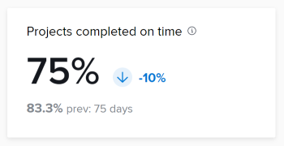

# KPI查询

您可以使用本文中的查询来创建类似于增强型分析中的数据可视化图表。

>[!IMPORTANT]
>
>查询将产生与增强型分析中所示类似的结果，但它们可能不完全匹配。


## 先决条件

在开始之前，您必须

1. 与Business Intelligence (BI)工具建立连接：
   1. [为Snowflake创建Reader帐户或连接](/help/quicksilver/reports-and-dashboards/data-lake/create-a-reader-account.md)
   1. [建立与Workfront数据连接的连接](/help/quicksilver/reports-and-dashboards/data-lake/share-data-externally.md)

建立连接后，即可使用本文档中的查询提取和可视化数据。

## 项目已完成

项目已完成KPI显示过滤后时间段内已完成的项目数，以及自上一个时间段以来百分比增加或减少的情况。 在这些数字的下方，您可以看到上一个时间段内完成的项目数量以及上一个时间段内的天数。


### 查询

```
WITH completedProjectsInRange as ( 
SELECT COUNT(t0.PROJECTID) as PROJECT_COUNT FROM PROJECTS_CURRENT t0 
WHERE t0.ACTUALCOMPLETIONDATE >= '2025-01-01' 
AND t0.ACTUALCOMPLETIONDATE <= '2025-01-31' 
), completedProjectsPreviousRange as ( 
SELECT COUNT(t0.PROJECTID) as PROJECT_COUNT FROM PROJECTS_CURRENT t0 
WHERE t0.ACTUALCOMPLETIONDATE >= '2024-12-01' 
AND t0.ACTUALCOMPLETIONDATE <= '2024-12-31' 
), rawChange as ( 
SELECT (a.PROJECT_COUNT - b.PROJECT_COUNT) as CHANGE_FROM_PREVIOUS_PERIOD FROM completedProjectsInRange a, completedProjectsPreviousRange b 
), percentChange as ( 
SELECT  
CASE 
WHEN a.PROJECT_COUNT = b.PROJECT_COUNT THEN 0.00 
WHEN b.PROJECT_COUNT > 0 THEN ((a.PROJECT_COUNT - b.PROJECT_COUNT) / b.PROJECT_COUNT * 100) 
END AS PERCENT_CHANGE_FROM_PREVIOUS_PERIOD 
FROM completedProjectsInRange a, completedProjectsPreviousRange b 
) 
SELECT 
a.PROJECT_COUNT, 
b.PROJECT_COUNT as PREVIOUS_PROJECT_COUNT, 
c.CHANGE_FROM_PREVIOUS_PERIOD, 
d.PERCENT_CHANGE_FROM_PREVIOUS_PERIOD 
FROM completedProjectsInRange a, completedProjectsPreviousRange b, rawChange c, 
percentChange d
```

## 按时完成的项目

按时完成的项目KPI显示在筛选的时间期内，按时完成的项目百分比，以及自上一时间段以来该百分比如何增加或减少。 在这些数字下面，您可以看到上一个时间段按时完成项目的百分比，以及上一个时间段内的天数。



## 平均 项目持续时间

平均 项目持续时间KPI显示实际结束日期在过滤时段内的项目的平均完成时间（以天、周或年为单位），以及百分比自上一个时段以来增加或减少的方式。 在这些数字下面，您可以看到具有上一时间期实际结束日期的项目平均完成时间量，以及上一时间期中的天数。


## 每个项目平均任务

“每个项目的平均任务KPI”显示在过滤的时间段内分配给项目的平均任务数，以及自上一个时间段以来该百分比如何增加或减少。 在这些数字的下方，您可以看到上一个时段分配给项目的平均任务数以及上一个时段中的天数。

每个项目