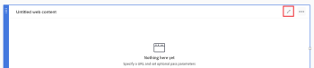

# 在报表画布中添加或编辑Web内容块

Web内容块允许您直接在报表中显示来自外部网站的信息。

## 先决条件

在开始之前，您必须注册报表画布测试版。 有关更多信息，请参阅 [报表画布测试版：概述](/help/quicksilver/product-announcements/betas/reporting-canvas-beta/reporting-canvas-beta-overview.md).

## 添加或编辑Web内容块

1. 单击 **主菜单** 图标  在Adobe Workfront的右上角，单击&#x200B;**报表**.
1. 单击 **新报告**.

   或

   转到现有报表，单击 **更多** 图标  在报表标题中，单击 **编辑**.

1. 在屏幕的右侧，在 **添加块**，则：

   拖动 **Web内容** 图标直接转到所需位置。

   或

   双击 **Web内容** 图标，以将块添加到画布顶部。

   >[!TIP]
   >
   >通过拖动块的角手柄来放置块后，可以更改块的大小。

1. 单击 **无标题Web内容** 在块标题中，键入块的标题。
1. 单击 **编辑** 图标  在块标题中。

   

1. 在 **设置** 打开的面板中，输入要在 **URL** 字段。

   >[!NOTE]
   >
   >目前，只能显示来自选定域的站点。 当前可用的域包括：
   >   
   >   * workfront.com
   >   * google.com
   >   * sharepoint.com
   >   * attask-ondemand.om
   >   * powerbi.com
   >   * domo.com
   >   * looker.com

   如果输入的URL无法嵌入，则会在其下方显示警告。 这些警告包括：

   | 警告名称 | 原因 |
   |---|---|
   | 无效 URL | 输入的URL不会返回有效的网站。 |
   | 提供程序站点限制 | 不允许您尝试嵌入的网站。 |

   {style=&quot;table-layout:auto&quot;}

1. （可选）单击 **传递参数** 切换以打开可用传递参数列表。

   >[!WARNING]
   >
   >传递参数当前处于禁用状态。

1. 单击 **嵌入URL** 保存您的选择并返回到报表。
