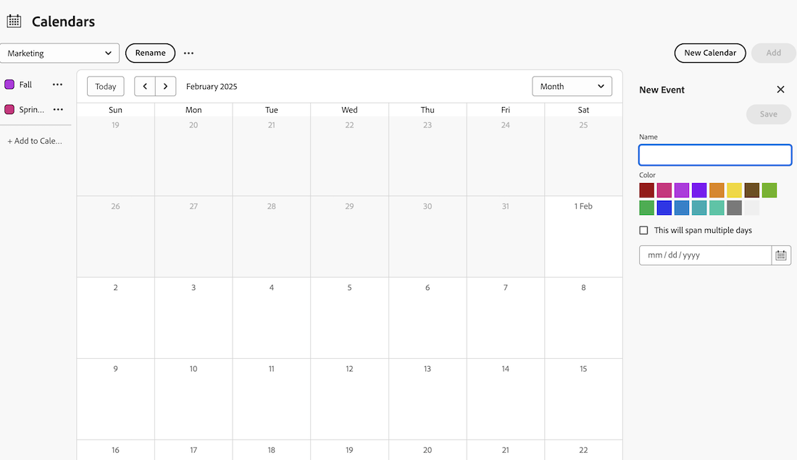

# 将临时事件添加到日历报表

您可以将临时事件添加到日历。 临时事件只是作为日历中的提醒，与项目、任务或问题无关。

## 访问要求

+++ 展开以查看本文中各项功能的访问要求。

<table style="table-layout:auto"> 
 <col> 
 </col> 
 <col> 
 </col> 
 <tbody> 
  <tr> 
   <td role="rowheader">Adobe Workfront包</td> 
   <td> 
任何
 </td> 
  </tr> 
  <tr> 
   <td role="rowheader">Adobe Workfront许可证</td> 
   <td>
标准

       
规划
</td> 
  </tr> 
  <tr> 
   <td role="rowheader">访问级别配置</td> 
   <td> 
 编辑对报告、功能板和日历的访问权限
</td> 
  </tr> 
  <tr> 
   <td role="rowheader">对象权限</td> 
   <td>管理对日历报告的访问</td> 
  </tr> 
 </tbody> 
</table>

有关此表中信息的更多详细信息，请参阅Workfront文档中的[访问要求](/help/quicksilver/administration-and-setup/add-users/access-levels-and-object-permissions/access-level-requirements-in-documentation.md)。

+++

## 将临时事件添加到日历报表

1. 转到要将临时事件添加到的日历。
1. 单击日历顶部的&#x200B;**添加**。
1. 在右侧的侧面板中，**Name**&#x200B;该事件。
1. 选择事件的颜色。
1. 选择事件是否应跨越多天。
1. 使用“日历”图标输入或选择日期。
   