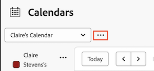

# 删除日历报表

您可以删除您拥有的日历或其他与您共享的日历。 一旦删除，您与其共享日历的用户将无法访问该日历。

您不能删除默认日历，除非您有现有的替代日历。 如果您尝试删除所有日历，系统会自动为您创建默认日历。

## 访问权限要求

+++ 展开可查看本文所述功能的访问权限要求。

<table style="table-layout:auto"> 
 <col> 
 </col> 
 <col> 
 </col> 
 <tbody> 
  <tr> 
   <td role="rowheader">Adobe Workfront 包</td> 
   <td> 
“任一”
 </td> 
  </tr> 
  <tr> 
   <td role="rowheader">Adobe Workfront许可证</td> 
   <td>
标准

       
规划
</td> 
  </tr> 
  <tr> 
   <td role="rowheader">访问级别配置</td> 
   <td> 
 编辑对报表、功能板和日历的访问权限
</td> 
  </tr> 
  <tr> 
   <td role="rowheader">对象权限</td> 
   <td>管理对日历报告的访问权限，有权将其删除</td> 
  </tr> 
 </tbody> 
</table>

有关此表中信息的详细信息，请参阅[Workfront文档中的访问要求](/help/quicksilver/administration-and-setup/add-users/access-levels-and-object-permissions/access-level-requirements-in-documentation.md)。

+++

## 删除日历报表

1. 转到要删除的日历。
1. 单击“日历”下拉菜单旁边的&#x200B;**更多**菜单。
   

1. 从下拉列表中选择&#x200B;**[!UICONTROL 删除]**。
1. 单击&#x200B;**[!UICONTROL 删除]**。
