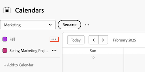

# 编辑现有日历报告

您可以通过添加或删除项目链接来修改现有日历。 您还可以修改与日历报告关联的日历分组。

>[!NOTE]
>
>在一个日历报表中您最多只能包含15个分组。

## 访问要求

+++ 展开以查看本文中各项功能的访问要求。

您必须具有以下权限才能执行本文中的步骤：

<table style="table-layout:auto"> 
 <col> 
 </col> 
 <col> 
 </col> 
 <tbody> 
  <tr> 
   <td role="rowheader">[!DNL Adobe Workfront plan]</td> 
   <td> 
任何
 </td> 
  </tr> 
  <tr> 
   <td role="rowheader">[!DNL Adobe Workfront] 许可证</td> 
   <td>
新增：标准

       
或

       
当前：计划
</td> 
  </tr> 
  <tr> 
   <td role="rowheader">访问级别配置</td> 
   <td> 
[！UICONTROL编辑]对[！UICONTROL报表]、[！UICONTROL功能板]和[！UICONTROL日历的访问权限
</td> 
  </tr> 
  <tr> 
   <td role="rowheader">对象权限</td> 
   <td>[！UICONTROL Manage]对日历报表的访问权限</td> 
  </tr> 
 </tbody> 
</table>

有关此表中信息的更多详细信息，请参阅Workfront文档中的[访问要求](/help/quicksilver/administration-and-setup/add-users/access-levels-and-object-permissions/access-level-requirements-in-documentation.md)。

+++

## 编辑现有日历报告

{{step1-to-calendars}}

1. （可选）要更改日历报告的名称，请单击日历下拉菜单旁边的&#x200B;**重命名**。
如果您已与其他用户或团队共享日历报告，则修改的日历名称会自动更新其日历视图。

1. （可选）要将项目添加到日历报表，请执行以下操作：
   1. 单击&#x200B;**[!UICONTROL 添加到日历]。**
   1. 开始键入要添加日历事件的项目名称，然后单击该名称以将其显示在下拉列表中。
   1. 单击&#x200B;**添加**。
      

1. （可选）要添加日历分组或修改现有日历分组，请执行以下操作：
   1. 单击项目名称旁边的&#x200B;**更多**&#x200B;菜单，然后单击&#x200B;**编辑**。
      

   1. 选择项目分组方式：

      * [在日历报告中使用[!UICONTROL 计划日期]](../../../reports-and-dashboards/reports/calendars/use-planned-dates.md)
      * [在日历报告中使用[!UICONTROL 预计日期]](../../../reports-and-dashboards/reports/calendars/use-projected-dates.md)
      * [在日历报告中使用自定义日期字段](../../../reports-and-dashboards/reports/calendars/use-custom-dates.md)

