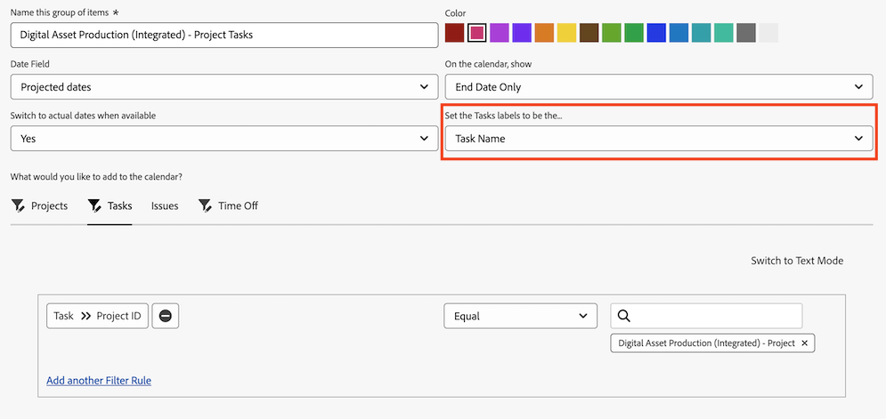

# 在日历报告中使用自定义日期字段

[!UICONTROL 日历]报告是一种动态报告，可提供您工作的可视化呈现。 您可以在日历报表中为以下对象使用自定义日期字段：

* 任务
* 问题
* 项目

## 访问要求

+++ 展开以查看本文中各项功能的访问要求。

您必须具有以下权限才能执行本文中的步骤：

<table style="table-layout:auto"> 
 <col> 
 </col> 
 <col> 
 </col> 
 <tbody> 
  <tr> 
   <td role="rowheader">[!DNL Adobe Workfront plan]</td> 
   <td> 
任何
 </td> 
  </tr> 
  <tr> 
   <td role="rowheader">[!DNL Adobe Workfront] 许可证</td> 
   <td>
新增：标准

       
或

       
当前：计划
</td> 
  </tr> 
  <tr> 
   <td role="rowheader">访问级别配置</td> 
   <td> 
[!UICONTROL 编辑]对[!UICONTROL 报表]、[!UICONTROL 功能板]和&lbrack;！UICONTROL日历的访问权限
</td> 
  </tr> 
  <tr> 
   <td role="rowheader">对象权限</td> 
   <td>[!UICONTROL Manage]对日历报表的访问权限</td> 
  </tr> 
 </tbody> 
</table>

有关此表中信息的更多详细信息，请参阅Workfront文档中的[访问要求](/help/quicksilver/administration-and-setup/add-users/access-levels-and-object-permissions/access-level-requirements-in-documentation.md)。

+++

## 先决条件

1. [!DNL Workfront]实例中必须具有自定义日期字段和字段内可用的值。 如果未设置包含自定义日期的自定义表单，请按照[创建自定义表单](/help/quicksilver/administration-and-setup/customize-workfront/create-manage-custom-forms/form-designer/design-a-form/design-a-form.md)中的说明操作。
1. 将自定义表单附加到计划添加到日历的项目、任务或问题，并指定日期。 有关详细信息，请参阅[将自定义表单添加到对象](../../../workfront-basics/work-with-custom-forms/add-a-custom-form-to-an-object.md)。

## 设置项目组

您可以选择您希望项目组在日历上显示的方式。

{{step1-to-calendars}}

1. 选择要添加新项目组的日历，单击“更多”菜单，然后单击&#x200B;**编辑**。
或
单击&#x200B;**[!UICONTROL +新日历]**，输入项目名称，然后单击&#x200B;**[!UICONTROL 添加高级项目]**。

   >[!NOTE]
   >
   >要创建日历报告，您必须对访问级别中的[!UICONTROL 报告]、[!UICONTROL 仪表板]和[!UICONTROL 日历]具有[!UICONTROL 编辑]访问权限。

1. 指定以下内容：

   <table style="table-layout:auto">
    <col>
    <col>
    <tbody>
     <tr>
      <td role="rowheader"><strong>[!UICONTROL 命名这组项目]</strong></td>
      <td>键入项目组的名称。</td>
     </tr>
     <tr>
      <td role="rowheader"><strong>[!UICONTROL 颜色]</strong></td>
      <td>选择项目组的颜色。 所有项目均以选定的颜色显示在日历报表中。</td>
     </tr>
     <tr>
      <td role="rowheader"><strong>[!UICONTROL 日期字段]</strong></td>
      <td>选择<strong>[!UICONTROL 自定义日期]</strong>。 </td>
     </tr>
     <tr>
      <td role="rowheader"><strong>[!UICONTROL 在日历上，显示]</strong></td>
      <td>
选择日期的显示方式：

       <ul>
        <li><strong>[!UICONTROL Single Date]</strong>：日历在单个日期显示对象。</li>
        <li><strong>[!UICONTROL Duration] （开始到结束）</strong>：日历显示跨天对象。 
注意：如果选择<strong>[!UICONTROL Duration]</strong>，则指定的结束日期必须晚于开始日期，否则日历上不会显示该项目。
</li>
       </ul></td>
     </tr>
     <tr data-mc-conditions="">
      <td role="rowheader"><strong>[!UICONTROL 自定义日期]</strong></td>
      <td>
输入附加到要跟踪的对象上的自定义日期名称。

<strong>注意：</strong>为避免性能问题，自定义日期名称的搜索限制为50个结果。</td>
     </tr>
    </tbody>
   </table>

1. 继续下一节。

### 将对象添加到项目组

设置项目显示方式后，您需要将要在日历上看到的对象添加到分组中。

1. 在&#x200B;**[!UICONTROL 中，您希望向日历添加什么？]**&#x200B;分区，选择

   * **[!UICONTROL 任务]**
   * **[!UICONTROL 项目]**
   * **[!UICONTROL 问题]**

1. 根据要添加到日历中的对象类型，单击&#x200B;**[!UICONTROL 添加任务]**、**[!UICONTROL 添加项目]**、**[!UICONTROL 添加问题]**&#x200B;或&#x200B;**休息时间**。

1. 在下拉菜单中，开始键入字段名称，然后选择要显示在日历上的对象的字段源（例如，**[!UICONTROL 延迟任务]**）。
1. 为日历分组设置条件语句。

   要了解如何设置条件，请参阅[筛选器和条件修饰符](../../../reports-and-dashboards/reports/reporting-elements/filter-condition-modifiers.md)。

   选择对象

1. （可选）通过重复步骤1-4为日历分组指定其他对象。
1. 在&#x200B;**[!UICONTROL 将任务/项目/问题标签设置为……]**&#x200B;字段中，选择此日历分组中的对象在日历中的标签方式。

   >[!NOTE]
   >
   >如果某个对象无法使用默认标签选项，则会改为显示对象名称。 例如，当选择[!UICONTROL 父任务]标签并且没有与对象关联的父任务时，[!DNL Adobe Workfront]将显示您在日历中查看的对象名称。

   
1. 单击&#x200B;**[!UICONTROL 保存]**。

