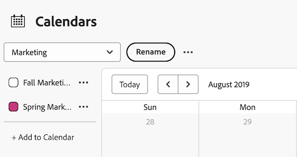

# 查看日历报告和事件详细信息

您可以在Adobe Workfront中查看您创建或与您共享的日历报告和事件详细信息。

## 访问要求

+++ 展开以查看本文中各项功能的访问要求。

<table style="table-layout:auto"> 
 <col> 
 </col> 
 <col> 
 </col> 
 <tbody> 
  <tr> 
   <td role="rowheader">Adobe Workfront包</td> 
   <td> 
任何
 </td> 
  </tr> 
  <tr> 
   <td role="rowheader">Adobe Workfront许可证</td> 
   <td>
投稿人

       
请求
</td> 
  </tr> 
  <tr> 
   <td role="rowheader">访问级别配置</td> 
   <td> 
查看或更高的报告、功能板和日历访问权限
</td> 
  </tr> 
  <tr> 
   <td role="rowheader">对象权限</td> 
   <td>查看日历报表或更高权限</td> 
  </tr> 
 </tbody> 
</table>

有关此表中信息的更多详细信息，请参阅Workfront文档中的[访问要求](/help/quicksilver/administration-and-setup/add-users/access-levels-and-object-permissions/access-level-requirements-in-documentation.md)。

+++

## 查看日历报告

<!--{{step1-to-calendars}}-->

1. 单击Adobe Workfront右上角的&#x200B;**[!UICONTROL 主菜单]**&#x200B;图标，或（如果可用）单击左上角的&#x200B;**[!UICONTROL 主菜单]**&#x200B;图标，然后单击&#x200B;**[!UICONTROL 日历]**。

   根据您的访问级别，您可能会看到列出以下日历：

   * 您的默认[!DNL Adobe Workfront]日历

     Workfront会根据分配给您或分配给您所分配团队、组或角色的项目、任务和问题为您创建日历。

   * 您已创建的日历

     要了解有关创建日历的信息，请参阅[日历报告概述](../../../reports-and-dashboards/reports/calendars/calendar-reports-overview.md)。

   * 其他用户与您共享的日历

     要了解如何共享日历，请参阅[[!UICONTROL 共享日历]报告](../../../reports-and-dashboards/reports/calendars/share-a-calendar-report.md)。

1. （视情况而定）单击&#x200B;**[!UICONTROL 查看]**&#x200B;下拉列表，然后选择要查看的日历持续时间。
   
您可以从以下日历报表视图中进行选择：

   * **[!UICONTROL 月]**：显示日历的四周
   * **[!UICONTROL 周]**：显示日历的一周
   * **[!UICONTROL 甘特图]**：显示日历的连续视图

     通过向下或横向滚动，您可以在&#x200B;**甘特图**&#x200B;视图中查看更多事件。 在为视图填充数据时，将显示一个加载符号。

   >[!NOTE]
   >
   >在&#x200B;**月**&#x200B;和&#x200B;**周**&#x200B;视图中，当前或未来的事件（包括跨越多天的事件，只要它们包含今天或未来的某天即可）具有与项目或日历分组中的颜色对应的阴影。 过去的事件具有更浅的阴影以表示它们不再是最新，但您仍然可以选择和查看这些事件。

1. （可选）如果您在&#x200B;**月**&#x200B;或&#x200B;**周**&#x200B;查看中查看日历，则可以使用以下选项更改日历视图：

   <!--   * To include or exclude weekends:
      1. On the **[!UICONTROL Calendar]** toolbar, click **[!UICONTROL Calendar Actions]**, then from the drop-down list select either **[!UICONTROL Show Weekend]** or **[!UICONTROL Hide Weekend]**.-->

   * 要快速更改显示的日期，请执行以下操作：

      1. 在&#x200B;**[!UICONTROL 日历]**&#x200B;工具栏上，单击日期指示器的左箭头在日历中向后移动，或者单击右箭头向前移动。

         

         显示的日期会根据当前日历视图按间隔进行调整。 例如，如果您在&#x200B;**周**&#x200B;视图中查看日历，则根据您选择的箭头，日历显示一周前或一周后。

      1. （可选）要返回到当前日期，请单击&#x200B;[!UICONTROL **今天**]。

1. （可选）要隐藏链接到日历的项目或日历分组事件，请在项目列表中清除该项目或日历分组。
   
通过选择项目列表中的[!UICONTROL 项目]或日历分组，可以再次显示事件。

## 查看日历报告事件详细信息

您可以在日历中查看当前和过去事件的详细信息。

1. 转到要了解其详细信息的事件，然后单击该事件。 详细信息会在右侧的面板中打开。
1. （可选）要打开关联的项目、任务或问题，请单击对象的标题。
