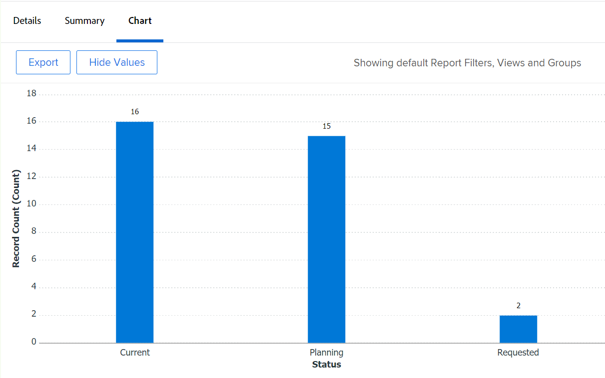
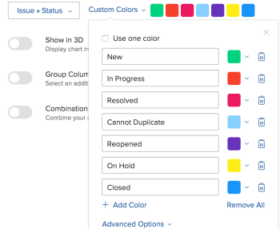

# 向报表中添加图表

<!--Audited: 01/2024-->

您可以通过添加图表来增强报表。 可以将图表添加到现有报表或正在创建的报表。

在将图表添加到报表之前，您应该为报表创建视图和分组。

除非您首先在报表中对信息进行分组，否则不能将图表添加到大多数报表中。 唯一可以在没有分组的情况下添加的图表是量规图。

有关视图的信息，请参阅Adobe Workfront中的[视图概述](../../../reports-and-dashboards/reports/reporting-elements/views-overview.md)。

有关分组的详细信息，请参阅Adobe Workfront中的[分组概述](../../../reports-and-dashboards/reports/reporting-elements/groupings-overview.md)。

如果报表显示的项目过多，则不会创建图表。 在这种情况下，您还必须向报表添加过滤器，以减少报表中的结果数。

有关筛选器的详细信息，请参阅[筛选器概述](../../../reports-and-dashboards/reports/reporting-elements/filters-overview.md)。

## 访问要求

+++ 展开以查看本文中各项功能的访问要求。

您必须具有以下权限才能执行本文中的步骤：

<table style="table-layout:auto"> 
 <col> 
 <col> 
 <tbody> 
  <tr> 
   <td role="rowheader">Adobe Workfront计划</td> 
   <td> 
任何
 </td> 
  </tr> 
  <tr> 
   <td role="rowheader">Adobe Workfront许可证*</td> 
   <td> 
当前：计划 

   或
   
新增：标准
 </td> 
  </tr> 
  <tr> 
   <td role="rowheader">访问级别配置</td> 
   <td> 
编辑对报告、功能板和日历的访问权限
 
编辑对筛选器、视图、分组的访问权限
 </td> 
  </tr> 
  <tr> 
   <td role="rowheader">对象权限</td> 
   <td> 
管理报表的权限
  </td> 
  </tr> 
 </tbody> 
</table>

&#42;要了解您拥有什么计划、许可证类型或访问权限，请与Workfront管理员联系。 有关访问要求的详细信息，请参阅Workfront文档中的[访问要求](/help/quicksilver/administration-and-setup/add-users/access-levels-and-object-permissions/access-level-requirements-in-documentation.md)。

+++

## 向报表中添加图表

1. 转到现有报告或创建新报告。 有关创建新报告的详细信息，请参阅[创建自定义报告](../../../reports-and-dashboards/reports/creating-and-managing-reports/create-custom-report.md)。
1. （视情况而定）如果您转到现有报表，请单击&#x200B;**报表操作** > **编辑**。

1. 确保已更新&#x200B;**列（视图）**&#x200B;选项卡以在报告中显示要绘制图表的信息。

   有关如何创建或修改报表视图的信息，请参阅[在Adobe Workfront中创建或编辑视图](/help/quicksilver/reports-and-dashboards/reports/reporting-elements/create-edit-views.md)。

1. 单击&#x200B;**分组**&#x200B;选项卡并添加分组。

   >[!TIP]
   >
   >* 您只能在报告结果分组时向报告添加图表。
   >* 图表不支持文本模式分组。 有关文本模式分组的详细信息，请参阅[在分组中编辑文本模式](../../../reports-and-dashboards/reports/text-mode/edit-text-mode-in-grouping.md)。
   >* 如果添加代表一个度量的单个分组，则除饼图之外的所有图表都会将分组中的每个结果显示为相同的颜色。

   有关创建分组的详细信息，请参阅[在Adobe Workfront中创建分组](/help/quicksilver/reports-and-dashboards/reports/reporting-elements/create-groupings.md)。

1. 选择&#x200B;**图表**&#x200B;选项卡。
1. 单击图表类型以将其选定。\
   

1. 从以下图表类型中选择：

   * [柱状图](#column-chart)
   * [条形图](#bar-chart)
   * [饼图](#pie-chart)
   * [折线图](#line-chart)
   * [仪表图表](#gauge-chart)
   * [气泡图](#bubble-chart)

1. 单击&#x200B;**保存+关闭**&#x200B;以保存图表和报告。

### 柱状图 {#column-chart}

要向报表添加&#x200B;**列**&#x200B;图表：

1. 开始向报表中添加图表，如[向报表中添加图表](#add-a-chart-to-a-report)中所述。
1. 在&#x200B;**左(Y)轴**&#x200B;字段中，选择要包含在图表Y轴上的值，以及希望如何汇总信息。
1. 在&#x200B;**底部(X)轴**&#x200B;字段中，选择要包含在图表中的分组。
1. （可选）选择&#x200B;**自定义颜色**&#x200B;以将您的首选颜色分配给每个列。\
   有关自定义图表颜色的详细信息，请参阅[自定义图表颜色](#customize-chart-colors)。

1. （可选）选择&#x200B;**以三维方式显示**&#x200B;以三维视图显示图表。
1. （可选） **分组列**：选择此选项可定义您希望如何对列进行分组。\
   从以下选项中选择：

   * 单击以下选项之一以选择分组列的显示方式：

      * **并排**
      * **栈叠**
      * **栈叠到100%**

   * 从&#x200B;**分组数据依据**&#x200B;下拉菜单中选择要包含在图表中的分组。
   * （可选）选择&#x200B;**自定义颜色**&#x200B;以自定义列的颜色。\
     有关自定义图表颜色的详细信息，请参阅[自定义图表颜色](#customize-chart-colors)。

1. （可选）选择&#x200B;**组合图表**&#x200B;以在图表中包括附加值，以及您希望如何汇总信息。\
   请考虑以下选项：

   * **绘制辅助轴**：选择此选项可在图表的右侧绘制数据。
   * **图表类型**：选择您希望将此附加值显示为线形还是第三列。\
     

1. 单击&#x200B;**保存+关闭**&#x200B;以保存图表和报告。

### 条形图 {#bar-chart}

要将&#x200B;**条形图**&#x200B;添加到您的报表，请执行以下操作：

1. 开始向报表中添加图表，如[向报表中添加图表](#add-a-chart-to-a-report)中所述。
1. 在&#x200B;**底部(X)轴**&#x200B;字段中，选择要包含在图表X轴上的值，以及希望如何汇总信息。
1. 在&#x200B;**左(Y)轴**&#x200B;字段中，选择要包含在图表中的分组。
1. （可选）选择&#x200B;**自定义颜色**&#x200B;以自定义条形颜色。\
   有关自定义图表颜色的详细信息，请参阅[自定义图表颜色](#customize-chart-colors)。

1. （可选）选择&#x200B;**以三维方式显示**&#x200B;以三维视图显示图表。
1. （可选）选择&#x200B;**分组栏**&#x200B;以定义您希望如何对栏进行分组。\
   从以下选项中选择：

   * 单击以下选项之一，选择分组栏的显示方式：

      * **并排**
      * **栈叠**
      * **栈叠到100%**

   * 从&#x200B;**分组数据依据**&#x200B;下拉菜单中选择要在图表中对信息进行分组的方式。
   * （可选）选择&#x200B;**自定义颜色**&#x200B;以自定义列的颜色。\
     有关自定义图表颜色的详细信息，请参阅[自定义图表颜色](#customize-chart-colors)。

1. （可选）选择&#x200B;**组合图表**&#x200B;以在图表中包括附加值，以及您希望如何汇总信息。\
   

1. 单击&#x200B;**保存+关闭**&#x200B;以保存图表和报告。

>[!IMPORTANT]
>
>将条形图限制为23个或更少的条形，因为包含超过23个条形的条形图无法正确显示所有条形标签。

### 饼图 {#pie-chart}

要向报表添加&#x200B;**饼图**&#x200B;图表：

1. 开始向报表中添加图表，如[向报表中添加图表](#add-a-chart-to-a-report)中所述。
1. 在&#x200B;**值**&#x200B;字段中，选择要显示在报告上的值，以及希望如何汇总这些值。\
   在&#x200B;**楔形**&#x200B;字段中，选择要包含在图表中的分组。 分组由图表的楔形表示。

1. （可选）选择&#x200B;**自定义颜色**&#x200B;以自定义图表上的楔形颜色。\
   有关自定义图表颜色的详细信息，请参阅[自定义图表颜色](#customize-chart-colors)。

1. （可选）选择&#x200B;**以三维方式显示**&#x200B;以三维视图显示图表。
1. 在&#x200B;**将结果显示为**&#x200B;字段中，选择您希望结果在图表中的显示方式。 请考虑以下选项：

   * **百分比**：图表结果显示为百分比。
   * **数字**：图表结果显示为数字。\
     

1. 单击&#x200B;**保存+关闭**&#x200B;以保存图表和报告。

### 折线图 {#line-chart}

要向报表添加&#x200B;**折线**&#x200B;图表：

1. 开始向报表中添加图表，如[向报表中添加图表](#add-a-chart-to-a-report)中所述。
1. 在&#x200B;**左(Y)轴**&#x200B;字段中，选择要包含在图表Y轴上的值，以及希望如何汇总信息。
1. 在&#x200B;**底部(X)轴**&#x200B;字段中，选择要包含在图表中的分组。
1. （可选）选择颜色以自定义线条的颜色。
1. （可选）选择&#x200B;**组线**，为图表选择其他分组。\
   （可选）选择&#x200B;**自定义颜色**&#x200B;以自定义新分组的颜色。\
   有关自定义图表颜色的详细信息，请参阅[自定义图表颜色](#customize-chart-colors)。

1. （可选）选择&#x200B;**组合图表**&#x200B;以按附加值组合线条。\
   从以下选项中考虑：

   * 选择要包含在图表中的值，以及您希望如何汇总信息。
   * 选择&#x200B;**辅助轴绘图**&#x200B;字段以绘制图表右侧的数据。\
     

1. 单击&#x200B;**保存+关闭**&#x200B;以保存图表和报告。

### 仪表图表 {#gauge-chart}

**量规**&#x200B;图表以量规格式显示符合特定条件的记录数。 量规的指示器指向符合在报告的视图和分组中选择的标准的记录数。 配置量规图不需要报告分组。

要将&#x200B;**量规**&#x200B;图表添加到您的报表，请执行以下操作：

1. 开始向报表中添加图表，如[向报表中添加图表](#add-a-chart-to-a-report)中所述。
1. 在&#x200B;**值**&#x200B;字段中，选择要显示在报告上的值，以及希望如何汇总这些值。 如果选择&#x200B;**记录计数**，则显示的值是报表的对象。

1. 在&#x200B;**指标**&#x200B;字段中，选择要包含在图表中的分组。 分组由图表上的指示符线表示。\
   如果分组包含两个项目，则图表上将显示两个指示器。\
   例如，如果您有一个项目状态分组，并且有两个项目状态（“当前”和“已搁置”），则您的量规图表包含两个量规指标。 他们将会指向处于该状态的项目数。\
   （可选）在&#x200B;**指示器**&#x200B;字段中选择&#x200B;**总计**&#x200B;以显示&#x200B;**值**&#x200B;字段中所选对象的总数。

1. 在&#x200B;**值范围**&#x200B;字段中，指定值的范围和颜色，以表示要在量规图表中显示的这些值。
1. （可选）单击&#x200B;**添加其他值范围**&#x200B;以向图表添加其他值范围。\
   

1. 单击&#x200B;**保存+关闭**&#x200B;以保存图表和报告。

### 气泡图 {#bubble-chart}

在&#x200B;**气泡**&#x200B;图表中，最多可以显示一个对象的三个字段。 这意味着您最多可以在气泡图中显示四个数据点。 每个具有三个关联字段的图元都显示为圆，表示其在X轴和Y轴中的位置内的两个字段。 第三个字段由圆的大小表示。

要向报表添加&#x200B;**气泡**&#x200B;图表：

1. 开始向报表中添加图表，如[向报表中添加图表](#add-a-chart-to-a-report)中所述。
1. 在&#x200B;**左(Y)轴**&#x200B;字段中，选择要包含在图表Y轴上的值。 值来自报表视图。 指定希望如何汇总信息。
1. 在&#x200B;**底部(X)轴字段**&#x200B;中，选择要包含在图表X轴上的值。 值来自报表视图。 指定希望如何汇总信息。

   >[!NOTE]
   >
   >确保您至少有一列是为该字段的激活而汇总的。\
   >有关汇总报告列中的信息的详细信息，请参阅[创建自定义报告](../../../reports-and-dashboards/reports/creating-and-managing-reports/create-custom-report.md)。

1. 在&#x200B;**气泡大小**&#x200B;字段中，选择要以图表中的气泡大小表示的值。 值来自报表视图。 指定希望如何汇总信息。

   >[!NOTE]
   >
   >确保您至少有一列是为该字段的激活而汇总的。\
   >有关汇总报告列中的信息的详细信息，请参阅[创建自定义报告](../../../reports-and-dashboards/reports/creating-and-managing-reports/create-custom-report.md)。

1. 在&#x200B;**气泡**&#x200B;字段中，选择要包含在图表中的分组。 分组由气泡在图表上的放置位置表示。
1. 在&#x200B;**气泡颜色**&#x200B;字段中，选择要用气泡颜色表示的字段。

   

   **气泡颜色**&#x200B;可以是您在报告中定义的分组，但只有当您在&#x200B;**气泡**&#x200B;字段中选择报告对象的&#x200B;**名称**&#x200B;列时，它才可用。

   例如，如果您在任务报告中选择了&#x200B;**任务名称**，则可以添加&#x200B;**任务状态**&#x200B;作为&#x200B;**气泡颜色**&#x200B;字段。

   

   但是，如果您为&#x200B;**气泡**&#x200B;字段选择了&#x200B;**任务状态**，则无法选择&#x200B;**气泡颜色**&#x200B;字段。 此外，您无法为&#x200B;**气泡颜色**&#x200B;字段选择&#x200B;**项目名称**，即使您为&#x200B;**气泡颜色**&#x200B;字段选择&#x200B;**任务名称**&#x200B;也是如此。

   

1. 单击&#x200B;**保存+关闭**&#x200B;以将更改保存到界面生成器。

## 导出图表

可以将图表导出为.pdf文件。

要导出图表，请执行以下操作：

1. 单击&#x200B;**导出**&#x200B;以将图表导出为.pdf。\
   已将.pdf文件下载到您的计算机。

1. 打开.pdf文件。\
   导出的文件包含以下信息：

   * 图表的图像。
   * 标题，即报表的名称。
   * 唯一的文件名，即报表的名称。
   * 包含导出报告的日期和时间以及页码的页脚。

## 自定义图表颜色 {#customize-chart-colors}

您可以让Workfront选择图表中元素的颜色，也可以在将图表添加到报表时自定义这些颜色。 如果您的图表包含表示一个量度的单个分组（例如显示按实际完成日期分组的任务数的任务报告），则分组中的每个结果将以相同的颜色显示。

您只能为报表视图中所显示的字段选择一种颜色。 您可以为“报告分组”中显示的字段选择多种颜色（每种颜色各一个）。

>[!IMPORTANT]
>
>对于日期字段，您只能为图表元素选择一个颜色。

要自定义图表颜色，请执行以下操作：

1. 在构建报告时，转到Report Builder中的&#x200B;**图表**&#x200B;选项卡。
1. 选择要添加到报表中的图表类型。\
   有关将图表添加到报表的详细信息，请参阅[将图表添加到报表](#add-a-chart-to-a-report)。

1. 如果此字段可用，请单击&#x200B;**自定义颜色**。\
   将显示“自定义颜色”对话框。\
   

   >[!NOTE]
   >
   >您可以将自定义颜色与可按其分组的任何字段相关联，并将自定义颜色与可在视图中显示的某些字段（包括自定义字段）相关联。 在“自定义颜色”对话框中选择的自定义字段或自定义字段选项区分大小写。

1. 考虑选择以下任一选项：

   * **使用一种颜色**：图表的所有元素将以选定的颜色显示。

      1. 开始键入所选字段的选项名称，然后选择一种颜色。 此选项以图表的选定颜色显示。
      1. （可选）为您的颜色指定十六进制颜色值，而不是从可用的颜色示例中选择一个值\
         或\
         单击单击十六进制代码后显示的拾色器，然后选择另一种颜色。

   * **添加颜色**：继续为所选字段的所有其他可能选项添加自定义颜色。
   * **全部删除**：选择此选项可删除以上所选字段的所有颜色和选项。
   * **高级选项**：从以下选项中选择：

      * **无值**：选择此字段和自定义颜色以显示对“无值”项进行分组的图表列。 这些项目不能按您在分组中选择的字段的任何选项进行分组。
      * **所有其他值**：选择此字段和自定义颜色以显示以上未选择选项的所有其他图表元素。

        >[!NOTE]
        >
        >最近使用的颜色显示在“自定义颜色”对话框的顶部。 当您将鼠标悬停在最近使用的颜色上时，将显示与其关联的字段的名称。

1. 单击“自定颜色”右上角的“x”以关闭“自定颜色”对话框。 所选颜色会自动保存。
1. 单击&#x200B;**保存+关闭**&#x200B;以保存图表并运行报告。

## 从报告中删除图表

要从报表中删除图表，请执行以下操作：

1. 打开Report Builder的&#x200B;**图表**&#x200B;选项卡。
1. 将鼠标悬停在所选图表类型的图标上，图标的右上角会显示一个“x”按钮。
1. 单击“x”可删除图表。
1. 单击&#x200B;**保存+关闭**。

## 使用图表时的限制

在使用图表时，请注意以下限制：

* Report Builder右侧的&#x200B;**图表预览**&#x200B;部分不包含报表中的实际数据。 您必须保存图表并从&#x200B;**图表**&#x200B;选项卡中查看该图表，才能查看包含数据的图表。

* 某些图表元素不可编辑：

   * 不能更改字体类型，也不能更改每个元素值的大小。
   * 不能更改图表中的轴的名称。

* 无法编辑图表的图例。
* 为分组使用计算字段时，无法单击图表元素。
* 在气泡图中，可在图表中显示的数据点最多为4个。 所有其他图表类型显示两个或最多三个数据点。
