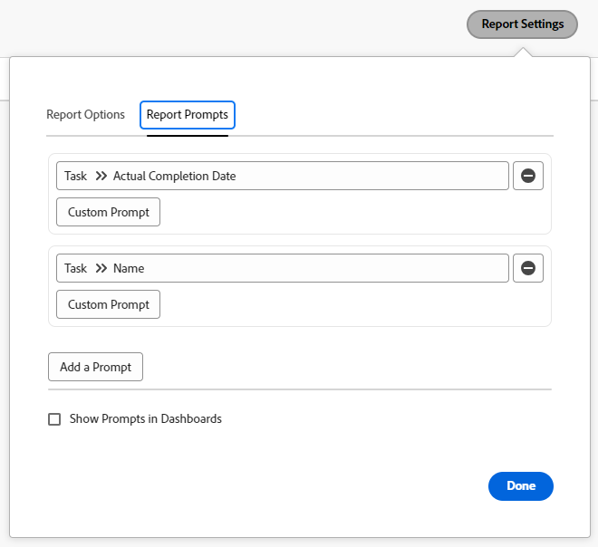
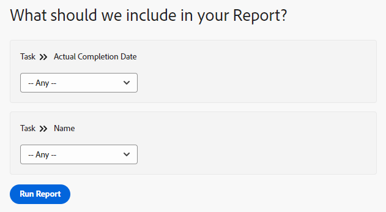

# 向报表添加提示

<!-- Audited: 11/2024 -->

## 提示和筛选器之间的区别

过滤器和提示相似，因为它们都会限制您在报告中显示的信息量。

You build a filter when you want the information displayed in the report to be filtered by the same criteria every time you run the report. Filters are built one time and they are hard coded in the report. For more information about building filters, see the article [Filters overview](../../../reports-and-dashboards/reports/reporting-elements/filters-overview.md).

Prompts are open filters that can be customized and applied differently every time you run a report.

When you add prompts to your report, you can customize the filtering information by editing the prompt criteria every time you run the report. The report runs with a different filter every time, depending on what modifiers you choose, instead of hard coding the modifiers once in the filter of the report.

Prompts act as a customizable filter on reports which can be updated right before you run the report. 您可以创建一般报表，然后根据当天要查看的信息或与单个标准集相关的信息来缩小结果范围。 例如，如果您有“小时数”报告，并且要根据以下条件更改报告的信息：

* 记录工时的日期
* 输入时数的用户
* 输入的工时数

您将生成三个提示，其中条件为所需条件，并且每次运行报告时，报告都会根据为提示选择的信息而有所不同。

过滤器可以告知Adobe Workfront仅显示今年6月至8月之间输入的小时数。 但是，每次运行报表时，如果提示符，您可以使用不同的时间范围（例如，在一月和二月之间或十月和十二月之间）。

## 访问权限要求

+++ 展开可查看本文所述功能的访问权限要求。 

<table style="table-layout:auto"> 
 <col> 
 <col> 
 <tbody> 
  <tr> 
   <td role="rowheader">Adobe Workfront 包</td> 
   <td> <p>“任一”</p> </td> 
  </tr> 
  <tr> 
   <td role="rowheader">Adobe Workfront许可证</td> 
   <td> 
      <p>标准</p>
      <p>规划</p>
   </td>
  </tr> 
  <tr> 
   <td role="rowheader">访问级别配置</td> 
   <td> <p>编辑对报告、功能板和日历的访问权限</p> <p>编辑对筛选器、视图、分组的访问权限</p> </td> 
  </tr> 
  <tr> 
   <td role="rowheader">对象权限</td> 
   <td> <p>管理报表的权限</p>  </td> 
  </tr> 
 </tbody> 
</table>

有关此表中信息的更多详细信息，请参阅Workfront文档中的[访问要求](/help/quicksilver/administration-and-setup/add-users/access-levels-and-object-permissions/access-level-requirements-in-documentation.md)。

+++

## 先决条件

You must create a report before you can add a prompt to it.

有关创建报告的说明，请参阅[创建报告](../../../reports-and-dashboards/reports/creating-and-managing-reports/create-report.md)

## 创建提示

1. 转到要添加提示的报告。
1. 展开&#x200B;**报表操作**，然后单击&#x200B;**编辑**。

1. 单击&#x200B;**报表设置**&#x200B;按钮。
1. 单击&#x200B;**报告提示**&#x200B;选项卡，然后单击&#x200B;**添加提示**。\
   

1. （条件）选择要作为提示基础的字段。 开始键入字段的名称，然后在列表中显示该字段时，单击以将其选中。\
   运行报告的用户可用的选项将因您选择的字段而异。\
   例如，如果您在任务报表上选择一个日期域（如“实际完成日期”），则提示名称将为“实际完成日期”。 在运行此报告时编辑此提示时，可以从一组修饰符中选择以构建筛选语句。 此过程与构建滤镜相同。 For more information about modifiers, see [Filter and condition modifiers](../../../reports-and-dashboards/reports/reporting-elements/filter-condition-modifiers.md).

1. （视情况而定）单击&#x200B;**自定义提示**&#x200B;以创建自定义提示。

   自定义提示是预定义提示，可在运行报表之前对筛选条件进行硬编码。 从这个意义上说，自定义提示比提示更接近于过滤器。

   但是，该提示与常规提示一样灵活，因为您可以从多个预定义语句中进行选择，而不是在报表中仅使用一个硬编码过滤器。

   为自定义提示指定以下信息：自定义提示的条件只能使用文本模式进行编辑。 这允许在单个字段中应用多个条件。

   * **字段名：**&#x200B;这是提示的名称，运行报告前可以看到它。
   * **下拉列表项标签：**&#x200B;这是运行报告前您看到的提示内的选项的名称。
   * **条件：**&#x200B;输入定义提示的条件。
   * **默认值：**&#x200B;您可以选择一个项目作为此提示的默认选项。

   使用与输入文本模式过滤器时相同的语法，并通过“&amp;”连接语句。 有关在文本模式下编辑筛选器的详细信息，请参阅[使用文本模式编辑筛选器](../../../reports-and-dashboards/reports/text-mode/edit-text-mode-in-filter.md)。

   例如，以下方案的自定义提示的&#x200B;**Condition**&#x200B;字段可能如下所示：

   * 项目状态为“想法”、“已请求”、“已计划”和“当前”的未来项目中的所有任务：

     ```
     project:plannedStartDate=$$TODAY&project:plannedStartDate_Mod=gte&project:status=IDA,REQ,PLN,CUR&project:status_Mod=in
     ```

   * 已完成（过去）项目中项目状态为“已完成”或“终止”的所有任务：

     ```
     project:actualCompletionDate=$$TODAY&project:actualCompletionDate_Mod=lte&project:status=CPL,DED&project:status_Mod=in
     ```

   有关文本模式修饰符的详细信息，请参阅[筛选器和条件修饰符](../../../reports-and-dashboards/reports/reporting-elements/filter-condition-modifiers.md)。

   >[!NOTE]
   >
   >运行报告时，不能更改自定义提示的条件，就像更改标准提示一样。 您可以根据需要为自定义提示设置多个预定义条件。

1. (Optional) Repeat Step 4 or Step 5 to create as many prompts as needed.
1. Click **Done**, then click **Save+Close** to save the report.

## 在报表中应用提示

当您将提示添加到报告时，报告的默认选项卡始终是提示选项卡。

要运行带有提示的报告，请执行以下操作：

1. Go to the report with the prompt.

   

1. Choose a condition for one or all the prompts displayed on the **Prompts** tab.\
   (Optional) You can leave the prompts blank and not filter the report by the prompt conditions.

1. 单击&#x200B;**运行报告**。\
   (Conditional) If you populated the prompts, the report is filtered by the conditions you have chosen for your prompts.\
   （条件）如果将提示留空，则报告不按提示条件过滤。 报告会以未筛选的状态显示。

   >[!NOTE]
   >
   >除提示外还包含筛选器的报告会根据筛选器中定义的标准和合并的提示来筛选结果。

## 共享提示报表的限制

>[!CAUTION]
>
>当您共享提示的报告时，已登录和未登录用户使用公共共享链接查看报告时，使用其提示无法运行报告。 在这种情况下，显示报告结果时不会应用任何提示，显示的信息将改为基于用户的访问级别和权限或报告的“以用户身份运行”访问级别和权限（如果已设置）。

以下是从Workfront共享提示报表时的限制：

* 公开共享报告时，用户无法运行带有应用提示的报告，除非他们：拥有Workfront凭据，先登录，然后直接在Workfront中导航到报告（不通过公共共享链接）。

  有关共享报表的更多信息，请参阅文章[在Adobe Workfront中共享报表](../../../reports-and-dashboards/reports/creating-and-managing-reports/share-report.md)。

* 当您计划发送提示报告时，电子邮件附件中的报告会在未提示的情况下包含报告数据。 用户单击电子邮件中的链接访问报告时，必须首先登录才能查看报告并自行运行提示。

  有关安排已交付报告的信息，请参阅[安排自动报告交付](../../../reports-and-dashboards/reports/creating-and-managing-reports/set-up-automatic-report-delivery.md)。

* When running a report with a date-based prompt, the report results will be filtered based on your browser&#39;s time zone settings. This can cause slight discrepancies in the date ranges displayed in a prompted report for dates that are at the beginning or end of a month. If your browser&#39;s time zone settings are tied to a specific location, variations in the that location&#39;s local time (such as adherence to daylight saving time) will also be factored into the dates displayed for a prompted report. This can lead to slight date range discrepancies between users in the same time zone but with different location settings.
