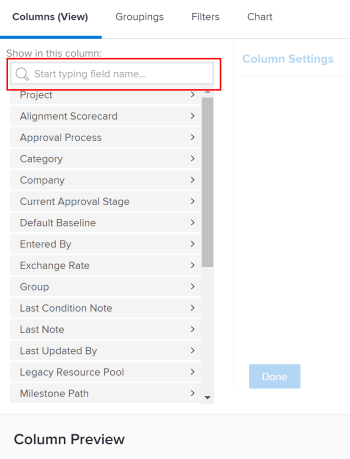

# 创建自定义报表

<!--Audited: 10/2024-->

您可以通过创建报告，提供对贵组织在Adobe Workfront中所需信息的访问权限。 您可以使用Workfront中提供的任何内置报告，也可以从头开始构建自定义报告。

有关内置报告的详细信息，请参阅[使用Adobe Workfront内置报告](../../../reports-and-dashboards/reports/using-built-in-reports/use-workfront-built-in-reports.md)。

有关通过复制报告来创建报告的信息，请参阅[创建报告副本](../../../reports-and-dashboards/reports/creating-and-managing-reports/create-copy-report.md)。

有关创建和管理报告（包括课程、视频和教程）的更多信息，请参阅Adobe Experience League网站上的“学习”部分。

## 访问要求

+++ 展开以查看本文中各项功能的访问要求。

您必须具备以下条件：

<table style="table-layout:auto"> 
 <col> 
 <col> 
 <tbody> 
  <tr> 
   <td role="rowheader">Adobe Workfront计划</td> 
   <td> 
任何
 </td> 
  </tr> 
  <tr> 
   <td role="rowheader">Adobe Workfront许可证</td> 
   <td> 
新增：标准 

   或
   
当前：计划 
 </td> 
  </tr> 
  <tr> 
   <td role="rowheader">访问级别配置</td> 
   <td> 
编辑对报告、功能板和日历的访问权限
 
编辑对筛选器、视图、分组的访问权限
</td> 
  </tr> 
  <tr> 
   <td role="rowheader">对象权限</td> 
   <td> 
您获取对所创建报告的管理权限。
</td> 
  </tr> 
 </tbody> 
</table>

有关信息，请参阅Workfront文档中的[访问要求](/help/quicksilver/administration-and-setup/add-users/access-levels-and-object-permissions/access-level-requirements-in-documentation.md)。

+++

## 创建报告 {#create-a-report}

{{step1-to-reports}}

1. 单击&#x200B;**新建报告**，然后为报告选择所需的对象类型。

   加载Report Builder。

   有关可用对象报表的特定信息，请参阅[了解Adobe Workfront中的对象](../../../workfront-basics/navigate-workfront/workfront-navigation/understand-objects.md)一文中的[对象报表](../../../workfront-basics/navigate-workfront/workfront-navigation/understand-objects.md#reporting-on-objects)部分。

   

   >[!TIP]
   >
   >您也可以通过复制现有报告来创建报告。 有关详细信息，请参阅[创建报告副本](../../../reports-and-dashboards/reports/creating-and-managing-reports/create-copy-report.md)。

1. （可选）要编辑新报表的标题，请在Report Builder左上角的文本字段中输入所需的报表标题。 我们建议仅使用UTF-8字符以避免兼容性问题。

1. 在Report Builder中，将以下内容添加到报表中：

   <table style="table-layout:auto"> 
    <col> 
    <col> 
    <thead> 
     <tr> 
      <th>功能</th> 
      <th>描述</th> 
     </tr> 
    </thead> 
    <tbody> 
     <tr> 
      <td>列（视图）</td> 
      <td> 
向报表中添加列将决定报表包含的信息。
 
要了解如何添加列，请参阅<a href="#add-columns-view-to-a-report" class="MCXref xref">将列（视图）添加到报表</a>。 
 </td> 
     </tr> 
     <tr> 
      <td>分组</td> 
      <td> 
向报表中添加分组可确定报表的组织方式。
 
要了解如何添加分组，请参阅<a href="#add-groupings-to-a-report" class="MCXref xref">将分组添加到报表</a>。
 </td> 
     </tr> 
     <tr> 
      <td>过滤器</td> 
      <td> 
将过滤器规则添加到报表可确定您在报表中看到的信息。
 
要了解如何添加筛选器，请参阅<a href="#add-filters-to-a-report" class="MCXref xref">将筛选器添加到报表</a>。
 </td> 
     </tr> 
     <tr> 
      <td>图表</td> 
      <td> 
向报表中添加图表可确定报表中的信息以可视方式显示。
 
要了解如何添加图表，请参阅<a href="#add-a-chart-to-a-report" class="MCXref xref">将图表添加到报表</a>。
 </td> 
     </tr> 
    </tbody> 
   </table>

1. 在报告创建过程中，随时单击&#x200B;**应用**&#x200B;以保存更改。
1. 完成后，单击&#x200B;**保存+关闭**。

### 向报表中添加列（视图） {#add-columns-view-to-a-report}

1. 开始创建报告，如本文中的[创建报告](#create-a-report)部分所述。
1. 在Report Builder中，选择&#x200B;**列（视图）**&#x200B;选项卡以标识要显示在报表中的列。
1. （可选）单击&#x200B;**应用现有视图**，然后在下拉菜单中单击视图名称以使用现有视图。

   有关创建视图的更多信息，请参阅Adobe Workfront中的[视图概述](../../../reports-and-dashboards/reports/reporting-elements/views-overview.md)。

1. （可选）要删除现有列，请单击要删除的列，然后单击列标题中当前名称旁边的&#x200B;**x**。

1. 要添加新列，请单击&#x200B;**添加列**。

   或

   要更改现有列，请单击列，在Report Builder左上角的&#x200B;**在此列字段中显示**&#x200B;区域中单击当前字段右侧的&#x200B;**删除**&#x200B;图标，并开始键入新字段，然后当该字段显示在列表中时单击它。

   有关您在列中看到的字段的更多信息，请参阅[Adobe Workfront术语词汇表](../../../workfront-basics/navigate-workfront/workfront-navigation/workfront-terminology-glossary.md)。

   

1. （可选）在&#x200B;**列设置**&#x200B;区域，选择&#x200B;**按此列排序**&#x200B;以按字母降序对列中的值进行升序排序，然后指示列表是否应使用此列作为第一个排序。

   如果您要先按一列中的值排序，其次按第二列中的值排序，则报表视图中可以有多个级别的排序，等等。

   如果多个结果根据第一个分类标准相同，则它们按第二个分类标准的顺序排序。 如果多个结果按照第一和第二排序标准相同，则它们按照第三排序标准进行排序，依此类推。

   >[!NOTE]
   >
   >如果添加字段引用的对象与您报告的对象相距太远，则可能无法按该字段排序。\
   >例如，问题报告无法按项目所有者字段排序，因为它引用了3个额外的对象：项目、所有者和名称。 但是，您仍可将此字段添加到问题报告并查看与其相关的信息。

   <!--outdated: To learn more about cross-object references in reports, see the section "Advanced Reporting Part 1 of 3" in the [Reports and Dashboards Learning Path](https://one.workfront.com/s/learningpath2/workfront-reporting-MC7MZT2BOL2ZC2LMJ4MA3EMHOCNY?tabset-dc70e=2).-->

1. （可选）如果您要使用分组并且希望汇总（聚合）列中的信息，请单击&#x200B;**列设置**&#x200B;区域中的&#x200B;**按**&#x200B;汇总此列，然后选择要用于汇总此列中的信息的选项。

   聚合的信息显示在分组行的列中。

   

   有关汇总列中数据的更多信息，请参阅Adobe Workfront中的[视图概述](../../../reports-and-dashboards/reports/reporting-elements/views-overview.md)。

   >[!NOTE]
   >
   >在分组中聚合以下字段的值时，以下例外适用于父对象（例如，父任务）：
   >
   >* 除“实际小时数”（例如，“计划或实际劳力成本”、“计划或实际费用成本”、“计划或实际成本”、“计划小时数”）之外的所有数字和货币字段仅汇总子任务和独立任务的值。 它们不会聚合父任务的值或父任务的父值。
   >* 实际小时数聚合主父级任务和独立任务的值；它们不会聚合父级任务或子级任务的父级任务的数量。
   >* 数字和货币值的自定义数据字段汇总所有任务：父任务、子任务、父任务的父任务和独立任务。

   有关在报表中使用分组的详细信息，请参阅Adobe Workfront中的[分组概述](../../../reports-and-dashboards/reports/reporting-elements/groupings-overview.md)。

1. （可选）单击&#x200B;**高级选项**&#x200B;为列指定以下信息：

   <table style="table-layout:auto"> 
    <col> 
    <col> 
    <tbody> 
     <tr> 
      <td role="rowheader">自定义列标签</td> 
      <td> 
指定列的自定义标签。 此标签将替换默认标签。
 </td> 
     </tr> 
     <tr> 
      <td role="rowheader">字段格式</td> 
      <td> 
选择您希望为列中的字段显示值的格式。
 </td> 
     </tr> 
     <tr> 
      <td role="rowheader">在仪表板上显示此列</td> 
      <td> 
当报告与其他报告并排显示时，选择此选项可在功能板上显示此列。 如果未选择此选项，则在报告并排显示的功能板上查看报告时，不会显示此列。
 </td> 
     </tr> 
     <tr> 
      <td role="rowheader">列规则</td> 
      <td> 
单击<strong>添加此列的规则</strong>以向该列添加条件格式。 添加规则后，您可以定义字段和文本样式，以显示与该规则匹配的字段。 完成规则定义后，单击<strong>添加规则</strong>。 有关视图中条件格式化的详细信息，请参阅<a href="../../../reports-and-dashboards/reports/reporting-elements/use-conditional-formatting-views.md" class="MCXref xref">在视图中使用条件格式</a>。
 </td> 
     </tr> 
    </tbody> 
   </table>

1. 单击&#x200B;**应用**&#x200B;以应用您目前所做的更改，并使用以下选项继续编辑报告。

   如果您已完成编辑报告中的列，并且要保存报告，请单击&#x200B;**保存+关闭**。

### 向报表中添加分组 {#add-groupings-to-a-report}

1. 开始创建报告，如本文中的[创建报告](#create-a-report)部分所述。
1. 在Report Builder中，选择&#x200B;**分组**&#x200B;选项卡以标识要对报表中的项目进行分组的方式。
1. 单击&#x200B;**添加分组**&#x200B;以添加新分组。

   或

   选择&#x200B;**应用现有分组**&#x200B;以在列表中显示现有分组时将其选定。

   

1. 开始键入要作为分组添加的字段。 如果该字段可用，则会填充每个可关联该字段的对象。 单击字段名称以将其添加到该分组。
1. （可选）您可以通过单击&#x200B;**切换到文本模式**，选择在文本模式下构建分组。 有关使用文本模式的详细信息，请参阅[文本模式概述](../../../reports-and-dashboards/reports/text-mode/understand-text-mode.md)。

   有关创建新分组的详细信息，请参阅Adobe Workfront中的[分组概述](../../../reports-and-dashboards/reports/reporting-elements/groupings-overview.md)。

1. （可选）如果希望此分组中的结果显示折叠而非展开，请选择&#x200B;**默认情况下折叠此分组**。

   默认情况下，此设置处于禁用状态，分组的结果始终显示在展开列表中。

   >[!TIP]
   >
   >* 当您在查看列表时手动调整分组时，Workfront会记住您的手动首选项，直到您注销。 重新登录时，将根据此设置显示列表。
   >* 从图表元素访问分组结果后，这些结果始终以展开形式显示。

1. （可选）单击&#x200B;**切换到矩阵分组**&#x200B;以构建矩阵分组并以网格格式显示结果。

   有关生成矩阵报表的详细信息，请参阅[创建矩阵报表](../../../reports-and-dashboards/reports/creating-and-managing-reports/create-matrix-report.md)。

1. 单击&#x200B;**应用**&#x200B;以应用您目前所做的更改，并使用以下选项继续编辑报告。

   如果您已完成编辑报告中的分组并想要保存报告，请单击&#x200B;**保存+关闭**。

### 将过滤器添加到报表 {#add-filters-to-a-report}

1. 开始创建报告，如本文中的[创建报告](#create-a-report)部分所述。
1. 在Report Builder中，选择&#x200B;**筛选器**&#x200B;选项卡以确定您希望报表包含的信息量。
1. 单击&#x200B;**添加筛选器规则**&#x200B;以添加自定义筛选器。\
   或\
   选择&#x200B;**应用现有筛选器**&#x200B;以使用现有筛选器。

   

1. 如果您单击&#x200B;**添加筛选器规则**，请开始键入要添加为筛选器的字段。 如果该字段可用，则会填充每个可关联该字段的对象。 单击字段名称以将其添加到该过滤器。\
   使用过滤器修饰符构建您的过滤器。 有关筛选器修饰符的详细信息，请参阅[筛选器和条件修饰符](../../../reports-and-dashboards/reports/reporting-elements/filter-condition-modifiers.md)。

   有关创建新筛选器的更多信息，请参阅[筛选器概述](../../../reports-and-dashboards/reports/reporting-elements/filters-overview.md)。

1. （可选）您可以通过单击&#x200B;**切换到文本模式**，选择在文本模式下构建筛选器。

   有关使用文本模式的详细信息，请参阅[文本模式概述](../../../reports-and-dashboards/reports/text-mode/understand-text-mode.md)。

1. 完成编辑报告中的筛选器后，单击&#x200B;**应用**&#x200B;以应用到目前为止所做的更改，并使用以下选项继续编辑报告。

   如果报告想要保存，请单击&#x200B;**保存+关闭**。

### 向报表中添加图表 {#add-a-chart-to-a-report}

1. 开始创建报告，如本文中的[创建报告](#create-a-report)部分所述。
1. 在Report Builder中，选择&#x200B;**图表**&#x200B;选项卡，然后选择要添加的图表类型。

   

   有关在报告中构建图表的详细信息，请参阅[将图表添加到报告中](../../../reports-and-dashboards/reports/creating-and-managing-reports/add-chart-report.md)。

1. 单击&#x200B;**应用**&#x200B;以应用您目前所做的更改，并使用以下选项继续编辑报告。

   如果您已完成编辑报告并想要保存报告，请单击&#x200B;**保存+关闭**。
