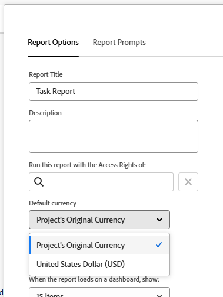

# 创建具有唯一汇率的财务数据报表

如果已在Adobe Workfront中配置了多个汇率，则可以在报表和列表中设置财务值，以默认货币以外的货币显示。

>[!IMPORTANT]
>
>如果您在视图中选择默认货币以外的货币，则项目列表底部将不再显示链接&#x200B;**添加更多任务**&#x200B;和&#x200B;**添加更多问题**。

有关如何更改给定项目的默认货币的信息，请参阅[更改项目货币](../../../manage-work/projects/project-finances/change-project-currency.md)。

如果报表中存在具有单一货币的项目，则分组的总和也会以系统默认货币显示。

## 访问要求

您必须具有以下权限才能执行本文中的步骤：

<table style="table-layout:auto"> 
 <col> 
 <col> 
 <tbody> 
  <tr> 
   <td role="rowheader">Adobe Workfront计划*</td> 
   <td> 
任何
 </td> 
  </tr> 
  <tr> 
   <td role="rowheader">Adobe Workfront许可证*</td> 
   <td> 
计划 
 </td> 
  </tr> 
  <tr> 
   <td role="rowheader">访问级别配置*</td> 
   <td> 
编辑对报告、功能板和日历的访问权限
 
编辑对筛选器、视图、分组的访问权限
 
注意：如果您仍然没有访问权限，请咨询Workfront管理员是否对您的访问级别设置了其他限制。 有关Workfront管理员如何修改您的访问级别的信息，请参阅<a href="../../../administration-and-setup/add-users/configure-and-grant-access/create-modify-access-levels.md" class="MCXref xref">创建或修改自定义访问级别</a>。
 </td> 
  </tr> 
  <tr> 
   <td role="rowheader">对象权限</td> 
   <td> 
管理报表的权限
 
有关请求其他访问权限的信息，请参阅<a href="../../../workfront-basics/grant-and-request-access-to-objects/request-access.md" class="MCXref xref">请求访问对象</a>。
 </td> 
  </tr> 
 </tbody> 
</table>

&#42;要了解您拥有什么计划、许可证类型或访问权限，请与Workfront管理员联系。

## 先决条件

要查看本节所述的备用货币，Workfront管理员必须先在Workfront的“设置”区域中启用并配置多种货币。 有关信息，请参阅[设置汇率](../../../administration-and-setup/manage-workfront/exchange-rates/set-up-exchange-rates.md)。

## 将财务值应用到报表 {#apply-financial-values-to-a-report}

要在处理报表时在不同货币之间转换财务值，请执行以下操作：

1. 转到要将财务值转换为其他货币的报表。
1. 单击&#x200B;**视图**&#x200B;下拉列表，单击&#x200B;**更改货币**，然后选择以下要显示财务值的货币之一：

   * 项目原始货币
   * 任何其他货币

     >[!TIP]
     >
     >您只能选择以前在“设置”中选择的货币。

   使用此选项可以快速转换报表中不同汇率值之间的财务值。

   

   <!--
   
(NOTE: drafted this tip because I think this is confusing; this is in the step above.)

   -->

   <!--
   <note type="tip">
   You can also select the Change Currency option to convert financial values in other lists.
    
   
    
    
   </note>
   -->

## 使用不同币种显示多个项目中的默认币种

在项目级别自定义货币，并且希望在同一报表中显示所有项目的信息时，存在以下情况：

* 如果创建的报表从应用了不同货币的两个或多个项目引入财务信息，则默认情况下，分组摘要将反映Workfront管理员选择的系统默认货币。
* 如果为具有相同货币的两个或多个项目创建报告，但它们与系统的默认货币不同，则使用系统默认货币显示分组中的总和。
* 如果您为两个或更多项目创建了一个报表，这些项目的工作角色分配与货币改写相关联，则Workfront会将财务信息从工作角色的已改写货币汇率折换为项目的货币（在视图中选择项目的原始货币时），或折换为查看报表时选择的任何其他货币。 有关覆盖工作角色的货币的信息，请参阅[创建和管理工作角色](../../../administration-and-setup/set-up-workfront/organizational-setup/create-manage-job-roles.md)。

要在报表中显示两个使用自定义货币的项目，请执行以下操作：

1. 创建两个应用了不同货币的项目。

   

1. 记录两个项目的小时数。

   有关记录时间的详细信息，请参阅[记录时间](../../../timesheets/create-and-manage-timesheets/log-time.md)。

1. 单击&#x200B;**主菜单**&#x200B;图标，然后单击&#x200B;**报表**。
1. 单击&#x200B;**新建报告**，然后单击&#x200B;**项目报告**。
1. 在&#x200B;**列（视图）**&#x200B;选项卡中，添加&#x200B;**实际成本**&#x200B;列，并按&#x200B;**总和**&#x200B;进行汇总。

   有关如何创建列的信息，请参阅Adobe Workfront中的[视图概述](../../../reports-and-dashboards/reports/reporting-elements/views-overview.md)。

1. 在&#x200B;**分组**&#x200B;选项卡中，应用&#x200B;**规划完成日期**&#x200B;分组。

   有关如何创建分组的信息，请参阅Adobe Workfront中的[分组概述](../../../reports-and-dashboards/reports/reporting-elements/groupings-overview.md)。

1. 在&#x200B;**筛选器**&#x200B;选项卡中，为&#x200B;**项目名称**&#x200B;添加筛选器，然后选择两个使用不同货币的项目。

   有关如何创建筛选器的信息，请参阅[筛选器概述](../../../reports-and-dashboards/reports/reporting-elements/filters-overview.md)。

1. 单击&#x200B;**保存+关闭**。

   **实际成本**&#x200B;的总数使用系统默认货币显示在分组中，而不管报告中的项目货币是什么。

   

   如果两个项目使用不同的币种，则系统默认币种也会显示在报表的分组中。

## 在项目层的报表中显示项目币种

如果对项目中的任务或小时列表应用分组，则分组的总和将以项目的货币显示。

1. 使用不同于系统默认货币的自定义货币创建项目。
1. 转到项目，并确保其中包含为任务记录的小时数。

   有关记录时间的详细信息，请参阅[记录时间](../../../timesheets/create-and-manage-timesheets/log-time.md)。

   >[!NOTE]
   >
   >任务应分配给具有每小时费率成本费率的用户或工作角色。

1. 单击&#x200B;**任务**。
1. 展开&#x200B;**视图**&#x200B;下拉菜单并选择&#x200B;**新建视图**。
1. 将&#x200B;**实际成本**&#x200B;作为新列添加到新视图中，并按&#x200B;**总和**&#x200B;进行汇总。
1. 单击&#x200B;**完成**，然后单击&#x200B;**保存视图**。
1. 展开&#x200B;**分组**&#x200B;下拉菜单并选择&#x200B;**新建分组**。
1. 将&#x200B;**实际完成日期**&#x200B;作为新字段添加到新分组中，然后单击&#x200B;**保存分组**。

   **实际成本**&#x200B;列汇总到新分组中，并以项目的货币显示总计。

## 编辑具有唯一货币的报告

在将报表设置更改为显示项目的原始货币之前，报表中的财务字段不可编辑。

要在报表中内联编辑财务字段，请执行以下操作：

1. 导航到报表。

   >[!NOTE]
   >
   >如果默认货币未在任何其他区域为列表显示，您可以编辑视图以显示默认货币。\
   >有关如何更改视图中的货币的信息，请参阅本文[将财务值应用到报表](#apply-financial-values-to-a-report)一节。

1. 单击&#x200B;**报告操作**，然后选择&#x200B;**编辑**。
1. 单击&#x200B;**报表设置**。
1. 单击&#x200B;**默认货币**&#x200B;下拉列表，然后选择&#x200B;**项目的原始货币**。

   

1. 单击&#x200B;**完成**。
