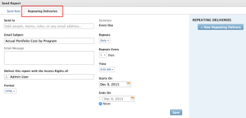

# 报表交付概述

<!-- Audited: 11/2024 -->

<!--

(NOTE: This is linked to the UI in the Send Report box inside the Preview sandbox. If you change title, log bug for Dev to fix the link) 

-->

您可以安排报表按照定义的计划自动交付给用户，也可以手动发送一次性报表。 从Adobe Workfront发送报告时，用户会收到一封电子邮件，其中包含单独附件中的Workfront报告。

有关设置报表交付的信息，请参阅文章[计划自动报表交付](../../../reports-and-dashboards/reports/creating-and-managing-reports/set-up-automatic-report-delivery.md)。

您不能计划报表提交，也不能在“预览沙盒”环境中手动提交报表。 有关预览沙盒的更多信息，请参阅文章[Adobe Workfront预览沙盒环境](../../../administration-and-setup/set-up-workfront/workfront-testing-environments/wf-preview-sandbox-environment.md)。\
有关在预览Sandbox环境中提交报告的更多信息，请参阅文章[在预览Sandbox环境中发送报告](../../../reports-and-dashboards/reports/creating-and-managing-reports/send-report-preview-sandbox-environment.md)。

## 报表投放限制

<!--

(NOTE: [! This information is shared between "Exporting Data" and "Setting Up Report Deliveries."])

-->

计划报表提交时，请考虑以下事项：

* 您最多可以为任何给定报告安排10个重复报告交付。
* 只有当您是报表的创建者时，才能安排报表的发送。 如果您需要发送未创建的报表，则可以手动发送。

## 导出限制

存在几种大小限制，它们会影响报表在Workfront中的显示方式以及它们通过手动导出、已交付报表或通过API导出的方式：

* **10MB文件大小：**&#x200B;任何计划传送的导出报告的文件大小限制。 如果附加到电子邮件的导出文件大于5MB，则会通过电子邮件发送可下载文件的链接，而不是附加的导出报告。

  >[!NOTE]
  >
  >大于10MB的Excel .xlsx文件不会生成电子邮件。 您可以手动将报告导出为此格式。 有关导出报告的信息，请参阅[导出数据](../../../reports-and-dashboards/reports/creating-and-managing-reports/export-data.md)。

* **50,000行：**&#x200B;报表导出中允许用于.pdf和Tab分隔文件的数据行数。

  对于Excel .xls文件，此限制为&#x200B;**65,000行**。

  对于Excel .xlsx文件，此限制为&#x200B;**100,000行**。

  这些限制不包括列标题以及报告中分组的行。 例如，如果报表中有6个分组，且有50,000行数据，则导出的文件将有50,000行。

  如果报表中的项目数超过这些限制，您将收到一个错误，指出报表导出和交付失败。 将您在屏幕上看到的项目数减少到一个小于或等于这些限制的数字，以便能够交付结果。 如果要导出所有数据，我们建议您使用过滤器来获取较小的数据负载，然后执行多次导出。 有关详细信息，请参阅[筛选器概述](../../../reports-and-dashboards/reports/reporting-elements/filters-overview.md)。

  这些限制适用于：

   * 手动导出报告。
   * 计划报表。
   * 通过API集成导出。
   * 通过快速启动导出的数据。

     有关通过Kick-Starts导出数据的更多信息，请参阅文章[通过Kick-Starts从Adobe Workfront导出数据](../../../administration-and-setup/manage-workfront/using-kick-starts/export-data-from-wf-via-kick-starts.md)。

     >[!NOTE]
     >
     >您可以在快速启动文件中导出50,000行，但只能导出为Excel格式文件。

   * 导出项目的利用率信息。

     有关导出项目的利用率信息的详细信息，请参阅[资源利用率报告概览](../../../reports-and-dashboards/reports/using-built-in-reports/resource-utilization-report.md)。

* **65,530个超链接：**&#x200B;这是Excel对包含65,530个以上超链接的文档施加的限制。 手动导出这些文档或在送达报表中发送它们时，无法打开它们。 请注意，一个Excel文档可能只有200行数据，但如果文档中有超过65,530个链接，则该文档不会打开。 此限制仅存在于Excel文件中，而不存在于其他支持的格式中。
* **256列**：这是Excel对包含超过256列的文档施加的限制。 这些文档无法手动导出，也不能在已送达的报告中发送。 此限制仅存在于Excel文件中，而不存在于其他支持的格式中。

如果尝试导出超出限制的数据，则可能不会在导出中收到所有预期的数据。 而是在此限制内生成修改后的报表。

此外，需要超过60分钟才能运行的报表将被停止。

如果您对您的限制有任何顾虑或问题，请联系Workfront技术支持。

## 了解已传送报表的时间戳

<!--

(NOTE: Note about if this is delivered at a time based on the user's time zone settings?)

-->

以电子邮件接收报表时，如果您要在报表传送的同时在Workfront中查看该报表，则报表上的时间戳和时间格式可能会与Workfront中的时间戳和时间格式不匹配。

请考虑以下事项：

* 在浏览器中查看报告时，报告上的时间戳和格式与浏览器的区域设置和时区匹配，如浏览器的设置中所定义。
* 通过电子邮件提交报表时，报表将带有时间戳，时间戳和格式与在Workfront配置文件中指定的用户区域设置和时区相匹配。\
  有关Workfront中用户区域设置和时区的详细信息，请参阅文章[编辑用户配置文件](../../../administration-and-setup/add-users/create-and-manage-users/edit-a-users-profile.md)。

## 具有特殊视图的报告 {#reports-with-a-special-view}

将特殊视图应用于报表时，特殊视图将显示在Workfront中报表的详细信息选项卡中。

当您计划具有特殊视图的报表的投放时，详细信息选项卡会在已发送电子邮件的附件中投放，而不是在特殊视图中投放。

以下被视为特殊观点：

* 项目报告中的里程碑视图
* 项目或任务报告的甘特图
* 以图表作为默认选项卡的报表

>[!NOTE]
>
>如果除了具有特殊视图的默认选项卡之外，报表上还具有“矩阵”选项卡，则报表会按其显示在“矩阵”选项卡上的方式进行交付。

有关如何将特殊视图应用于报表的更多信息，请参阅文章[创建自定义报表](../../../reports-and-dashboards/reports/creating-and-managing-reports/create-custom-report.md)。

## 使用交付的文件

从Workfront发送报告时，用户会收到一封电子邮件，其中报告位于单独的附件中。

* [主题行、附件名称和报告标题](#subject-line-attachment-name-and-report-title)
* [时间戳](#timestamps)
* [品牌](#branding)
* [正在格式化](#formatting)
* [链接](#links)

### 主题行、附件名称和报告标题 {#subject-line-attachment-name-and-report-title}

有关已传送报表电子邮件的主题行的详细信息，请参阅[计划自动报表传送](../../../reports-and-dashboards/reports/creating-and-managing-reports/set-up-automatic-report-delivery.md)。

附加报告的名称是： *The_Name_Of_The_Report*，后面是导出的文件格式。

如果您计划将传送的报表格式化为PDF或HTML文件，则报表的标题将为：

*报告的名称。*

计划以Excel、Excel (.xlsx)或TSV格式传送的报表没有标题。

>[!NOTE]
>
>如果报告有说明，并且文件格式为PDF或HTML文件，则该报告将包含在导出的文件中。

### 时间戳 {#timestamps}

仅当文件的格式为.pdf时，附加文件才会显示时间戳。 时间戳位于附加文件的页脚中。

时间戳包括：

* 日期
* 时间
* 发送报告的时区

### 品牌化 {#branding}

如果您的Workfront管理员向Workfront实例添加了自定义品牌，则以.pdf格式发送的报告还将包含您的个性化徽标。

以所有其他格式发送的报表不能使用您的徽标进行个性化。

有关将Workfront实例品牌化的详细信息，请参阅文章[将Adobe Workfront实例品牌化](../../../administration-and-setup/customize-workfront/brand-workfront/brand-your-workfront-instance.md)。

### 格式设置 {#formatting}

在发送或计划发送报告时，除非报告具有特殊视图，否则您始终会收到报告的详细信息选项卡。

如果报表在Web应用程序中具有特殊格式，则在仅针对.pdf和Excel文件交付“详细信息”和“矩阵”选项卡时，应使用特殊格式交付报表。

报告的过滤器、视图或分组不包含在传送的文件中。 仅当以PDF文件形式发送报表时，才会包含报表的描述。

有关以特殊视图接收报告的详细信息，请参阅文章[具有特殊视图的报告](#reports-with-a-special-view)。\
有关选择报表的默认选项卡以及特殊格式设置的详细信息，请参阅[创建自定义报表](../../../reports-and-dashboards/reports/creating-and-managing-reports/create-custom-report.md)。

### 链接 {#links}

当您将报表从Workfront发送到PDF或Excel格式时，原始文档中存在的任何工作链接都保留在发送的文件中。 链接可以指向Workfront中支持链接的任何对象。

电子邮件中报告的名称也是一个链接。

## 计划报告的报告

您可以通过创建以下内容来查看报表是否已配置为交付：

* 报表列表或报表中报表对象的&#x200B;**视图**：在报表列表或报表的报表中创建视图，并将以下列添加到视图中：\
  *计划报表名称。\
  *为该报告计划的所有投放的名称列在项目符号列表的列中。\
  

* 报表对象的&#x200B;**筛选器**：使用以下语句在报表列表或报表报表中创建筛选器： *计划报表ID不为空*。\
  这将仅显示在您的列表或报告中安排的报告。\
  \
  有关创建报告的详细信息，请参阅[创建自定义报告](../../../reports-and-dashboards/reports/creating-and-managing-reports/create-custom-report.md)。 有关创建报告的信息，请参阅[创建报告活动报告](../../../reports-and-dashboards/reports/report-usage/create-report-reporting-activities.md)。

<!--
<h2 data-mc-conditions="QuicksilverOrClassic.Draft mode">Scheduling a Repeating Report Delivery</h2>
-->

<!--

You can schedule up to 10 repeating report deliveries for any given report.

-->

<!--

You can schedule a report to be delivered only if you are the creator of the report. If you need to send a report that you did not create, you can send it on a manual basis.

-->

<!--

To schedule a report for automatic delivery or to edit an existing report delivery: ​

-->

<!--
   <li value="1" data-mc-conditions="QuicksilverOrClassic.Draft mode">Navigate to and click the name of the report for which you want to schedule delivery. </li>
   -->

<!--
   <li value="2" data-mc-conditions="QuicksilverOrClassic.Draft mode">Click <strong>Report Actions</strong>, then <strong>Send Report</strong>.  The <strong>Send Report</strong> dialog box is displayed.</li>
   -->

<!--
   <li value="3" data-mc-conditions="QuicksilverOrClassic.Draft mode">Select the <strong>Repeating Deliveries</strong> tab. </li>
   -->

<!--
   <li value="4" data-mc-conditions="QuicksilverOrClassic.Draft mode">(Conditional) To modify an existing repeating report delivery, select the report delivery in the <strong>Repeating Deliveries</strong> section.</li>
   -->

<!--
   <li value="5" data-mc-conditions="QuicksilverOrClassic.Draft mode">Specify the following information:
   <ul>
   <li data-mc-conditions="QuicksilverOrClassic.Draft mode"><strong>Send to:</strong> Begin typing the name of the user, group, team, or role who you want to send the report to, then click the name when it appears in the drop-down list. Or Specify the email address of a person external to the Workfront system who you want to have access to the report.  Repeat this process to send the report to multiple users, groups, teams, or roles.</li>
   <li data-mc-conditions="QuicksilverOrClassic.Draft mode"><strong>Email Subject:</strong> Specify a subject for the email notification.  By default, the email subject is: <em>Workfront Report: <Name of the report> Date of the Export</em>.<strong></strong></li>
   <li data-mc-conditions="QuicksilverOrClassic.Draft mode"><strong>Email Message:</strong> Specify a message to include in the email. By default, the email message is: <em>Attached is the <report frequency> report <Name of the report> generated by Workfront on <Date>.</em> 
   <note type="note">
   For reports delivered as an Excel file only, the following message is also added to the email: "Please be aware that with MS Excel (XLS) file types, there is a limit (65,530) on the number of hyperlinks these file types support. If you exceed those limits, your file will not open and it is recommended to resend without the hyperlinks. Please go back to the report scheduler to remove hyperlinks and resend the report." The "please go back to the report scheduler" phrase is a link back to the report. 
   </note>
   </li>
   <li data-mc-conditions="QuicksilverOrClassic.Draft mode"><strong>Deliver this report with the Access Rights of:</strong> Begin typing the name of a user who has access to the report, then click the name when it appears in the drop-down list. Users who receive the report will be granted the same level of access to the report as the user that you specify here.  For more information, see <a href="../../../reports-and-dashboards/reports/creating-and-managing-reports/run-deliver-report-access-rights-another-user.md" class="MCXref xref">Run and deliver a report with the access rights of another user</a>
   <note type="note">
   This field does not support wildcards. For example, using the wildcard $$User.ID does not run the report with the access rights of the user who is receiving the report.
   </note>
   </li>
   <li data-mc-conditions="QuicksilverOrClassic.Draft mode"><strong>Format:</strong> Select in which of the following formats you want the report to be delivered:
   <ul>
   <li data-mc-conditions="QuicksilverOrClassic.Draft mode"> HTML</li>
   <li data-mc-conditions="QuicksilverOrClassic.Draft mode">PDF</li>
   <li data-mc-conditions="QuicksilverOrClassic.Draft mode">MS Excel</li>
   <li data-mc-conditions="QuicksilverOrClassic.Draft mode">MS Excel (.xlsx)</li>
   <li data-mc-conditions="QuicksilverOrClassic.Draft mode">TSV  </li>
   </ul></li>
   <li data-mc-conditions="QuicksilverOrClassic.Draft mode"><strong>Include Links:</strong> This option is available only when <strong>MS Excel</strong> is selected in the <strong>Format</strong> drop-down menu. When this option is enabled, any hyperlinks are included in the exported Excel document.  Documents that contain more than 65,530 links cannot be opened. If the exported document will contain more than 65,530 links, deselect this option. This option is enabled by default. </li>
   <li data-mc-conditions="QuicksilverOrClassic.Draft mode"><strong>Summary:</strong> Displays a summary of when the delivery repeats.</li>
   <li data-mc-conditions="QuicksilverOrClassic.Draft mode"><strong>Repeats:</strong> Select whether the report should be delivered daily, weekly, monthly, or yearly.</li>
   <li data-mc-conditions="QuicksilverOrClassic.Draft mode"><strong>Repeats Every:</strong> Select the frequency with which you want the delivery to repeat. The value you select for this option is based on the option that is selected in the <strong>Repeats</strong> drop-down list.</li>
   <li data-mc-conditions="QuicksilverOrClassic.Draft mode"><strong>Time:</strong> Select the time of day for the delivery to be sent.</li>
   
<strong>Repeats On:</strong> This option is available when the <strong>Repeats</strong> option is set to either <strong>Weekly</strong> or <strong>Monthly</strong>.

   <li data-mc-conditions="QuicksilverOrClassic.Draft mode">When the <strong>Repeats</strong> option is set to <strong>Weekly</strong>: Select the days of the week that the delivery is sent.</li>
   <li data-mc-conditions="QuicksilverOrClassic.Draft mode">When the <strong>Repeats</strong> option is set to <strong>Monthly</strong>: Select whether the delivery is sent on the day of the month, day of the week, or last day of the month (these options leverage the date that you select in the <strong>Starts On</strong> field).</li>
   <li data-mc-conditions="QuicksilverOrClassic.Draft mode"><strong>Starts On:</strong> Select the date for the scheduled delivery to begin.</li>
   <li data-mc-conditions="QuicksilverOrClassic.Draft mode"><strong>Ends On:</strong> Select a date for the scheduled delivery to end.  Or</li>
   <li data-mc-conditions="QuicksilverOrClassic.Draft mode">Select <strong>Never</strong> if you want the scheduled delivery to last indefinitely.</li>
   -->

<!--
   <li value="6" data-mc-conditions="QuicksilverOrClassic.Draft mode">Click <strong>Save</strong> to save the report delivery.  The report is saved in the <strong>Repeating Deliveries</strong> section (in the <strong>Send Report</strong> dialog box).  The report will be sent at the schedule time Or To manually send the report, click <strong>Send Now</strong>. For more information about sending the report instantly or manually, see .</li>
   -->

<!--
<h2 data-mc-conditions="QuicksilverOrClassic.Draft mode">Deleting a Scheduled Report Delivery</h2>
-->

<!--
   <li value="1" data-mc-conditions="QuicksilverOrClassic.Draft mode">Go to the report with the delivery you want to delete.</li>
   -->

<!--
   <li value="2" data-mc-conditions="QuicksilverOrClassic.Draft mode">Click <strong>Report Actions</strong>, then <strong>Send Report</strong>. </li>
   -->

<!--
   <li value="3" data-mc-conditions="QuicksilverOrClassic.Draft mode">Click <strong>Repeating Deliveries</strong>. </li>
   -->

<!--
   <li value="4" data-mc-conditions="QuicksilverOrClassic.Draft mode">Click the name of the scheduled delivery you want to delete, then click <strong>Delete</strong>. The report is no longer set up for the scheduled delivery. </li>
   -->

<!--
<h2 data-mc-conditions="QuicksilverOrClassic.Draft mode">Sending a Report Manually, on a One-Time Basis</h2>
-->

<!--

You can manually send a report that has been previously scheduled, or you can create a single-use report delivery.​

-->

<!--
  <li data-mc-conditions="QuicksilverOrClassic.Draft mode"><a title="Setting Up Report Deliveries" href="#sending-a-scheduled-report-now" class="MCXref xref">Sending a Scheduled Report Now</a> </li>
  -->

<!--
  <li data-mc-conditions="QuicksilverOrClassic.Draft mode"><a title="Setting Up Report Deliveries" href="#sending-a-report-one-time-only" class="MCXref xref">Sending a Report (One Time Only)</a> </li>
  -->

<!--
<h3 data-mc-conditions="QuicksilverOrClassic.Draft mode" id="sending-a-scheduled-report-now">Sending a Scheduled Report Now</h3>
-->

<!--

After a scheduled report has been set up, you can manually send the report rather than waiting until the scheduled time.

-->

<!--
   <li value="1" data-mc-conditions="QuicksilverOrClassic.Draft mode">Navigate to and click the name of the report that you want to send now.</li>
   -->

<!--
   <li value="2" data-mc-conditions="QuicksilverOrClassic.Draft mode">Click <strong>Report Actions</strong>, then <strong>Send Report</strong>.  The Send Report dialog box is displayed.</li>
   -->

<!--
   <li value="3" data-mc-conditions="QuicksilverOrClassic.Draft mode">Click the <strong>Repeating Deliveries</strong> tab.</li>
   -->

<!--
   <li value="4" data-mc-conditions="QuicksilverOrClassic.Draft mode">In the <strong>Repeating Deliveries</strong> section, select the report delivery that was previously created. </li>
   -->

<!--
   <li value="5" data-mc-conditions="QuicksilverOrClassic.Draft mode">Click <strong>Send Now</strong>.  The report is sent to all users identified in the scheduled delivery.</li>
   -->

<!--
<h3 data-mc-conditions="QuicksilverOrClassic.Draft mode" id="sending-a-report-one-time-only">Sending a Report (One Time Only)</h3>
-->

<!--

You can manually send a report at any time. When you send a report in this way, delivery information (such as the users you are sending to and the email subject) are not saved. If you want to create a report delivery that you can save for later use, create a repeating scheduled report. 

-->

<!--

To send a report to users (one time only):

-->

<!--
   <li value="1" data-mc-conditions="QuicksilverOrClassic.Draft mode">Navigate to and click the name of the report that you want to send now.</li>
   -->

<!--
   <li value="2" data-mc-conditions="QuicksilverOrClassic.Draft mode">Click <strong>Report Actions</strong>, then <strong>Send Report</strong>.  The <strong>Send Report</strong> dialog box is displayed. </li>
   -->

<!--
   <li value="3" data-mc-conditions="QuicksilverOrClassic.Draft mode">On the <strong>Send Now</strong> tab, specify the following information:
   <ul>
   <li data-mc-conditions="QuicksilverOrClassic.Draft mode"><strong>Send to:</strong> Begin typing the name of the user, group, team, or role who you want to send the report to, then click the name when it appears in the drop-down list. Or, specify the email address of a person external to the Workfront system who you want to have access to the report.  Repeat this process to send the report to multiple users, groups, teams, or roles.</li>
   <li data-mc-conditions="QuicksilverOrClassic.Draft mode"><strong>Email Subject:</strong> Specify a subject for the email notification.  By default, the email subject is: <em>Workfront Report: <Name of the report> Date of the Export</em>.</li>
   <li data-mc-conditions="QuicksilverOrClassic.Draft mode"><strong>Email Message:</strong> Specify a message to include in the email. By default, the email message is: <em>Attached is the <report frequency> report <Name of the report> generated by Workfront on <Date>.</em> 
   <note type="note">
   For reports delivered as an Excel file only, the following message is also added to the email: "Please be aware that with MS Excel (XLS) file types, there is a limit (65,530) on the number of hyperlinks these file types support. If you exceed those limits, your file will not open and it is recommended to resend without the hyperlinks. Please go back to the report scheduler to remove hyperlinks and resend the report." The "please go back to the report scheduler" phrase is a link back to the report. 
   </note>
   </li>
   <li data-mc-conditions="QuicksilverOrClassic.Draft mode"><strong>Deliver this report with the Access Rights of:</strong> Begin typing the name of a user who has access to the report, then click the name when it appears in the drop-down list. Users who receive the report will be granted the same level of access to the report as the user that you specify here.  For more information, see <a href="../../../reports-and-dashboards/reports/creating-and-managing-reports/run-deliver-report-access-rights-another-user.md" class="MCXref xref">Run and deliver a report with the access rights of another user</a>.
   <note type="note">
   This field does not support wildcards. For example, using the wildcard $$User.ID does not run the report with the access rights of the user who is receiving the report.
   </note>
   </li>
   <li data-mc-conditions="QuicksilverOrClassic.Draft mode"><strong>Format:</strong> Select in which of the following formats you want the report to be delivered:
   <ul>
   <li data-mc-conditions="QuicksilverOrClassic.Draft mode"> HTML</li>
   <li data-mc-conditions="QuicksilverOrClassic.Draft mode">PDF</li>
   <li data-mc-conditions="QuicksilverOrClassic.Draft mode">MS Excel</li>
   <li data-mc-conditions="QuicksilverOrClassic.Draft mode">MS Excel (.xlsx)</li>
   <li data-mc-conditions="QuicksilverOrClassic.Draft mode">TSV</li>
   </ul></li>
   <li data-mc-conditions="QuicksilverOrClassic.Draft mode"><strong>Include Links:</strong> This option is available only when <strong>MS Excel</strong> is selected in the <strong>Format</strong> drop-down menu. When this option is enabled, any hyperlinks are included in the exported Excel document.  Documents that contain more than 65,000 links cannot be opened. If the exported document will contain more than 65,000 links, deselect this option. This option is enabled by default.</li>
   </ul></li>
   -->

<!--
   <li value="4" data-mc-conditions="QuicksilverOrClassic.Draft mode">Click <strong>Send Now</strong>.  The report is sent to all users that you identified.  Or  Click <strong>Make Repeating Delivery</strong> if you want to set up a scheduled delivery with this same information, then complete the additional information regarding the frequency of when the report is sent.</li>
   -->
