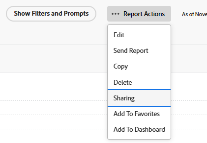

# 在Adobe Workfront中共享报表

<!-- Audited: 11/2024 -->

您的Adobe Workfront管理员会在用户分配访问级别时授予他们查看或编辑报表的权限。 有关授予对问题的访问权限的详细信息，请参阅[授予对报告、功能板和日历的访问权限](../../../administration-and-setup/add-users/configure-and-grant-access/grant-access-reports-dashboards-calendars.md)。

除了授予用户的访问级别之外，您还可以授予他们查看或管理您有权访问共享的特定报表的权限。 有关访问级别和权限的详细信息，请参阅[访问级别和权限如何协同工作](../../../administration-and-setup/add-users/access-levels-and-object-permissions/how-access-levels-permissions-work-together.md)。

权限特定于Workfront中的一个项目，并定义可以对该项目执行的操作。

>[!NOTE]
>
>Workfront管理员可以为所有用户添加或删除系统中任何项目的权限，而无需是这些项目的所有者。

## 访问权限要求

+++ 展开可查看本文所述功能的访问权限要求。 

<table style="table-layout:auto"> 
 <col> 
 <col> 
 <tbody> 
  <tr> 
   <td role="rowheader">Adobe Workfront 包</td> 
   <td> 
“任一”
 </td> 
  </tr> 
  <tr> 
   <td role="rowheader">Adobe Workfront许可证</td> 
   <td> 
      
轻量

      
审阅

   </td>
  </tr> 
  <tr> 
   <td role="rowheader">访问级别配置</td> 
   <td> 
查看对报告、功能板和日历的访问权
</td> 
  </tr> 
  <tr> 
   <td role="rowheader">对象权限</td> 
   <td> 
查看报表的权限或更高版本
</td> 
  </tr> 
 </tbody> 
</table>

有关此表中信息的更多详细信息，请参阅Workfront文档中的[访问要求](/help/quicksilver/administration-and-setup/add-users/access-levels-and-object-permissions/access-level-requirements-in-documentation.md)。

+++

## 有关共享报表的注意事项

除了以下注意事项之外，另请参阅[共享报表、功能板和日历](../../../workfront-basics/grant-and-request-access-to-objects/permissions-reports-dashboards-calendars.md)。

* 您可以与其他个人、团队、群组、职务角色或公司共享您创建的报表。 您还可以共享其他人创建并与您共享的报告。
* 您可以与整个组织共享报表，也可以将报表设为公用。 将报表设为公开会生成一个可与其他人共享的URL。
* 您可以共享单个报告，也可以从报告列表中共享多个报告。

## 共享报表的方法

您可以通过以下方式在Workfront中共享报表：

* 手动，如下面[共享报表](#share-a-report)部分中所述。
* 通过从包含已共享报表的功能板继承视图权限来自动创建。 有关查看对象的继承权限的信息，请参阅[查看对象的继承权限](../../../workfront-basics/grant-and-request-access-to-objects/view-inherited-permissions-on-objects.md)。

## 共享报表 {#share-a-report}

从列表中共享一个报告或多个报告是相同的。

1. 转到报告列表并选择一个或多个报告，然后单击&#x200B;**共享**&#x200B;图标。

   或

   单击一个报表的名称，然后单击&#x200B;**报表操作** > **共享**。 将打开&#x200B;**共享[报表名称]**&#x200B;框。

   

1. 在&#x200B;**将报表访问权限授予**&#x200B;字段中，开始键入要与其共享报表的用户、团队、工作角色、组或公司的名称，然后在显示时将其选定。

1. 要调整所添加名称的访问级别，请单击名称右侧的下拉菜单，然后选择以下选项之一。

   <table style="table-layout:auto"> 
    <col> 
    <col> 
    <tbody> 
     <tr> 
      <td role="rowheader">视图</td> 
      <td> 
允许您的收件人访问，以便在<strong>报告</strong>区域查看并运行报告。
 
您可以单击右侧的<strong>高级设置</strong>图标，以指定您是否希望用户或用户能够<strong>与系统中的任何人共享</strong>。
 </td> 
     </tr> 
     <tr> 
      <td role="rowheader">管理</td> 
      <td> 
允许您的收件人完全编辑该报表。
 
您可以单击右侧的<strong>高级设置</strong>图标，以指定是否希望用户或用户能够<strong>从系统</strong>删除报表<strong>与系统中的任何人共享</strong>该报表。
 </td> 
     </tr> 
    </tbody> 
   </table>

1. （可选）重复前面的2个步骤，将其他名称添加到列表中并配置其选项。
1. （可选）单击共享框中的&#x200B;**只有被邀请的人才能访问**&#x200B;下拉菜单，然后选择以下选项之一：

   * **只有受邀人员才能访问**：选择此选项可仅获得对报告的访问权限的用户才能查看它。

   * **系统中的每个人都可以查看**：选择此选项以使Workfront中有权访问报表的所有人都可以查看报表。

1. （可选）单击共享框右上角的&#x200B;**齿轮**&#x200B;图标，然后选择以下选项：

   * **将此设为外部用户公开**：选择此选项可生成可与他人共享的URL。 具有URL的任何人都可以访问报表，而无需拥有Adobe Workfront许可证。

     >[!CAUTION]
     >
     >建议在与外部用户共享包含机密信息的对象时务必谨慎。 这样，他们便可以查看信息，而无需成为Workfront用户或您组织的一部分。

     >[!NOTE]
     >
     >如果报告具有提示并且您公开共享它，则通过公共共享链接运行报告的用户将无法使用提示运行报告。 除非他们登录到Workfront并访问报表，然后不使用公共共享链接，否则他们将会看到报表，但不显示应用到的提示。 有关共享带有提示的报告限制的更多信息，请参阅文章[向报告添加提示](../../../reports-and-dashboards/reports/creating-and-managing-reports/add-prompt-report.md#limitations-of-running-public-prompted-reports)中的[共享提示报告的限制](../../../reports-and-dashboards/reports/creating-and-managing-reports/add-prompt-report.md)部分。

1. 单击&#x200B;**保存**。
